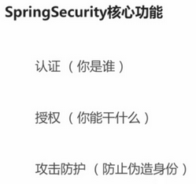
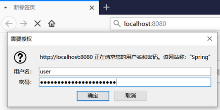
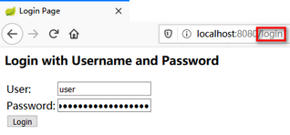
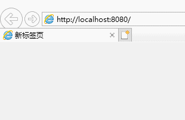

# Spring Security 常见用法(第4章) 及 授权机制(第7章)

## 第4章 使用 Spring Security 开发基于表单的登录


### 4.2(4-2). Spring Security 的基本原理和核心概念

#### 4.2.1. Spring Security 核心概念



#### 4.2.2. 开箱即用的 Spring Security

当项目中（直接或间接）引入了 Spring Security ，<span style="color:green">**无需任何配置**</span>， **默认以 `Http Basic` 方式 进行校验**。

1. 重新打开之前关掉的 spring security 。（对于新项目来说，不用这一步。）

2. 访问任意接口，浏览器弹出的 对话框中输入 user/pwd 。

   a. 用户名：默认为 `user` ,  密码：在启动日志中查找 如下字段。

   ```txt
   Using default security password: fb0ba698-c091-4192-ae48-ffaa772ddddc
   ```




#### 4.2.3. 修改成 form 校验

在 C134_imooc-security-browser 中 新建 BrowserSecurityConfig 配置类。

<span style="color:green">**如果将 formLogin 改成 httpBasic 就是 Security 的 默认实现。**</span>

```java
package com.yafey.security.browser;

@Configuration
public class BrowserSecurityConfig extends WebSecurityConfigurerAdapter {
	@Override
	protected void configure(HttpSecurity http) throws Exception {
		http.formLogin()  // 认证方式
//		http.httpBasic()
			// 授权 , 以下表示 任何请求都需要 校验
			.and()
			.authorizeRequests()
			.anyRequest()
			.authenticated();
	}
}
```


启动 C134_imooc-security-demo-browser ， 访问 任意 服务，如 http://localhost:8080/ , **将会先跳转到 http://localhost:8080/login 进行校验，校验通过后再跳转到 原先的地址。**






#### 4.2.4. Spring Security 的基本原理

<span style="color:#7fb80e">**Spring Security 核心是一堆 过滤器链 （一组 filter）。**</span>

##### 简洁说明 TL;DR

几种重要的 过滤器 说明如下：

- **最核心的** 就是 <span style="color:green">**绿色的 过滤器**</span> 用来 **认证 用户的身份**，每一个方块 代表 一种 **认证方式**。

  - **绿色 过滤器 的 主要功能是 检查请求中是否 包含当前过滤器 所需要的信息。**
  - **任何一个过滤器成功地完成了这个用户登录以后，它会在请求上做一个标记，说当前这个用户已经认证成功了。**

- 请求 经过 那些 <span style="color:green">**绿色的 过滤器**</span> 以后，最终会到 <span style="color:darkorange">**`FilterSecurityInterceptor` 过滤器**</span> ， **它是整个 Spring Security 过滤器链 的 最后一关，根据配置 判断 是否 可以访问 后面的 那些 Controller 的 Restful 服务**。

  - 如果 不过， 会抛出不同的异常。

- 在 `FilterSecurityInterceptor` 过滤器 前面的 <span style="color:darkblue">**`ExceptionTranslationFilter` 的过滤器， 这个过滤器的作用 就是用来捕获 `FilterSecurityInterceptor` 过滤器 抛出来的异常，根据抛出来的这些异常做相应的处理。**</span>

  - 如 引导 用户到 相应的页面/方式 进行 登陆。

- 如果说我们要扩展 比如 验证码登录 或者 第三方的 微信登陆、QQ 登陆，实际上都是**在这个过滤器链上 去加 绿色的过滤器 来支持不同的身份认证方式 。**

-  <span style="color:green">**这里要注意的就是，在这个过滤器链上，绿色的部分我们是可以 通过配置 来 决定某一个过滤器是否生效的。**</span>

  - 不如不配 http basic , 那么 http basic filter 就不会生效。

   <span style="color:red">**但是除了绿色以外，其他颜色的 过滤器，都是不能控制的，他们一定会在 过滤器链 上，而且一定会在 Spring Security 事先 指定的 位置 。**</span>


##### 详细说明

最核心的就是绿色的这个过滤器，它的作用就是用来认证用户的身份，每一个方块代表一个过滤器，每一个过滤器负责处理一种认证方式。

前面的例子里，我们举了两种认证方式，form登陆 和 http basic登陆，分别对应 `UsernamePasswordAuthenticationFilter` 和 `BasicAuthenticationFilter` 。 

绿色的的过滤器，它的主要的工作就是检查当前的请求里面是不是有这个过滤器所需要的信息 。

- 比如说对 `UsernamePasswordAuthenticationFilter` 这个过滤器来说，它就会检查：

  - 你的请求是不是一个 POST 方式 的登录请求；

  - 然后在这个登陆请求里面带没带用户名和密码。

    如果带了username/password ， 这个过滤器就会尝试用那个用户名和密码去做用户的这个登录。

    如果当前的请求中没有带用户名和密码，那么 当前的 filter 就会放过去 ，给下一个过滤器。

如果下一个过滤器 是 `BasicAuthenticationFilter`  ，它就会检查

- 请求的 Header 里面 是不是有 Basic 开头的 Authentication 的信息。

  如果有的话，它会去拿出来做 Base64 解码，然后取出用户名和密码，做用户的登录。

其实 Spring Security 中还提供了很多其他的认证方式，如果还声明了其他的认证方式，那些其他的也会按照这个原理一个一个往下走。


**任何一个过滤器成功地完成了这个用户登录以后，它会在请求上做一个标记，说当前这个用户已经认证成功了。**


请求 经过 那些 **绿色的** 过滤器 以后，最终会到 **`FilterSecurityInterceptor` 过滤器 ， 它是整个 Spring Security 过滤器链 的 最后一关**，它是最后的一个守门人，在它身后就是我们自个儿写的那些 Controller 的 Restful 服务了。

- <span style="color:darkorange">**`FilterSecurityInterceptor` 过滤器**</span> 决定了 当前的那个请求 能不能 去访问 后边 真正的 Restful 服务 。

  - 它依据我们代码里面的配置来判断。

    比如说我们现在的配置，就是说 任何请求 都需要 身份证证 后 才能访问 。

    （`http.formLogin().and.authorizeRequests().anyRequest().authenticated();`） 

    那么它就会去判断 当前的请求 是不是经过了前边 某个过滤器的 身份认证 。

    - 这里的规则比较简单，实际上可以写的很复杂。
    - 如果过了，就可以去访问最终的 服务了。
    - <span style="color:red">**如果不过，会根据不过的原因，它会抛出不同的异常。**</span>
      - 比如说 这里配的是 所有请求都需要 身份认证，那么如果 请求 没有 经过身份认证就抛一个没有身份认证的 异常。
      - 如果说 这里配的是 只有 VIP 用户 才能访问，那么虽然你经过身份认证了，但是你不是 VIP 用户，那么就会抛 一个没权限的 异常。 

    

在 <span style="color:darkorange">**`FilterSecurityInterceptor` 过滤器**</span> 的前面，还有一个叫做 <span style="color:darkblue">**`ExceptionTranslationFilter` 的过滤器， 这个过滤器的作用 就是用来捕获 `FilterSecurityInterceptor` 过滤器 抛出来的异常，根据抛出来的这些异常做相应的处理。**</span>

- 比如说 因为没有登录不能访问，那么他会根据前面的配置，引导用户去登陆 。
  - 如果前面配的是formLogin， 就会引导用户去表单登陆页面去；如果配的是 http basic , 浏览器就会弹窗引导用户登陆。


这就是 Spring Security 最核心的一个基本原理 。Spring Security 提供的 所有 功能特性 都是建立在 这个过滤器链的基础上的 。

- **如果说我们要扩展 比如 验证码登录 或者 第三方的 微信登陆、QQ 登陆，实际上都是在这个过滤器链上 去加 绿色的过滤器 来支持不同的身份认证方式 。**


 <span style="color:green">**这里要注意的就是，在这个过滤器链上，绿色的部分我们是可以 通过配置 来 决定某一个过滤器是否生效的。**</span>

- 不如不配 http basic , 那么 http basic filter 就不会生效。

 <span style="color:red">**但是除了绿色以外，其他颜色的 过滤器，都是不能控制的，他们一定会在 过滤器链 上，而且一定会在 Spring Security 事先 指定的 位置 。**</span>

- 比如说 蓝色的 过滤器 一定会在 橘色的 过滤器之前。这个位置是不能改的，也不能把它们从 过滤器链上 去掉。


##### Debug 断点 建议

> 执行流程：
>
> - 访问 http://localhost:8080 ； 
> - 进入 断点 1，抛出异常；
> - 抛出的异常被 断点2 捕获；
> - 重定向到 http://localhost:8080/login 登陆页面进行登陆；
> - 进入 断点 3 ；
> - 进入 断点 1；
> - 进入 断点 4， 访问到最终的 Restful 服务。

1. 在 橘色的 <span style="color:darkorange">**`FilterSecurityInterceptor` 过滤器**</span> 的 L124 打断点。

```java
InterceptorStatusToken token = super.beforeInvocation(fi); // L124 ，断点处，所有的 判断逻辑 都在 beforeInvocation 方法里 执行。 都通过的话， 就执行 下面的语句。

try {
    fi.getChain().doFilter(fi.getRequest(), fi.getResponse()); // 执行到这里的话， 实际上就是调 最后的 Restful 服务的 方法了。
}
```

2. 在 蓝色的 <span style="color:darkblue">**`ExceptionTranslationFilter` 的过滤器**</span> 的 L123 打断点。

```java
public void doFilter(ServletRequest req, ServletResponse res, FilterChain chain)
    throws IOException, ServletException {
    HttpServletRequest request = (HttpServletRequest) req;
    HttpServletResponse response = (HttpServletResponse) res;

    try {
        chain.doFilter(request, response); // doFilter 的方法 什么都不敢，直接调用 后面的 filter 。
    }
    catch (IOException ex) {
        throw ex;
    }
    catch (Exception ex) {
        // Try to extract a SpringSecurityException from the stacktrace
        Throwable[] causeChain = throwableAnalyzer.determineCauseChain(ex); // L123 ，断点处， 尝试 从 堆栈中 解析 Spring Security 的 Exception ， 并进行处理。
        RuntimeException ase = (AuthenticationException) throwableAnalyzer
            .getFirstThrowableOfType(AuthenticationException.class, causeChain);

        if (ase == null) {
            ase = (AccessDeniedException) throwableAnalyzer.getFirstThrowableOfType(
                AccessDeniedException.class, causeChain);
        }

        if (ase != null) {
            handleSpringSecurityException(request, response, chain, ase);
        }
        ... 其他代码 ...
    }
}
```

3. `UsernamePasswordAuthenticationFilter` 的 L75 打断点。

```java
public Authentication attemptAuthentication(HttpServletRequest request,
                                            HttpServletResponse response) throws AuthenticationException {
    // 只会处理 Post 方式的请求。
    if (postOnly && !request.getMethod().equals("POST")) {
        throw new AuthenticationServiceException(
            "Authentication method not supported: " + request.getMethod());
    }

    String username = obtainUsername(request); // L75 , 断点处， 解析 Post 请求中的 用户名 。
    String password = obtainPassword(request);

    if (username == null) { username = ""; }
    if (password == null) { password = ""; }
    ... 其他代码 ...
}   
```

4. Controller 的某个 服务方法上 断点。

简单起见， 在 com.yafey.DemoBrowserApplication 的 hello 方法上打断点。

```java
@GetMapping("/")
public String hello() {
    return "hello Spring Security";  // 断点处
}
```


