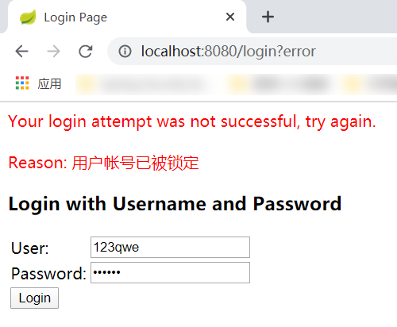
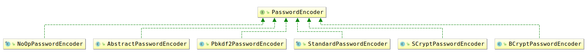
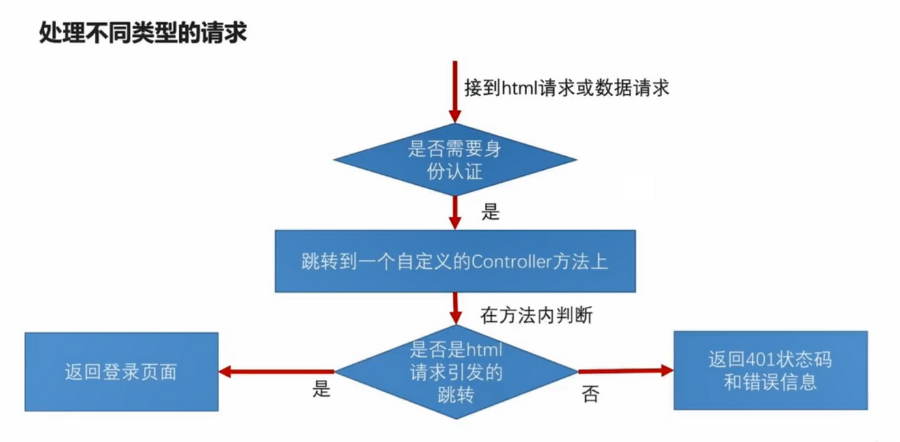
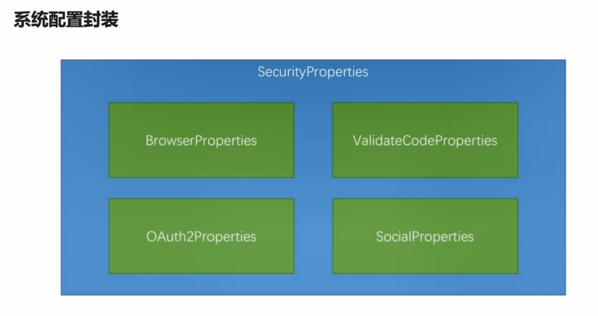
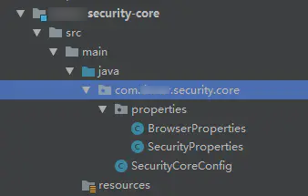
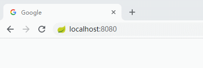
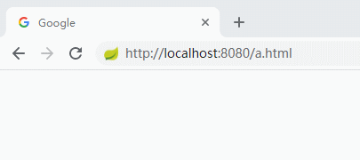
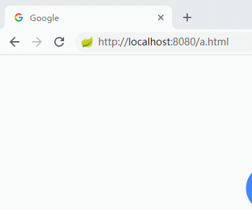

# Spring Security 常见用法(第4章) 及 授权机制(第7章)

## 第4章 使用 Spring Security 开发基于表单的登录


### 4.2(4-2). Spring Security 的基本原理和核心概念

#### 4.2.1. Spring Security 核心概念


#### 4.2.2. 开箱即用的 Spring Security

当项目中（直接或间接）引入了 Spring Security ，<span style="color:green">**无需任何配置**</span>， **默认以 `Http Basic` 方式 进行校验**。

1. 重新打开之前关掉的 spring security 。（对于新项目来说，不用这一步。）

2. 访问任意接口，浏览器弹出的 对话框中输入 user/pwd 。

   a. 用户名：默认为 `user` ,  密码：在启动日志中查找 如下字段。

   ```txt
   Using default security password: fb0ba698-c091-4192-ae48-ffaa772ddddc
   ```


#### 4.2.3. 修改成 form 校验

在 C134_imooc-security-browser 中 新建 BrowserSecurityConfig 配置类。

<span style="color:green">**如果将 formLogin 改成 httpBasic 就是 Security 的 默认实现。**</span>

```java
package com.yafey.security.browser;

@Configuration
public class BrowserSecurityConfig extends WebSecurityConfigurerAdapter {
	@Override
	protected void configure(HttpSecurity http) throws Exception {
		http.formLogin()  // 认证方式
//		http.httpBasic()
			// 授权 , 以下表示 任何请求都需要 校验
			.and()
			.authorizeRequests()
			.anyRequest()
			.authenticated();
	}
}
```


启动 C134_imooc-security-demo-browser ， 访问 任意 服务，如 http://localhost:8080/ , **将会先跳转到 http://localhost:8080/login 进行校验，校验通过后再跳转到 原先的地址。**


#### 4.2.4. Spring Security 的基本原理

<span style="color:#7fb80e">**Spring Security 核心是一堆 过滤器链 （一组 filter）。**</span>

##### 简洁说明 TL;DR

几种重要的 过滤器 说明如下：

- **最核心的** 就是 <span style="color:green">**绿色的 过滤器**</span> 用来 **认证 用户的身份**，每一个方块 代表 一种 **认证方式**。

  - **绿色 过滤器 的 主要功能是 检查请求中是否 包含当前过滤器 所需要的信息。**
  - **任何一个过滤器成功地完成了这个用户登录以后，它会在请求上做一个标记，说当前这个用户已经认证成功了。**

- 请求 经过 那些 <span style="color:green">**绿色的 过滤器**</span> 以后，最终会到 <span style="color:darkorange">**`FilterSecurityInterceptor` 过滤器**</span> ， **它是整个 Spring Security 过滤器链 的 最后一关，根据配置 判断 是否 可以访问 后面的 那些 Controller 的 Restful 服务**。

  - 如果 不过， 会抛出不同的异常。

- 在 `FilterSecurityInterceptor` 过滤器 前面的 <span style="color:darkblue">**`ExceptionTranslationFilter` 的过滤器， 这个过滤器的作用 就是用来捕获 `FilterSecurityInterceptor` 过滤器 抛出来的异常，根据抛出来的这些异常做相应的处理。**</span>

  - 如 引导 用户到 相应的页面/方式 进行 登陆。

- 如果说我们要扩展 比如 验证码登录 或者 第三方的 微信登陆、QQ 登陆，实际上都是**在这个过滤器链上 去加 绿色的过滤器 来支持不同的身份认证方式 。**

-  <span style="color:green">**这里要注意的就是，在这个过滤器链上，绿色的部分我们是可以 通过配置 来 决定某一个过滤器是否生效的。**</span>

  - 不如不配 http basic , 那么 http basic filter 就不会生效。

   <span style="color:red">**但是除了绿色以外，其他颜色的 过滤器，都是不能控制的，他们一定会在 过滤器链 上，而且一定会在 Spring Security 事先 指定的 位置 。**</span>


##### 详细说明

最核心的就是绿色的这个过滤器，它的作用就是用来认证用户的身份，每一个方块代表一个过滤器，每一个过滤器负责处理一种认证方式。

前面的例子里，我们举了两种认证方式，form登陆 和 http basic登陆，分别对应 `UsernamePasswordAuthenticationFilter` 和 `BasicAuthenticationFilter` 。 

绿色的的过滤器，它的主要的工作就是检查当前的请求里面是不是有这个过滤器所需要的信息 。

- 比如说对 `UsernamePasswordAuthenticationFilter` 这个过滤器来说，它就会检查：

  - 你的请求是不是一个 POST 方式 的登录请求；

  - 然后在这个登陆请求里面带没带用户名和密码。

    如果带了username/password ， 这个过滤器就会尝试用那个用户名和密码去做用户的这个登录。

    如果当前的请求中没有带用户名和密码，那么 当前的 filter 就会放过去 ，给下一个过滤器。

如果下一个过滤器 是 `BasicAuthenticationFilter`  ，它就会检查

- 请求的 Header 里面 是不是有 Basic 开头的 Authentication 的信息。

  如果有的话，它会去拿出来做 Base64 解码，然后取出用户名和密码，做用户的登录。

其实 Spring Security 中还提供了很多其他的认证方式，如果还声明了其他的认证方式，那些其他的也会按照这个原理一个一个往下走。


**任何一个过滤器成功地完成了这个用户登录以后，它会在请求上做一个标记，说当前这个用户已经认证成功了。**


请求 经过 那些 **绿色的** 过滤器 以后，最终会到 **`FilterSecurityInterceptor` 过滤器 ， 它是整个 Spring Security 过滤器链 的 最后一关**，它是最后的一个守门人，在它身后就是我们自个儿写的那些 Controller 的 Restful 服务了。

- <span style="color:darkorange">**`FilterSecurityInterceptor` 过滤器**</span> 决定了 当前的那个请求 能不能 去访问 后边 真正的 Restful 服务 。

  - 它依据我们代码里面的配置来判断。

    比如说我们现在的配置，就是说 任何请求 都需要 身份证证 后 才能访问 。

    （`http.formLogin().and.authorizeRequests().anyRequest().authenticated();`） 

    那么它就会去判断 当前的请求 是不是经过了前边 某个过滤器的 身份认证 。

    - 这里的规则比较简单，实际上可以写的很复杂。
    - 如果过了，就可以去访问最终的 服务了。
    - <span style="color:red">**如果不过，会根据不过的原因，它会抛出不同的异常。**</span>
      - 比如说 这里配的是 所有请求都需要 身份认证，那么如果 请求 没有 经过身份认证就抛一个没有身份认证的 异常。
      - 如果说 这里配的是 只有 VIP 用户 才能访问，那么虽然你经过身份认证了，但是你不是 VIP 用户，那么就会抛 一个没权限的 异常。 

    

在 <span style="color:darkorange">**`FilterSecurityInterceptor` 过滤器**</span> 的前面，还有一个叫做 <span style="color:darkblue">**`ExceptionTranslationFilter` 的过滤器， 这个过滤器的作用 就是用来捕获 `FilterSecurityInterceptor` 过滤器 抛出来的异常，根据抛出来的这些异常做相应的处理。**</span>

- 比如说 因为没有登录不能访问，那么他会根据前面的配置，引导用户去登陆 。
  - 如果前面配的是formLogin， 就会引导用户去表单登陆页面去；如果配的是 http basic , 浏览器就会弹窗引导用户登陆。


这就是 Spring Security 最核心的一个基本原理 。Spring Security 提供的 所有 功能特性 都是建立在 这个过滤器链的基础上的 。

- **如果说我们要扩展 比如 验证码登录 或者 第三方的 微信登陆、QQ 登陆，实际上都是在这个过滤器链上 去加 绿色的过滤器 来支持不同的身份认证方式 。**


 <span style="color:green">**这里要注意的就是，在这个过滤器链上，绿色的部分我们是可以 通过配置 来 决定某一个过滤器是否生效的。**</span>

- 不如不配 http basic , 那么 http basic filter 就不会生效。

 <span style="color:red">**但是除了绿色以外，其他颜色的 过滤器，都是不能控制的，他们一定会在 过滤器链 上，而且一定会在 Spring Security 事先 指定的 位置 。**</span>

- 比如说 蓝色的 过滤器 一定会在 橘色的 过滤器之前。这个位置是不能改的，也不能把它们从 过滤器链上 去掉。


##### Debug 断点 建议

> 执行流程：
>
> - 访问 http://localhost:8080 ； 
> - 进入 断点 1，抛出异常；
> - 抛出的异常被 断点2 捕获；
> - 重定向到 http://localhost:8080/login 登陆页面进行登陆；
> - 进入 断点 3 ；
> - 进入 断点 1；
> - 进入 断点 4， 访问到最终的 Restful 服务。

1. 在 橘色的 <span style="color:darkorange">**`FilterSecurityInterceptor` 过滤器**</span> 的 L124 打断点。

```java
InterceptorStatusToken token = super.beforeInvocation(fi); // L124 ，断点处，所有的 判断逻辑 都在 beforeInvocation 方法里 执行。 都通过的话， 就执行 下面的语句。

try {
    fi.getChain().doFilter(fi.getRequest(), fi.getResponse()); // 执行到这里的话， 实际上就是调 最后的 Restful 服务的 方法了。
}
```

2. 在 蓝色的 <span style="color:darkblue">**`ExceptionTranslationFilter` 的过滤器**</span> 的 L123 打断点。

```java
public void doFilter(ServletRequest req, ServletResponse res, FilterChain chain)
    throws IOException, ServletException {
    HttpServletRequest request = (HttpServletRequest) req;
    HttpServletResponse response = (HttpServletResponse) res;

    try {
        chain.doFilter(request, response); // doFilter 的方法 什么都不敢，直接调用 后面的 filter 。
    }
    catch (IOException ex) {
        throw ex;
    }
    catch (Exception ex) {
        // Try to extract a SpringSecurityException from the stacktrace
        Throwable[] causeChain = throwableAnalyzer.determineCauseChain(ex); // L123 ，断点处， 尝试 从 堆栈中 解析 Spring Security 的 Exception ， 并进行处理。
        RuntimeException ase = (AuthenticationException) throwableAnalyzer
            .getFirstThrowableOfType(AuthenticationException.class, causeChain);

        if (ase == null) {
            ase = (AccessDeniedException) throwableAnalyzer.getFirstThrowableOfType(
                AccessDeniedException.class, causeChain);
        }

        if (ase != null) {
            handleSpringSecurityException(request, response, chain, ase);
        }
        ... 其他代码 ...
    }
}
```

3. `UsernamePasswordAuthenticationFilter` 的 L75 打断点。

```java
public Authentication attemptAuthentication(HttpServletRequest request,
                                            HttpServletResponse response) throws AuthenticationException {
    // 只会处理 Post 方式的请求。
    if (postOnly && !request.getMethod().equals("POST")) {
        throw new AuthenticationServiceException(
            "Authentication method not supported: " + request.getMethod());
    }

    String username = obtainUsername(request); // L75 , 断点处， 解析 Post 请求中的 用户名 。
    String password = obtainPassword(request);

    if (username == null) { username = ""; }
    if (password == null) { password = ""; }
    ... 其他代码 ...
}   
```

4. Controller 的某个 服务方法上 断点。

简单起见， 在 com.yafey.DemoBrowserApplication 的 hello 方法上打断点。

```java
@GetMapping("/")
public String hello() {
    return "hello Spring Security";  // 断点处
}
```


### 4.3. 自定义 用户 认证、校验逻辑及密码加密解密

> 默认的 用户名只能是 `user` ， 密码 是 每次启动时 自动生成，这不能符合大部分的应用场景。

- 处理 用户 信息获取 逻辑

- 处理用户 校验 逻辑

- 处理 密码 加密 解密


#### 4.3.1. 处理 用户 信息获取 的 逻辑

> 整理自 https://www.jianshu.com/p/78a39a6c3447
>
> https://blog.csdn.net/u013504720/article/details/78998591
>
> https://blog.csdn.net/superbeyone/article/details/84623343

用户信息获取逻辑 封装在 `UserDetailService` 接口里面， 里面只有一个 `loadUserByUsername(String username)` 方法，返回 UserDetails 对象。

这个方法的作用 就是根据用户在前台输入的 用户名 到 数据集合（数据库）中去读取一个用户信息，用户信息最后被封装在一个 UserDetails 的接口的 实现类 中。然后 Spring Security 会拿着这个用户信息去做相应的处理和校验，如果校验都通过了就会把用户放在 session 中，那么用户认证就成功了。如果认证失败就会抛出 UsernameNotFoundException 异常，然后 Spring Security 捕获到这个异常会显示出相应的信息。

```java
package org.springframework.security.core.userdetails;

public interface UserDetailsService {
    UserDetails loadUserByUsername(String username) throws UsernameNotFoundException;
}
```


#### 4.3.2. 自定义认证逻辑

新建一个 **`UserDetailsService` 接口** 的实现类（如 MyUserDetailsService），重写里面的 loadUserByUsername 方法 。 

- *其实在实际的开发过程中应该是要去 service 层去读取数据库中根据 String 类型的用户名去查询相应的用户信息的。但是在这我就简写了。*
- **Spring Security 中已经有了一个实现类** `org.springframework.security.core.userdetails.User`。

```java
package com.yafey.security.browser;

@Component
@Slf4j
public class MyUserDetailsService implements UserDetailsService {
    @Override
    public UserDetails loadUserByUsername(String username) throws UsernameNotFoundException {
        //根据用户名查找用户信息
        log.info("用户是:" + username);
        //参数：用户名，密码，权限集合
        User user = new User(username, "123qwe",
        		AuthorityUtils.commaSeparatedStringToAuthorityList("admin"));
        return user;
    }
}
```

沿用之前的 BrowserSecurityConfig.java 中的配置 ， 也可以参考下面的配置方式。

然后我们启动服务，在密码框中输入 `123qwe` 就会进入到系统 Restful 服务中。

> 使用默认的 认证配置 
>
> ```java
> @Configuration
> @EnableWebSecurity
> public class SecurityConfig extends WebSecurityConfigurerAdapter {
>     @Autowired
>     private UserDetailsService myUserDetailsService;
>     /**
>     *注册用户的获取逻辑
>     */
>     @Override
>     protected void configure(AuthenticationManagerBuilder auth) throws Exception {
>         auth.userDetailsService(myUserDetailsService);
>     }
> }
> ```


####  4.3.3. 处理用户校验逻辑

在用户校验逻辑中，分为两部分，第一个是用户名的密码校验逻辑；第二是其他的一些校验（用户是否被冻结、是否过期等）。
我们先来看 `loadUserByUsername`方法返回的 `UserDetails` 接口的源代码: 

```java
package org.springframework.security.core.userdetails;
public interface UserDetails extends Serializable {
	
	Collection<? extends GrantedAuthority> getAuthorities();//获取用户权限信息
	String getPassword();//获取密码
	String getUsername();//获取用户名

    
    // 下面四个返回 布尔值的 方法 就是用来让我们自己去执行校验逻辑的。我们需要将 我们自己的 校验的 结果 通过这些方法的 实现 返回回去。
	boolean isAccountNonExpired();//判断账户是否过期,返回true表示认证成功，返回false代表过期了。如果在系统中没有关于这个的逻辑，可以永远返回true
    boolean isCredentialsNonExpired();//判断密码是否过期,因为有些安全级别比较高的网站可能会要求用户三十天或固定时间去修改密码。这个方法可以告诉Spring Security密码是否过期了。
    
    // isAccountNonLocked和isEnabled的区别是isAccountNonLocked可以恢复使用的，但是isEnabled被注销的用户一般是不能被恢复的。
	boolean isAccountNonLocked();//判断账户是否被锁定（冻结）
	boolean isEnabled();//账户是否被删除（注销）
}
```

在 `MyUserDetailsService` 这个类中重写的那个方法里面我们可以自定义哪些属性是false，一旦有一个设置为false，那么我的校验逻辑是不能被通过的。比如我在账户是否锁定的字段设置为false，则会有相应的错误处理

```java
package com.yafey.security.browser;

@Component
@Slf4j
public class MyUserDetailsService implements UserDetailsService {
    @Override
    public UserDetails loadUserByUsername(String username) throws UsernameNotFoundException {
        //根据用户名查找用户信息
        log.info("用户是:" + username);
        //参数：用户名，密码，权限集合
//        User user = new User(username, "123qwe",
//        		AuthorityUtils.commaSeparatedStringToAuthorityList("admin"));
        User user = new User(username, "123qwe",
        		true,true,true,false,//该账户被锁定
        		AuthorityUtils.commaSeparatedStringToAuthorityList("admin"));
        return user;
    }
}
```

然后在浏览器中输入资源地址，即使输入正确的用户名和密码，也会给出相应的提示



#### 4.3.4. 处理密码加密逻辑

在我们的系统应用中，我们不会将用户的明文写入到数据库中，也就是说从数据库中取出来的密码应该是已经加密过的一串字符串，在 Spring Security 中处理加密解密的是一个**`org.springframework.security.crypto.password.PasswordEncoder`**（<span style="color:red">**注意：是`crypto` 包**</span>）。
 在这个接口中有两个方法：

```java
package org.springframework.security.crypto.password;
public interface PasswordEncoder {
    /*编码*/
    String encode(CharSequence rawPassword); // 加密方法，这个方法应该是插入数据库之前去调用的方法。
    /*匹配*/
    boolean matches(CharSequence rawPassword, String encodedPassword); //这个方法是Spring Security 去调用的，在拿到 UserDetails 对象之后，会根据 UserDetails 中的 password 跟用户在登录请求中输入的密码去进行匹配，如果匹配上了就会返回true。
}
```

spring security中密码相关的验证工作由实现`PasswordEncoder`的类完成,相关的继承关系如下




> ##### Spring Security 使用 `crypto` 包中的 `PasswordEncoder` 的说明：
>
> Spring Security 发展过程中有两个版本的 `PasswordEncoder`，分别是~~`org.springframework.security.authentication.encoding`~~（已废弃） 和`org.springframework.security.crypto.password`，现在使用的是后者，前者已经弃用。
>
> 在`Spring Security`中，已经对`PasswordEncoder`有了很多实现，包括`md5`加密、`SHA-256`加密等等，一般情况下我们只要直接拿来用就可以了。
>
> 查看类`DaoAuthenticationProvider`的`setPasswordEncoder` 方法上的注释可以看到，<span style="color:red">**推荐 使用org.springframework.security.crypto.password的实现类去完成密码的编码和匹配工作。**</span>
>
> 
>
> 更多关于 PasswordEncoder 参考：[Spring Security中的密码加密](PasswordEncoder_in_SpringSecurity.md)


密码加密的配置：

1. 注册一种 PasswordEncoder 的实现

   ```java
   package com.yafey.security.browser;
   @Configuration
   public class BrowserSecurityConfig extends WebSecurityConfigurerAdapter {
       @Bean
       public PasswordEncoder passwordEncoder() {
           return new BCryptPasswordEncoder();
       }
       ... 其他代码...
   }
   ```

   

2. 使用 注册的 PasswordEncoder

   ```java
   package com.yafey.security.browser;
   @Component
   @Slf4j
   public class MyUserDetailsService implements UserDetailsService {
   	@Autowired // 注入 注册的 PasswordEncoder
   	private PasswordEncoder passwordEncoder;
       
       @Override
       public UserDetails loadUserByUsername(String username) throws UsernameNotFoundException {
           //根据用户名查找用户信息
           log.info("用户是:" + username);
           String password=passwordEncoder.encode("123qwe"); // 随机加盐加密， 每次的密码都不一样。
           log.info("数据库密码是：{}",password);
           //参数：用户名，密码，权限集合
           User user = new User(username, password,
           		AuthorityUtils.commaSeparatedStringToAuthorityList("admin"));
           return user;
       }
   }
   ```

   


控制登陆 2 次可以看到 每次的密码都是不一样的。

```
用户是:123qwe
数据库密码是：$2a$10$yvN/gU6hFkh1LEOPRhlcceRteKFGsSAyDG2C5ur7FX0Feam5ZkuoS

用户是:123qwe
数据库密码是：$2a$10$8ao06G1sQ.foCHVldK2z6O.PPkg39JU0zLGFT345x/rvXHqyQb1xi
```


> 或者可以使用下面的配置方式 , 未验证。
>
> ```java
> @Configuration
> @EnableWebSecurity
> public class SecurityConfig extends WebSecurityConfigurerAdapter {
>     @Autowired
>     private UserDetailsService myUserDetailsService;
>     /**
>     *注册一种PasswordEncoder实现
>     */
>     @Bean
>     public PasswordEncoder passwordEncoder() {
>         return new BCryptPasswordEncoder();
>     }
>     @Override
>     protected void configure(AuthenticationManagerBuilder auth) throws Exception {
>         auth.userDetailsService(myUserDetailsService)
>         /**
>         *使用我们注册的passwordencoder
>         */
>                 .passwordEncoder(passwordEncoder());
>     }
>     @Override
>     protected void configure(HttpSecurity http) throws Exception {
>         http.formLogin()
>                 .and()
>                 .authorizeRequests()
>                 .anyRequest()
>                 .authenticated();
>     }
> }
> ```
>
> 


### 4.4. 个性化用户认证流程

> 整理自 ： https://www.jianshu.com/p/2fcec5a67d73

- 自定义登陆页面
- 自定义登陆成功处理
- 自定义登陆失败处理


#### 4.4.1. 自定义登陆页面

我们不能每次都去使用SpringSecurity默认的很简单的登录页面样式去进行登录，需要我们去自定义自己的登录页面的话，我们怎么实现呢？

- 在 BrowserSecurityConfig 类中的configure方法中，我在http.formLogin()的后面去添加一行代码“.loginPage(“url”)”，那么在用户访问页面的时候就会去根据配置的这个url去访问相对应的自定义登录页面。


1. 新建页面：在`src->main->resources->resources`文件夹下创建文件 `self-login.html` 。

   ```html
   <!DOCTYPE html>
   <html lang="en">
   <head>
   <meta charset="UTF-8">
   <title>登录</title>
   </head>
   <body>
   	<h1>标准登录页面</h1>
   	<h3>表单登录</h3>
   	<form action="/authentication/form" method="post">
   		<table>
   			<tr>
   				<td>用户名：</td>
   				<td><input type="text" name="username" /></td>
   			</tr>
   			<tr>
   				<td>密码：</td>
   				<td><input type="password" name="password" /></td>
   			</tr>
   			<tr>
   				<td colspan="2"><button type="submit">登录</button></td>
   			</tr>
   		</table>
   	</form>
   </body>
   </html>
   ```

2. 自定义配置

   额外地添加了两行代码，一个是指定了登录的页面，另一个是对于"`/self-login.html`"这个页面，我们必须将它放行，不能让它去进行资源权限的校验，否则会发生“重定向次数过多”（死循环）。

   `csrf().disable();`  是跨站请求伪造的安全机制。SpringSecurity默认地会有csrf跨站请求伪造防护的机制。因为是从一个html，进行post去提交给服务器的，涉及到跨站请求。

   ```java
   package com.yafey.security.browser;
   @Configuration
   public class BrowserSecurityConfig extends WebSecurityConfigurerAdapter {
   
       @Bean
       public PasswordEncoder passwordEncoder() {
           return new BCryptPasswordEncoder();
       }
       
   	@Override
   	protected void configure(HttpSecurity http) throws Exception {
   		http.formLogin()  // 认证方式
   			.loginPage("/self-login.html") // 自定义 登陆页面
   	        .loginProcessingUrl("/authentication/form") // 自定义表单 处理请求，伪造的请求
   //		http.httpBasic()
   	         // 授权 , 以下表示 任何请求都需要 校验
   	         .and()
   	         .authorizeRequests()//对请求进行授权
   	         .antMatchers("/self-login.html").permitAll() //登陆页面不需要校验
   	         .anyRequest()//任何请求
   	         .authenticated()//都需要身份认证
   	         .and()
   	         .csrf().disable() // 关闭 跨站请求伪造 防护。
   	         ;  
   	}
   }
   ```

   

#### 4.4.2. 自定义登录改进

虽然可以用一个自定义的 HTML 页面来完成表单登录，但是现在出现了两个问题：

- 在起始的时候发送的是一个 Rest 服务的请求，但是在跳转控制上返回去的是一个 HTML，这种方式是不合理的。Rest 服务应该返回的是状态码和 JSON 的信息。我们需要做的是 **如果是 HTML 请求就跳到登录页上，如果不是就返回 JSON 数据**。
- 我写了一个标准的登录页面，但是我希望能提供一个可重用的安全模块（即有多个项目都会使用这个安全模块，但是这些项目不可能只用这一个简单样式的登录页面）。如何能让这些项目使用自己自定义的登录页面？如果不使用自己定义的登录页面，才会使用我自己写的这个简单样式的登录页面。

基于以上问题，我来对这个安全模块进行改进：

##### 1、处理不同类型的请求

先来看看整体的流程图




###### <1> 写自定义的Controller

在写这个Controller时，我们需要知道，对于html请求，我们不可能永远跳转到一个死的登录页面上去，我需要提供一个能力，去读取配置文件实现活的返回页面。
在这个方法上，我返回的是一个http的状态码。

```java
package com.yafey.security.browser;
@RestController
@Slf4j
public class BrowserSecurityController {
	private RequestCache requestCache = new HttpSessionRequestCache(); // 将请求缓存到 session 里面
	private RedirectStrategy redirectStrategy = new DefaultRedirectStrategy(); // Spring redirect 的 工具类
	@Autowired
	private SecurityProperties securityProperties;

	/**
	 * 当需要身份认证时，跳转到这里
	 * 
	 * @param request
	 * @param response
	 * @return
	 * @throws IOException
	 */
	@RequestMapping("/authentication/require")
	@ResponseStatus(code = HttpStatus.UNAUTHORIZED)
	public SimpleResponse requireAuthentication(HttpServletRequest request, HttpServletResponse response)
			throws IOException {

		SavedRequest savedRequest = requestCache.getRequest(request, response);

		if (savedRequest != null) {
			String targetUrl = savedRequest.getRedirectUrl();
			log.info("引发跳转的请求是:" + targetUrl);
	        //判断引发跳转的是html 还是 不是html
			if (StringUtils.endsWithIgnoreCase(targetUrl, ".html")) {
				redirectStrategy.sendRedirect(request, response
						, securityProperties.getBrowser().getLoginPage()  // 可以使用自定义的 login 页面，或者使用默认的页面
						);
			}
		}
		return new SimpleResponse("访问的服务需要身份认证，请引导用户到登录页");
	}
}
```

###### <2>定义返回数据类型

这个方法应该返回的是一个自定义的类，里面去返回各种各样的属性，因此我来创建一个返回类SimpleResponse ，里面只有一个Object类型的变量。

```java
package com.yafey.security.browser.support;
@Data
@AllArgsConstructor
public class SimpleResponse {
	private Object content;
}
```

###### <3>将页面配置写活

返回的数据类型定义完了，就需要去将配置的自定义页面去写活，在这里我们使用 demo 项目去引用 browser 项目，在 demo 的配置文件中 新增配置

```yaml
yafey:
  security:
    browser:
      loginPage: /demo-login.html
```

我希望如果 demo 项目做了这个页面配置就跳转到 demo 配置的自定义页面，如果没有进行配置则跳转到browser 项目定义的登录页面。
为了实现这个逻辑，我需要去将这些配置进行封装，将它们封装到一个类里面中去。



这个图就是对整个项目配置文件的封装，我会去定义一个 SecurityProperties 类，然后这个类中又分为几个子类（根据配置项的不同去划分）。
 代码我写在了 security-core 项目中



因为系统的配置 无论 是浏览器模块 还是app模块 中都会用到。

先去定义 BrowserProperties 类

```java
package com.yafey.security.core.properties;
import lombok.Data;
@Data
public class BrowserProperties {
	private String loginPage = "/self-login.html";
}
```

然后去定义 SecurityProperties 类

```java
package com.yafey.security.core.properties;
@Data
@ConfigurationProperties(prefix = "yafey.security")
public class SecurityProperties {
	private BrowserProperties browser = new BrowserProperties();
}
```

然后在 BrowserSecurityConfig 去进行配置: 将 loginPage 修改成 Controller 的 url，将 loginPage 和 配置的 loginPage 设置为不需要校验。

```java
package com.yafey.security.browser;
@Configuration
public class BrowserSecurityConfig extends WebSecurityConfigurerAdapter {
	@Autowired
	private SecurityProperties securityProperties;
    @Bean
    public PasswordEncoder passwordEncoder() {
        return new BCryptPasswordEncoder();
    }
	@Override
	protected void configure(HttpSecurity http) throws Exception {
		http.formLogin()  // 认证方式
			.loginPage("/authentication/require") // 自定义 登陆页面
	        .loginProcessingUrl("/authentication/form") // 自定义表单 处理请求，伪造的请求
//		http.httpBasic()
	         // 授权 , 以下表示 任何请求都需要 校验
	         .and()
	         .authorizeRequests()//对请求进行授权
	         .antMatchers("/authentication/require",
	        		 securityProperties.getBrowser().getLoginPage() 
	        		 ).permitAll() //登陆页面不需要校验
	         .anyRequest()//任何请求
	         .authenticated()//都需要身份认证
	         .and()
	         .csrf().disable() // 关闭 跨站请求伪造 防护。
	         ;  
	}
}
```

最后这个自定义的 controller 的逻辑就是跟我流程图里面的逻辑一样，如果请求是一个 html 请求 (http://localhost:8080/a.html )，去根据配置文件去进行跳转（如果用户配了自定义登录页面就走其对应的页面，如果用户没配置，则走 browser 默认的标准登录页面去进行登录。）

- 访问 Restful 服务
  
- demo 中配置了 自定义 登陆页面， 访问 html 页面
  `yafey.security.browser.loginPage=/demo-login.html`
  
- demo 中 没有配置， 访问 html 页面
  