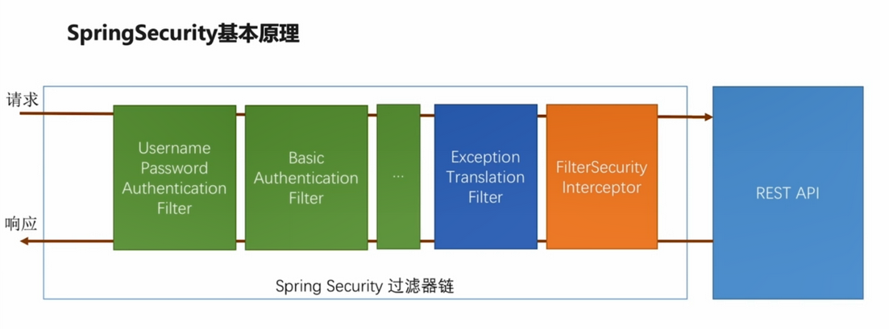
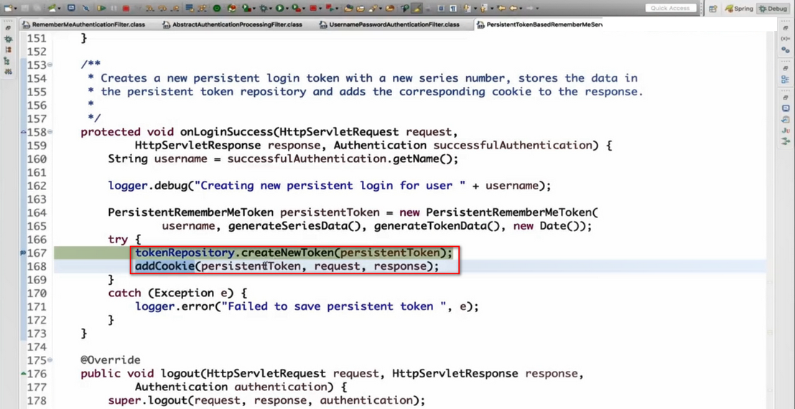

# Spring Security 常见用法(第4章) 及 授权机制(第7章)

## 第4章 使用 Spring Security 开发基于表单的登录


### 4.2(4-2). Spring Security 的基本原理和核心概念

#### 4.2.1. Spring Security 核心概念


#### 4.2.2. 开箱即用的 Spring Security

当项目中（直接或间接）引入了 Spring Security ，<span style="color:green">**无需任何配置**</span>， **默认以 `Http Basic` 方式 进行校验**。

1. 重新打开之前关掉的 spring security 。（对于新项目来说，不用这一步。）

2. 访问任意接口，浏览器弹出的 对话框中输入 user/pwd 。

   a. 用户名：默认为 `user` ,  密码：在启动日志中查找 如下字段。

   ```txt
   Using default security password: fb0ba698-c091-4192-ae48-ffaa772ddddc
   ```


#### 4.2.3. 修改成 form 校验

在 C134_imooc-security-browser 中 新建 BrowserSecurityConfig 配置类。

<span style="color:green">**如果将 formLogin 改成 httpBasic 就是 Security 的 默认实现。**</span>

```java
package com.yafey.security.browser;

@Configuration
public class BrowserSecurityConfig extends WebSecurityConfigurerAdapter {
	@Override
	protected void configure(HttpSecurity http) throws Exception {
		http.formLogin()  // 认证方式
//		http.httpBasic()
			// 授权 , 以下表示 任何请求都需要 校验
			.and()
			.authorizeRequests()
			.anyRequest()
			.authenticated();
	}
}
```


启动 C134_imooc-security-demo-browser ， 访问 任意 服务，如 http://localhost:8080/ , **将会先跳转到 http://localhost:8080/login 进行校验，校验通过后再跳转到 原先的地址。**


#### 4.2.4. Spring Security 的基本原理

<span style="color:#7fb80e">**Spring Security 核心是一堆 过滤器链 （一组 filter）。**</span>

##### 简洁说明 TL;DR

几种重要的 过滤器 说明如下：

- **最核心的** 就是 <span style="color:green">**绿色的 过滤器**</span> 用来 **认证 用户的身份**，每一个方块 代表 一种 **认证方式**。

  - **绿色 过滤器 的 主要功能是 检查请求中是否 包含当前过滤器 所需要的信息。**
  - **任何一个过滤器成功地完成了这个用户登录以后，它会在请求上做一个标记，说当前这个用户已经认证成功了。**

- 请求 经过 那些 <span style="color:green">**绿色的 过滤器**</span> 以后，最终会到 <span style="color:darkorange">**`FilterSecurityInterceptor` 过滤器**</span> ， **它是整个 Spring Security 过滤器链 的 最后一关，根据配置 判断 是否 可以访问 后面的 那些 Controller 的 Restful 服务**。

  - 如果 不过， 会抛出不同的异常。

- 在 `FilterSecurityInterceptor` 过滤器 前面的 <span style="color:darkblue">**`ExceptionTranslationFilter` 的过滤器， 这个过滤器的作用 就是用来捕获 `FilterSecurityInterceptor` 过滤器 抛出来的异常，根据抛出来的这些异常做相应的处理。**</span>

  - 如 引导 用户到 相应的页面/方式 进行 登陆。

- 如果说我们要扩展 比如 验证码登录 或者 第三方的 微信登陆、QQ 登陆，实际上都是**在这个过滤器链上 去加 绿色的过滤器 来支持不同的身份认证方式 。**

-  <span style="color:green">**这里要注意的就是，在这个过滤器链上，绿色的部分我们是可以 通过配置 来 决定某一个过滤器是否生效的。**</span>

  - 不如不配 http basic , 那么 http basic filter 就不会生效。

   <span style="color:red">**但是除了绿色以外，其他颜色的 过滤器，都是不能控制的，他们一定会在 过滤器链 上，而且一定会在 Spring Security 事先 指定的 位置 。**</span>



##### 详细说明

最核心的就是绿色的这个过滤器，它的作用就是用来认证用户的身份，每一个方块代表一个过滤器，每一个过滤器负责处理一种认证方式。

前面的例子里，我们举了两种认证方式，form登陆 和 http basic登陆，分别对应 `UsernamePasswordAuthenticationFilter` 和 `BasicAuthenticationFilter` 。 

绿色的的过滤器，它的主要的工作就是检查当前的请求里面是不是有这个过滤器所需要的信息 。

- 比如说对 `UsernamePasswordAuthenticationFilter` 这个过滤器来说，它就会检查：

  - 你的请求是不是一个 POST 方式 的登录请求；

  - 然后在这个登陆请求里面带没带用户名和密码。

    如果带了username/password ， 这个过滤器就会尝试用那个用户名和密码去做用户的这个登录。

    如果当前的请求中没有带用户名和密码，那么 当前的 filter 就会放过去 ，给下一个过滤器。

如果下一个过滤器 是 `BasicAuthenticationFilter`  ，它就会检查

- 请求的 Header 里面 是不是有 Basic 开头的 Authentication 的信息。

  如果有的话，它会去拿出来做 Base64 解码，然后取出用户名和密码，做用户的登录。

其实 Spring Security 中还提供了很多其他的认证方式，如果还声明了其他的认证方式，那些其他的也会按照这个原理一个一个往下走。


**任何一个过滤器成功地完成了这个用户登录以后，它会在请求上做一个标记，说当前这个用户已经认证成功了。**


请求 经过 那些 **绿色的** 过滤器 以后，最终会到 **`FilterSecurityInterceptor` 过滤器 ， 它是整个 Spring Security 过滤器链 的 最后一关**，它是最后的一个守门人，在它身后就是我们自个儿写的那些 Controller 的 Restful 服务了。

- <span style="color:darkorange">**`FilterSecurityInterceptor` 过滤器**</span> 决定了 当前的那个请求 能不能 去访问 后边 真正的 Restful 服务 。

  - 它依据我们代码里面的配置来判断。

    比如说我们现在的配置，就是说 任何请求 都需要 身份证证 后 才能访问 。

    （`http.formLogin().and.authorizeRequests().anyRequest().authenticated();`） 

    那么它就会去判断 当前的请求 是不是经过了前边 某个过滤器的 身份认证 。

    - 这里的规则比较简单，实际上可以写的很复杂。
    - 如果过了，就可以去访问最终的 服务了。
    - <span style="color:red">**如果不过，会根据不过的原因，它会抛出不同的异常。**</span>
      - 比如说 这里配的是 所有请求都需要 身份认证，那么如果 请求 没有 经过身份认证就抛一个没有身份认证的 异常。
      - 如果说 这里配的是 只有 VIP 用户 才能访问，那么虽然你经过身份认证了，但是你不是 VIP 用户，那么就会抛 一个没权限的 异常。 

    

在 <span style="color:darkorange">**`FilterSecurityInterceptor` 过滤器**</span> 的前面，还有一个叫做 <span style="color:darkblue">**`ExceptionTranslationFilter` 的过滤器， 这个过滤器的作用 就是用来捕获 `FilterSecurityInterceptor` 过滤器 抛出来的异常，根据抛出来的这些异常做相应的处理。**</span>

- 比如说 因为没有登录不能访问，那么他会根据前面的配置，引导用户去登陆 。
  - 如果前面配的是formLogin， 就会引导用户去表单登陆页面去；如果配的是 http basic , 浏览器就会弹窗引导用户登陆。


这就是 Spring Security 最核心的一个基本原理 。Spring Security 提供的 所有 功能特性 都是建立在 这个过滤器链的基础上的 。

- **如果说我们要扩展 比如 验证码登录 或者 第三方的 微信登陆、QQ 登陆，实际上都是在这个过滤器链上 去加 绿色的过滤器 来支持不同的身份认证方式 。**


 <span style="color:green">**这里要注意的就是，在这个过滤器链上，绿色的部分我们是可以 通过配置 来 决定某一个过滤器是否生效的。**</span>

- 不如不配 http basic , 那么 http basic filter 就不会生效。

 <span style="color:red">**但是除了绿色以外，其他颜色的 过滤器，都是不能控制的，他们一定会在 过滤器链 上，而且一定会在 Spring Security 事先 指定的 位置 。**</span>

- 比如说 蓝色的 过滤器 一定会在 橘色的 过滤器之前。这个位置是不能改的，也不能把它们从 过滤器链上 去掉。


##### Debug 断点 建议

> 执行流程：
>
> - 访问 http://localhost:8080 ； 
> - 进入 断点 1，抛出异常；
> - 抛出的异常被 断点2 捕获；
> - 重定向到 http://localhost:8080/login 登陆页面进行登陆；
> - 进入 断点 3 ；
> - 进入 断点 1；
> - 进入 断点 4， 访问到最终的 Restful 服务。

1. 在 橘色的 <span style="color:darkorange">**`FilterSecurityInterceptor` 过滤器**</span> 的 L124 打断点。

```java
InterceptorStatusToken token = super.beforeInvocation(fi); // L124 ，断点处，所有的 判断逻辑 都在 beforeInvocation 方法里 执行。 都通过的话， 就执行 下面的语句。

try {
    fi.getChain().doFilter(fi.getRequest(), fi.getResponse()); // 执行到这里的话， 实际上就是调 最后的 Restful 服务的 方法了。
}
```

2. 在 蓝色的 <span style="color:darkblue">**`ExceptionTranslationFilter` 的过滤器**</span> 的 L123 打断点。

```java
public void doFilter(ServletRequest req, ServletResponse res, FilterChain chain)
    throws IOException, ServletException {
    HttpServletRequest request = (HttpServletRequest) req;
    HttpServletResponse response = (HttpServletResponse) res;

    try {
        chain.doFilter(request, response); // doFilter 的方法 什么都不敢，直接调用 后面的 filter 。
    }
    catch (IOException ex) {
        throw ex;
    }
    catch (Exception ex) {
        // Try to extract a SpringSecurityException from the stacktrace
        Throwable[] causeChain = throwableAnalyzer.determineCauseChain(ex); // L123 ，断点处， 尝试 从 堆栈中 解析 Spring Security 的 Exception ， 并进行处理。
        RuntimeException ase = (AuthenticationException) throwableAnalyzer
            .getFirstThrowableOfType(AuthenticationException.class, causeChain);

        if (ase == null) {
            ase = (AccessDeniedException) throwableAnalyzer.getFirstThrowableOfType(
                AccessDeniedException.class, causeChain);
        }

        if (ase != null) {
            handleSpringSecurityException(request, response, chain, ase);
        }
        ... 其他代码 ...
    }
}
```

3. `UsernamePasswordAuthenticationFilter` 的 L75 打断点。

```java
public Authentication attemptAuthentication(HttpServletRequest request,
                                            HttpServletResponse response) throws AuthenticationException {
    // 只会处理 Post 方式的请求。
    if (postOnly && !request.getMethod().equals("POST")) {
        throw new AuthenticationServiceException(
            "Authentication method not supported: " + request.getMethod());
    }

    String username = obtainUsername(request); // L75 , 断点处， 解析 Post 请求中的 用户名 。
    String password = obtainPassword(request);

    if (username == null) { username = ""; }
    if (password == null) { password = ""; }
    ... 其他代码 ...
}   
```

4. Controller 的某个 服务方法上 断点。

简单起见， 在 com.yafey.DemoBrowserApplication 的 hello 方法上打断点。

```java
@GetMapping("/")
public String hello() {
    return "hello Spring Security";  // 断点处
}
```


### 4.3. 自定义 用户 认证、校验逻辑及密码加密解密

> 默认的 用户名只能是 `user` ， 密码 是 每次启动时 自动生成，这不能符合大部分的应用场景。

- 处理 用户 信息获取 逻辑

- 处理用户 校验 逻辑

- 处理 密码 加密 解密


#### 4.3.1. 处理 用户 信息获取 的 逻辑

> 整理自 https://www.jianshu.com/p/78a39a6c3447
>
> https://blog.csdn.net/u013504720/article/details/78998591
>
> https://blog.csdn.net/superbeyone/article/details/84623343

用户信息获取逻辑 封装在 `UserDetailService` 接口里面， 里面只有一个 `loadUserByUsername(String username)` 方法，返回 UserDetails 对象。

这个方法的作用 就是根据用户在前台输入的 用户名 到 数据集合（数据库）中去读取一个用户信息，用户信息最后被封装在一个 UserDetails 的接口的 实现类 中。然后 Spring Security 会拿着这个用户信息去做相应的处理和校验，如果校验都通过了就会把用户放在 session 中，那么用户认证就成功了。如果认证失败就会抛出 UsernameNotFoundException 异常，然后 Spring Security 捕获到这个异常会显示出相应的信息。

```java
package org.springframework.security.core.userdetails;

public interface UserDetailsService {
    UserDetails loadUserByUsername(String username) throws UsernameNotFoundException;
}
```


#### 4.3.2. 自定义认证逻辑

新建一个 **`UserDetailsService` 接口** 的实现类（如 MyUserDetailsService），重写里面的 loadUserByUsername 方法 。 

- *其实在实际的开发过程中应该是要去 service 层去读取数据库中根据 String 类型的用户名去查询相应的用户信息的。但是在这我就简写了。*
- **Spring Security 中已经有了一个实现类** `org.springframework.security.core.userdetails.User`。

```java
package com.yafey.security.browser;

@Component
@Slf4j
public class MyUserDetailsService implements UserDetailsService {
    @Override
    public UserDetails loadUserByUsername(String username) throws UsernameNotFoundException {
        //根据用户名查找用户信息
        log.info("用户是:" + username);
        //参数：用户名，密码，权限集合
        User user = new User(username, "123qwe",
        		AuthorityUtils.commaSeparatedStringToAuthorityList("admin"));
        return user;
    }
}
```

沿用之前的 BrowserSecurityConfig.java 中的配置 ， 也可以参考下面的配置方式。

然后我们启动服务，在密码框中输入 `123qwe` 就会进入到系统 Restful 服务中。

> 使用默认的 认证配置 
>
> ```java
> @Configuration
> @EnableWebSecurity
> public class SecurityConfig extends WebSecurityConfigurerAdapter {
>     @Autowired
>     private UserDetailsService myUserDetailsService;
>     /**
>     *注册用户的获取逻辑
>     */
>     @Override
>     protected void configure(AuthenticationManagerBuilder auth) throws Exception {
>         auth.userDetailsService(myUserDetailsService);
>     }
> }
> ```


####  4.3.3. 处理用户校验逻辑

在用户校验逻辑中，分为两部分，第一个是用户名的密码校验逻辑；第二是其他的一些校验（用户是否被冻结、是否过期等）。
我们先来看 `loadUserByUsername`方法返回的 `UserDetails` 接口的源代码: 

```java
package org.springframework.security.core.userdetails;
public interface UserDetails extends Serializable {
	
	Collection<? extends GrantedAuthority> getAuthorities();//获取用户权限信息
	String getPassword();//获取密码
	String getUsername();//获取用户名

    
    // 下面四个返回 布尔值的 方法 就是用来让我们自己去执行校验逻辑的。我们需要将 我们自己的 校验的 结果 通过这些方法的 实现 返回回去。
	boolean isAccountNonExpired();//判断账户是否过期,返回true表示认证成功，返回false代表过期了。如果在系统中没有关于这个的逻辑，可以永远返回true
    boolean isCredentialsNonExpired();//判断密码是否过期,因为有些安全级别比较高的网站可能会要求用户三十天或固定时间去修改密码。这个方法可以告诉Spring Security密码是否过期了。
    
    // isAccountNonLocked和isEnabled的区别是isAccountNonLocked可以恢复使用的，但是isEnabled被注销的用户一般是不能被恢复的。
	boolean isAccountNonLocked();//判断账户是否被锁定（冻结）
	boolean isEnabled();//账户是否被删除（注销）
}
```

在 `MyUserDetailsService` 这个类中重写的那个方法里面我们可以自定义哪些属性是false，一旦有一个设置为false，那么我的校验逻辑是不能被通过的。比如我在账户是否锁定的字段设置为false，则会有相应的错误处理

```java
package com.yafey.security.browser;

@Component
@Slf4j
public class MyUserDetailsService implements UserDetailsService {
    @Override
    public UserDetails loadUserByUsername(String username) throws UsernameNotFoundException {
        //根据用户名查找用户信息
        log.info("用户是:" + username);
        //参数：用户名，密码，权限集合
//        User user = new User(username, "123qwe",
//        		AuthorityUtils.commaSeparatedStringToAuthorityList("admin"));
        User user = new User(username, "123qwe",
        		true,true,true,false,//该账户被锁定
        		AuthorityUtils.commaSeparatedStringToAuthorityList("admin"));
        return user;
    }
}
```

然后在浏览器中输入资源地址，即使输入正确的用户名和密码，也会给出相应的提示


#### 4.3.4. 处理密码加密逻辑

在我们的系统应用中，我们不会将用户的明文写入到数据库中，也就是说从数据库中取出来的密码应该是已经加密过的一串字符串，在 Spring Security 中处理加密解密的是一个**`org.springframework.security.crypto.password.PasswordEncoder`**（<span style="color:red">**注意：是`crypto` 包**</span>）。
 在这个接口中有两个方法：

```java
package org.springframework.security.crypto.password;
public interface PasswordEncoder {
    /*编码*/
    String encode(CharSequence rawPassword); // 加密方法，这个方法应该是插入数据库之前去调用的方法。
    /*匹配*/
    boolean matches(CharSequence rawPassword, String encodedPassword); //这个方法是Spring Security 去调用的，在拿到 UserDetails 对象之后，会根据 UserDetails 中的 password 跟用户在登录请求中输入的密码去进行匹配，如果匹配上了就会返回true。
}
```

spring security中密码相关的验证工作由实现`PasswordEncoder`的类完成,相关的继承关系如下


> ##### Spring Security 使用 `crypto` 包中的 `PasswordEncoder` 的说明：
>
> Spring Security 发展过程中有两个版本的 `PasswordEncoder`，分别是~~`org.springframework.security.authentication.encoding`~~（已废弃） 和`org.springframework.security.crypto.password`，现在使用的是后者，前者已经弃用。
>
> 在`Spring Security`中，已经对`PasswordEncoder`有了很多实现，包括`md5`加密、`SHA-256`加密等等，一般情况下我们只要直接拿来用就可以了。
>
> 查看类`DaoAuthenticationProvider`的`setPasswordEncoder` 方法上的注释可以看到，<span style="color:red">**推荐 使用org.springframework.security.crypto.password的实现类去完成密码的编码和匹配工作。**</span>
>
> 
>
> 更多关于 PasswordEncoder 参考：[Spring Security中的密码加密](PasswordEncoder_in_SpringSecurity.md)


密码加密的配置：

1. 注册一种 PasswordEncoder 的实现

   ```java
   package com.yafey.security.browser;
   @Configuration
   public class BrowserSecurityConfig extends WebSecurityConfigurerAdapter {
       @Bean
       public PasswordEncoder passwordEncoder() {
           return new BCryptPasswordEncoder();
       }
       ... 其他代码...
   }
   ```

   

2. 使用 注册的 PasswordEncoder

   ```java
   package com.yafey.security.browser;
   @Component
   @Slf4j
   public class MyUserDetailsService implements UserDetailsService {
   	@Autowired // 注入 注册的 PasswordEncoder
   	private PasswordEncoder passwordEncoder;
       
       @Override
       public UserDetails loadUserByUsername(String username) throws UsernameNotFoundException {
           //根据用户名查找用户信息
           log.info("用户是:" + username);
           String password=passwordEncoder.encode("123qwe"); // 随机加盐加密， 每次的密码都不一样。
           log.info("数据库密码是：{}",password);
           //参数：用户名，密码，权限集合
           User user = new User(username, password,
           		AuthorityUtils.commaSeparatedStringToAuthorityList("admin"));
           return user;
       }
   }
   ```

   


控制登陆 2 次可以看到 每次的密码都是不一样的。

```
用户是:123qwe
数据库密码是：$2a$10$yvN/gU6hFkh1LEOPRhlcceRteKFGsSAyDG2C5ur7FX0Feam5ZkuoS

用户是:123qwe
数据库密码是：$2a$10$8ao06G1sQ.foCHVldK2z6O.PPkg39JU0zLGFT345x/rvXHqyQb1xi
```


> 或者可以使用下面的配置方式 , 未验证。
>
> ```java
> @Configuration
> @EnableWebSecurity
> public class SecurityConfig extends WebSecurityConfigurerAdapter {
>     @Autowired
>     private UserDetailsService myUserDetailsService;
>     /**
>     *注册一种PasswordEncoder实现
>     */
>     @Bean
>     public PasswordEncoder passwordEncoder() {
>         return new BCryptPasswordEncoder();
>     }
>     @Override
>     protected void configure(AuthenticationManagerBuilder auth) throws Exception {
>         auth.userDetailsService(myUserDetailsService)
>         /**
>         *使用我们注册的passwordencoder
>         */
>                 .passwordEncoder(passwordEncoder());
>     }
>     @Override
>     protected void configure(HttpSecurity http) throws Exception {
>         http.formLogin()
>                 .and()
>                 .authorizeRequests()
>                 .anyRequest()
>                 .authenticated();
>     }
> }
> ```
>
> 


### 4.4. 个性化用户认证流程

> 整理自 ： https://www.jianshu.com/p/2fcec5a67d73

- 自定义登陆页面
- 自定义登陆成功处理
- 自定义登陆失败处理


#### 4.4.1. 自定义登陆页面

我们不能每次都去使用SpringSecurity默认的很简单的登录页面样式去进行登录，需要我们去自定义自己的登录页面的话，我们怎么实现呢？

- 在 BrowserSecurityConfig 类中的configure方法中，我在http.formLogin()的后面去添加一行代码“.loginPage(“url”)”，那么在用户访问页面的时候就会去根据配置的这个url去访问相对应的自定义登录页面。


1. 新建页面：在`src->main->resources->resources`文件夹下创建文件 `self-login.html` 。

   ```html
   <!DOCTYPE html>
   <html lang="en">
   <head>
   <meta charset="UTF-8">
   <title>登录</title>
   </head>
   <body>
   	<h1>标准登录页面</h1>
   	<h3>表单登录</h3>
   	<form action="/authentication/form" method="post">
   		<table>
   			<tr>
   				<td>用户名：</td>
   				<td><input type="text" name="username" /></td>
   			</tr>
   			<tr>
   				<td>密码：</td>
   				<td><input type="password" name="password" /></td>
   			</tr>
   			<tr>
   				<td colspan="2"><button type="submit">登录</button></td>
   			</tr>
   		</table>
   	</form>
   </body>
   </html>
   ```

2. 自定义配置

   额外地添加了两行代码，一个是指定了登录的页面，另一个是对于"`/self-login.html`"这个页面，我们必须将它放行，不能让它去进行资源权限的校验，否则会发生“重定向次数过多”（死循环）。

   `csrf().disable();`  是跨站请求伪造的安全机制。SpringSecurity默认地会有csrf跨站请求伪造防护的机制。因为是从一个html，进行post去提交给服务器的，涉及到跨站请求。

   ```java
   package com.yafey.security.browser;
   @Configuration
   public class BrowserSecurityConfig extends WebSecurityConfigurerAdapter {
   
       @Bean
       public PasswordEncoder passwordEncoder() {
           return new BCryptPasswordEncoder();
       }
       
   	@Override
   	protected void configure(HttpSecurity http) throws Exception {
   		http.formLogin()  // 认证方式
   			.loginPage("/self-login.html") // 自定义 登陆页面
   	        .loginProcessingUrl("/authentication/form") // 自定义表单 处理请求，伪造的请求
   //		http.httpBasic()
   	         // 授权 , 以下表示 任何请求都需要 校验
   	         .and()
   	         .authorizeRequests()//对请求进行授权
   	         .antMatchers("/self-login.html").permitAll() //登陆页面不需要校验
   	         .anyRequest()//任何请求
   	         .authenticated()//都需要身份认证
   	         .and()
   	         .csrf().disable() // 关闭 跨站请求伪造 防护。
   	         ;  
   	}
   }
   ```

   

#### 4.4.2. 自定义登录改进

虽然可以用一个自定义的 HTML 页面来完成表单登录，但是现在出现了两个问题：

- 在起始的时候发送的是一个 Rest 服务的请求，但是在跳转控制上返回去的是一个 HTML，这种方式是不合理的。Rest 服务应该返回的是状态码和 JSON 的信息。我们需要做的是 **如果是 HTML 请求就跳到登录页上，如果不是就返回 JSON 数据**。
- 我写了一个标准的登录页面，但是我希望能提供一个可重用的安全模块（即有多个项目都会使用这个安全模块，但是这些项目不可能只用这一个简单样式的登录页面）。如何能让这些项目使用自己自定义的登录页面？如果不使用自己定义的登录页面，才会使用我自己写的这个简单样式的登录页面。

基于以上问题，我来对这个安全模块进行改进：


**处理不同类型的请求** , 先来看看整体的流程图


##### <1> 写自定义的Controller

在写这个Controller时，我们需要知道，对于html请求，我们不可能永远跳转到一个死的登录页面上去，我需要提供一个能力，去读取配置文件实现活的返回页面。
在这个方法上，我返回的是一个http的状态码。

```java
package com.yafey.security.browser;
@RestController
@Slf4j
public class BrowserSecurityController {
	private RequestCache requestCache = new HttpSessionRequestCache(); // 将请求缓存到 session 里面
	private RedirectStrategy redirectStrategy = new DefaultRedirectStrategy(); // Spring redirect 的 工具类
	@Autowired
	private SecurityProperties securityProperties;

	/**
	 * 当需要身份认证时，跳转到这里
	 * 
	 * @param request
	 * @param response
	 * @return
	 * @throws IOException
	 */
	@RequestMapping("/authentication/require")
	@ResponseStatus(code = HttpStatus.UNAUTHORIZED)
	public SimpleResponse requireAuthentication(HttpServletRequest request, HttpServletResponse response)
			throws IOException {

		SavedRequest savedRequest = requestCache.getRequest(request, response);

		if (savedRequest != null) {
			String targetUrl = savedRequest.getRedirectUrl();
			log.info("引发跳转的请求是:" + targetUrl);
	        //判断引发跳转的是html 还是 不是html
			if (StringUtils.endsWithIgnoreCase(targetUrl, ".html")) {
				redirectStrategy.sendRedirect(request, response
						, securityProperties.getBrowser().getLoginPage()  // 可以使用自定义的 login 页面，或者使用默认的页面
						);
			}
		}
		return new SimpleResponse("访问的服务需要身份认证，请引导用户到登录页");
	}
}
```

##### <2>定义返回数据类型

这个方法应该返回的是一个自定义的类，里面去返回各种各样的属性，因此我来创建一个返回类SimpleResponse ，里面只有一个Object类型的变量。

```java
package com.yafey.security.browser.support;
@Data
@AllArgsConstructor
public class SimpleResponse {
	private Object content;
}
```

##### <3>将页面配置写活

返回的数据类型定义完了，就需要去将配置的自定义页面去写活，在这里我们使用 demo 项目去引用 browser 项目，在 demo 的配置文件中 新增配置

```yaml
yafey:
  security:
    browser:
      loginPage: /demo-login.html
```

我希望如果 demo 项目做了这个页面配置就跳转到 demo 配置的自定义页面，如果没有进行配置则跳转到browser 项目定义的登录页面。
为了实现这个逻辑，我需要去将这些配置进行封装，将它们封装到一个类里面中去。


这个图就是对整个项目配置文件的封装，我会去定义一个 SecurityProperties 类，然后这个类中又分为几个子类（根据配置项的不同去划分）。
 代码我写在了 security-core 项目中


因为系统的配置 无论 是浏览器模块 还是app模块 中都会用到。

先去定义 BrowserProperties 类

```java
package com.yafey.security.core.properties;
import lombok.Data;
@Data
public class BrowserProperties {
	private String loginPage = "/self-login.html";
}
```

然后去定义 SecurityProperties 类

```java
package com.yafey.security.core.properties;
@Data
@ConfigurationProperties(prefix = "yafey.security")
public class SecurityProperties {
	private BrowserProperties browser = new BrowserProperties();
}
```

然后在 BrowserSecurityConfig 去进行配置: 将 loginPage 修改成 Controller 的 url，将 loginPage 和 配置的 loginPage 设置为不需要校验。

```java
package com.yafey.security.browser;
@Configuration
public class BrowserSecurityConfig extends WebSecurityConfigurerAdapter {
	@Autowired
	private SecurityProperties securityProperties;
    @Bean
    public PasswordEncoder passwordEncoder() {
        return new BCryptPasswordEncoder();
    }
	@Override
	protected void configure(HttpSecurity http) throws Exception {
		http.formLogin()  // 认证方式
			.loginPage("/authentication/require") // 自定义 登陆页面
	        .loginProcessingUrl("/authentication/form") // 自定义表单 处理请求，伪造的请求
//		http.httpBasic()
	         // 授权 , 以下表示 任何请求都需要 校验
	         .and()
	         .authorizeRequests()//对请求进行授权
	         .antMatchers("/authentication/require",
	        		 securityProperties.getBrowser().getLoginPage() 
	        		 ).permitAll() //登陆页面不需要校验
	         .anyRequest()//任何请求
	         .authenticated()//都需要身份认证
	         .and()
	         .csrf().disable() // 关闭 跨站请求伪造 防护。
	         ;  
	}
}
```

最后这个自定义的 controller 的逻辑就是跟我流程图里面的逻辑一样，如果请求是一个 html 请求 (http://localhost:8080/a.html )，去根据配置文件去进行跳转（如果用户配了自定义登录页面就走其对应的页面，如果用户没配置，则走 browser 默认的标准登录页面去进行登录。）

- 访问 Restful 服务
  
  
- demo 中配置了 自定义 登陆页面， 访问 html 页面
  `yafey.security.browser.loginPage=/demo-login.html`
  
  
- demo 中 没有配置， 访问 html 页面
  
  

#### 4.4.3(4-5). 自定义登录成功处理

在默认的处理中，登录成功之后会重定向到 引发登陆的 URL 上面，但是往往不满足我们真实的开发场景：

- 现在前端 SPA（single page web application）比较流行的情况下，登陆动作可能不是由 同步的表单来触发的，而是可能由 异步的 Ajax 来触发的（前端期望拿到的是 JSON 格式的响应体 ）。
- 比如登录成功后进行签到处理、进行积分的累积等。


**Spring Security 中 自定义登录成功处理，只需要实现一个接口（AuthenticationSuccessHandler）即可。**

代码写在了 browser 项目中。

AuthenticationSuccessHandler 接口中，只有一个 onAuthenticationSuccess 方法需要实现，**这个方法会在登录成功之后调用**，参数除了 HttpServletRequest 和 HttpServletResponse 对象之外，


还有一个 **Authentication 接口，是 Spring Security 的一个核心接口，它的作用是封装认证信息**。

- 包含了 发起认证请求中的一些信息， 比如 发起认证请求的 ip ， session。
- 以及 认证成功后，UserDetailService.loadUserByUsername 返回的 UserDetails 接口实例对象。


我们在用户登录成功之后将 authentication 对象中的信息返回给了前台 来观察里面的数据。

```java
package com.yafey.security.browser;

@Slf4j
@Component("yafeyAuthentivationSuccessHandler")
public class YafeyAuthentivationSuccessHandler implements AuthenticationSuccessHandler {

	@Autowired
	private ObjectMapper objectMapper;

	@Override
	public void onAuthenticationSuccess(HttpServletRequest httpServletRequest, HttpServletResponse httpServletResponse,
			Authentication authentication) throws IOException, ServletException {
		log.info("登录成功");
		httpServletResponse.setContentType("application/json;charset=UTF-8");
		httpServletResponse.getWriter().write(objectMapper.writeValueAsString(authentication));
	}
}
```


 然后在 BrowserSecurityConfig去进行配置 `successHandler(yafeyAuthentivationSuccessHandler)`

```java
package com.yafey.security.browser;

@Configuration
public class BrowserSecurityConfig extends WebSecurityConfigurerAdapter {

	@Autowired
	private SecurityProperties securityProperties;
	
    @Autowired
    private AuthenticationSuccessHandler yafeyAuthentivationSuccessHandler;

    @Bean
    public PasswordEncoder passwordEncoder() {
        return new BCryptPasswordEncoder();
    }
    
	@Override
	protected void configure(HttpSecurity http) throws Exception {
		http.formLogin()  // 认证方式
			.loginPage("/authentication/require") // 自定义 登陆页面
	        .loginProcessingUrl("/authentication/form") // 自定义表单 处理请求，伪造的请求
	        .successHandler(yafeyAuthentivationSuccessHandler)
//		http.httpBasic()
	         // 授权 , 以下表示 任何请求都需要 校验
	         .and()
	         .authorizeRequests()//对请求进行授权
	         .antMatchers("/authentication/require",
	        		 securityProperties.getBrowser().getLoginPage() 
	        		 ).permitAll() //登陆页面不需要校验
	         .anyRequest()//任何请求
	         .authenticated()//都需要身份认证
	         .and()
	         .csrf().disable() // 关闭 跨站请求伪造 防护。
	         ;  
	}
}
```


然后我们去访问系统的资源 http://localhost:8080/a.html，会先跳转到登录页面，登录成功之后，我会看到一系列的用户相关信息


解释:

- `authenticated` 为 true，表示用户通过了身份认证。
- `authorities` 中封装了用户的身份权限信息。
- `credentials` 是用户输入的用户密码，但是默认的 SpringSecurity 对其进行了处理返回的是 null。
- `details` 包含了认证请求的一些信息：访问地址以及 sessionId。
- `name` 是用户写的用户名。
- `principal` 是 userdetails 里面的内容。


在未来如果用到QQ微信授权登录，其 authentication 信息是不一样的。


#### 4.4.4(4-5). 自定义登录失败处理

和 成功处理器 一样， 失败处理也只需要实现 AuthenticationFailureHandler 接口即可。

这个接口的 onAuthenticationFailure 方法，其中的第三个参数 不再是 Authentication 对象，而是一个异常 AuthenticationException ，这是因为登录失败的时候会抛出一系列异常（比如 用户名未找到、密码错误等），这个时候登录信息是不完整的，我们就拿不到那个登录验证信息，取而代之的是一个认证过程中发生的错误所产生的异常 （AuthenticationException 有一堆 具体的异常 子类）。

```java
package com.yafey.security.browser;

@Slf4j
@Component("yafeyAuthentivationFailureHandler")
public class YafeyAuthentivationFailureHandler implements AuthenticationFailureHandler  {

	@Autowired
	private ObjectMapper objectMapper;

	@Override
	public void onAuthenticationFailure(HttpServletRequest request, HttpServletResponse response,
			AuthenticationException e) throws IOException, ServletException {
		log.info("登录失败");
		response.setStatus(HttpStatus.INTERNAL_SERVER_ERROR.value());
		response.setContentType("application/json;charset=UTF-8");
		response.getWriter().write(objectMapper.writeValueAsString(e));
	}

}
```


同样，去 BrowserSecurityConfig 中进行配置 `failureHandler(yafeyAuthentivationFailureHandler)`

```java
package com.yafey.security.browser;

@Configuration
public class BrowserSecurityConfig extends WebSecurityConfigurerAdapter {

	@Autowired
	private SecurityProperties securityProperties;
	
    @Autowired
    private AuthenticationSuccessHandler yafeyAuthentivationSuccessHandler;

    @Autowired
    private YafeyAuthentivationFailureHandler yafeyAuthentivationFailureHandler;
    
    @Bean
    public PasswordEncoder passwordEncoder() {
        return new BCryptPasswordEncoder();
    }
    
	@Override
	protected void configure(HttpSecurity http) throws Exception {
		http.formLogin()  // 认证方式
			.loginPage("/authentication/require") // 自定义 登陆页面
	        .loginProcessingUrl("/authentication/form") // 自定义表单 处理请求，伪造的请求
	        .successHandler(yafeyAuthentivationSuccessHandler)  // 配置成功处理器
	        .failureHandler(yafeyAuthentivationFailureHandler)  // 配置失败处理器
//		http.httpBasic()
	         // 授权 , 以下表示 任何请求都需要 校验
	         .and()
	         .authorizeRequests()//对请求进行授权
	         .antMatchers("/authentication/require",
	        		 securityProperties.getBrowser().getLoginPage() 
	        		 ).permitAll() //登陆页面不需要校验
	         .anyRequest()//任何请求
	         .authenticated()//都需要身份认证
	         .and()
	         .csrf().disable() // 关闭 跨站请求伪造 防护。
	         ;  
	}
}
```


然后访问系统中的 Restful 服务资源 （http://localhost:8080/a.html），输入错误的用户密码，然后会受到一个500的请求，里面包含了错误消息以及其堆栈信息。


#### 4.4.5(4-5). 改进 响应格式(JSON 或者 页面)

如果我把登录和失败的处理方式写死，写成只返回json的方式也是不合适的，因为在某些项目中，我们可能会用到相关模板去进行架构（ JSP、freemarker模板等）。它的登录不是异步进行登录的而是同步进行的。我们需要让用户可以进行自己的配置去进行动态地选择同步登录还是异步登录（跳转、返回 JSON）。

在 LoginResponseType 中我定义了两个枚举类型：JSON 和 REDIRECT 。通过判断这个枚举类型来动态地实现登录方式。然后重新构造登录成功处理器和登录失败处理器。

```java
package com.yafey.security.core.properties;
public enum LoginResponseType {
	/** 跳转 */
	REDIRECT,
	/** 返回json */
	JSON
}
```

登录成功 处理器 ：

我们现在没有去实现 AuthenticationSuccessHandler 接口，而是去继承了SavedRequestAwareAuthenticationSuccessHandler 类，这个类是 Spring Security 提供的默认的登录成功处理器，然后重写父类的方法，进行判断。

```java
package com.yafey.security.browser;

@Slf4j
@Component("yafeyAuthentivationSuccessHandler")
// SavedRequestAwareAuthenticationSuccessHandler 类是 Spring Security 提供的默认的登录成功处理器
public class YafeyAuthentivationSuccessHandler extends SavedRequestAwareAuthenticationSuccessHandler {

	@Autowired
	private ObjectMapper objectMapper;
	
	@Autowired
	private SecurityProperties securityProperties;

	@Override
	public void onAuthenticationSuccess(HttpServletRequest request, HttpServletResponse response,
			Authentication authentication) throws IOException, ServletException {
		log.info("登录成功");
		if (LoginResponseType.JSON.equals(securityProperties.getBrowser().getLoginType())) {
			response.setContentType("application/json;charset=UTF-8");
			response.getWriter().write(objectMapper.writeValueAsString(authentication));
		} else {
			// 父类处理方式 就是 redirect 。
			super.onAuthenticationSuccess(request, response, authentication);
		}
	}
}
```

同样修改 登陆失败 处理器：

```java
package com.yafey.security.browser;
@Slf4j
@Component("yafeyAuthentivationFailureHandler")
public class YafeyAuthentivationFailureHandler extends SimpleUrlAuthenticationFailureHandler {

	@Autowired
	private ObjectMapper objectMapper;
	
	@Autowired
	private SecurityProperties securityProperties;

	@Override
	public void onAuthenticationFailure(HttpServletRequest request, HttpServletResponse response,
			AuthenticationException e) throws IOException, ServletException {
		log.info("登录失败");
		if (LoginResponseType.JSON.equals(securityProperties.getBrowser().getLoginType())) {
			response.setStatus(HttpStatus.INTERNAL_SERVER_ERROR.value());
			response.setContentType("application/json;charset=UTF-8");
			response.getWriter().write(objectMapper.writeValueAsString(new SimpleResponse(e.getMessage())));
		}else{
			super.onAuthenticationFailure(request, response, e);
		}
	}
}
```

然后如果我在 demo 项目中指定了登录类型为重定向

```properties
yafey.security.browser.loginType=REDIRECT
```

然后在 `src/main/resources/resources` 目录下新建 `demo-index.html`，然后在浏览器中访问这个 html 页面，会先重定向到登录页面，输入错误的用户名密码，则跳转到了 Spring 默认的登录失败的页面中（报401错误），然后重新输入一次正确的用户名密码，则自动跳转到了 `demo-index.html`页面上。


### 4.5(4-6). Spring Security 认证流程源码详解

#### 4.5.1. 认证处理流程说明

**原理图**


1. 在前台输入完用户名密码之后，会进入`UsernamePasswordAuthenticationFilter` 类中去获取用户名和密码，然后去构建一个 `UsernamePasswordAuthenticationToken` 对象。

   这个对象实现了 `Authentication` 接口，封装了验证信息，在调用`UsernamePasswordAuthenticationToken` 的构造函数的时候先调用父类`AbstractAuthenticationToken` 的构造方法，**传递一个 `null`**，**因为在认证的时候并不知道这个用户有什么权限。**之后去给用户名密码赋值，最后有一个`setAuthenticated（false）`方法，**代表存进去的信息是否经过了身份认证**。

     

   

2. 实例化 `UsernamePasswordAuthenticationToken` 之后调用了`setDetails(request,authRequest)` 将请求的信息设到`UsernamePasswordAuthenticationToken` 中去，包括 ip、session 等内容。

   

3. 然后去调用 `AuthenticationManager`,它本身不包含验证的逻辑，它的作用是用来管理 `AuthenticationProvider`。

   `authenticate` 这个方法是在 `ProviderManager` 类上的，这个类实现了 `AuthenticationManager` 接口，在 `authenticate` 方法中有一个 for 循环，去拿到所有的 `AuthenticationProvider`，真正校验的逻辑是写在 `AuthenticationProvider`中的，为什么是一个集合去进行循环？是因为不同的登陆方式认证逻辑是不一样的，可能是微信等社交平台登陆，也可能是用户名密码登陆。`AuthenticationManager` 其实是将 `AuthenticationProvider` 收集起来，然后登陆的时候挨个去 `AuthenticationProvider` 中问你这种验证逻辑支不支持此次登陆的方式，根据传进来的 `Authentication` 类型会挑出一个适合的provider来进行校验处理。

   

   

   然后去调用 `provider` 的验证方法 `authenticate`方法，这是 `DaoAuthenticationProvider` 类中的一个方法，这个类继承了`AbstractUserDetailsAuthenticationProvider`。实际上 `authenticate` 的校验逻辑写在了 `AbstractUserDetailsAuthenticationProvider` 抽象类中，首先实例化`UserDetails`对象，调用了`retrieveUser`方法获取到了一个`user`对象，`retrieveUser`是一个抽象方法。

   

   

   `DaoAuthenticationProvider` 实现了`retrieveUser`方法，在实现的方法中实例化了`UserDetails`对象 。

   也就是相当于自定义验证逻辑的那个类（`MyUserDetailsService`），去实现`UserDetailService`类，这个返回结果就是我们自己在数据库中根据username查询出来的用户信息。

   

   在 `AbstractUserDetailsAuthenticationProvider` 中如果没拿到信息就会抛出异常，如果查到了就会去调用 `preAuthenticationChecks` 的 `check` 方法去进行预检查。

   

   在预检查中进行了三个检查，因为 `UserDetail` 类中有四个布尔类型，去检查其中的三个，用户是否锁定、用户是否过期，用户是否可用。

   

   预检查之后紧接着去调用了`additionalAuthenticationChecks`方法去进行附加检查，这个方法也是一个抽象方法，在`DaoAuthenticationProvider`中去具体实现，在里面进行了加密解密去校验当前的密码是否匹配。

   

   如果通过了预检查和附加检查，还会进行后检查，检查4个布尔中的最后一个。所有的检查都通过，则认为用户认证是成功的。用户认证成功之后，会将这些认证信息和 user 传递进去，调用 `createSuccessAuthentication` 方法。

   

   在这个方法中同样会实例化一个user，但是这个方法不会调用之前传两个参数的函数，而是会调用三个参数的构造函数。**这个时候，在调 super 的构造函数中不会再传 `null`**，会将 authorities 权限设进去，之后将用户密码设进去，**最后 `setAuthenticated(true)`,代表验证已经通过**。

   

   最后创建一个`authentication`会沿着验证的这条线返回回去。如果验证成功，则在这条路中调用我们系统的业务逻辑。如果在任何一处发生问题，就会抛出异常，调用我们自己定义的认证失败的处理器。

   

#### 4.5.2. 认证结果如何在多个请求之间共享

**问题：它是什么时候，把什么东西放到了session中，什么时候在session中读出来。**
原理图：


在验证成功之后，其中会调用`AbstractAuthenticationFilter`中的`successfulAuthentication`方法，在这个方法最后会调用我们自定义的`successHandle`登陆成功处理器，在调用这个方法之前会调用`SecurityContextHolder.getContext()`的`setAuthentication`方法，会将我们验证成功的那个`Authentication`放到`SecurityContext`中，然后再放到`SecurityContextHolder`中。`SecurityContextImpl`中只是重写了 hashcode 方法 和 equals 方法去保证`Authentication`的唯一。


`SecurityContextHolder` 是 `ThreadLocal` 的一个封装，**ThreadLocal 是线程绑定的一个 map，在同一个线程里在这个方法里往 ThreadLocal 里设置的变量是可以在另一个线程中读取到的**。它是一个线程级的全局变量，在一个线程中操作 `ThreadLocal` 中的数据会影响另一个线程。也就是说创建成功之后，塞进去，此次登陆所有的请求都会通过 `SecurityContextPersisenceFilter` 去 `SecurityContextHolder` 拿那个`Authentication`。`SecurityContextHolder` 在整个过滤器的最前面。


当请求进来的时候，会先经过 `SecurityContextPersisenceFilter`，`SecurityContextPersisenceFilter` 会去 `session` 中去查 `SecurityContext` 的验证信息，如果有，就把 `SecurityContext` 的验证信息放到线程里直接返回回去，如果没有则通过，去通过其他的过滤器，当请求处理完回来之后，`SecurityContextHolder`会去检查当前线程中有没有`SecurityContext`的验证信息，如果有，则将`SecurityContext`放到`session`中。通过这样将不同的请求就可以从同一个`session`里拿到验证信息。

> 简单来说就是进来的时候检查session，有认证信息放到线程里。出去的时候检查线程，有认证信息放到session里。
>  因为整个请求和响应的过程都是在一个线程里去完成的，所以在线程的其他位置随时可以用SecurityContextHolder来拿到认证信息。


#### 4.5.3. 从 SecurityContextHolder 获取用户 认证信息

在`DemoBrowserApplication`上加入一个新的服务 `/me`

```
package com.yafey;

@SpringBootApplication
@RestController
@EnableSwagger2
public class DemoBrowserApplication {

	public static void main(String[] args) {
		SpringApplication.run(DemoBrowserApplication.class, args);
	}
	
	@GetMapping("/")
	public String hello() {
		return "hello Spring Security";
	}
	
    @GetMapping("/me")
    public Object getCurrentUser(){
        return SecurityContextHolder.getContext().getAuthentication();
    }
}
```

先访问 http://localhost:8080/self-login.html 登陆， 然后访问 http://localhost:8080/me 得到用户的身份信息


##### 改进1: Controller 方法 参数自动注入

也可以这样写，同样也可以拿到用户的身份信息。（<span style="color:green">**Spring MVC 会自动的到 `SecurityContext` 中查找 Authentication 对象，然后注入。**</span>）

```java
@GetMapping("/me1")
public Object getCurrentUser(Authentication authentication){
	return authentication;
}
```


##### 改进2 ：`@AuthenticationPrincipal`

但是如果我只想拿到用户名不想拿到那么多一长串怎么办？
代码可以这样写：(其实我只拿到了`Principal`对象 )

```java
@GetMapping("/me2")
public Object getCurrentUser(@AuthenticationPrincipal UserDetails userDetails){
	return userDetails;
}
```

然后访问  http://localhost:8080/me2 , 结果如下：


### 4.6(4-7). 图形验证码

1. 开发生成图形验证码接口

2. 在认证流程中加入图形验证码的校验
3. 重构代码


#### 4.6.1. 开发生成图形验证码接口

1. 根据随机数生成图片

   因为不管是手机APP还是浏览器都可能会用到，所以我写到了core模块。

2. 将随机数存到 Session 中

3. 再将生成的图片写到接口的响应中


首先定义一个实体类，封装验证码的信息，其中包含图片信息，验证码，以及过期时间。

注意：

- 在重写构造方法的时候，入参是一个int类型的一个过期时间，就是一个秒，一般过期时间都是60秒，然后在构造方法里面 `this.expireTime = LocalDateTime.now().plusSeconds(expireTime);` 这个代码指的是将过期时间设为一个**未来的**一个时间。
- 这个类中还有一个判断验证码是否过期的一个方法 isExpried。

```java
package com.yafey.security.core.validate.code;

@Data
@AllArgsConstructor
public class ImageCode {
    private BufferedImage image;
    private String code;
    private LocalDateTime expireTime; // 过期时间
    
    // 注意：构造方法中的 expireTime 是 int 型，多少秒，所以 成员变量的过期时间应该为 当前时间 + 多少秒过期 来构建一个 未来的时间。 
    public ImageCode(BufferedImage image, String code, int expireTime) {
        this.image = image;
        this.code = code;
        this.expireTime = LocalDateTime.now().plusSeconds(expireTime);
    }
    
	public boolean isExpried() {
		return LocalDateTime.now().isAfter(expireTime);
	}
}
```
生成验证码
```java
package com.yafey.security.core.validate.code;

@RestController
public class ValidateCodeController {

	public static final String SESSION_KEY = "SESSION_KEY_IMAGE_CODE";

	private SessionStrategy sessionStrategy = new HttpSessionSessionStrategy();

	@GetMapping("/code/image")
	public void createCode(HttpServletRequest request, HttpServletResponse response) throws IOException {
		ImageCode imageCode = createImageCode(request);
		sessionStrategy.setAttribute(new ServletWebRequest(request), SESSION_KEY, imageCode);
		ImageIO.write(imageCode.getImage(), "JPEG", response.getOutputStream());
	}

	private ImageCode createImageCode(HttpServletRequest request) {
		int width = 67;
		int height = 23;
		BufferedImage image = new BufferedImage(width, height, BufferedImage.TYPE_INT_RGB);

		Graphics g = image.getGraphics();

		Random random = new Random();

		g.setColor(getRandColor(200, 250));
		g.fillRect(0, 0, width, height);
		g.setFont(new Font("Times New Roman", Font.ITALIC, 20));
		g.setColor(getRandColor(160, 200));
		for (int i = 0; i < 155; i++) {
			int x = random.nextInt(width);
			int y = random.nextInt(height);
			int xl = random.nextInt(12);
			int yl = random.nextInt(12);
			g.drawLine(x, y, x + xl, y + yl);
		}

		String sRand = "";
		for (int i = 0; i < 4; i++) {
			String rand = String.valueOf(random.nextInt(10));
			sRand += rand;
			g.setColor(new Color(20 + random.nextInt(110), 20 + random.nextInt(110), 20 + random.nextInt(110)));
			g.drawString(rand, 13 * i + 6, 16);
		}

		g.dispose();

		return new ImageCode(image, sRand, 60);
	}

	/**
	 * 生成随机背景条纹
	 *
	 * @param fc
	 * @param bc
	 * @return
	 */
	private Color getRandColor(int fc, int bc) {
		Random random = new Random();
		if (fc > 255) {
			fc = 255;
		}
		if (bc > 255) {
			bc = 255;
		}
		int r = fc + random.nextInt(bc - fc);
		int g = fc + random.nextInt(bc - fc);
		int b = fc + random.nextInt(bc - fc);
		return new Color(r, g, b);
	}

}
```

将 验证码显示在 登陆页面 self-login.html

```html
<!DOCTYPE html>
<html lang="en">
<head>
<meta charset="UTF-8">
<title>登录</title>
</head>
<body>
	<h1>标准登录页面</h1>
	<h3>表单登录</h3>
	<form action="/authentication/form" method="post">
		<table>
			<tr>
				<td>用户名：</td>
				<td><input type="text" name="username" /></td>
			</tr>
			<tr>
				<td>密码：</td>
				<td><input type="password" name="password" /></td>
			</tr>
			<tr>
				<td>图形验证码:</td>
				<td><input type="text" name="imageCode"> </td>
			</tr>
			<tr>
				<td colspan="2"><button type="submit">登录</button></td>
			</tr>
		</table>
	</form>
</body>
</html>
```


二、在认证流程中加入图形验证码的校验

在 Spring Security 中，并没有提供图像验证码的过滤器，但是我们可以在过滤器链中加入我们自己写的图形过滤器。就是在 UsernamePasswordAuthenticationFilter 过滤器之前加一个自己写的过滤器。在自己写的过滤器里面去执行校验的逻辑，如果验证通过则将请求通过，如果验证失败就抛出异常。

> OncePerRequestFilter 是 Security 的一个工具类，来保证我们的 filter 只会被调用一次。

```java
package com.yafey.security.core.validate.code;

// OncePerRequestFilter 是 Security 的一个工具类，来保证我们的 filter 只会被调用一次。
public class ValidateCodeFilter extends OncePerRequestFilter {

	@Setter @Getter
    private AuthenticationFailureHandler authenticationFailureHandler;

    private SessionStrategy sessionStrategy = new HttpSessionSessionStrategy();

    @Override
    protected void doFilterInternal(HttpServletRequest httpServletRequest,
    		HttpServletResponse httpServletResponse, FilterChain filterChain) 
    		throws ServletException, IOException {
    	
        if (StringUtils.equals("/authentication/form",httpServletRequest.getRequestURI()) 
        		&& StringUtils.equalsIgnoreCase(httpServletRequest.getMethod(),"post")){
            try {
                validate(new ServletWebRequest(httpServletRequest));
            }catch (ValidateCodeException e){
                authenticationFailureHandler.onAuthenticationFailure(httpServletRequest,httpServletResponse,e);
                return ; // 如果校验失败了，不再经过后续的过滤器。
            }
        }
        filterChain.doFilter(httpServletRequest,httpServletResponse);
    }

    /**
     * 校验逻辑
     * @param
     */
    public void validate(ServletWebRequest request) throws ServletRequestBindingException {

        ImageCode codeInSession = (ImageCode) sessionStrategy.getAttribute(request,ValidateCodeController.SESSION_KEY);

        String codeInRequest =  ServletRequestUtils.getStringParameter(request.getRequest(),"imageCode");

        if (StringUtils.isBlank(codeInRequest)) {
            throw new ValidateCodeException("验证码的值不能为空");
        }

        if (codeInSession == null) {
            throw new ValidateCodeException( "验证码不存在");
        }

        if (codeInSession.isExpried()) {
            sessionStrategy.removeAttribute(request, ValidateCodeController.SESSION_KEY);
            throw new ValidateCodeException( "验证码已过期");
        }

        if (!StringUtils.equals(codeInSession.getCode(), codeInRequest)) {
            throw new ValidateCodeException("验证码不匹配");
        }

        sessionStrategy.removeAttribute(request, ValidateCodeController.SESSION_KEY);

    } 
}
```

其中我还定义了一个异常信息：继承自 AuthenticationException ，这个异常是安全框架默认提供的一个异常。

```java
package com.yafey.security.core.validate.code;

public class ValidateCodeException extends AuthenticationException {
	private static final long serialVersionUID = -7285211528095468156L;
	public ValidateCodeException(String msg) {
		super(msg);
	}
}
```

三、配置 Spring Security 的 config ：BrowserSecurityConfig.java

设置 filter 的失败 处理器，并 将 filter 加在 某个过滤器 之前。（L22-27）

imageCode 也不需要权限校验。(L39)


```java
package com.yafey.security.browser;

@Configuration
public class BrowserSecurityConfig extends WebSecurityConfigurerAdapter {

	@Autowired
	private SecurityProperties securityProperties;
	
    @Autowired
    private AuthenticationSuccessHandler yafeyAuthentivationSuccessHandler;

    @Autowired
    private YafeyAuthentivationFailureHandler yafeyAuthentivationFailureHandler;
    
    @Bean
    public PasswordEncoder passwordEncoder() {
        return new BCryptPasswordEncoder();
    }
    
	@Override
	protected void configure(HttpSecurity http) throws Exception {
        ValidateCodeFilter validateCodeFilter = new ValidateCodeFilter();
        // 设置 filter 的失败 处理器
        validateCodeFilter.setAuthenticationFailureHandler(yafeyAuthentivationFailureHandler);
        
		http
        	.addFilterBefore(validateCodeFilter, UsernamePasswordAuthenticationFilter.class) // 将 filter 加在 某个过滤器 之前
			.formLogin()  // 认证方式
			.loginPage("/authentication/require") // 自定义 登陆页面
	        .loginProcessingUrl("/authentication/form") // 自定义表单 处理请求，伪造的请求
	        .successHandler(yafeyAuthentivationSuccessHandler)  // 配置成功处理器
	        .failureHandler(yafeyAuthentivationFailureHandler)  // 配置失败处理器
//		http.httpBasic()
	         // 授权 , 以下表示 任何请求都需要 校验
	         .and()
	         .authorizeRequests()//对请求进行授权
	         .antMatchers("/authentication/require",
	        		 securityProperties.getBrowser().getLoginPage()
	        		 ,"/code/image" // imageCode 也不需要权限校验
	        		 ).permitAll() //登陆页面不需要校验
	         .anyRequest()//任何请求
	         .authenticated()//都需要身份认证
	         .and()
	         .csrf().disable() // 关闭 跨站请求伪造 防护。
	         ;  
	}
}
```

这样，项目就可以运行了，但是在我登录失败之后它会弹出一大堆 堆栈信息，不能比较方便的找出校验错误的信息。修改 YafeyAuthentivationFailureHandler 的onAuthenticationFailure 方法，之前是将异常全部写入httpServletResponse中，现在只将异常的message写进去即可。


#### 4.6.2(4-8). 重构图形验证码接口

1. 验证码基本参数可配 （验证码图片的 width、height，以及 验证码数字的位数，验证码的有效时间）
2. 验证码拦截的接口可配置
3. 验证码生成逻辑可配置


##### 4.6.2.1. 图形验证码基本参数配置


效果：request 中的 200 宽度 覆盖了 demo 里面 100， 同时使用 demo 里面的 6 位字符。


##### 4.6.2.2. 验证码拦截的接口可配置

ValidateCodeFilter 实现 InitializingBean 接口，覆盖 afterPropertiesSet 方法，将配置的 URL 加到 URL set 集合中。

同时使用 Spring 的 AntPathMatcher 进行 URI 匹配，因为会涉及到 类似 `/user/*` 这样的配置。

```java
package com.yafey.security.core.validate.code;

@Accessors(chain = true)
// OncePerRequestFilter 是 Security 的一个工具类，来保证我们的 filter 只会被调用一次。
public class ValidateCodeFilter extends OncePerRequestFilter implements InitializingBean {

	@Setter @Getter
    private AuthenticationFailureHandler authenticationFailureHandler;

    private SessionStrategy sessionStrategy = new HttpSessionSessionStrategy();
    
	@Setter @Getter
    private SecurityProperties securityProperties;
    
    private Set<String> urlSet = new HashSet<>();
    
	/**
	 * Spring 验证请求url与配置的url是否匹配的工具类
	 */
	private AntPathMatcher pathMatcher = new AntPathMatcher();


    @Override
    public void afterPropertiesSet() throws ServletException {
    	super.afterPropertiesSet();
    	String[] configUrls = StringUtils.splitByWholeSeparatorPreserveAllTokens(securityProperties.getCode().getImage().getUrl(), ",");
		for (String url : configUrls) {
			urlSet.add(url);
		}
		urlSet.add("/authentication/form");
    }
    
    @Override
    protected void doFilterInternal(HttpServletRequest request,
    		HttpServletResponse httpServletResponse, FilterChain filterChain) 
    		throws ServletException, IOException {
    	
    	boolean action = false;
    	for (String url : urlSet) {
			if(pathMatcher.match(url, request.getRequestURI())) { // 如果请求中匹配到配置中任意一个 uri,就需要校验。
				action = true;
			}
		}
    	
        if (action){
            try {
                validate(new ServletWebRequest(request));
            }catch (ValidateCodeException e){
                authenticationFailureHandler.onAuthenticationFailure(request,httpServletResponse,e);
                return ; // 如果校验失败了，不再经过后续的过滤器。
            }
        }

        filterChain.doFilter(request,httpServletResponse);

    }

    /**
     * 校验逻辑
     * @param
     */
    public void validate(ServletWebRequest request) throws ServletRequestBindingException {

        ImageCode codeInSession = (ImageCode) sessionStrategy.getAttribute(request,ValidateCodeController.SESSION_KEY);

        String codeInRequest =  ServletRequestUtils.getStringParameter(request.getRequest(),"imageCode");

        if (StringUtils.isBlank(codeInRequest)) {
            throw new ValidateCodeException("验证码的值不能为空");
        }

        if (codeInSession == null) {
            throw new ValidateCodeException( "验证码不存在");
        }

        if (codeInSession.isExpried()) {
            sessionStrategy.removeAttribute(request, ValidateCodeController.SESSION_KEY);
            throw new ValidateCodeException( "验证码已过期");
        }

        if (!StringUtils.equals(codeInSession.getCode(), codeInRequest)) {
            throw new ValidateCodeException("验证码不匹配");
        }

        sessionStrategy.removeAttribute(request, ValidateCodeController.SESSION_KEY);

    }   
}
```

将 securityProperties 传给 filter，并调用 filter 的 afterPropertiesSet 方法 初始化 配置。

```java
package com.yafey.security.browser;

@Configuration
public class BrowserSecurityConfig extends WebSecurityConfigurerAdapter {

	@Autowired
	private SecurityProperties securityProperties;
	
    @Autowired
    private AuthenticationSuccessHandler yafeyAuthentivationSuccessHandler;

    @Autowired
    private YafeyAuthentivationFailureHandler yafeyAuthentivationFailureHandler;
    
    @Bean
    public PasswordEncoder passwordEncoder() {
        return new BCryptPasswordEncoder();
    }
    
	@Override
	protected void configure(HttpSecurity http) throws Exception {
        ValidateCodeFilter validateCodeFilter = new ValidateCodeFilter();
        // 设置 filter 的失败 处理器
        validateCodeFilter.setAuthenticationFailureHandler(yafeyAuthentivationFailureHandler)
        					.setSecurityProperties(securityProperties)
        					.afterPropertiesSet(); // 配置初始化
        
		http
        	.addFilterBefore(validateCodeFilter, UsernamePasswordAuthenticationFilter.class) // 将 filter 加在 某个过滤器 之前
			.formLogin()  // 认证方式
			.loginPage("/authentication/require") // 自定义 登陆页面
	        .loginProcessingUrl("/authentication/form") // 自定义表单 处理请求，伪造的请求
	        .successHandler(yafeyAuthentivationSuccessHandler)  // 配置成功处理器
	        .failureHandler(yafeyAuthentivationFailureHandler)  // 配置失败处理器
//		http.httpBasic()
	         // 授权 , 以下表示 任何请求都需要 校验
	         .and()
	         .authorizeRequests()//对请求进行授权
	         .antMatchers("/authentication/require",
	        		 securityProperties.getBrowser().getLoginPage()
	        		 ,"/code/image"
	        		 ).permitAll() //登陆页面不需要校验
	         .anyRequest()//任何请求
	         .authenticated()//都需要身份认证
	         .and()
	         .csrf().disable() // 关闭 跨站请求伪造 防护。
	         ;  
	}
}
```

在 demo 项目的配置文件中 配置 

```yaml
yafey:
  security:
    code:
      image:
        url: /users,/user/*
```

登陆成功后，如果 访问 http://localhost:8080/users 和  http://localhost:8080/user/1 出现 `验证码不能为空` 的提醒，说明配置生效了。


##### 4.6.2.3. 验证码生成逻辑可配置

新建 ValidateCodeGenerator 接口，将 验证码生成的逻辑放到  ImageCodeGenerator 类中。

```java
package com.yafey.security.core.validate.code;
public interface ValidateCodeGenerator {
	ImageCode generate(ServletWebRequest request);
}
```

同时新建配置类， 使用 `@ConditionalOnMissingBean` 注解 初始化 bean ，这个注解 会先去 容器中查找 bean，如果找不到 再 创建。 

- 如果以后要使用 新的 图形生成方式，只需要将新的类声明成 `@Component("imageValidateCodeGenerator")` , 此处就不会初始化，而是会使用 新加的 bean。

```java
package com.yafey.security.core.validate.code;

@Configuration
public class ValidateCodeBeanConfig {
	
	@Autowired
	private SecurityProperties securityProperties;
	
	@Bean
	@ConditionalOnMissingBean(name = "imageValidateCodeGenerator")  // 如果在 Spring 容器中没有找到 name 的bean，再初始化 bean。
	public ValidateCodeGenerator imageValidateCodeGenerator() {
		ImageCodeGenerator codeGenerator = new ImageCodeGenerator(); 
		codeGenerator.setSecurityProperties(securityProperties);
		return codeGenerator;
	}
}
```

效果与 上一节 一致， 略。


### 4.7(4-9). 添加“记住我”功能

> 整理自 ： https://www.jianshu.com/p/9843296e0d5a

1. 记住我功能基本原理
2. 记住我功能具体实现
3. 记住我功能 Spring Security 源码解析


#### 4.7.1. 记住我功能基本原理

一个请求，先进入 UsernamePasswordAuthenticationFilter，当这个过滤器认证成功之后，会调用一个 RemeberMeService 服务，在 RemeberMeService 类里面有一个 TokenRepository 方法。


RemeberMeService 这个服务会干什么呢？它会生成一个 token，然后将这个 token 存入到浏览器的 Cookie 中去，同时 TokenRepository 方法还可以将这个 Token 写入到数据库中，因为我这个动作是在通过 UsernamePasswordAuthenticationFilter 认证成功之后去做的，所以在存入 DB 的时候会将用户名和 token 存入进去，即 token 和用户名是一一对应的。


等第二天这个同一个用户再次访问系统的时候，这个请求在经过过滤器链的时候会经过 RememberMeAuthenticationFilter 过滤器，这个过滤器的作用就是读取 cookie 中的 token，然后交给 RemeberMeService，RemeberMeService会用TokenRepository到数据库中去查询这个token在数据库中有没有记录，如果有记录会将username取出来，取出来之后会调用UserDetailsService去获取用户信息，然后将用户信息存入到SecurityContext中去，以此来实现记住我功能。


**RemeberMeService** 的过滤器链位置，它是倒数第二个 过滤器，当其他的过滤器都没有认证通过的时候，会尝试使用这个进行认证。


#### 4.7.2. 记住我功能具体实现

修改页面 self-login.html，增加 checkbox，注意，它的 name 一定要写成 `remember-me`

```html
<!DOCTYPE html>
<html lang="en">
<head>
<meta charset="UTF-8">
<title>登录</title>
</head>
<body>
	<h1>标准登录页面</h1>
	<h3>表单登录</h3>
	<form action="/authentication/form" method="post">
		<table>
			<tr>
				<td>用户名：</td>
				<td><input type="text" name="username" /></td>
			</tr>
			<tr>
				<td>密码：</td>
				<td><input type="password" name="password" /></td>
			</tr>
			<tr>
				<td>图形验证码:</td>
				<td><input type="text" name="imageCode"> </td>
			</tr>
			<tr>
				<!-- Spring Security 记住我功能，name 一定要写成 `remember-me` -->
				<td colspan="2"><input name="remember-me" type="checkbox"
					value="true" />记住我</td>
			</tr>
			<tr>
				<td colspan="2"><button type="submit">登录</button></td>
			</tr>
		</table>
	</form>
</body>
</html>
```

配置数据库

因为添加"记住我"这个功能需要用到DB，所以我在properties文件中去加入我的数据库的信息

```yaml
spring:
  datasource:  
    url: jdbc:mysql://192.168.99.218:13306/imooc_c134?useUnicode=true&characterEncoding=UTF-8&useSSL=false&characterSetResults=utf8&serverTimezone=GMT
    username: root
    password: 123456
    driver-class-name: com.mysql.cj.jdbc.Driver
```

注意： 因为用了 MySQL 8 ， 会有一些坑。

> Spring Boot 与 MySQL 8 填坑 指南。
>
> > 参考自： [Unknown system variable ‘tx_isolation’ @CSDN](https://blog.csdn.net/qq_40495860/article/details/90513863?depth_1-utm_source=distribute.pc_relevant.none-task&utm_source=distribute.pc_relevant.none-task)
> >
> > https://blog.csdn.net/DavyLee2008/article/details/81007954
> >
> > https://blog.csdn.net/java_cxrs/article/details/84332182
> >
> > [https://github.com/Flying9001/springBootDemo/blob/master/doc/8.springBoot%E9%80%82%E9%85%8DMySQL8.0.md](https://github.com/Flying9001/springBootDemo/blob/master/doc/8.springBoot适配MySQL8.0.md)
>
> 1. Spring Boot 连接 MySQL8 报错：
>    `java.sql.SQLException: Unknown system variable 'tx_isolation'`
>
>    mysql 8 以前 是 `tx_isolation`
>    现在 是 `transaction_isolation`
>
>    解决办法：
>
>    - 在 pom.xml 文件中将 MySQL 驱动版本升级为 8：
>
>      MySQL 驱动的版本 必须与 MySQL 的版本 一致 。
>
>      ```xml
>      <dependency>
>          <groupId>mysql</groupId>
>          <artifactId>mysql-connector-java</artifactId>
>          <version>8.0.19</version>
>      </dependency>
>      ```
>
> 2. driver-class
>
>     MySQL 8 的 JDBC 的 `driver-class` 是 `com.mysql.cj.jdbc.Driver`，而不是~~`com.mysql.jdbc.Driver`~~。


在 BrowserProperties 中去设置一个默认的记住我的时间，这个也是可以在配置文件中去配置的。默认我写了3600秒 。

```java
package com.yafey.security.core.properties;
@Data
public class BrowserProperties {
	private String loginPage = "/self-login.html";
	private LoginResponseType loginType = LoginResponseType.JSON;
	private int rememberMeSecond = 3600;
}
```


配置 BrowserSecurityConfig （`com.yafey.security.browser.BrowserSecurityConfig`）

首先去配置 PersistentTokenRepository ，在这个里面将 dataSource 注入进去，然后在这个类中有一个 `tokenRepository.setCreateTableOnStartup(true);` 方法，这个方法会去 DB 中新建一个存储 token 和 用户名的 表，然后项目第一次启动之后，会自动地去 DB 中新建这个表，但是在之后就不能再把这个打开了，需要注释掉。

```java
    @Autowired
    private DataSource dataSource;
    
    @Autowired
    private UserDetailsService userDetailsService;

    @Bean
    public PersistentTokenRepository persistentTokenRepository(){
        JdbcTokenRepositoryImpl tokenRepository = new JdbcTokenRepositoryImpl();
        tokenRepository.setDataSource(dataSource);
        // 数据库创建语句 ： CREATE DATABASE `imooc_c134` CHARACTER SET 'utf8mb4' COLLATE 'utf8mb4_general_ci';
//    	/** Default SQL for creating the database table to store the tokens */
//    	public static final String CREATE_TABLE_SQL = "create table persistent_logins (username varchar(64) not null, series varchar(64) primary key, "
//    			+ "token varchar(64) not null, last_used timestamp not null)";
          // 下面这条语句只能运行一次 ， 可以使用 上面的语句 创建数据库 和 表。
//        tokenRepository.setCreateTableOnStartup(true); // 数据库中如果没有表的话 就创建。
        return tokenRepository;
    }
```

然后在 configure 方法中调用 rememberMe 服务，然后调用 tokenRepository 方法， 设置一个 cookie 有效时间，最后返回回去的时候调用 userDetailsService 这个服务，将用户信息返回给前台。

```java
		http
        	.addFilterBefore(validateCodeFilter, UsernamePasswordAuthenticationFilter.class) // 将 filter 加在 某个过滤器 之前
			.formLogin()  // 认证方式
				.loginPage("/authentication/require") // 自定义 登陆页面
		        .loginProcessingUrl("/authentication/form") // 自定义表单 处理请求，伪造的请求
		        .successHandler(yafeyAuthentivationSuccessHandler)  // 配置成功处理器
		        .failureHandler(yafeyAuthentivationFailureHandler)  // 配置失败处理器
	        .and()
            .rememberMe()  // 调用 rememberMe 方法 并进行配置
	            .tokenRepository(persistentTokenRepository())
	            .tokenValiditySeconds(securityProperties.getBrowser().getRememberMeSecond())
	            .userDetailsService(userDetailsService)
```

访问 http://localhost:8080/self-login.html 进行登陆， 然后访问 Restful 接口 ， http://localhost:8080/usersWithParam 。

即使 服务器 重启后（Session 清空了），Restful 接口依然能够正常访问。

数据库中的 username 和 token 数据。


#### 4.7.3. 记住我功能 Spring Security 源码解析


##### 1.登录解析

首先，请求会进入 UsernamePasswordAuthenticationFilter 中，校验完用户名密码，将校验成功的结果放到 session 里面之后，会调用 rememberMeService 的 loginSuccess 方法。


在这个 loginSuccess 方法里面，它做了两件事，第一件事是用 tokenRepository 去创建一个新的 token 存入到数据库中。第二件是就是将生成的 token 存入到浏览器的 cookie 中去。



##### 2.在有 remeberMe 功能开启的情况下 再次登录解析

现在浏览器中输入 url，然后请求进入到了 RememberMeAuthenticationFilter 过滤器中，它首先会判断 SecurityContextHolder 中是不是有一个认证过的 Authentication，如果没有就会去调用 rememberMeService 的 autoLogin 方法 。


在 autoLogin 方法中首先会从请求的 cookie 中拿到 token，然后再调用 getTokenForService 去数据库中去拿相应的 token 和用户名信息。如果 token 没值就会抛出异常，如果有值则会去进行判断（token是否过期等）。

这些检查都通过了，最终会调用 getUserDetailsService 的 loadUserByUsername 方法。

也就是说 用找到的 那个用户名 去调用 UserDetailService 去获取用户信息，最终返回到 RememberMeAuthenticationFilter。

然后 RememberMeAuthenticationFilter 拿到了之后会将用户信息存入到 session 中去。


### 4.8(4-10). 实现短信验证码登陆

开发短信验证码生成接口 并 重构代码

校验短信验证码并登陆

重构代码

#### 4.8.1. 开发短信验证码生成接口

参考 图片验证码 方式， 具体 见 commit 。

#### 4.8.2. 重构 验证码 生成接口

使用 模板方法 的思想 分层 定义接口。


在 AbstractValidateCodeProcessor 中 定义 主干 流程。

```java
@Override
public void create(ServletWebRequest request) throws Exception {
    C validateCode = generate(request);
    save(request, validateCode);
    send(request, validateCode);
}
```

**Spring 中常见的开发技巧：依赖查找。**

image 和 sms 的 generator 都是 ValidateCodeGenerator 的 实现类， 当 Spring 在初始化的时候，看到 `Map<String, ValidateCodeGenerator>` 这样的结构，会查找所有 ValidateCodeGenerator 接口的 实现类，然后 将找到的 bean 以 bean name 为 key 放到 这个 Map 中。

```java
/**
 * 收集系统中所有的 {@link ValidateCodeGenerator} 接口的实现。
 */
@Autowired
private Map<String, ValidateCodeGenerator> validateCodeGenerators;
```


#### 4.8.3. 校验 短信验证码 并登陆

Spring Security 处理 **密码登陆请求** 的 主要步骤：

1. `UsernamePasswordAuthenticationFilter` 过滤器 拦截 密码登陆请求 （ 自定义的url：`/authentication/form`，默认为 `/login`）。
2. 过滤器从请求中 获取用户名和密码， 构建一个 `UsernamePasswordAuthenticationToken（未认证）` 对象，传给 `AuthenticationManager`。
3. `AuthenticationManager` 会从一堆 `AuthenticationProvider`里面挑一个来处理认证请求， 挑选的依据是依据 `provider.supports` 方法 来判断 当前的 provider 是否支持 处理 传入的 token。
4. 如果 支持，就会用 这个 provider  来认证 这个 Token，在认证的过程中， 会调用 `UserDetailService` 来 获取 用户的信息（UserDetails），然后跟 请求中的 用户名、密码 进行比对，判断是否可以认证通过。
5.  最终认证通过的话，会将 Token 标记成 Authenticated，返回一个 认证成功的 `Authentication（已认证）`。
6. 然后将 `Authentication（已认证）` 放到 session 里面。


---

短信验证码 登陆 模仿上面的流程，创建 4 个东西。

1.  `SmsAuthenticationFilter` 过滤器。

   和  `UsernamePasswordAuthenticationFilter` 过滤器的功能 类似， 这里 拦截的是 **`短信登陆请求`** (`/authentication/mobile`)。

2. 过滤器 从请求中获取 手机号，然后封装成 一个 我们自己写的 `SmsAuthenticationToken（未认证）` 对象。

3. 将 SmsToken 传给 `AuthenticationManager` 。

4. 新建 一个 `SmsAuthenticationProvider` 用于校验 SmsToken 里面的手机号信息。

5. 校验过程中 根据手机号 调用 `UserDetailService` 来 获取 用户的信息（UserDetails）。

6. 如果校验通过， 将 SmsToken 标记成 Authenticated，返回一个 认证成功的 `Authentication（已认证）`。 


上面的流程里面不会验证 短信 验证码。就像 图形验证码 过滤器 在 `UsernamePasswordAuthenticationFilter`  过滤器 之前，我们也在 `SmsAuthenticationFilter` 过滤器之前 新建一个 过滤器 用来验证 短信验证码，这样可以提供给 其他功能使用。


参考 UsernamePasswordAuthenticationToken ， 新建 SmsCodeAuthenticationToken。

principal 字段 认证前 放手机号，认证后 放 用户信息。 

手机验证码登陆时，没有密码，所以这里不需要 credentials 这个字段。 

```java
package com.yafey.security.core.authentication.mobile;

// 参考 UsernamePasswordAuthenticationToken
public class SmsCodeAuthenticationToken extends AbstractAuthenticationToken {

	private static final long serialVersionUID = SpringSecurityCoreVersion.SERIAL_VERSION_UID;

	// principal 字段 认证前 放手机号，认证后 放 用户信息。
	private final Object principal;
	
//	private Object credentials; // 手机验证码登陆时，没有密码，所以这里不需要 这个字段。 

	public SmsCodeAuthenticationToken(String mobile) {
		super(null);
		this.principal = mobile;
		setAuthenticated(false);
	}

	public SmsCodeAuthenticationToken(Object principal,
			Collection<? extends GrantedAuthority> authorities) {
		super(authorities);
		this.principal = principal;
		super.setAuthenticated(true); // must use super, as we override
	}
	... 其他代码...
}
```

参考 UsernamePasswordAuthenticationFilter， 新建 SmsCodeAuthenticationFilter 。

将 SmsToken 传给 `AuthenticationManager` 。

```java
package com.yafey.security.core.authentication.mobile;

// 参考 UsernamePasswordAuthenticationFilter
public class SmsCodeAuthenticationFilter extends AbstractAuthenticationProcessingFilter {

	public static final String YAFEY_FORM_MOBILE_KEY = "mobile";
	private String mobileParameter = YAFEY_FORM_MOBILE_KEY;
	private boolean postOnly = true;

	public SmsCodeAuthenticationFilter() {
		super(new AntPathRequestMatcher("/authentication/mobile", "POST"));
	}

	public Authentication attemptAuthentication(HttpServletRequest request, HttpServletResponse response)
			throws AuthenticationException {
		if (postOnly && !request.getMethod().equals("POST")) {
			throw new AuthenticationServiceException("Authentication method not supported: " + request.getMethod());
		}

		String mobile = obtainMobile(request);

		if (mobile == null) {
			mobile = "";
		}

		mobile = mobile.trim();

		SmsCodeAuthenticationToken authRequest = new SmsCodeAuthenticationToken(mobile);

		// Allow subclasses to set the "details" property
		setDetails(request, authRequest);

		// #3. 将 SmsToken 传给 `AuthenticationManager` 。
		return this.getAuthenticationManager().authenticate(authRequest);
	}

	/**
	 * 获取手机号
	 */
	protected String obtainMobile(HttpServletRequest request) {
		return request.getParameter(mobileParameter);
	}

	protected void setDetails(HttpServletRequest request, SmsCodeAuthenticationToken authRequest) {
		authRequest.setDetails(authenticationDetailsSource.buildDetails(request));
	}

	public void setMobileParameter(String usernameParameter) {
		Assert.hasText(usernameParameter, "Username parameter must not be empty or null");
		this.mobileParameter = usernameParameter;
	}

	public void setPostOnly(boolean postOnly) {
		this.postOnly = postOnly;
	}

	public final String getMobileParameter() {
		return mobileParameter;
	}

}
```

新建 SmsCodeAuthenticationProvider 。

实现 support 方法（判断传入的 是不是 SmsCodeAuthenticationToken 类型） 和 authenticate 方法（根据 手机号 获取用户信息， 并构建一个 已认证的 token ）。 

```java
package com.yafey.security.core.authentication.mobile;

public class SmsCodeAuthenticationProvider implements AuthenticationProvider {

	private UserDetailsService userDetailsService;

	@Override
	public Authentication authenticate(Authentication authentication) throws AuthenticationException {
		// 根据 手机号 获取用户信息， 并构建一个 已认证的 token 。
		SmsCodeAuthenticationToken authenticationToken = (SmsCodeAuthenticationToken) authentication;
		
		UserDetails user = userDetailsService.loadUserByUsername((String) authenticationToken.getPrincipal());

		if (user == null) {
			throw new InternalAuthenticationServiceException("无法获取用户信息");
		}
		
		SmsCodeAuthenticationToken authenticationResult = new SmsCodeAuthenticationToken(user, user.getAuthorities());
		
		// 将 未认证 token 里面的信息 copy 到 已认证 的 Token 中
		authenticationResult.setDetails(authenticationToken.getDetails());

		return authenticationResult;
	}

	@Override
	public boolean supports(Class<?> authentication) {
		// 判断传入的 是不是 SmsCodeAuthenticationToken 类型。
		return SmsCodeAuthenticationToken.class.isAssignableFrom(authentication);
	}

	public UserDetailsService getUserDetailsService() {
		return userDetailsService;
	}

	public void setUserDetailsService(UserDetailsService userDetailsService) {
		this.userDetailsService = userDetailsService;
	}
}
```

参考 ValidateCodeFilter ，新建 SmsCodeFilter ， 拦截 并 校验 短信验证码。

```java
package com.yafey.security.core.validate.code;

@Accessors(chain = true)
// OncePerRequestFilter 是 Security 的一个工具类，来保证我们的 filter 只会被调用一次。
public class SmsCodeFilter extends OncePerRequestFilter implements InitializingBean {

	@Setter @Getter
    private AuthenticationFailureHandler authenticationFailureHandler;

    private SessionStrategy sessionStrategy = new HttpSessionSessionStrategy();
    
	@Setter @Getter
    private SecurityProperties securityProperties;
    
    private Set<String> urlSet = new HashSet<>();
    
	/**
	 * Spring 验证请求url与配置的url是否匹配的工具类
	 */
	private AntPathMatcher pathMatcher = new AntPathMatcher();


    @Override
    public void afterPropertiesSet() throws ServletException {
    	super.afterPropertiesSet();
    	String[] configUrls = StringUtils.splitByWholeSeparatorPreserveAllTokens(securityProperties.getCode().getSms().getUrl(), ",");
		for (String url : configUrls) {
			urlSet.add(url);
		}
		urlSet.add("/authentication/mobile");
    }
    
    @Override
    protected void doFilterInternal(HttpServletRequest request,
    		HttpServletResponse httpServletResponse, FilterChain filterChain) 
    		throws ServletException, IOException {
    	
    	boolean action = false;
    	for (String url : urlSet) {
			if(pathMatcher.match(url, request.getRequestURI())) { // 如果请求中匹配到配置中任意一个 uri,就需要校验。
				action = true;
			}
		}
    	
        if (action){
            try {
                validate(new ServletWebRequest(request));
            }catch (ValidateCodeException e){
                authenticationFailureHandler.onAuthenticationFailure(request,httpServletResponse,e);
                return ; // 如果校验失败了，不再经过后续的过滤器。
            }
        }

        filterChain.doFilter(request,httpServletResponse);

    }

    /**
     * 校验逻辑
     * @param
     */
    public void validate(ServletWebRequest request) throws ServletRequestBindingException {

        ImageCode codeInSession = (ImageCode) sessionStrategy.getAttribute(request,ValidateCodeProcessor.SESSION_KEY_PREFIX + "SMS");

        String codeInRequest =  ServletRequestUtils.getStringParameter(request.getRequest(),"smsCode");

        if (StringUtils.isBlank(codeInRequest)) {
            throw new ValidateCodeException("验证码的值不能为空");
        }

        if (codeInSession == null) {
            throw new ValidateCodeException( "验证码不存在");
        }

        if (codeInSession.isExpried()) {
            sessionStrategy.removeAttribute(request, ValidateCodeProcessor.SESSION_KEY_PREFIX + "SMS");
            throw new ValidateCodeException( "验证码已过期");
        }

        if (!StringUtils.equals(codeInSession.getCode(), codeInRequest)) {
            throw new ValidateCodeException("验证码不匹配");
        }

        sessionStrategy.removeAttribute(request, ValidateCodeProcessor.SESSION_KEY_PREFIX + "SMS");

    }
}
```

配置 Spring Security 的 config ， 这里单独写在 core 里面， browser 里面要用的 时候， 通过 apply 方法 引用。

```java
package com.yafey.security.core.authentication.mobile;

@Component
public class SmsCodeAuthenticationSecurityConfig extends SecurityConfigurerAdapter<DefaultSecurityFilterChain, HttpSecurity> {
	
	@Autowired
	private AuthenticationSuccessHandler yafeyAuthenticationSuccessHandler;
	
	@Autowired
	private AuthenticationFailureHandler yafeyAuthenticationFailureHandler;
	
	@Autowired
	private UserDetailsService userDetailsService;
	
	@Override
	public void configure(HttpSecurity http) throws Exception {
		
		SmsCodeAuthenticationFilter smsCodeAuthenticationFilter = new SmsCodeAuthenticationFilter();
		smsCodeAuthenticationFilter.setAuthenticationManager(http.getSharedObject(AuthenticationManager.class));
		smsCodeAuthenticationFilter.setAuthenticationSuccessHandler(yafeyAuthenticationSuccessHandler);
		smsCodeAuthenticationFilter.setAuthenticationFailureHandler(yafeyAuthenticationFailureHandler);
		
		SmsCodeAuthenticationProvider smsCodeAuthenticationProvider = new SmsCodeAuthenticationProvider();
		smsCodeAuthenticationProvider.setUserDetailsService(userDetailsService);
		
		http.authenticationProvider(smsCodeAuthenticationProvider)
			.addFilterAfter(smsCodeAuthenticationFilter, UsernamePasswordAuthenticationFilter.class);
		
	}

}
```

BrowserSecurityConfig 中 使用 apply 方法 引用上述配置，使之生效。

```java
@Autowired
private SmsCodeAuthenticationSecurityConfig smsCodeAuthenticationSecurityConfig;

@Override
protected void configure(HttpSecurity http) throws Exception {

	// 设置 filter 的失败 处理器
	smsCodeFilter.setAuthenticationFailureHandler(yafeyAuthentivationFailureHandler)
						.setSecurityProperties(securityProperties)
						.afterPropertiesSet(); // 配置初始化
	
	http
		.addFilterBefore(smsCodeFilter, UsernamePasswordAuthenticationFilter.class) // 将 filter 加在 某个过滤器 之前
		.addFilterBefore(validateCodeFilter, UsernamePasswordAuthenticationFilter.class) // 将 filter 加在 某个过滤器 之前
		.formLogin()  // 认证方式
        ... 其他设置...
        .apply(smsCodeAuthenticationSecurityConfig) // apply 方法 将 其他地方的配置加到这里来， 使之生效。
	;
	... 其他代码 ...
}
```


#### 4.8.4. 重构代码（系统配置）

