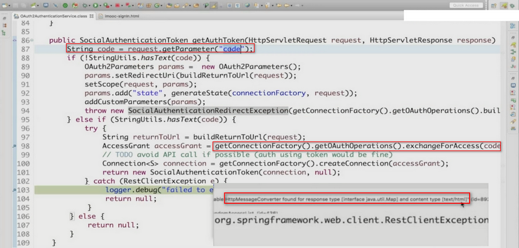
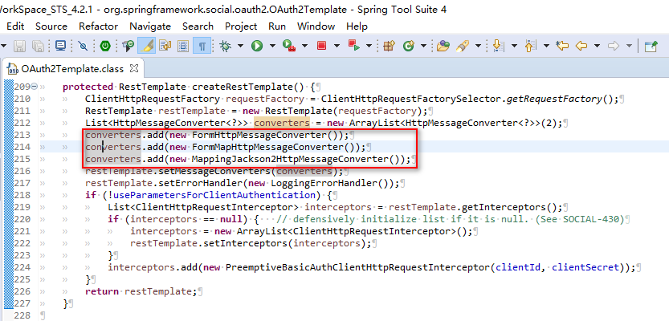
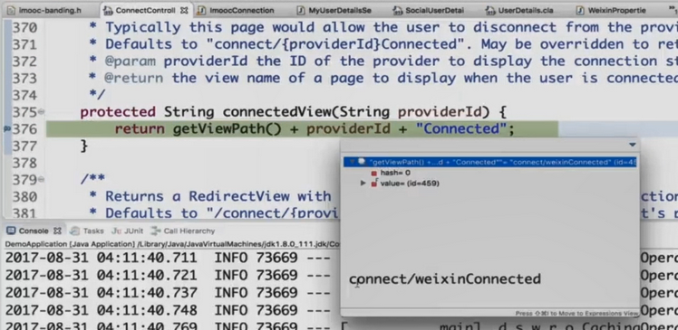

[返回](./README.md)

<details>
  <summary>点击时的区域标题</summary>
  <p> - 测试 测试测试</p>
  <p> 测试二 测试三 。。。。。 .</p>
  ```
    我是代码块1。我是代码块2。
  ```
</details>


# 第5章 使用 Spring Social 开发第三方登录

> 参考、整理自：
>
> - [九、SpringSocial基本原理 @Tinner丶](https://www.jianshu.com/p/9e3d2980d9de)
> - [SpringSecurity开发基于表单的认证(八) @ 云师兄 ](https://www.jianshu.com/p/9c8d197ccdab)


- 介绍 OAuth 协议 和 Spring Social 的基本原理和核心概念。
- 深入了解 Spring Social 的底层源码实现，以及扩展这些实现来适应不同的服务提供商。
  - 实现 QQ 认证 和 微信认证。
- 介绍 Spring Security 中与 session 管理相关的特性。
  - 如超时处理，并发控制，集群环境等。


## 5.1(5-1).  OAuth 协议 简介

不管是 Spring Social 还是 Spring Security OAuth，这两个框架都是根据 OAuth 协议来提供功能的。为了理解这两个框架的功能，我们需要对 OAuth 协议有一个较全面的理解。

> 1. OAuth 协议要解决的问题
> 2. OAuth 协议中的各种角色
> 3. OAuth 协议的运行流程

### 5.1.1. OAuth 协议 要解决的问题

首先我来举一个例子。


> 比如说我要开发一个微信美图助手，可以将用户在微信里面的自拍数据进行美化。这件事对于双方系统都是一件有利的事。对于微信来说，我提供这种服务，用户可能就更愿意把自拍放到微信上，而不是放到别的平台上去。而对于我自己的应用，默认的我可以把微信平台上的所有的这些用户都变为我的潜在用户，这比我从0开始一个个地去扩展用户的效率还是成本都好很多，这本身就是一种共赢的事情。

但是问题来了，微信肯定是不会允许我去随便地去获取 微信的 用户信息的。这时我就需要用户的一个授权，用户同意我去读 用户 在微信中的 自拍数据。有了这个授权之后我就可以告诉微信说用户同意了，这个时候微信就会把用户的 自拍数据 开放给我了。那么如何来得到用户的授权呢？我们可能会想到去要用户的微信名和微信密码，先不说安全问题，就算用户给了我微信名和密码，我拿着用户名和密码去微信中读取用户的 自拍数据，也是会存在很大的问题的。

> ​	问题1：***应用可以访问用户在微信上的所有数据***。因为如果用户把密码给我，我登录微信上之后我想看什么 看什么 ，比如说自己的通讯录好友，朋友圈等信息，并不只是 自拍数据。
> ​	问题2：***用户只有修改密码，才能收回授权***。因为我知道用户名密码了，但是用户并不能控制我到底能用多久，只要用户不更改密码我可以一直使用这个微信账号，但是用户一旦改了密码，其他的第三方应用也用不了了，而且下次再授权还是需要告诉我用户名密码。
> ​	问题3：***密码泄露的可能性大大提高***。如果用这种方式授权，就比如说我只是用户授权的其中之一的服务商，可能对于其他功能还会有很多授权，那么如果其中一个服务商出现了安全问题，将密码泄露了，那么可能用户的数据就泄露了，密码泄露的可能性就会大大提高。

那么为了解决这些问题，**OAuth 协议** 就诞生了，它出现的意义就在于，在用户给服务商授权的时候并不用给我用户名密码，而是可以交给我一个令牌（Token），我再去访问微信上 用户的 自拍数据 的时候 ， 我就不需要 用户的 用户名和密码了，而是用 用户的 令牌 去进行访问。有了这个机制，上述三个问题就会迎刃而解了。

> 首先， 在令牌上写着，你只能访问 用户的 自拍数据。你就没办法访问 用户 在微信上 其他的 数据 了。
>
> 第二， 令牌上会有一个有效期。比如 令牌上写着 这个令牌只能用一个月，那么 一个月 以后就再也不能访问 用户的 自拍数据 了。
>
> 最后，微信 根本就没有把密码给 我们的 美图助手 应用，而是给了它一个 令牌，所以也不会存在 用户密码泄露 的问题。

### 5.1.2. OAuth 协议 中的 各种角色

1. <span style="color:green">**服务提供商**（**Provider**）</span>

   **它用来提供 令牌**。因为之前说了 OAuth 协议 是基于 **令牌（Token）**的，这个令牌总不能让用户写个纸条给我，它本身就是一个电子化的东西。那么谁提供这个令牌，谁就是这个提供商，在我上边的例子中，主要是微信提供这个令牌，那么微信就是这个服务提供商。

   - <span style="color:green">(4) **认证服务器**（**Authenrization Serve**r）</span>

     它的作用是 **认证 用户的 身份 并且 产生 令牌**，<span style="color:green">令牌 是从这个角色中产生出来的。</span>

   - <span style="color:green">(5) **资源服务器**（**Resource Server**）</span>

     这个角色有两个作用：

     - 第一个作用就是 **保存用户的资源**，即 用户的 自拍数据 是保存在 资源服务器 上的。
     - 第二个作用就是 **验证令牌**。最终我们的 第三方应用 发送请求 的时候 是发送到 资源服务器的，发请求的时候 会带着 认证服务器 发给我们的 Token，由 资源服务器 去验证 这个 Token，如果验证过了 就会把 用户的 自拍数据 给第三方应用。

2. <span style="color:green">**资源所有者**（**Resource Owner**）</span>

   资源是指什么？资源就是 用户的 自拍数据。**这些数据所有者是用户，而不是微信，用户只是把这些资源放在了微信上。**那么这里的 资源所有者 就是 用户 。

3. <span style="color:green">**第三方应用**（**Client**）</span>

   第三方应用 也就是 我们例子中的 美图助手，它的目的就是 将 微信用户 转化为 第三方的用户，然后向微信提供服务。

> 认证服务器 和 资源服务器 在 角色上是 2 个，但是在物理上， 他们可以在 同一台 机子上。


### 5.1.3. OAuth 协议 的 运行流程

首先 用户 要访问 第三方应用。

1. 然后 第三方应用 就会 请求 用户 去授权。

   用户 必须要让 第三方应用 有权限 去访问 相应数据 才能 进行服务。

2. 如果 用户 同意授权，那么 第三方应用 就会去访问 服务提供商 的 认证服务器，告诉 认证服务器 用户同意 我访问 微信上的 自拍数据了，你给我一个令牌（申请令牌）。

3. 其次 认证服务器 会去验证 第三方应用 “说的是不是实话”，即 用户 是不是 真的 同意授权了。

4. 如果 验证 通过了， 认证服务器 就会给 第三方应用 发送一个令牌。

5. 第三方应用 拿到了这个令牌之后，它就可以使用 这个令牌 去 资源服务器 中申请 访问资源。

6. 资源服务器 会验证 （由 第三方应用 发出的）申请资源 请求 上 携带的 令牌，确认令牌无误之后，它会同意把 用户的 自拍数据 开放给 第三方应用。

在这几个步骤中，**第二步（用户同意授权）这个是关键**，因为有了这个授权之后，第三方应用 Client 才能去进行下面的一系列操作 （申请令牌、获取资源）。


### 5.1.4. OAuth 协议 中的 授权模式

在用户授权的时候，可以将授权模式分为以下几种：

> 1. 授权码模式（authorization code）
> 2. 密码模式（resource owner password credentials）
> 3. ~~客户端模式（client credentials）~~
> 4. ~~简化模式（implicit）~~

其中，用的最多的是 **授权码模式（authorization code）和密码模式（resource owner password credentials）**。

~~客户端模式（client credentials）和 简化模式（implicit）~~在实际开发应用过程中会用的比较少， 这里也不会涉及。


其中特别常见、特别主流、特别安全的一种授权模式，就是授权码模式（authorization code），下面我来详细介绍一下这种授权模式。

### 5.1.5. 授权码模式 简介

授权码模式 是四种授权模式中 <span style="color:green">**功能最完整、流程最严密**</span> 的一种授权模式，不管是微信也好、微博也好，几乎所有的互联网提供商都是采用这种方式来完成授权的。

##### 5.1.5.1. 授权码 模式 授权步骤

用户访问第三方客户端。

1. 如果第三方应用需要用户授权，它会将 用户 导向 认证服务器。
2. **用户 同意 授权 的这个动作 会在 `认证服务器` 上来完成**。
3. 如果 用户 同意 授权，那么 认证服务器 会将 用户 重新引导到 第三方应用上去。
   - 那么导回去 的时候 会导入到 第三方应用 的哪里呢？一般会指向到一个 URL 上去，这个 URL 是 第三方应用 Client 和 服务提供商 事先商量好的。
   - 当 认证服务器 将 用户 导入 第三方应用 的 URL 上去时，会携带一个**授权码**（这个授权码 并不是 第三方应用 需要的 那个令牌（Token））。
4. 第三方应用 在 收到 这个 授权码 之后，会拿着这个 **授权码** 向 认证服务器 上 **申请令牌**，（注意：这一步是在 第三方应用 Client 的 服务器后台 去完成的，对用户是不可见的）。
5. 然后 认证服务器 会核对 第三步给的 那个**授权码 **是不是 之前 给 第三方应用 Client 发过去的，如果确认无误，那么会向 第三方应用 Client **发送令牌（Token）**。


##### 5.1.5.2. 授权码模式特点

> 在整个过程中，我们了解到，就是因为在授权的时候会产生一个授权码，因此这个方式就叫做授权码模式。

这种模式主要有两个特点：(与其他 3 种 区分开)

1.  <span style="color:green">**用户 同意 授权 的动作是在 认证服务器 上去完成的。**</span>

   - 相比其它三种授权模式中， <span style="color:red">**密码模式和客户端模式，同意授权的动作是在第三方应用上去完成的。**</span>授权之后，第三方应用 Client 去向 认证服务器 申请令牌 的时候 带着一些信息（用户同意 第三方应用 Client 授权）。但是 认证服务器 是没办法确定 用户 是不是真的授权了，有可能这个授权信息是 第三方应用 Client 自己伪造的。
   -  <span style="color:green">**而在 授权码 模式中，“同意授权” 这个动作是在 认证服务器 上去完成的**</span>，所以 认证服务器 可以明确的 知道 用户 确实同意了 授权。

2.  <span style="color:green">**Client 换取令牌 的方式**。</span>

   第三方应用 Client 在整个申请 令牌（Token）的过程中向认证服务器进行了两个请求，第一个是拿到 授权码，第二次请求是拿着 授权码 去换取 真正的 令牌（Token）。

   - 也就是说在这个模式下 要求 第三方应用 必须要有一个服务器，并不是直接返回到 浏览器上，认证服务器 将 令牌 是发给 第三方应用 的 服务器的，安全性会更高。
   - 有些网站只有一些静态页面，没有服务器。这种情况下，它们可能会 用  简化模式（implicit），从 认证服务器 到 第三方 的时候，直接返回的 令牌。然后在第三方 页面上 用 脚本去读取。换句话说，简化模式（implicit）下，你从 浏览器 中就可以直接拿到令牌。

就是因为这两个特点，决定了 **授权码模式** 是 <span style="color:green">**功能最完整、流程最严密**</span> 的一种授权模式，也是现今 第三方应用服务商 最常用的 授权模式。


## 5.2(5-2). Spring Social 简介


> 前面 我们了解到 **OAuth 协议 其实是一个 授权协议**，其目的是 让用户 在不将 服务提供商 的用户名密码 提供给 第三方应用 的情况下，让 第三方应用 有权限访问 用户 存在 服务提供商 上的资源。


**那么 OAuth 协议 跟我们要实现的 第三方登陆 （QQ登录、微信登录等）是什么关系呢？**

*在前面的例子中，走完 授权协议，拿到令牌之后，说的场景是 拿用户的 自拍数据。* 

但是如果我们不去拿 用户的 自拍数据，而是拿 用户的 基本信息（比如 昵称、头像）。根据 用户 基本信息 构建 Authentivcation 并放入 SecurityContext 中去。

- 当我们往 SecurityContext 放入一个 经过验证的 Authentivcation 实例的时候，对于 Spring Security 来说，就是 登陆成功了。
- 如果我们 引导 用户 走完 下面的整个流程 ，实际上就是 拿 用户 在 服务提供商 上边的用户基本信息 登陆了 我们的 第三方应用。这个就是 第三方登录 实现的 基本原理和流程。


### 5.2.1. Spring Socail 核心功能

> **Spring Social 的核心功能就是 封装 并实现了整个 授权流程。** 


那么 Spring Social 在这一过程中做了什么事情呢？

**Spring Social 就是将这一整个 流程 封装起来 并且实现了。**

- 它把 上面 整个流程 封装到了 `SocialAuthenticationFilter` 的过滤器中，然后把这个过滤器加入到了 Spring Security 的过滤器链上。当访问请求的时候，SocialAuthenticationFilter 会将请求拦截下来，然后将整个流程走完。实际上 就相当于 实现了 第三方登录。


### 5.2.2. Spring Social 接口说明

> Spring Social 是如何将上面的 流程 封装到 特定的接口和类中去的？以及这些接口和类的调用关系。


#### 服务提供商相关

在整个流程上面，从第一步到第六步，都是需要跟 服务提供商 打交道的。

所以它的 **第一个接口叫--`ServiceProvider`**，它实际上就是 服务提供商 的一个抽象。

针对每一个 服务提供商（QQ、微信），都需要一个 ServiceProvider 接口的一个实现。Spring Social 提供了一个**`AbstractOauth2ServiceProvider`** 抽象类，实现了一些共有的东西，如果要自己写，只需要 继承 这个类 实现其中的 方法即可。

> 国内因为用 OAuth 协议比较晚，基本是用的都是 OAuth2 协议。

回过头来再看整个流程：

- ①第一步到第五步发放令牌其实是一个标准的流程。
- ②到了第六步（获取用户信息）的时候其实就是一个 个性化的实现，因为每一个 服务提供商 返回的用户信息的 数据结构 定义 都不一样。

针对①和②，SpringSocial 提供了两个接口：

- `Oauth2Operation`（封装第一步到第五步）。

  Spring 提供了一个默认的实现叫`Oauth2Template` ， 这个类会帮助我们去完成 Oauth 协议 的执行流程。

- `API`（个性化第六步），实际上没有一个明确的接口，因为每一个 服务提供商 对于用户基本信息的调用 都是有区别的。这里我们需要自己写一个接口来封装 第六步 获取用户信息 的行为。

  Spring Social 其实也提供了一个抽象类叫`AbstractOauth2ApiBinding` 帮助我们快速开发 第六步 的实现。

#### 第三方应用内部

到了第七步 实际上就跟 服务提供商 没有任何关系了。都是在 第三方应用Client 内部 去完成的。

- 第一个接口是 `Connection`，Spring Social 提供的实现类叫 `OAuth2Connection`。**其作用是 封装 前六步执行完毕之后 获取到的 用户信息**。

- `Connection` 是由 `ConnectionFactory` 工厂类 创建出来的，用到的类叫`OAuth2ConnectionFactory`。

  - **这个工厂类的 作用就是 为了创建 `Connection` 对象 来 获取用户信息。**

    但是用户信息是在`ServiceProvider` 中去构建的。**所以在 `OAuth2ConnectionFactory` 中肯定有一个`ServiceProvider` 实例**，即 `ServiceProvider` 被封装起来放到 `ConnectionFactory` 中去，以便去走 第一步到第五步 的流程 。

  - **注意：`Connection` 的对象名和字段名都是 固定的。**


之前说过，每一个 服务提供商 对于 第六步 获取到的 用户信息的 数据结构 都是不一样的，那么**`ConnectionFactory` 是如何做到将 这些 不同 数据结构的 信息 转化成 `Connection` 这样一个标准的数据结构（ 对象名和字段名 都是固定的 对象）的呢？**

- `ConnectionFactory` 有一个 `ApiAdapter` 。 将 不同格式的 用户信息 转化为 固定格式的 `Connection` 对象就是由 **`ApiAdapter` (Api 接口的 实现类)** 来完成。

  - `ApiAdapter` ，顾名思义，就是在 `Api` 和 `Connection` 之间进行一个 适配。

    转化成功之后就将向 `Connection` 中封装进去一个用户信息。


一般情况下，我们 业务系统 的用户 会存到 数据库 的 Table 里面（如 User 表）。

**如果 将 业务系统中的 用户信息 和 服务提供商 的 用户信息 关联到一块呢？**

- 换句话说， 服务提供商 里的 A 用户 登陆，如何知道是 业务系统的 张三 登陆呢？

在 Spring Social 中， **这个对应关系 是存在 数据库中的**。数据库中有一张 **UserConnection 表**，里面有 **业务系统的 userId 以及 服务提供商 的 Connection 之间的 对应关系**。

那么由谁来 操纵 这个 UserConnection  表呢？就是由 **UsersConnectionRepository**存储器 去实现的。在代码中用到的 实现类 叫做 **JdbcUsersConnectionRepository**, 这个类的作用就是 去数据库中 针对 用户 对应关系表 去做一些增删改查的操作。


## 5.3(5-3,5-4). 开发 QQ 登陆

> 参考 整理自： https://www.jianshu.com/p/6220b2745b24


- 关键是要做一个 OAuth 流程， 拿到 服务提供商 QQ 的 用户信息，它是封装在 Connection 中的。
- 要创建 Connection， 需要一个 ConnectionFactory（OAuth2ConnectionFactory）这么一个工厂。
- 要构建 ConnectionFactory， 需要 2 个东西：ServiceProvider（服务提供商） 和 ApiAdapter （API 适配器）。 
- 要构建 ServiceProvider ， 也需要 2 个东西：OAuth2Operations （Spring Social 提供了一个 OAuth2Template 的默认实现） 和 Api（用来获取用户信息，它是跟 服务提供商 紧密相关的，每个 服务提供商 都不一样。我们从 Api 作为切入点 入手 进行实现）。


### 5.3.1. 整个开发流程如下：

1. 先写 Api 的实现。(获取用户信息 的 实现。)
2. 用默认的 OAuth2Template 作为 OAuth2Operations 的一个实现。
3. 然后用 上面的 2 个 东西（Api 和 OAuth2Operations ） 构建出 一个 ServiceProvider 。
4. 然后去实现 ApiAdapter。
5. 有了 ServiceProvider  和 ApiAdapter ， 就可以构建 ConnectionFactory 。
6. 然后就可以拿到 服务提供商 的 用户信息（Connection）了。
7. 在 数据库中创建 UserConnection  表，然后配置下 告诉 JdbcUsersConnectionRepository 数据库的信息 就可以了。


-----

因为这个可以在 browser 和 app 都可以使用，所以也写在 core 里面。

#### 5.3.1.1. Api 开发

1. Api开发 -- 声明获取用户信息接口

   Api 主要是为了 获取用户信息，因此我们只需要 声明一个 获取用户信息的 接口。

   ```java
   package com.yafey.security.core.social.qq.api;
   public interface QQ {
   	// Api 主要是为了 获取用户信息，因此我们只需要 声明一个 获取用户信息的 接口。
       QQUserInfo getUserInfo();
   }
   ```

2. 开发接口实现类

   接口实现类继承了 Spring Social 中的 AbstractOAuth2ApiBinding 并实现了 QQ 接口。

   > 我们 先看一下 Spring Social 中 AbstractOAuth2ApiBinding 中的部分源码：
   >
   > 这个抽象类里面声明了一个 accessToken 和一个 restTemplate。
   >
   > - accessToken 说明： 我们现在写的 Api 实现类（QQImpl） 在 整个流程里面是执行 第六步 获取用户信息的。要执行这一步，必须携带 第五步 拿到的 令牌。 所以 这个 accessToken  属性 保存的是 就是这个 令牌。
   >   - *授权登录中，获取每一个QQ用户的 openId 和登录信息都需要一个 token，而且每个人的 token 不可能都一样，因此我们的 accessToken  不能够是单例的。*
   > - restTemplate 主要用于帮助我们往 服务提供商 发 Restful/HTTP 请求的。
   >
   > ```java
   > package org.springframework.social.oauth2;
   > public abstract class AbstractOAuth2ApiBinding implements ApiBinding, InitializingBean {
   > 
   >     private final String accessToken;
   >     private RestTemplate restTemplate;
   > 
   >     protected AbstractOAuth2ApiBinding() {
   >         accessToken = null;
   >         restTemplate = createRestTemplateWithCulledMessageConverters();
   >         configureRestTemplate(restTemplate);
   >     }
   >         //省略几万字~~~
   > ```
   
   查看 QQ互联 接口 API，accessToken 已经在 AbstractOAuth2ApiBinding 中帮我们定义好了， 我们只需要 在 QQImpl 中定义 appID（appId 是我们接入 QQ 时分配的 ID） 和 openid（存储的是 获取到的用户 openId，唯一标识符） 即可。外加两个 URL 模板字符串 方便调用（一个是 get_user_info 获取用户信息的路径，另一个是 通过 access Token 去发请求 获取 openid 的路径）。

   - 构造函数中，我们调用了父类的构造方法，最主要的是第二个参数`TokenStrategy.ACCESS_TOKEN_PARAMETER`，表示我们去获取 openID 的时候，**token 是放在`请求参数`中的，父类默认是放在`请求头`里面的，所以我们这里必须这么写一下。**
   - getUserInfo 方法使用 openId 和 appId，发起 rest 请求从QQ那里获取到用户的具体信息，然后封装成 QQUserInfo 对象。
   
   
   
   ```java
   package com.yafey.security.core.social.qq.api;
   // 每个人的 token 都是不一样的，因此我们的QQImpl不能够是单例的。即 不能使用 @Component 注解。
   public class QQImpl extends AbstractOAuth2ApiBinding implements QQ {
   	// 通过 access Token 去发请求 获取 openid 的路径
   	private static final String URL_GET_OPENID = "https://graph.qq.com/oauth2.0/me?access_token=%s";
   	// 获取用户信息的路径
   	private static final String URL_GET_USERINFO = "https://graph.qq.com/user/get_user_info?oauth_consumer_key=%s&openid=%s";
   	
   	private String appId;
   	
   	private String openId;
   	
   	private ObjectMapper objectMapper = new ObjectMapper();
   	
   	public QQImpl(String accessToken, String appId) {
           // token 是放在`请求参数`中的，父类默认是放在`请求头`里面的，所以我们这里必须这么写一下。
   		super(accessToken, TokenStrategy.ACCESS_TOKEN_PARAMETER);
   		
   		this.appId = appId;
   		
   		String url = String.format(URL_GET_OPENID, accessToken);
   		String result = getRestTemplate().getForObject(url, String.class);
   		
   		System.out.println(result);
   		
   		this.openId = StringUtils.substringBetween(result, "\"openid\":\"", "\"}");
   	}
   	
   	/** 
   	 * 这个方法使用 openId 和 appId，发起 rest 请求从QQ那里获取到用户的具体信息，然后封装成 QQUserInfo 对象。
   	 */
   	@Override
   	public QQUserInfo getUserInfo() {
   		
   		String url = String.format(URL_GET_USERINFO, appId, openId);
   		String result = getRestTemplate().getForObject(url, String.class);
   		
   		System.out.println(result);
   		
   		QQUserInfo userInfo = null;
   		try {
   			userInfo = objectMapper.readValue(result, QQUserInfo.class);
   			userInfo.setOpenId(openId);
   			return userInfo;
			} catch (Exception e) {
   		throw new RuntimeException("获取用户信息失败", e);
   		}
   	}
   }
   ```
   
3. QQUserInfo , 这个就是把从QQ接收到的用户信息字段映射到的一个类中。

   OK，Api模块我们就开发完成了。

   


#### 5.3.1.2. OAuthOperations 开发

为什么我们不直接使用 OAuth2Template 呢，而要自己去实现一个 QQOAuth2Template？

这是因为 QQ 返回回来的信息中是 `text/html` 格式的，OAuth2Template 没有支持处理这种类型的请求，所以我们必须要自己手动定义一个 。

- createRestTemplate 方法添加了一个 StringHttpMessageConverter，这样我们就可以成功的将服务提供商返回的信息转换成对应的对象了。
- 那为什么我们还要重写 postForAccessGrant 方法呢？我们会在后面讲解。  


OAuthOperations 开发就算开发完成了，那么我们相当于凑齐了 ServiceProvider 的两大组件了，我们可以做 ServiceProvider 的实现了。


#### 5.3.1.3. ServiceProvider 开发

ServiceProvider 抛开 API 组件，主要是完成了OAuth中的步骤1-5。

`QQServiceProvider` 需要继承抽象类 `AbstractOAuth2ServiceProvider<QQ>` ，里面 的 泛型是 Api 接口的泛型，即我们自定义的 QQ 接口。

- getApi 方法： ServiceProvider 用来获取 用户信息 需要的方法。我们刚才说了每个用户的token 是不一样的，而且 token 是有期限的。所以我们不能够直接把 QQImpl 声明为单例的，这里必须要 new 一个出来。accessToken 保存在 父类中。

  

- 构造方法： 调用了父类的构造方法，并且参数是我们自己声明的 QQOAuth2Template。

  - 其中 appId 和 appSecret 是QQ分配给我们的。因为每个调用我们模块的这两个参数都不一样，所以需要传进来。
  - URL_AUTHORIZE 表示我们引导用户跳转的授权页面，对应步骤1。
  - URL_ACCESS_TOKEN 对应步骤4，表示去获取 token。

```java
package com.yafey.security.core.social.qq.connect;

public class QQServiceProvider extends AbstractOAuth2ServiceProvider<QQ> {

	private String appId; // 整个应用 对于 QQ 来说，有一个固定的 appID。
	
	private static final String URL_AUTHORIZE = "https://graph.qq.com/oauth2.0/authorize";
	
	private static final String URL_ACCESS_TOKEN = "https://graph.qq.com/oauth2.0/token";
	
	public QQServiceProvider(String appId, String appSecret) {
		// 其中 appId 和 appSecret 是QQ分配给我们的。因为每个调用我们模块的这两个参数都不一样，所以需要传进来。
		// URL_AUTHORIZE 表示我们引导用户跳转的授权页面，对应步骤1。
		// URL_ACCESS_TOKEN 对应步骤4，表示去获取 token。
		super(new QQOAuth2Template(appId, appSecret, URL_AUTHORIZE, URL_ACCESS_TOKEN));
		this.appId = appId;
	}
	
	@Override
	public QQ getApi(String accessToken) {
		return new QQImpl(accessToken, appId);
	}
}
```


#### 5.3.1.4. ApiAdapter

这个主要是用于适配作用的，试想，我们从QQ、微信、微博中获取到的 UserInfo 信息是五花八门的，但是我们的 Connection 想要的信息就那么多，如何适配呢？很简单直接继承 SpringSocial提供的 ApiAdapter 接口。

> QQAdapter 就是在我们自己写的 QQImpl （Api）所获取到的 个性化的 服务提供商 的 用户数据 和 Spring Social 标准的 数据结构 进行 适配。

- test 方法：表示和 QQ 的连接是否 还通畅，我们这里直接返回 true。

- `setConnectionValues` 方法：**这里就是 真正 做适配 的地方。**

  这个方法里面要做的就是 把 QQUserInfo （从 Api 接口获取的数据） 转换成 ConnectionValues 需要的数据。

  

当我们完成了 适配 和 Serviceprovider 后，我们就可以开始构造 我们的 ConnectionFactory 了。

```
package com.yafey.security.core.social.qq.connect;

public class QQAdapter implements ApiAdapter<QQ> {

	/**
	 * 表示和 QQ 的连接是否 还通畅，我们这里直接返回 true。
	 */
	@Override
	public boolean test(QQ api) {
		return true;
	}

	/**
	 * 把 QQUserInfo （从 Api 接口获取的数据） 转换成 ConnectionValues 需要的数据。
	 */
	@Override
	public void setConnectionValues(QQ api, ConnectionValues values) {
		QQUserInfo userInfo = api.getUserInfo();
		
		values.setDisplayName(userInfo.getNickname());
		values.setImageUrl(userInfo.getFigureurl_qq_1());
		values.setProfileUrl(null); // qq 里面没有 个人主页。 比如 微博，这个就可以设置为 个人主页。
		values.setProviderUserId(userInfo.getOpenId()); // 用户在  服务提供商 那边的唯一标识。
	}

	// 跟 api.getUserInfo() ， 后续 绑定、解绑 的时候再写。
	@Override
	public UserProfile fetchUserProfile(QQ api) {
		// TODO Auto-generated method stub
		return null;
	}

	// 比如 微博，可以发一条消息去更新微博， 在 QQ 这里没有这种操作。
	@Override
	public void updateStatus(QQ api, String message) {
		//do noting
	}
}
```


#### 5.3.1.5. OAuth2ConnectionFactory 及 Connection

OAuth2ConnectionFactory 的构建非常简单，继承 OAuth2ConnectionFactory ， 泛型是 Api 接口类型，然后 将我们构建出的 QQServiceProvider 和 QQAdapter 传给 父类的构造函数即可。

然后 Spring Social 就可以利用它创建 Connection 了。

- 我们不用自己处理 Connection ， Spring Social 会根据 OAuth2ConnectionFactory 和 前面的代码，自动帮我们创建出来。

```java
package com.yafey.security.core.social.qq.connect;

public class QQConnectionFactory extends OAuth2ConnectionFactory<QQ> {

	// providerId 表示 服务提供商 的唯一标识 ，放在配置中。
	// appId 和 appSecret 也从外面传进来，交给 QQServiceProvider。 
	/**
	 * 将我们构建出的 QQServiceProvider 和 QQAdapter 传给 父类的构造函数即可。
	 */
	public QQConnectionFactory(String providerId, String appId, String appSecret) {
		super(providerId, new QQServiceProvider(appId, appSecret), new QQAdapter());
	}
}
```


#### 5.3.1.6. 配置SocialConfig

要把数据保存到数据库，我们只需要 配置数据库信息交给 Spring Social `JdbcUsersConnectionRepository` 即可。

Spring Socail 会使用 `JdbcUsersConnectionRepository`（UsersConnectionRepository 的 默认实现类） 来将 Connection 存储到 DBUserConnection中去。

1. 成员变量解析

   DataSource  表示数据源，repository 会使用到

   connectionSignUp 注册配置,详情请见下面的 第9部分拓展部分

   SecurityProperties，存放QQ和微信的配置，其中的成员变量包含了 appId 和 appSecret

2. **`getUsersConnectionRepository`**

   这里我们使用了 SpringSocial 默认提供的 JdbcUsersConnectionRepository，第一个参数是dataSource，第二个参数 connectionFactoryLocator 可以帮我们选择对应的ConnectionFactory ，我们这里只写了一个QQ登录，只有一个QQ的 ConnectionFactory，但是下一篇文章中，我们写微信登录的时候，那么就会有多的 ConnectionFactory 了。`Encryptors.noOpText()` 表示我们对数据不加密，这里我们只是为了演示使用，**实际上我们的数据入库的时候，对于 access_token 这类敏感信息还是需要加密的**。

3. `addConnectionFactories`

  把我们的 QQFactory 和 WeixinFactory 加进去对于微信的实现我们下一篇文章讲，这里先卖个关子 。

4. `getUserIdSource`

   这个也是 SpringBoot2 里面最恶心的地方了，在 1.5 的版本中是没有这个东西了，这个方法主要是被 Filter 调用的，我们就返回 SpringSocial 默认提供的实现就可以了。

```java
package com.yafey.security.core.social;

@Configuration
@EnableSocial  // 声明 使用 Spring Social
public class SocialConfig extends SocialConfigurerAdapter {

	@Autowired
	private DataSource dataSource;

	@Override
	public UsersConnectionRepository getUsersConnectionRepository(ConnectionFactoryLocator connectionFactoryLocator) {
		JdbcUsersConnectionRepository repository = new JdbcUsersConnectionRepository(dataSource,
				connectionFactoryLocator, Encryptors.noOpText());
		repository.setTablePrefix("yafey_");  // 假设我们的 表名 规范里面有统一的前缀。
		return repository;
	}

}
```

#### 5.3.1.7. 建立表

Spring-social-core 包提供了 SQL 语句，直接使用就可以了。（和 JdbcUsersConnectionRepository 放在同一个 package 下面）

userId 就是我们的业务系统 userId，providerId 表示 服务提供商 Id，providerUserId 就是 openId。这 3 个 字段是 这张表的 主键。

```sql
create table yafey_UserConnection (  -- 假设我们的 表名 规范里面有统一的前缀。
    userId varchar(255) not null,  -- 业务系统 userId
    providerId varchar(255) not null,  -- 服务提供商 Id
    providerUserId varchar(255),  -- 对于 QQ 来说 就是 openId 
    rank int not null,
    displayName varchar(255),
    profileUrl varchar(512),
    imageUrl varchar(512),
    accessToken varchar(512) not null,
    secret varchar(512),
    refreshToken varchar(512),
    expireTime bigint,
    primary key (userId, providerId, providerUserId));
create unique index UserConnectionRank on UserConnection(userId, providerId, rank);
```

#### 5.3.1.8. 修改 MyUserDetailsService 实现 SocialUserDetailsService 接口

在我们进行QQ 登录的时候，我们会根据 providerId 和 providerUserId 拿到 userId，然后通过 userId 拿到 用户的 具体业务信息。其实 SpringSocial 也提供了一个接口 SocialUserDetailsService ,帮助我们获取 user 的信息，所以我们也让 MyUserDetailsService 实现了 SocialUserDetailsService 接口， 并实现 loadUserByUserId 方法。

SocialUserDetails 是 UserDetails 的 子类，只不过多了一个 getUserId(); 方法。如果用 username 作为 唯一标识，这个方法等同于 getUsername 。

然后将 这个类 从 security-browser 挪到 browser-demo project 中。 ------ 因为 userId 这种 是 具体的 业务数据。

```java
package com.yafey.security.browser;

@Component
@Slf4j
public class MyUserDetailsService implements UserDetailsService,SocialUserDetailsService {

    // 这个方法是 Spring Social 根据 providerId 和 providerUserId 从 yafey_UserConnection 拿到 userId，然后传过来。
    @Override
    public SocialUserDetails loadUserByUserId(String userId) throws UsernameNotFoundException {
    	log.info("社交登录用户Id:" + userId);
        return buildUser(userId);
    }

    private SocialUserDetails buildUser(String userId) {
        // 根据用户名查找用户信息
        //根据查找到的用户信息判断用户是否被冻结
        String password = passwordEncoder.encode("123456");
        log.info("数据库密码是:"+password);
        return new SocialUser(userId, password,
                true, true, true, true,
                AuthorityUtils.commaSeparatedStringToAuthorityList("admin"));
    }
    ...其他代码...
}
```


#### 5.3.1.9. 新建 QQProperties

```java
package com.yafey.security.core.properties;

// 父类中声明了 appid 和 appSecret
@Data
public class QQProperties extends SocialProperties {
	
	private String providerId = "qq";  // 标识符 就设置为 qq 就可以
}
```

#### 5.3.1.10. 新建 SocialProperties

然后把 QQProperties 加进去，然后 把 SocialProperties 加到 SecurityProperties 中。

```java
package com.yafey.security.core.properties;
import lombok.Data;

@Data
public class SocialProperties {
	private QQProperties qq = new QQProperties();
}
```


```java
package com.yafey.security.core.properties;

@Data
@ConfigurationProperties(prefix = "yafey.security")
public class SecurityProperties {
	
	private BrowserProperties browser = new BrowserProperties();
	private ValidateCodeProperties code = new ValidateCodeProperties();

	private SocialProperties social = new SocialProperties();
}
```

#### 5.3.1.11. 新建 QQAutoConfig 配置类

继承 SocialAutoConfigurerAdapter， 实现 createConnectionFactory 方法。----- 将 配置的 appid 、appSecret 和 providerId 构建 ConnectionFactory 。 

```java
package com.yafey.security.core.social.qq.config;

@Configuration
@ConditionalOnProperty(prefix = "yafey.security.social.qq", name = "app-id") // 只有在系统中 配置 app-id,下面的配置才会生效。
public class QQAutoConfig extends SocialAutoConfigurerAdapter {

	@Autowired
	private SecurityProperties securityProperties;

	@Override
	protected ConnectionFactory<?> createConnectionFactory() {
		QQProperties qqConfig = securityProperties.getSocial().getQq();
		return new QQConnectionFactory(qqConfig.getProviderId(), qqConfig.getAppId(), qqConfig.getAppSecret());
	}
}
```

#### 5.3.1.12. 添加 social 配置 @ browser-demo

```yaml
yafey:
  security:
    social:
      qq:
        app-id: 
        app-secret: 
        providerId: qq
    ...其他配置...
```

#### 5.3.1.13. 配置 SocialConfigurer ，加到 过滤器链上。

我们把所有的组件都已经完成好了，接下来就是配置我们的过滤器了

在 SocialConfig 中我们先暂时直接 new SpringSocialConfigurer。

```java
package com.yafey.security.core.social;

@Configuration
@EnableSocial  // 声明 使用 Spring Social
public class SocialConfig extends SocialConfigurerAdapter {
	... 其他代码...
        
	@Bean
	public SpringSocialConfigurer yafeySocialSecurityConfig() {
		return new SpringSocialConfigurer();
	}
}
```

继承的 SpringSocialConfigurer 其实生成了一个`SocialAuthenticationFilter`，而这个Filter默认只会拦截 `/auth` 开头的请求路径。

```java
package com.yafey.security.browser;

@Configuration
public class BrowserSecurityConfig extends AbstractChannelSecurityConfig {
    
    @Autowired
	private SpringSocialConfigurer yafeySocialSecurityConfig;
    
	@Override
	protected void configure(HttpSecurity http) throws Exception {
		
		applyPasswordAuthenticationConfig(http);
		
		http
			.apply(yafeySocialSecurityConfig) // 添加 social 的配置
		;
		... 其他代码 ... 
	}
    ... 其他代码 ... 
}			
```

#### 5.3.1.14. 在 self-login.html 新增链接

SocialAuthenticationFilter 默认会拦截 `/auth` 开头的链接，qq 是 ProviderID 

```html
<h3>社交登录</h3>
<!-- SocialAuthenticationFilter 默认会拦截 /auth 开头的链接，qq 是 ProviderID -->
<a href="/auth/qq">QQ登录</a>
```


**目前只是能跑起来。还有一些问题需要处理。**


## 5.4(5-5,5-6). 完善 QQ 登陆

上图中出现的 `param client_id is wrong or lost (100001)` ， 表示 回调地址 出错。

在 OAuth 流程的 第三步， 当 用户同意授权后，服务提供商 会跳回到 第三方应用 ， 就需要 这个 回调地址。这个地址是 我们在 QQ 互联 上申请应用的时候 需要填写的 ，示例如下：


### 5.4.1. 修改 redirectURL

让我们的回调地址指向到 上面 申请时候配置的 地址。

1. 修改 hosts , 让 www.pinzhi365.com 指向 localhost/127.0.0.1

   ```hosts
   127.0.0.1 www.pinzhi365.com
   ```

   

2. 修改 Social filter 默认拦截的 地址。

   新建 YafeySpringSocialConfigurer

   我们这里使用了 `filter.setFilterProcessesUrl(filterProcessesUrl);` 来改变默认的配置。为什么是在 setFilterProcessesUrl 配置呢？

   - 因为 SpringSocialConfigurer 在把 Filter 放到过滤器链之前会调用一个 `postProcess` 方法，所以我们在调用父类的 postProcess 之后，我们就在这里设置 processingUrl。除此之外，我们的请求跳转还涉及到 providerId，**这个 providerId 也是我们实现跳转和授权完成之后回调的关键**。我们自定义 Filter 拦截 `/qqLogin/callback.do` 的请求会跳转到QQ登录，因此 ConnectionProvider 的 providerId 也必须配置成 `callback.do`，filterProcessesUrl 为 qqLogin。

   ```java
   package com.yafey.security.core.social;
   
   public class YafeySpringSocialConfigurer extends SpringSocialConfigurer {
   	
   	private String filterProcessesUrl;
   	
   	public YafeySpringSocialConfigurer(String filterProcessesUrl) {
   		this.filterProcessesUrl = filterProcessesUrl;
   	}
   	
   	@SuppressWarnings("unchecked")
   	@Override
   	protected <T> T postProcess(T object) {
   		SocialAuthenticationFilter filter = (SocialAuthenticationFilter) super.postProcess(object);
   		filter.setFilterProcessesUrl(filterProcessesUrl);
   		return (T) filter;
   	}
   }
   ```

3. 修改 SocialConfig

   ```java
   package com.yafey.security.core.social;
   
   @Configuration
   @EnableSocial  // 声明 使用 Spring Social
   public class SocialConfig extends SocialConfigurerAdapter {
   	...其他代码...
   	@Autowired
   	private SecurityProperties securityProperties;
   	
   	@Bean
   	public SpringSocialConfigurer yafeySocialSecurityConfig() {
   		String filterProcessesUrl = securityProperties.getSocial().getFilterProcessesUrl();
   		YafeySpringSocialConfigurer configurer = new YafeySpringSocialConfigurer(filterProcessesUrl);
   		return configurer;
   	}
   ```

4. 配置 ， 和 申请时的 uri 保持一致。

   ```yaml
   yafey:
     security:
       social:
         qq:
           app-id: 
           app-secret: 
           filterProcessUrl: /qqLogin
           providerId: callback.do
   ```

5. 修改 self-login.html 的链接

   ```html
   	<h3>社交登录</h3>
   	<!-- SocialAuthenticationFilter 默认会拦截 /auth 开头的链接，qq 是 ProviderID -->
       <a href="/qqLogin/callback.do">QQ登录</a>
   ```

   使用 www.pinzhi365.com/self-login.html , 因为修改了 hosts, 所以访问的还是 本地的 服务。

   > 查看日志， 发现会访问 signIn 地址， 因为这个地址没有 排除掉，所以跳到了需要授权的页面。
   >
   > ```
   > 引发跳转的请求是: http://www.pinzhi365.com/signin
   > ```

   

   

   

### 5.4.2. Spring Social 流程说明

Spring Social 和 用户名密码 或 手机号 登陆的 核心流程基本上是一致的。

1. 有一个拦截器（SocialAuthenticationFilter) 去拦截特定的请求 （默认是 `/auth/<providerId>` )。
2. 把这个请求中 需要做身份认证的信息 封装到一个 Authentication 的实现类 中。
3. 然后把 Authentication 实现类 交给 AuthenticationManager。
   - <span style="color:green;font-family:'PMingLiU,MingLiU,KaiTi_GB2312'">*在 Spring Social 中，在 封装 Authentication  给 AuthenticationManager 的时候，用到了一个接口--SocialAuthenticationService， 在这里 具体的实现类是 OAuth2AuthenticationService。它的作用是 执行整个 OAuth2 的 流程。*</span>
   - <span style="color:green;font-family:'PMingLiU,MingLiU,KaiTi_GB2312'">*然后在执行的过程中会去调用我们自己写的 ConnectionFactory，拿到 ServiceProvider ，ServiceProvider 里面有 一个 OAuth2Operators（OAuth2Template），可以帮助 Spring Social 完成 整个的流程。*</span>
   - <span style="color:green;font-family:'PMingLiU,MingLiU,KaiTi_GB2312'">*完成流程后， 会拿到 服务提供商 的用户信息，封装到 Connection 中。 Connection 会被封装成 一个 SocialAuthenticationToken （Authentication）， 然后将 SocialAuthenticationToken 交给 AuthenticationManager。*</span>
4. AuthenticationManager 根据 传进来的 Authentication 的类型， 从它管理的 AuthenticationProvider 接口实现类 中 挑一个 Provider 来处理 传进来的 校验信息。
   - <span style="color:green;font-family:'PMingLiU,MingLiU,KaiTi_GB2312'">*AuthenticationManager 会挑选 SocialAuthenticationProvider 来处理 这个 Token （SocialAuthenticationToken ）。在处理的 时候， 会根据 Connection （也就是 服务提供商 的 用户信息），使用 JdbcUsersConnectionRepository 这个类 到数据库中 查找到 业务系统的 UserId。*</span>
   - <span style="color:green;font-family:'PMingLiU,MingLiU,KaiTi_GB2312'">*查找到 UserId 后， 根据 UserId 去调 我们自己写的 SocialUserDetailService ，这个类里面，去业务系统里 把 真正要放到 session 中的 用户信息 查出来（也就是 SocialUserDetails）, 然后把 SocialUserDetails 中的用户信息 放到 最终的 SocialAuthenticationToken ，并标记为 已经过身份校验，然后 放到 SecurityContext 中，最终放到 session 中。*</span>
5. 在处理的过程中， 会去调用我们自己写的 UserDetailService 接口的实现 来获取业务系统中 用户的 信息。 然后把 业务系统的 用户信息 封装在 UserDetail 接口的实现类 中。
6. 然后进行一系列的 检查和 校验， 如果都通过了，然后把 业务系统的用户信息 封装在 Authentication 中，并把它 标记为 `已校验` 的， 放到 SecurityContext 中。


PS：

- 蓝色的这些 是 Spring Social 封装好的；
- 橙色的这些 是 我们自己写的。


### 5.4.3 (5-6). Spring Social 流程源码分析

我们来回想下刚才流程出错的场景：我们已经 跳到 QQ 上，手机扫码了，说明我们已经进行 授权的确认了，确认后，跳回到了我们的 第三方应用。但是它并没有像 我们想象的那样 --- 进到系统里面去，而是跳到了 signin 的 url 上去。所以我们出问题的点 还是在 走 OAuth 的流程中出现的问题（也就是说我们最终 还没有 获取到一个正确 SocialAuthenticationToken 交给 AuthenticationManager 去验证，而是在 OAuth2AuthenticationService 去走 OAuth 流程的过程中出现了问题）。


OAuth2AuthenticationService，它是 SocialAuthenticationFilter 的关键 service，在这里我们主要是简单讲讲它的原理。这个 service 中有一个 getAuthToken 方法。

因为第三步中 QQ 会返回授权码 code，如果发现 没有这个 code，SpringSocial 会认为是第一步，也就是要去授权认证，因此会作重定向。但是如果我们发现我们得到了 code，这个时候我们就会利用 code 去拿 token 信息。

我们在 L98 和 L103 分别打断点，看看发生了什么。

我们可以看到 这里抛出了一个 RestClientException 异常，异常信息为 ：`No avaiable HttpMessageConventer found for response [Map] and content type [text/html]` ，然后 跑到 unsuccessfulAuthentication ，即交给 Social 的 失败处理器 处理。





查看 SocialAuthenticationFilter ， 默认的 失败处理器 的处理是 重定向到 DEFAULT_FAILURE_URL （/signin）的 url 上。

```java
package org.springframework.social.security;
public class SocialAuthenticationFilter extends AbstractAuthenticationProcessingFilter {

	private SimpleUrlAuthenticationFailureHandler delegateAuthenticationFailureHandler;

	public SocialAuthenticationFilter(AuthenticationManager authManager, UserIdSource userIdSource, UsersConnectionRepository usersConnectionRepository, SocialAuthenticationServiceLocator authServiceLocator) {
		super(DEFAULT_FILTER_PROCESSES_URL);
		setAuthenticationManager(authManager);
		this.userIdSource = userIdSource;
		this.usersConnectionRepository = usersConnectionRepository;
		this.authServiceLocator = authServiceLocator;
		this.delegateAuthenticationFailureHandler = new SimpleUrlAuthenticationFailureHandler(DEFAULT_FAILURE_URL);
		super.setAuthenticationFailureHandler(new SocialAuthenticationFailureHandler(delegateAuthenticationFailureHandler));
	}
	
	private static final String DEFAULT_FAILURE_URL = "/signin";
	
	private static final String DEFAULT_FILTER_PROCESSES_URL = "/auth";
	
	... 其他代码 ...
}
```

默认的 OAuth2Template 中没有 处理 `text/html` 的 converter, 所以我们要 覆盖掉下面的方法，让它可以处理 `text/html`。



新建 QQOAuth2Template ，

```java
package com.yafey.security.core.social.qq.connect;

@Slf4j
public class QQOAuth2Template extends OAuth2Template {
	
	public QQOAuth2Template(String clientId, String clientSecret, String authorizeUrl, String accessTokenUrl) {
		super(clientId, clientSecret, authorizeUrl, accessTokenUrl);
		// 默认为 false ， 只有设置为 true 的时候才会传 clientId 和 clientSecret。 
		// 详见 org.springframework.social.oauth2.OAuth2Template.authenticateClient(String)
		 setUseParametersForClientAuthentication(true); 
	}
	
	// 解析 QQ 的 response，详见 org.springframework.social.oauth2.OAuth2Template.postForAccessGrant(String, MultiValueMap<String, String>)
	@Override
	protected AccessGrant postForAccessGrant(String accessTokenUrl, MultiValueMap<String, String> parameters) {
		 String responseStr = getRestTemplate().postForObject(accessTokenUrl, parameters, String.class);
		 
		 log.info("获取accessToke的响应："+responseStr);
		 
		 String[] items = StringUtils.splitByWholeSeparatorPreserveAllTokens(responseStr, "&");
		 
		 String accessToken = StringUtils.substringAfterLast(items[0], "=");
		 Long expiresIn = new Long(StringUtils.substringAfterLast(items[1], "="));
		 String refreshToken = StringUtils.substringAfterLast(items[2], "=");
		 
		 return new AccessGrant(accessToken, null, refreshToken, expiresIn);
	}
	
	// 增加 处理 content type 为 “text/html” 格式的 MessageConverter 
	@Override
	protected RestTemplate createRestTemplate() {
		 RestTemplate restTemplate = super.createRestTemplate();
		 restTemplate.getMessageConverters().add(new StringHttpMessageConverter(Charset.forName("UTF-8")));
		 return restTemplate;
	}

}
```

然后 在 QQServiceProvider 中， 使用 QQOAuth2Template 替换 默认的 OAuth2Template 。

在我们拿到 Token 之后，Filter 会拿着这个 Token 选择一个 Provider 做验证，Provider 会使用 Repository **到数据库中获取 userId，如果获取不到，就会跳转到 signUp 页面**，提示用户去注册。而且在跳转之前我们可以看到，session中已经存放了connection的信息，具体步骤如下：

- 第1步：根据得到的 token 去验证
- 第2步：provider 中通过 repostitory 去拿对应的 userId
- 第3步：跳转到注册页面


基于此，我们还需要设置一个注册页面。


### 5.4.4. 注册页面

1. 标准注册页面 yafey-signUp.html

   ```html
   <!DOCTYPE html>
   <html>
   <head>
   <meta charset="UTF-8">
   <title>标准注册页面</title>
   </head>
   <body>
   	<h2>标准注册页面</h2>
   	<h3>这是系统注册页面，请配置  yafey.security.browser.signUpUrl 属性来设置自己的注册页</h3>
   </body>
   </html>
   ```

   

2. 在 BrowserProperties 新增 signUpUrl 属性。

3. 配置 demo.yaml

   ```yaml
   yafey:
     browser:
       signUpUrl: /demo-signUp.html
   ```

4. 新建 demo-signUp.html

   ```html
   <!DOCTYPE html>
   <html>
   <head>
   <meta charset="UTF-8">
   <title>Demo注册页</title>
   </head>
   <body>
       <h2>Demo注册页</h2>
       
       <form action="/user/regist" method="post">
           <table>
               <tr>
                   <td>用户名:</td> 
                   <td><input type="text" name="username"></td>
               </tr>
               <tr>
                   <td>密码:</td>
                   <td><input type="password" name="password"></td>
               </tr>
               <tr>
                   <td colspan="2">
                       <button type="submit" name="type" value="regist">注册</button>
                       <button type="submit" name="type" value="binding">绑定</button>
                   </td>
               </tr>
           </table>
       </form>
   </body>
   </html>
   ```

   

5. 注册逻辑

   **`ProviderSignInUtils` 是SpringSocial提供的一个工具类，帮助我们把用户信息绑定到对应的账户中去。**

   ```java
   @RestController
   public class UserController {
       
       @Autowired
       private ProviderSignInUtils providerSignInUtils;
       
       @PostMapping("/user/regist")
       public void regist(User user, HttpServletRequest request) {
           
           //不管是注册用户还是绑定用户，都会拿到一个用户唯一标识。
           String userId = user.getUsername();
           providerSignInUtils.doPostSignUp(userId, new ServletWebRequest(request));
       }
       ... 其他代码 ...
   }
   ```

6. 在 SocialConfig 中 注册 providerSignInUtils

   ```java
   	@Bean
   	public ProviderSignInUtils providerSignInUtils(ConnectionFactoryLocator connectionFactoryLocator) {
   		return new ProviderSignInUtils(connectionFactoryLocator,
   				getUsersConnectionRepository(connectionFactoryLocator)) {
   		};
   	}
   ```

7. 在 BrowserSecurityConfig 中，将 signUpUrl 和 "/user/regist" url 设置为不需要校验。

   ```
   ,securityProperties.getBrowser().getSignUpUrl()
   ,"/user/regist"
   ```


### 5.4.5. 从 session中获取 Connection 信息

在 重定向到 注册页面 之前，Spring Social 会将 Connection 放到 session 中， 因此，在注册页面我们可以从 session 中 取出 用户 在 服务提供商 的信息。相关操作可以使用 providerSignInUtils 类。


### 5.4.6. 新用户直接登录

有时候我们发现在用第三方授权登录后，不需要用户在注册信息，那这个是怎么实现的呢？我们先看看 SocialAuthenticationProvider 源码


在toUserId中我们刚才找不到用户的时候直接跳转到了注册页面，原因是Repostiry在寻找userId的时候的逻辑是这样的：

如果找不到用户且connectionSignUp为空了，就会返回一个空的List，但是如果我们实现一个connectionSignUp，这里就可以根据我们的根据我们的逻辑把这个userId放到数据库中去，所以我们这里要自己实现一个connectionSignUp。

这样配置后，我们即使在数据库中没有该用户也能够拿到用户信息 。


```
@Component
public class DemoConnectionSignUp implements ConnectionSignUp {

    /* (non-Javadoc)
     * @see org.springframework.social.connect.ConnectionSignUp#execute(org.springframework.social.connect.Connection)
     */
    @Override
    public String execute(Connection<?> connection) {
        //根据社交用户信息默认创建用户并返回用户唯一标识
        return connection.getDisplayName();
    }

}
```


## 5.5.(5-7) 开发微信登陆

SpringSocial 开发微信登录。大部分其实和 QQ 登录很相似，原理就不赘述了。


### 5.5.1. Properties

1. WeixinProperties

   ```java
   package com.yafey.security.core.properties;
   
   @Data
   public class WeixinProperties extends SocialProperties {
   	
   	/**
   	 * 第三方id，用来决定发起第三方登录的url，默认是 weixin。
   	 */
   	private String providerId = "weixin";
   
   }
   ```

2. SocialProperties

   ```
   package com.yafey.security.core.properties;
   
   import lombok.Data;
   
   @Data
   public class SocialProperties {
   	private String filterProcessesUrl = "/auth";
   
   	private QQProperties qq = new QQProperties();
   	
   	private WeixinProperties weixin = new WeixinProperties();
   }
   ```

3. yaml

   ```yaml
   yafey:
     browser:
       signUpUrl: /demo-signUp.html
     security:
       code:
         image:
           length: 6
           width: 100
           url: /users,/user/*
       social:
         filterProcessUrl: /qqLogin
         qq:
           app-id: 
           app-secret: 
           providerId: callback.do
         weixin:
           app-id: wxd99431bbff8305a0
           app-secret: 60f78681d063590a469f1b297feff3c4
   ```


### 5.5.2. Api 开发 

1. 声明获取用户信息接口

   ```java
   package com.yafey.security.core.social.weixin.api;
   /**
    * 微信API调用接口
    */
   public interface Weixin {
   
   	WeixinUserInfo getUserInfo(String openId);
   	
   }
   ```

   

2. WeixinUserInfo

   ```java
   package com.yafey.security.core.social.weixin.api;
   
   import lombok.Data;
   
   /**
    * 微信用户信息
    */
   @Data
   public class WeixinUserInfo {
   	
   	/**
   	 * 普通用户的标识，对当前开发者帐号唯一
   	 */
   	private String openid;	
   	/**
   	 * 普通用户昵称
   	 */
   	private String nickname;
   	/**
   	 * 语言
   	 */
   	private String language;
   	/**
   	 * 普通用户性别，1为男性，2为女性
   	 */
   	private String sex;
   	/**
   	 * 普通用户个人资料填写的省份
   	 */
   	private String province;
   	/**
   	 * 普通用户个人资料填写的城市
   	 */
   	private String city;
   	/**
   	 * 国家，如中国为CN
   	 */
   	private String country;
   	/**
   	 * 用户头像，最后一个数值代表正方形头像大小（有0、46、64、96、132数值可选，0代表640*640正方形头像），用户没有头像时该项为空
   	 */
   	private String headimgurl;
   	/**
   	 * 用户特权信息，json数组，如微信沃卡用户为（chinaunicom）
   	 */
   	private String[] privilege;
   	/**
   	 * 用户统一标识。针对一个微信开放平台帐号下的应用，同一用户的unionid是唯一的。
   	 */
   	private String unionid;
   	
   }
   ```

   

3. 获取用户信息接口实现类

   > 和QQ区别最大的是，我们没有在去获取openId了，而且我们的getUserInfo里面多了一个 openId 参数，**为啥不需要去获取openId了呢？是因为微信通过授权码拿到token后同时也把openId带回来了，所以帮我们省去了步骤 。**

   ```java
   package com.yafey.security.core.social.weixin.api;
   
   /**
    * Weixin API调用模板， scope为Request的Spring bean, 根据当前用户的accessToken创建。
    */
   public class WeixinImpl extends AbstractOAuth2ApiBinding implements Weixin {
   	
   	/**
   	 * 
   	 */
   	private ObjectMapper objectMapper = new ObjectMapper();
   	/**
   	 * 获取用户信息的url
   	 */
   	private static final String URL_GET_USER_INFO = "https://api.weixin.qq.com/sns/userinfo?openid=";
   	
   	/**
   	 * @param accessToken
   	 */
   	public WeixinImpl(String accessToken) {
   		super(accessToken, TokenStrategy.ACCESS_TOKEN_PARAMETER);
   	}
   	
   	/**
   	 * 默认注册的StringHttpMessageConverter字符集为ISO-8859-1，而微信返回的是UTF-8的，所以覆盖了原来的方法。
   	 */
   	protected List<HttpMessageConverter<?>> getMessageConverters() {
   		List<HttpMessageConverter<?>> messageConverters = super.getMessageConverters();
   		messageConverters.remove(0);
   		messageConverters.add(new StringHttpMessageConverter(Charset.forName("UTF-8")));
   		return messageConverters;
   	}
   
   	/**
   	 * 获取微信用户信息。
   	 */
   	@Override
   	public WeixinUserInfo getUserInfo(String openId) {
   		String url = URL_GET_USER_INFO + openId;
   		String response = getRestTemplate().getForObject(url, String.class);
   		if(StringUtils.contains(response, "errcode")) {
   			return null;
   		}
   		WeixinUserInfo profile = null;
   		try {
   			profile = objectMapper.readValue(response, WeixinUserInfo.class);
   		} catch (Exception e) {
   			e.printStackTrace();
   		}
   		return profile;
   	}
   
   }
   ```

   

OK，API部分开发完成。


### 5.5.3 OAuthOperations开发

1. WeixinOAuth2Template

   ```java
   package com.yafey.security.core.social.weixin.connect;
   
   /**
    * 完成微信的OAuth2认证流程的模板类。国内厂商实现的OAuth2每个都不同, spring默认提供的OAuth2Template适应不了，只能针对每个厂商自己微调。
    *
    */
   public class WeixinOAuth2Template extends OAuth2Template {
   	
   	private String clientId;
   	
   	private String clientSecret;
   
   	private String accessTokenUrl;
   	
   	private static final String REFRESH_TOKEN_URL = "https://api.weixin.qq.com/sns/oauth2/refresh_token";
   	
   	private Logger logger = LoggerFactory.getLogger(getClass());
   
   	public WeixinOAuth2Template(String clientId, String clientSecret, String authorizeUrl, String accessTokenUrl) {
   		super(clientId, clientSecret, authorizeUrl, accessTokenUrl);
   		setUseParametersForClientAuthentication(true);
   		this.clientId = clientId;
   		this.clientSecret = clientSecret;
   		this.accessTokenUrl = accessTokenUrl;
   	}
   	
   	/* (non-Javadoc)
   	 * @see org.springframework.social.oauth2.OAuth2Template#exchangeForAccess(java.lang.String, java.lang.String, org.springframework.util.MultiValueMap)
   	 */
   	@Override
   	public AccessGrant exchangeForAccess(String authorizationCode, String redirectUri,
   			MultiValueMap<String, String> parameters) {
   		
   		StringBuilder accessTokenRequestUrl = new StringBuilder(accessTokenUrl);
   		
   		accessTokenRequestUrl.append("?appid="+clientId);
   		accessTokenRequestUrl.append("&secret="+clientSecret);
   		accessTokenRequestUrl.append("&code="+authorizationCode);
   		accessTokenRequestUrl.append("&grant_type=authorization_code");
   		accessTokenRequestUrl.append("&redirect_uri="+redirectUri);
   		
   		return getAccessToken(accessTokenRequestUrl);
   	}
   	
   	public AccessGrant refreshAccess(String refreshToken, MultiValueMap<String, String> additionalParameters) {
   		
   		StringBuilder refreshTokenUrl = new StringBuilder(REFRESH_TOKEN_URL);
   		
   		refreshTokenUrl.append("?appid="+clientId);
   		refreshTokenUrl.append("&grant_type=refresh_token");
   		refreshTokenUrl.append("&refresh_token="+refreshToken);
   		
   		return getAccessToken(refreshTokenUrl);
   	}
   
   	@SuppressWarnings("unchecked")
   	private AccessGrant getAccessToken(StringBuilder accessTokenRequestUrl) {
   		
   		logger.info("获取access_token, 请求URL: "+accessTokenRequestUrl.toString());
   		
   		String response = getRestTemplate().getForObject(accessTokenRequestUrl.toString(), String.class);
   		
   		logger.info("获取access_token, 响应内容: "+response);
   		
   		Map<String, Object> result = null;
   		try {
   			result = new ObjectMapper().readValue(response, Map.class);
   		} catch (Exception e) {
   			e.printStackTrace();
   		}
   		
   		//返回错误码时直接返回空
   		if(StringUtils.isNotBlank(MapUtils.getString(result, "errcode"))){
   			String errcode = MapUtils.getString(result, "errcode");
   			String errmsg = MapUtils.getString(result, "errmsg");
   			throw new RuntimeException("获取access token失败, errcode:"+errcode+", errmsg:"+errmsg);
   		}
   		
   		WeixinAccessGrant accessToken = new WeixinAccessGrant(
   				MapUtils.getString(result, "access_token"), 
   				MapUtils.getString(result, "scope"), 
   				MapUtils.getString(result, "refresh_token"), 
   				MapUtils.getLong(result, "expires_in"));
   		
   		accessToken.setOpenId(MapUtils.getString(result, "openid"));
   		
   		return accessToken;
   	}
   	
   	/**
   	 * 构建获取授权码的请求。也就是引导用户跳转到微信的地址。
   	 */
   	public String buildAuthenticateUrl(OAuth2Parameters parameters) {
   		String url = super.buildAuthenticateUrl(parameters);
   		url = url + "&appid="+clientId+"&scope=snsapi_login";
   		return url;
   	}
   	
   	public String buildAuthorizeUrl(OAuth2Parameters parameters) {
   		return buildAuthenticateUrl(parameters);
   	}
   	
   	/**
   	 * 微信返回的contentType是html/text，添加相应的HttpMessageConverter来处理。
   	 */
   	protected RestTemplate createRestTemplate() {
   		RestTemplate restTemplate = super.createRestTemplate();
   		restTemplate.getMessageConverters().add(new StringHttpMessageConverter(Charset.forName("UTF-8")));
   		return restTemplate;
   	}
   
   }
   ```

2. WeixinAccessGrant

   ```java
   package com.yafey.security.core.social.weixin.connect;
   
   /**
    * 微信的access_token信息。与标准OAuth2协议不同，微信在获取access_token时会同时返回openId,并没有单独的通过accessToke换取openId的服务
    * 
    * 所以在这里继承了标准AccessGrant，添加了openId字段，作为对微信access_token信息的封装。
    *
    */
   @Data
   public class WeixinAccessGrant extends AccessGrant {
   	
   	private static final long serialVersionUID = -7243374526633186782L;
   	
   	private String openId;
   	
   	public WeixinAccessGrant() {
   		super("");
   	}
   
   	public WeixinAccessGrant(String accessToken, String scope, String refreshToken, Long expiresIn) {
   		super(accessToken, scope, refreshToken, expiresIn);
   	}
   
   }
   ```

3. ServiceProvider

   ```java
   package com.yafey.security.core.social.weixin.connect;
   
   /**
    * 微信的OAuth2流程处理器的提供器，供spring social的connect体系调用
    */
   public class WeixinServiceProvider extends AbstractOAuth2ServiceProvider<Weixin> {
   	
   	/**
   	 * 微信获取授权码的url
   	 */
   	private static final String URL_AUTHORIZE = "https://open.weixin.qq.com/connect/qrconnect";
   	/**
   	 * 微信获取accessToken的url
   	 */
   	private static final String URL_ACCESS_TOKEN = "https://api.weixin.qq.com/sns/oauth2/access_token";
   
   	/**
   	 * @param appId
   	 * @param appSecret
   	 */
   	public WeixinServiceProvider(String appId, String appSecret) {
   		super(new WeixinOAuth2Template(appId, appSecret,URL_AUTHORIZE,URL_ACCESS_TOKEN));
   	}
   
   	@Override
   	public Weixin getApi(String accessToken) {
   		return new WeixinImpl(accessToken);
   	}
   }
   ```

4. ApiAdapter

   ```java
   package com.yafey.security.core.social.weixin.connect;
   
   /**
    * 微信 api适配器，将微信 api的数据模型转为spring social的标准模型。
    *
    */
   public class WeixinAdapter implements ApiAdapter<Weixin> {
   	
   	private String openId;
   	
   	public WeixinAdapter() {}
   	
   	public WeixinAdapter(String openId){
   		this.openId = openId;
   	}
   
   	@Override
   	public boolean test(Weixin api) {
   		return true;
   	}
   
   	@Override
   	public void setConnectionValues(Weixin api, ConnectionValues values) {
   		WeixinUserInfo profile = api.getUserInfo(openId);
   		values.setProviderUserId(profile.getOpenid());
   		values.setDisplayName(profile.getNickname());
   		values.setImageUrl(profile.getHeadimgurl());
   	}
   
   	@Override
   	public UserProfile fetchUserProfile(Weixin api) {
   		return null;
   	}
   
   	@Override
   	public void updateStatus(Weixin api, String message) {
   		//do nothing
   	}
   }
   ```

5. OAuth2ConnectionFactory

   ```java
   package com.yafey.security.core.social.weixin.connect;
   
   /**
    * 微信连接工厂
    */
   public class WeixinConnectionFactory extends OAuth2ConnectionFactory<Weixin> {
   
   	public WeixinConnectionFactory(String providerId, String appId, String appSecret) {
   		super(providerId, new WeixinServiceProvider(appId, appSecret), new WeixinAdapter());
   	}
   	
   	/**
   	 * 由于微信的openId是和accessToken一起返回的，所以在这里直接根据accessToken设置providerUserId即可，不用像QQ那样通过QQAdapter来获取
   	 */
   	@Override
   	protected String extractProviderUserId(AccessGrant accessGrant) {
   		if(accessGrant instanceof WeixinAccessGrant) {
   			return ((WeixinAccessGrant)accessGrant).getOpenId();
   		}
   		return null;
   	}
   	
   	public Connection<Weixin> createConnection(AccessGrant accessGrant) {
   		return new OAuth2Connection<Weixin>(getProviderId(), extractProviderUserId(accessGrant), accessGrant.getAccessToken(),
   				accessGrant.getRefreshToken(), accessGrant.getExpireTime(), getOAuth2ServiceProvider(), getApiAdapter(extractProviderUserId(accessGrant)));
   	}
   
   	public Connection<Weixin> createConnection(ConnectionData data) {
   		return new OAuth2Connection<Weixin>(data, getOAuth2ServiceProvider(), getApiAdapter(data.getProviderUserId()));
   	}
   	
   	private ApiAdapter<Weixin> getApiAdapter(String providerUserId) {
   		return new WeixinAdapter(providerUserId);
   	}
   	
   	private OAuth2ServiceProvider<Weixin> getOAuth2ServiceProvider() {
   		return (OAuth2ServiceProvider<Weixin>) getServiceProvider();
   	}
   }
   ```

6. 配置SocialConfig

   ```java
   package com.yafey.security.core.social;
   
   @Configuration
   @EnableSocial  // 声明 使用 Spring Social
   public class SocialConfig extends SocialConfigurerAdapter {
   
   	@Autowired
   	private DataSource dataSource;
   	@Autowired
   	private SecurityProperties securityProperties;
   	
   	@Autowired(required = false)
   	private ConnectionSignUp connectionSignUp;
   
   	@Override
   	public UsersConnectionRepository getUsersConnectionRepository(ConnectionFactoryLocator connectionFactoryLocator) {
   		JdbcUsersConnectionRepository repository = new JdbcUsersConnectionRepository(dataSource,
   				connectionFactoryLocator, Encryptors.noOpText());
   		repository.setTablePrefix("yafey_");  // 假设我们的 表名 规范里面有统一的前缀。
   		if(connectionSignUp != null) {
   			repository.setConnectionSignUp(connectionSignUp);
   		}
   		return repository;
   	}
   	
   	@Bean
   	public SpringSocialConfigurer yafeySocialSecurityConfig() {
   		String filterProcessesUrl = securityProperties.getSocial().getFilterProcessesUrl();
   		YafeySpringSocialConfigurer configurer = new YafeySpringSocialConfigurer(filterProcessesUrl);
   		configurer.signupUrl(securityProperties.getBrowser().getSignUpUrl()); // 当找不到用户时，跳转到 注册页面。
   		return configurer;
   	}
   	
   	@Bean
   	public ProviderSignInUtils providerSignInUtils(ConnectionFactoryLocator connectionFactoryLocator) {
   		return new ProviderSignInUtils(connectionFactoryLocator,
   				getUsersConnectionRepository(connectionFactoryLocator)) {
   		};
   	}
   
   }
   ```

7. WeixinAutoConfiguration

   ```java
   package com.yafey.security.core.social.weixin.config;
   
   /**
    * 微信登录配置
    */
   @Configuration
   @ConditionalOnProperty(prefix = "yafey.security.social.weixin", name = "app-id")
   public class WeixinAutoConfiguration extends SocialAutoConfigurerAdapter {
   
   	@Autowired
   	private SecurityProperties securityProperties;
   
   	@Override
   	protected ConnectionFactory<?> createConnectionFactory() {
   		WeixinProperties weixinConfig = securityProperties.getSocial().getWeixin();
   		return new WeixinConnectionFactory(weixinConfig.getProviderId(), weixinConfig.getAppId(),
   				weixinConfig.getAppSecret());
   	}
   	
   }
   ```

   

## 5.6(5-8). 绑定和解绑处理

> 参考 整理自 [Spring-Security源码分析十四-Spring-Social绑定与解绑/#绑定与解绑实现](https://niocoder.com/2018/02/02/Spring-Security源码分析十四-Spring-Social绑定与解绑/#绑定与解绑实现)

绑定 与 QQ 登陆 流程本身是一样的， 不一样的地方是，在 QQ 登陆时，开始走流程的时候，是不知道 当前系统的 登陆的用户 是谁的，因为要在走完流程之后，根据 QQ 账号拿到的 UserID 去 登陆我们的系统。

而 绑定 的时候，是已经知道 绑定的 UserID 是谁了，再去走流程，走完流程后，将 社交账号 与 UserID 建立关联关系。

解绑就是删除`UserConnection`表数据。

`Spring Social`默认在`ConnectController`类上已经帮我们实现了以上的需求。


### 5.6.1. 服务接口分析

1. 在 绑定 页面，我们需要拿到 所有 社交账号的 绑定 信息（包括支持哪些社交账号、及 哪些已经绑定、哪些没有绑定 等）。
2. 绑定 操作。
3. 解绑 操作。

Spring Social 默认已实现上述 3 个 服务接口。但是这几个 服务接口 跟之前的有点不一样，它只提供了 数据， 没有提供 视图。


#### 5.6.1.1. 获取状态 接口 分析 及实现

Spring Social 实现了`/connect` 接口，返回了状态数据。

**实现`connect/status `视图即可获得社交账号的绑定状态。**

> Spring Social 源码分析
>
> ```java
> package org.springframework.social.connect.web;
> @Controller
> @RequestMapping("/connect")
> public class ConnectController implements InitializingBean {
> 	
> 	private String viewPath = "connect/";
>     
> 	@RequestMapping(method=RequestMethod.GET)
> 	public String connectionStatus(NativeWebRequest request, Model model) {
> 		setNoCache(request);
> 		processFlash(request, model);
> 		Map<String, List<Connection<?>>> connections = connectionRepository.findAllConnections();//根据userId查询UserConnection表
> 		model.addAttribute("providerIds", connectionFactoryLocator.registeredProviderIds());//系统中已经注册的服务提供商		
> 		model.addAttribute("connectionMap", connections);
> 		return connectView();//返回connectView()
> 	}
> 	
> 	protected String connectView() {
> 		return getViewPath() + "status";// connect/status，Spring 会在 容器中 查找 这个视图。
> 	}
>     // ... 其他代码
> }
> ```
>
> 


##### 实现 connect/status 视图

```java
package com.yafey.security.core.social;

@Component("connect/status") 
public class SocialConnectionStatusView extends AbstractView {

    @Autowired
    private ObjectMapper objectMapper;

    @Override
    protected void renderMergedOutputModel(Map<String, Object> model, HttpServletRequest request, HttpServletResponse  ) throws Exception {
        Map<String, List<Connection<?>>> connections = (Map<String, List<Connection<?>>>) model.get("connectionMap");

        Map<String, Boolean> result = new HashMap<>();
        for (String key : connections.keySet()) {
            result.put(key, CollectionUtils.isNotEmpty(connections.get(key)));
        }

        response.setContentType("application/json;charset=UTF-8");
		response.getWriter().write(objectMapper.writeValueAsString(result));
    }
}
```


先去 标准登陆页面 http://localhost/self-login.html 登陆，再 访问 http://localhost/connect 查看 状态信息。

注意：从这里开始，端口号 改成 80 。


#### 5.6.1.2. Spring Social 与 MySQL8 的坑

> 整理自 ： [springsocial/oauth2---第三方登陆之QQ登陆7【注册逻辑之mysql里rank为关键字问题解决+springsocial源码解读③】](https://blog.csdn.net/nrsc272420199/article/details/100749424)

##### mysql8 里 rank 为关键字问题解决

填上用户名+密码点击注册发现会出现如下bug：


我把图中语句放在navicat里运行，发现仍然报语法错误，此时突然想到之前写的一篇文章：《[【MySQL报错处理】[Err] 1064 、[Err] 1055、JdbcUsersConnectionRepository.sql建表报错](https://blog.csdn.net/nrsc272420199/article/details/98803281)》，于是豁然开朗，其实rank在我的mysql版本里是一个保留关键字，因此需要再将rank弄成下面的样子才可以 （即 加上 反引号）。


为什么会报出这个bug呢？跟踪springsocial源码发现在执行 providerSignInUtils.doPostSignUp(userId, new ServletWebRequest(request));语句进行存储数据时，会调用JdbcConnectionRepository类里的如下方法：

```java
@Transactional
public void addConnection(Connection<?> connection) {
	try {
		ConnectionData data = connection.createData();
		int rank = jdbcTemplate.queryForObject("select coalesce(max(rank) + 1, 1) as rank from " + tablePrefix + "UserConnection where userId = ? and providerId = ?", new Object[]{ userId, data.getProviderId() }, Integer.class);
		jdbcTemplate.update("insert into " + tablePrefix + "UserConnection (userId, providerId, providerUserId, rank, displayName, profileUrl, imageUrl, accessToken, secret, refreshToken, expireTime) values (?, ?, ?, ?, ?, ?, ?, ?, ?, ?, ?)",
				userId, data.getProviderId(), data.getProviderUserId(), rank, data.getDisplayName(), data.getProfileUrl(), data.getImageUrl(), encrypt(data.getAccessToken()), encrypt(data.getSecret()), encrypt(data.getRefreshToken()), data.getExpireTime());
	} catch (DuplicateKeyException e) {
		throw new DuplicateConnectionException(connection.getKey());
	}
}
```

追踪到该方法时，真有种不看不知道一看吓一跳的感觉，因为JdbcConnectionRepository这个类里很多方法都用到了rank字段，那操作数据库时肯定就会有很多的问题了。但是仔细分析一下可以看到该类是一个没有被public，private等字段修饰的类，即该类只允许同一个包中的类进行访问。那它在哪个包呢？其实就是JdbcUsersConnectionRepository所在的包，看下图：


再仔细一看，可以在JdbcUsersConnectionRepository类里看到如下方法：

```java
public ConnectionRepository createConnectionRepository(String userId) {
	if (userId == null) {
		throw new IllegalArgumentException("userId cannot be null");
	}
	return new JdbcConnectionRepository(userId, jdbcTemplate, connectionFactoryLocator, textEncryptor, tablePrefix);
}
```

即JdbcConnectionRepository类是在JdbcUsersConnectionRepository类里new出来的。那这个问题就好解决了。

##### 解决方案

1. 将数据库里的 `rank` 字段改成了 `_rank` —》感觉尽量不要用mysql的保留关键字

2. 将 org.springframework.social.connect.jdbc 包下的 `JdbcUsersConnectionRepository` 类和`JdbcConnectionRepository` 类拷贝了一份放到了我的项目目录中—》放在了com.yafey.security.core.social.jdbc 包路径下

3. 将 `JdbcConnectionRepository` 中的所有 `rank` 字段改成了 `_rank` 

4. 将 `UsersConnectionRepository` 换成了我自己的刚复制的 `YafeyJdbcUsersConnectionRepository` 即：

   ```java
   package com.yafey.security.core.social;
   
   public class SocialConfig extends SocialConfigurerAdapter {
   	@Override
   	public UsersConnectionRepository getUsersConnectionRepository(ConnectionFactoryLocator connectionFactoryLocator) {
   		/**
            * 第二个参数的作用：根据条件查找该用哪个ConnectionFactory来构建Connection对象
            * 第三个参数的作用: 对插入到userconnection表中的数据进行加密和解密
            */
           YafeyJdbcUsersConnectionRepository repository = new YafeyJdbcUsersConnectionRepository(dataSource,
   				connectionFactoryLocator, Encryptors.noOpText());
   		repository.setTablePrefix("yafey_");  // 假设我们的 表名 规范里面有统一的前缀。
   		if(connectionSignUp != null) {
   			repository.setConnectionSignUp(connectionSignUp);
   		}
   		return repository;
   	}
       ... 其他代码 
   }
   ```

   


### 5.6.2. 绑定(以 微信 为例)

在 browser 项目下 新建 yafey-binding.html

注意： 表单提交的默认接口是   `/connect/{providerId}` (只接受 POST 方式) ， 定义在 org.springframework.social.connect.web.ConnectController.connect(String, NativeWebRequest)

```html
<!DOCTYPE html>
<html>
<head>
<meta charset="UTF-8">
<title>标准绑定页面</title>
</head>
<body>
	<h2>标准绑定页面</h2>
	<!-- 格式  /connect/{providerId} -->
	<form action="/connect/weixin" method="post">
		<button type="submit">绑定微信</button>
	</form>
</body>
</html>
```

修改 hosts ， 增加下面的映射关系。

```
127.0.0.1       www.pinzhi365.com
```

需要 增加 `connect/weixinConnected` 视图




```java
package com.yafey.security.core.social;

public class YaFeyConnectView extends AbstractView {

	@Override
	protected void renderMergedOutputModel(Map<String, Object> model, HttpServletRequest request,
			HttpServletResponse response) throws Exception {

		response.setContentType("text/html;charset=UTF-8");
		if (model.get("connections") == null) {
			response.getWriter().write("<h3>解绑成功</h3>");
		} else {
			response.getWriter().write("<h3>绑定成功</h3>");
		}
	}
}
```

为了 复用 上面的 view ， 我们在 SocialConfig 中 新增如下配置。

```java
package com.yafey.security.core.social;
public class SocialConfig extends SocialConfigurerAdapter {
	// connect/weixinConnected : 绑定。
	// connect/weixinConnect : 解绑。
	@Bean({"connect/weixinConnect", "connect/weixinConnected"})
	@ConditionalOnMissingBean(name = "weixinConnectedView")
	public View weixinConnectedView() {
		return new YaFeyConnectView();
	}
}
```


http://www.pinzhi365.com/self-login.html 登录， 然后在 http://www.pinzhi365.com/yafey-binding.html 页面 点击 绑定。


以上，完成 绑定。


### 5.6.3. 解绑

~~在 浏览器中 使用 RestClient 工具 发送 `Delete` 方式的 请求到 http://www.pinzhi365.com/connect/weixin~~

添加 解绑 按钮

```html
<!DOCTYPE html>
<html>
<head>
<meta charset="UTF-8">
<title>标准绑定页面</title>
</head>
<body>
	<h2>标准绑定页面</h2>
	<!-- 格式  /connect/{providerId} -->
	<form action="/connect/weixin" method="post">
		<button type="submit">绑定微信</button>
	</form>

	<button id="DeleteWX">解绑微信</button>
</body>
<script type="text/javascript">
	// 参考自： https://developer.mozilla.org/zh-CN/docs/Web/API/Fetch_API/Using_Fetch
	document.getElementById("DeleteWX").onclick=function() {
        // 格式  /connect/{providerId}
		DeleteData('http://www.pinzhi365.com/connect/weixin')
		.then(data => console.log(data)) // JSON from `response.json()` call
		.catch(error => console.error(error));
	}
	
	function DeleteData(url) {
		// Default options are marked with *
		return fetch(url, {
		  //body: JSON.stringify(data), // must match 'Content-Type' header
		  cache: 'no-cache', // *default, no-cache, reload, force-cache, only-if-cached
		  // 要改为确保浏览器不在请求中包含凭据，请使用 credentials: 'omit'。
		  credentials: 'same-origin', // include, same-origin, *omit
		  headers: {
		    'user-agent': 'Mozilla/4.0 MDN Example',
		    'content-type': 'application/json'
		  },
		  method: 'DELETE', // *GET, POST, PUT, DELETE, etc.
		  mode: 'cors', // no-cors, cors, *same-origin
		  redirect: 'manual', // manual, *follow, error
		  referrer: 'no-referrer', // *client, no-referrer
		})
		.then(response => console.log(response) ) // parses response to JSON
	}
</script>
</html>
```

查看 console 控制台， HTTP 返回状态码 应该是 302 ， 查看 数据库，数据被删除了。


## 5.7(5-9). Session 管理

- Session 超时处理 （如何控制超时时间 及 ）
- Session 并发控制 （后面的登陆 把 前面的登陆 踢掉）
- 集群 Session 管理


> 整理自 ： https://blog.csdn.net/nrsc272420199/article/details/101098871


### 5.7.1. Session 超时时间设置

springboot 项目 session 超时时间设置很简单，只需要在 yml 或 properties 文件里进行配置一下就可以了。

`springboot的版本是 2.1.7.RELEASE`，在yml里配置如下：

```yaml
server:
  servlet:
    session:
      timeout: 60 # session 超时时间为60秒,这是最短的分钟数
```

<span style="color:red">`注意1：`早一点的 springboot 版本如 1.5.6.RELEASE 的配置可能如下：</span>

```yaml
server:
  session:
    timeout: 60 # session超时时间为60秒,这是最短的分钟数
```

<span style="color:red">注意2：如果设置的超时时间不满一分钟，将按一分钟来算，超过1分钟才按照你设置的超时时间来算。</span>

- springboot 的版本为 2.1.7.RELEASE 的可以参看 TomcatServletWebServerFactory 这个类里对 session-timeout 的控制
- springboot 的版本为 1.5.6.RELEASE 的可以参看 TomcatEmbeddedServletContainerFactory 这个类


### 5.7.2. 如何通知用户 Session 超时

在之前实现的代码里，是没对用户session超时做过特殊处理的，因此当session超时的时候会走之前写的用户认证失败的逻辑，即

- 访问url里以.html结尾时重定向到登陆页
- 不以.html结尾时则返回一个json字符串

那如果是session超时的情况下，如何给用户一个特殊的提示，告诉他们是因为session超时引起的认证、校验失败呢？需要如下三步：

1. 在配置文件 BrowserSecurityConfig 里加上 session 超时跳向的 url

   ```java
    .sessionManagement() //session超时管理
    .invalidSessionUrl("/session/invalid") //session超时跳向的url
   ```

2. 在配置文件BrowserSecurityConfig里为指定session超时跳向的url授权

   

3. BrowserSecurityController.java 中 写一个controller方法来处理session超时的提示逻辑

   ```java
   /***
    * session超时的时候会请求该方法
    * @return
    */
   @GetMapping("/session/invalid")
   @ResponseStatus(code = HttpStatus.UNAUTHORIZED)
   public SimpleResponse sessionInvalid() {
   	String message = "session 失效";
   	return new SimpleResponse(message);
   }
   ```

   

session超时后访问 http://localhost/users 会跳转到如下页面，说明配置已经成功。


### 5.7.3. session 的并发控制

> 整理自 https://blog.csdn.net/nrsc272420199/article/details/101110879

#### 5.7.3.1. 是什么？

以腾讯视频会员为例，假如我的账号买了会员，则我可以享受看视频免广告，某些热门电视剧提前看等福利。若我的朋友也想享受这些福利又不想花钱买会员，则我可以让他用我的号登陆。但是假如我有很多很多的朋友都不想买会员，都想用我的号登陆，那腾讯肯定感觉自己就亏了，所以腾讯视频`最大可同时登陆的设备是有数量限制的`，超过这个限制，前面的账户就会被踢下来，这就是所谓的session并发控制。


**spring security 在解决该问题时有两种策略：**

- 超过设置的最大session并发数量时，把之前的session失效掉，即踢掉前面的登陆
- 超过设置的最大session并发数量时，阻止后面的登陆


#### 5.7.3.2. 超过最大并发数量时，踢掉前面的登陆

在配置文件BrowserSecurityConfig里指定最大的并发数量

```java
//session相关的控制
.sessionManagement()
	//指定session超时跳向的url
	.invalidSessionUrl("/session/invalid")
	//指定最大的session并发数量---即一个用户只能同时在一处登陆（腾讯视频的账号好像就只能同时允许2-3个手机同时登陆）
	.maximumSessions(1)
	//超过最大session并发数量时的策略
	.expiredSessionStrategy(new YaFeyExpiredSessionStrategy())
	.and()
	.and()
```

超过最大session并发数量时的策略

```java
package com.yafey.security.browser.session;

/**
 * 如果设置的session并发策略为一个账户第二次登陆会将第一次给踢下来
 * 则第一次登陆的用户再访问我们的项目时会进入到该类
 * event里封装了request、response信息
 */
@Slf4j
public class YaFeyExpiredSessionStrategy implements SessionInformationExpiredStrategy {

    @Override
    public void onExpiredSessionDetected(SessionInformationExpiredEvent event) throws IOException, ServletException {
        String header = event.getRequest().getHeader("user-agent");
        log.info("浏览器信息为：{}", header);

        //告诉前端并发登陆异常
        event.getResponse().setContentType("application/json;charset=UTF-8");
        event.getResponse().getWriter().write("并发登陆！！！<br/>"+header);
    }
}
```


#### 5.7.3.3. 超过最大并发数量时，阻止后面的登陆

BrowserSecurityConfig 中修改为 `.maxSessionsPreventsLogin(true)` , 感觉貌似很少会用到这种策略

```java
//session相关的控制
.sessionManagement()
  //指定session超时跳向的url
  .invalidSessionUrl("/session/invalid")
  //指定最大的session并发数量---即一个用户只能同时在一处登陆（腾讯视频的账号好像就只能同时允许2-3个手机同时登陆）
  .maximumSessions(1)
  //当超过指定的最大session并发数量时，阻止后面的登陆（感觉貌似很少会用到这种策略）
  .maxSessionsPreventsLogin(true)
  //超过最大session并发数量时的策略
	.expiredSessionStrategy(new YaFeyExpiredSessionStrategy())
	.and()
	.and()
```


### 5.7.4. Session 管理 代码重构

session 超时后， 访问 html 结尾的 url （如：http://localhost/me.html) 引导到 默认的 html 页面。详见 提交。


## 5.8(5-10). session集群管理

> 整理自 ： 
>
> https://blog.csdn.net/dandandeshangni/article/details/79108696
>
> https://blog.csdn.net/nrsc272420199/article/details/101123577
>
> 关于更多Spring Session可参考：[程序猿DD](http://blog.didispace.com/tags/Spring-Session/)

session集群管理，或者说session共享我想大家都懂，这里我就不过多叙述了。


session 支持的 存储 定义在 StoreType 类 中：（在 Spring-Session 依赖中）

```java
package org.springframework.boot.autoconfigure.session;

public enum StoreType {

	/** Redis backed sessions. */
	REDIS,

	/** Mongo backed sessions. */
	MONGO,

	/** JDBC backed sessions. */
	JDBC,

	/** Hazelcast backed sessions. */
	HAZELCAST,

	/** Simple in-memory map of sessions. */
	HASH_MAP,

	/** No session data-store. */
	NONE;
}
```


### 5.8.1. 集群环境Session处理

> springboot版本为2.1.8.RELEASE 的配置如下：
>
> - 首先需要在pom.xml里再引入如下两个依赖
>
>   ```xml
>   <dependency>
>     <groupId>org.springframework.session</groupId>
>     <artifactId>spring-session-data-redis</artifactId>
>   </dependency>
>   <dependency>
>     <groupId>org.springframework.boot</groupId>
>     <artifactId>spring-boot-starter-data-redis</artifactId>
>   </dependency>
>   ```
>
> - 其次需要在yml或properties文件里指定存储session信息的为redis、并配置redis的数据库信息
>
>   ```yaml
>   spring:
>     ### 指定用什么存储session信息---可选项可参看源码StoreType枚举类
>     session:
>       store-type: redis
>     ###本地环境下不配置也可以
>   #  redis:
>   #    host: 127.0.0.1
>   #    port: 6379
>   #    password: 123
>   #    database: 0
>   ```

1. 添加spring-session-data-redis依赖

   ```xml
   <dependency>
       <groupId>org.springframework.session</groupId>
       <artifactId>spring-session-data-redis</artifactId>
   </dependency>
   ```

2. 配置Spring-session存储策略

   ```yaml
     redis:   ###本地环境下不配置也可以
       host: localhost
       port: 6379
     session:
       store-type: redis  ### 指定用什么存储session信息---可选项可参看源码StoreType枚举类
   ```

3. **强调一点：存到redis里的对象必须是序列化的即实现了Serializable 接口 — 其属性如果是一个对象的话，也必须实现了Serializable 接口。**

   可能遇到的问题，详见 5.8.2 。

4. 测试`80`和`8060`端口分别启动项目

   ```
   java -jar spring-security.jar --server.port=80
   java -jar spring-security.jar --server.port=8060
   ```

   - 访问 80 并登陆

   - 在不登陆的情况下直接访问8060服务器的接口 — 无需登陆可直接获得到数据，证明我们借助redis搭建的session集群管理已经生效。

     

     

   - 再看一下存到redis里的数据内容：

     

     

5.  **同时 前面的 session超时时间设置和并发控制功能都仍然有效。**


### 5.8.2 ImageCode 不显示 和 `序列化`报错问题

启动我们的项目，访问登陆页发现图形验证码显示不出来，后端报如下错误：


后端报错信息

```
org.springframework.data.redis.serializer.SerializationException: Cannot serialize; nested exception is org.springframework.core.serializer.support.SerializationFailedException: Failed to serialize object using DefaultSerializer; nested exception is java.lang.IllegalArgumentException: DefaultSerializer requires a Serializable payload but received an object of type [com.yafey.security.core.validate.code.image.ImageCode]
```


原因(非常重要)
由于我们项目里ImageCode对象没有实现Serializable 接口，且该类里有一个属性 — BufferedImage对象，该对象也没有实现Serializable 接口，因此才会报出序列化错误。

- 解决办法是 ： 
  - ValidateCode 实现 Serializable 接口。
  - BufferedImage 对象因为无法 实现 Serializable 接口。换个思路，修改代码，我们不需要把 图片保存到 session 中， 只需要把 验证码 放到 session 中即可。


## 5.9(5-11). 退出 处理

> 整理自 ：
>
> https://blog.csdn.net/nrsc272420199/article/details/101150634
>
> https://blog.csdn.net/dandandeshangni/article/details/79098629

- 如何退出登陆
- Spring Security 默认的 退出处理逻辑
- 与 退出登陆 相关的配置


### 5.9.1. spring-security默认退出处理逻辑

1. 清除`Cookie`
2. 清除当前用户的`remember-me`记录
3. 使当前`session`失效
4. 清空当前的`SecurityContext`
5. 重定向到登录界面

`Spring Security`的退出请求（默认为`/logout`）由 [LogoutFilter](https://longfeizheng.github.io/2018/01/05/Spring-Security源码分析二-Spring-Security授权过程/#源码分析 "https://longfeizheng.github.io/2018/01/05/Spring-Security源码分析二-Spring-Security授权过程/#源码分析") 过滤器拦截处理。


### 5.9.2. 自定义退出登陆的一些处理逻辑

demo-index.html 添加链接

```html
<a href="/signOut">退出</a>
```


在配置文件里自定义退出登陆的一些处理逻辑

```java
.and()
   //退出登陆相关的逻辑
   .logout()
   //自定义退出的url---默认的为/logout
   .logoutUrl("/logout")
   //自定义退出成功处理器
   .logoutSuccessHandler(logoutSuccessHandler)
   //自定义退出成功后跳转的url与logoutSuccessHandler互斥
   //.logoutSuccessUrl("/index")
   //指定退出成功后删除的cookie
   .deleteCookies("JSESSIONID")
```

不要忘记对涉及到的URL进行授权

```java
.antMatchers( //配置不用进行认证校验的url
	SecurityConstants.DEFAULT_UNAUTHENTICATION_URL,
	SecurityConstants.DEFAULT_LOGIN_PROCESSING_URL_MOBILE,
	securityProperties.getBrowser().getLoginPage(),
	SecurityConstants.DEFAULT_VALIDATE_CODE_URL_PREFIX+"/*"
	,securityProperties.getBrowser().getSignUpUrl()
	//session失效默认的跳转地址
    ,securityProperties.getBrowser().getSession().getSessionInvalidUrl()
    //退出登陆默认跳转的url
    ,securityProperties.getBrowser().getSignOutUrl()
	,"/user/regist"
		).permitAll()
```

自定义的退出成功处理器

```java
package com.yafey.security.browser.logout;

@Slf4j
public class YafeyLogoutSuccessHandler implements LogoutSuccessHandler {
    /**
     * 退出登陆url
     *      可以在yml或properties文件里通过 yafey.security.browser.signOutUrl 进行指定
     *      我指定的默认值为"/" --- 因为如果不指定一个默认的url时，配置授权那一块会报错
     */
    private String signOutSuccessUrl;
    
    private ObjectMapper objectMapper = new ObjectMapper();
    
    public YafeyLogoutSuccessHandler(String signOutSuccessUrl) {
        this.signOutSuccessUrl = signOutSuccessUrl;
    }

    @Override
    public void onLogoutSuccess(HttpServletRequest request, HttpServletResponse response, Authentication authentication)
            throws IOException, ServletException {

        log.info("退出成功");
        //如果没有指定退出成功的页面则返回前端一个json字符串
        if (StringUtils.equalsIgnoreCase("/",signOutSuccessUrl)) {
            response.setContentType("application/json;charset=UTF-8");
            response.getWriter().write(objectMapper.writeValueAsString(new SimpleResponse("退出成功")));
        } else {
            //重定向到退出成功登陆页面
            response.sendRedirect(signOutSuccessUrl);
        }
    }
}
```

访问 http://localhost/self-login.html 登陆成功后，访问 http://localhost/demo-index.html 点击 退出 。

- yaml 未指定 signOutUrl

  

- yaml 里指定了 signOutUrl 为 `yafey.security.browser.signOutUrl=/yafey-logout.html`

  

  


**清除当前用户的 remember-me 记录**

如果登陆时 勾选 记住我， persistent_logins 会多一条记录， 默认的退出机制 会将这条 也删除。


