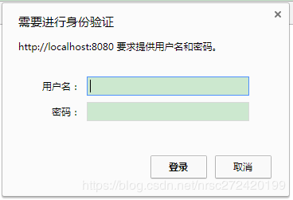

[返回](./README.md)


# 第6章 Spring Security OAuth 开发 APP 认证框架

> 整理自 ： 
>
> [Spring Security源码分析十：初识Spring Security OAuth2](https://blog.csdn.net/dandandeshangni/article/details/79116294)
>
> ~~[Spring Security源码分析十：初识Spring Security OAuth2](https://blog.csdn.net/dandandeshangni/article/details/79116294)~~ [https://longfeizheng.github.io/2018/01/20/Spring-Security源码分析十-初识Spring-Security-OAuth2/](https://niocoder.com/2018/01/20/Spring-Security源码分析十-初识Spring-Security-OAuth2/)
>
> https://blog.csdn.net/nrsc272420199/category_9090165.html


- 实现一个标准的 OAuth2 协议中 Provider 角色的主要功能。
- 重构之前的三种认证方式的代码，使其支持 Token 。
- 高级特性（Token 的生成方式（不使用默认的生成规则，如 JWT），SSO（使用 Token 如何实现单点登录）。

先讲一下如何搭建一个简单的认证服务器和资源服务器并简单走一下授权码模式和密码模式
研读一下spring security oauth源码,看如何将我们自定义的认证方式嫁接到spring security oauth框架上
将用户名+密码登陆、手机短信登陆和第三方登陆嫁接到spring security oauth框架上
利用jwt替换掉spring security oauth框架里默认实现的token


## 6.1(6-1). SpringSecurityOAuth 简介

> 本节如果熟悉 Session 和 cookie 的话， 可以跳过。

**从 cookie/session 和 token 的角度来认识一下 spring security oauth **


### 6.1.0. cookie 和 session

#### 6.1.0.1. cookie和session的概念

我想每一个web开发者肯定都知道cookie和session。但是在这里我仍然想用自己的话来表述一下。

- **啥是session**？

  简单理解它就是由服务器创建并存储于服务器的一个比较特殊的map — 除了可以像其他map一样存取数据，它还有过期时间、有一个唯一的id用于区分不同的session、而最最重要的是在创建该session时，会同时创建一个cookie，cookie的key为JSESSIONID，而cookie的value正是该session的id。

- **那啥又是cookie呢？** 

  首先需要指明的一点是cookie是由服务器创建的，它其实也可以简单的理解成一个map，或者更确切点来说就是一个k-v形式的键值对。当http请求获得到响应后，浏览器就会将服务端创建的cookie保存到浏览器中，默认情况下当浏览器关闭时该cookie就不存在了，但是服务器可以设置cookie的存活时间，如果设置了cookie的存活时间，即使关了浏览器，如果没超过cookie的存活时间，再打开浏览器，该cookie仍然会存在。—> 但是要说明的一点是服务器在创建session时，好像我们无法修改cookie的存活时间。

- 对`HttpSession session = request.getSession();`的深入理解。 作为java开发者应该都知道创建session时一般都会使用这个语句进行创建，但是人们通常对这句话的解释是如果服务器中有该request对应的session就取出，没有就新建一个session，却很少提及细节。我在这里试着展开说一下：

  - 首先服务器会遍历request中所有的cookie；

  - 如果某一个key为JSESSIONID的cookie，其value值正好与当前服务器中的某个session的id一致则取出该session；

  - 而如果服务器中没有session或者在服务器中找不到任何一个session的id与cookie中的value相同，则服务器就创建一个新的session，并同时创建一个key为JSESSIONID，value为该session的id的cookie并响应给浏览器。

    

#### 6.1.0.2. cookie、session在用户登陆中扮演的作用

   首先应该明确的一点是在没有cookie和session时，任意两次的http请求都是没有什么关系的，也就是大家平常说的http请求是无状态的。cookie和session为http之间的请求建立起了联系，具体的实现方式大体可分为如下几步：

- 用户登陆某个系统，在进行完身份认证后，该系统会在服务器上为这个用户创建一个session，并将认证后的用户信息保存到session里；

- 如 6.1.0.1 中所言，服务器在创建session的同时会创建一个key为JSESSIONID，value为该session id的cookie响应给浏览器；

- 这个用户的后续请求就会带着该cookie，服务器就可以通过请求中的cookie判定这些请求是该用户的请求。

  

### 6.1.1. token — 令牌

   至于为什么会出现token这种认证方式,以及它和cookie/session孰优孰劣等问题,这里不进行任何分析,请大家自行百度,这里只聊一下token的基本概念.

   那token究竟是什么呢？ 其实token就是由服务器生成的一个字符串,这里我大体按照自己的理解讲讲普通的token和JSON Web Token即jwt这两种token的生成机制及它们在用户登陆中扮演的作用.

#### 6.1.1.1. 普通的token

用户登陆某个系统，在进行完身份认证后，该系统会在服务器上为这个用户创建一个token，并将该token与用户信息进行绑定，并将该绑定关系存放在内存或者数据库 —> 同时将该token返回给浏览器；
浏览器会将登陆时获得到的token保存起来，并在后续的每次请求里都带着该token（token放在请求头里、参数里或者url里都行）；
服务器就可以通过请求中的token来判定这些请求是该用户的请求。
通过上面的描述可以看到这种token极其类似于session和创建该session时同步创建的cookie两者之和.

#### 6.1.1.2. JWT

用户登陆某个系统，在进行完身份认证后，该系统会在服务器上为这个用户创建一个jwt，该token虽然也是一个字符串,但是它却又比较特殊,它里面包含用户信息(实际生产中密码肯定都不会放到该token里)、用户权限信息等 —> 并且服务器不会存储该token，而是将生成的token返回给浏览器；
浏览器会将登陆时获得到的token保存起来，并在后续的每次请求里都带着该token（token放在请求头里、参数里或者url里都行）；
服务器从请求中取出token —> 验证该token是不是本服务器发送给该用户的有效的token，----> 并以此来判定是不是该用户的请求，且该请求有没有权限访问该服务器的api。


### 6.1.2. 认识一下spring security oauth

#### 6.1.2.1. 什么是spring security oauth

   其实前面文章中介绍的用户名+密码登陆、短信登陆、第三方用户登陆都是基于cookie和session实现的，那如何做基于token的登陆认证呢？按照本文关于token的介绍，我觉得自己实现一个普通token的生成、存储、发送给浏览器(或app)+验证随后请求中的token属于哪个用户这一套流程应该也不是不可能的。但更简单且可取的方式是我们`使用别人造好的轮子` —> spring security oauth。

   <span style="color:green">**那spring security oauth是什么呢？**</span> 

> 简单点说就是：封装了 服务提供商 的 行为，负责 发放令牌 ，校验令牌。

   首先我们先看一下下面这幅图，想必看过我前面关于第三方登陆的文章的人肯定不陌生。之前讲第三方登陆时，我们的程序相当于第三方应用，QQ、微信等是服务提供商。当我们的服务需要请求服务提供商的某一个接口（获取用户信息的接口）时，我们需要先向它们的认证服务器申请token，然后拿着token去它们的资源服务器去请求它们的接口 —> 再之后，它们的资源服务器会拿着请求中的token去认证服务器进行验证该token是否合法有效 —> 如果是,我们的应用就可以调用到它们接口并获取到相应的数据了。

- 在第三方登陆的过程中我们真正能操作的是我们的应用（引导用户进行授权并去认证服务器获取token、拿着token获取用户信息等） —> 使用的技术栈为spring social。
- 而服务提供商中认证服务器生成token并返回给第三方应用、在第三方应用请求资源服务器的接口时先去认证服务器校验请求中的token是否合法有效、验证token合法有效后第三方应用才能请求到资源服务器的接口数据 —> 这一整套流程正是spring security oauth所解决的问题。


**稍微总结一下**

- springsocial主要是对oauth2协议中的资源所有者、第三方应用两个角色行为的封装;
- spring security oauth主要是对oauth2协议中服务提供商、认证服务器和资源服务器三个角色行为的封装。


### 6.1.2. spring security oauth开发基于token的认证方式 原理介绍

spring security oauth的大致原理如下图。

- 认证服务器
  - 要实现 `4 种授权模式` --- 即 简单模式，授权码模式，客户端模式，密码模式。
    - spring security oauth 已经对上述 4 种模式 提供了 默认的实现。
  -  根据 某种授权下 获取到的 用户信息， 进行 token 的 生成、存储。根据 token 中权限去获取 资源服务器上的 资源。
    - oauth协议中并没有规定token要怎么生成、存储和校验。spring security oauth提供了一个默认的实现,其基本原理`大致`就是我在本文描述的普通的token。我会在接下来的文章里探索如何将其换成jwt。

- 资源服务器

  - 保护资源 --- 保护我们的 rest 服务。

  - Spring Security 通过 过滤器链 来保护 资源。

    - 那么 Spring Security OAuth 是如何来实现 资源服务器 的 功能呢？

      它是通过在 过滤器链上 增加了 OAuth2AuthenticationProcessingFilter 过滤器。它的作用是 从请求中拿到 发出去的 token ，然后根据 token 对应的 用户 及对应的权限 来判断是否能访问 rest 服务。

> 但是开发基于token的认证，用户走的不是 4 种 标准授权模式中的任何一种,因为我们的目的就是在用户登陆时,如果用户信息校验(*这里所说的用户校验其实就是指的我们前面文章里讲到的用户名+密码登陆、手机短信登陆和第三方登陆*)成功了,我们就为该用户生成一个token并将其返回给用户 —> 用户接下来的每次请求再带着该token —> 我们只需要验证该token合法 —> 就可以让用户请求到我们接口的数据了。
>
> 所以这一块需要我们自己实现。


## 6.2(6-2). 实现一个标准的 OAuth2 协议中 Provider(服务提供商)

> 主要实现 认证服务器 和 资源服务器。

0. 要使用spring security oauth做服务提供商相关的开发还需要添加如下依赖。

   ```xml
   <dependency>
       <groupId>org.springframework.cloud</groupId>
       <artifactId>spring-cloud-starter-oauth2</artifactId>
   </dependency>
   ```

   

1. 配置认证服务器

   Spring Security Oauth对Oauth协议做了很好的封装，我们只需要添加一个配置类就可以完成一个标准的认证服务器的开发了 。

   ```java
   package com.imooc.security.app;
   
   @Configuration
   @EnableAuthorizationServer  //是的，没错，就这么一个注解
   public class ImoocAuthenticationServerConfig {
   
   }
   ```

   

2. 定义 MyUserDetailsService , 默认需要 ROLE_USER 权限。

   ```java
   @Component
   public class MyUserDetailsService implements UserDetailsService {
       @Override
       public UserDetails loadUserByUsername(String username) throws UsernameNotFoundException {
           return new User(username, "123qwe", AuthorityUtils.commaSeparatedStringToAuthorityList("ROLE_USER"));
       }
   }
   ```

   

### 6.2.1. 访问

> Spring Security Oauth 已经实现了 Oauth 的四种基本 授权模式。 以下以 授权码 模式 和 用户名密码 模式 举例。


#### 6.2.1.1. 授权码 模式

> 授权码模式，对于服务提供商来说，需要提供 2 个服务：
>
> 1. 用户跳过来 点 授权的 地址； -- Spring Security Oauth 默认的 地址：`/oauth/authorize`
> 2. 点完授权，带着授权码返回给客户端， 客户端拿着 授权码 来换 token 的地址。 -- Spring Security Oauth 默认的 地址： `/oauth/token`


授权的 url 需要携带一些参数，详见 OAuth2 文档：

> https://oauth.net/2/
>
> [OAuth 2.0 Framework](https://tools.ietf.org/html/rfc6749) - RFC 6749：https://tools.ietf.org/html/rfc6749#section-4
>
> 


其中 client-id 和 client-secret 在 启动项目的时候，在控制台中看到：


默认情况下项目每次重新启动这两个值都会改变。我们可以暂时在yaml或properties配置文件里将其指定为固定值，便于后面调试,但真实项目中需要将它们放在数据库里。

```yaml
security:
  oauth2:
    client:
      # 真实项目中应放在数据库里      
      client-id: yafey
      client-secret: 123456
```


参照 Oauth2 协议我们拼接的访问认证服务器的url如下：

http://localhost:80/oauth/authorize?response_type=code&client_id=yafey&redirect_uri=http://www.example.com&scope=all


其实对上面的URL我觉得看过我QQ和微信授权博客的肯定一点都不陌生了，解释如下：


##### 6.2.1.1.1. 授权码模式 遇到的问题

1. 但是直接请求会有一点问题，报错如下：

   

   百度发现，原来是spring security5认证默认改为表单认证的原因 —https://blog.csdn.net/mr_zhuqiang/article/details/82020697
   所以需要先`将spring security的认证方式改回basic登陆`：

   ```java
   package com.imooc.security.app;
    
   @Configuration
   public class AppSecurityConfig extends WebSecurityConfigurerAdapter {
       @Override
       protected void configure(HttpSecurity http) throws Exception {
           //security5+ 认证默认为表单了也就是http.formLogin()
           http.httpBasic();
       }
   }
   ```

2. 但是还是有问题，再次请求资源服务器，会报如下错误：

   

   该错误是说我们必须至少在我们的系统里为客户端用户指定一个redirect_uri，即回调地址。我们可以简单的在yml或properties文件里配置一下：

   ```yaml
   security:
     oauth2:
       client:
         client-id: nrsc
         client-secret: 123456
         # 可以在这里简单的指定一个或多个redirect-uri，但实际开发中并不会这样做，而是将其放在数据库里
         # 大家可以好好想想为什么资源服务器非要我们指定redirect-uri呢？
         registered-redirect-uri:
           - http://www.example.com
           - http://www.nrsc.com
   ```


##### 6.2.1.1.2. 默认授权页面

再次请求认证服务器，会先让我们输入密码，其实这里的用户名和密码指的就是资源所有者的用户名和密码，这里可以联系一下QQ和微信登陆时,我们扫码或输入用户名+密码进行授权的过程.

> 说明：我们现在扮演的是 服务提供商 的角色，也就是 QQ、微信 这样的，这个地址也就是我们提供给第三方，让他们引导用户来授权的。这时候我们需要知道 3 件事：
>
> 1. 那个应用在请求授权。--- 通过 client_id 。
> 2. 请求 哪个用户 给你授权。 --- 通过（Http basic）弹出框输入的 用户名、密码。
>3. 给你什么 权限。--- 通过 scope 参数，这个是由 服务提供商 自己定义的 。




当我们输入了用户名yoyo+密码：123456（ YafeyDetailsService类中指定的默认密码）后会进入到下面的页面，即询问用户是不是给client-id为nrsc的客户端授予`all`的权限。


当选择了Approve，并点击Authorize时，认证服务器就会拿着授权码，跳回到我们指定的 redirect-uri，这样我们就获取到了授权码。


##### 6.2.1.1.3. 拿着授权码换取accessToken

spring security oauth提供的获取accessToken的接口在
package org.springframework.security.oauth2.provider.endpoint包下的TokenEndpoint类里,如下图所示:


可以看到该接口是一个post请求,请求参数可以参照Oauth2协议官方文档

> 获取accessToken,参考Oauth2协议官方文档:https://tools.ietf.org/html/rfc6749#section-4.1.3

这里通过Restlet Client工具来发post请求,进行测试:
(1) 在请求头里加入client-id和client-secret信息


(2)指定Content-Type为`application/x-www-form-urlencoded`
(3)按照Oauth2协议官方文档指定请求参数


点击发送后可以获取到accessToken如下:


### 6.2.2. 用户名密码模式

密码模式和授权码模式获取accessToken的接口是一个,但是请求参数不一样:


> **注意1**:
>
> - 由于在用户名密码模式里用户的用户名和密码直接放在了客户端,所以这种模式的授权相当于是在客户端完成的
> - 而授权码模式的授权是在认证服务器上完成的

点击发送后可以获取到accessToken如下:


> **注意2**: 这里需要注意,我利用用户名密码模式获取的accessToken和之前利用授权码模式**获取的accessToken是一样的**,只是expires_in即过期时间比之前少了, 这是因为默认情况下Spring Security Oauth会将某个资源所有者(由用户名+密码进行确定,这里就是yoyo 123456)获取的accessToken保存在内存里一段时间,下次该资源所有者再向认证服务器请求获取accessToken时,如果没超过过期时间,该资源所有者获取到的accessToken都是一样的.


测试类`SecurityOauth2Test`(用户名密码模式)

```java
package com.imooc;

@RunWith(SpringRunner.class)
@SpringBootTest(classes= {DemoBrowserApplication.class})
@Slf4j
public class SecurityOAuth2Test {

	//端口
    final static long PORT = 80;
    //clientId
    final static String CLIENT_ID = "yafey";
    //clientSecret
    final static String CLIENT_SECRET = "123456";
    //用户名
    final static String USERNAME = "admin";
    //密码
    final static String PASSWORD = "123qwe";
    //获取accessToken得URI
    final static String TOKEN_REQUEST_URI = "http://localhost:"+PORT+"/oauth/token?grant_type=password&username=" + USERNAME + "&password=" + PASSWORD+"&redirect_uri=http://example.com&scope=all";
    //获取用户信息得URL
    final static String USER_INFO_URI = "http://localhost:"+PORT+"/";

    @Ignore
    @Test
    public void getUserInfo() throws Exception{
        RestTemplate rest = new RestTemplate();
        HttpHeaders headers = new HttpHeaders();
        headers.add( "Authorization", "bearer " + getAccessToken() );
        HttpEntity<String> entity = new HttpEntity<String>(null, headers);
        // pay attention, if using get with headers, should use exchange instead of getForEntity / getForObject
        ResponseEntity<String> result = rest.exchange( USER_INFO_URI, HttpMethod.GET, entity, String.class, new Object[]{ null } );
        log.info("用户信息返回的结果={}",ReflectionToStringBuilder.toString(result,
        		ToStringStyle.JSON_STYLE));
    }

    /**
     * 获取accessToken
     * @return
     */
    private String getAccessToken(){
        RestTemplate rest = new RestTemplate();
        HttpHeaders headers = new HttpHeaders();
        headers.setContentType( MediaType.TEXT_PLAIN );
        headers.add("Authorization", getBasicAuthHeader());
        HttpEntity<String> entity = new HttpEntity<String>(null, headers);
        ResponseEntity<OAuth2AccessToken> resp = rest.postForEntity( TOKEN_REQUEST_URI, entity, OAuth2AccessToken.class);
        if( !resp.getStatusCode().equals( HttpStatus.OK )){
            throw new RuntimeException( resp.toString() );
        }
        OAuth2AccessToken t = resp.getBody();
        log.info("accessToken={}",ReflectionToStringBuilder.toString(t,
        		ToStringStyle.JSON_STYLE));
        log.info("the response, access_token: " + t.getValue() +"; token_type: " + t.getTokenType() +"; "
                + "refresh_token: " + t.getRefreshToken() +"; expiration: " + t.getExpiresIn() +", expired when:" + t.getExpiration() );
        return t.getValue();

    }

    /**
     * 构建header
     * @return
     */
    private String getBasicAuthHeader(){
        String auth = CLIENT_ID + ":" + CLIENT_SECRET;
        byte[] encodedAuth = Base64.encodeBase64(auth.getBytes());
        String authHeader = "Basic " + new String(encodedAuth);
        return authHeader;
    }
}
```

测试类打印`accessToken`信息

```
2018-01-20 18:16:49.900  INFO 16136 --- [           main] cn.merryyou.security.SecurityOauth2Test  : accessToken={
  "value": "8e5ea72c-d153-48f5-8ee7-9b5616fc43dc",
  "expiration": "Jan 21, 2018 6:10:25 AM",
  "tokenType": "bearer",
  "refreshToken": {
    "value": "7adfefec-c80c-4ff4-913c-4f161c47fbf1"
  },
  "scope": [
    "all"
  ],
  "additionalInformation": {}
}
```


## 6.3(6-2) 开发资源服务器

同开发认真服务器一样,由于Spring Security Oauth对Oauth协议做了很好的封装，我们只需要添加一个配置类就可以完成一个标准的资源服务器的开发了，代码如下：

```java
package com.imooc.security.app;
 
@Configuration
@EnableResourceServer //咦，没错还是一个注解
public class ImoocResourcesServerConfig {
}
```

`注意 :` 资源服务器和认证服务器只是逻辑上的概念,可以写在同一个配置类里,也可以写在不同的配置类,甚至可以写在不同的项目里.

以后再请求我们的rest接口,就需要每次带上accessToken了,请求如下:


## 6.4(6-3). Spring Security OAuth发放token的源码剖析

**绿色** 代表的是 实体类， **蓝色** 的代表 接口，**括号内**为 具体的实现类。

1. **TokenEndpoint** ： 可以理解为 Controller ，用来处理 获取令牌的请求 `/oauth/token`。
2. 调用 **ClientDetailService**: 这个有点像 UserDetailService，只不过这里获取的是 第三方应用的信息，如 client-id 等，将这些信息 封装到 **ClientDetails** 中。
3. TokenEndpoint 构建 **TokenRequest**： 封装了请求中的其他信息，如 grant_type 等。ClientDetails 也会放到 这个对象中，因为也是 请求的 一部分。
4. 用 TokenRequest 调用 **TokenGranter**， 这个接口后面封装的是我们的 4 中授权模式，根据 grant_type 挑选一个实现类 来执行 令牌的 生成逻辑。
5. 不管是哪种实现类，在生成令牌的过程中，都会创建 OAuth2Request 和 Authentication 两个 东西。
   - **OAuth2Request** 对象： 对 ClientDetails 和 TokenRequest 对象的 重新整合。
   - **Authentication** 接口：封装了当前请求授权的 **用户信息**。谁在做这个授权，这里面就是他的一些信息。**这里面的信息是通过 UserDetailService 读出来的**。
6. **OAuth2Authentication** 对象： 将 OAuth2Request 对象 和 Authentication 封装成 该对象。该对象中包含了 哪个第三方应用、在请求哪个用户给你授权、授权的模式、授权的参数 等信息。
7. **AuthenrizationServerTokenServices** 根据 OAuth2Authentication 生成 token 。


下图引自 https://blog.csdn.net/dandandeshangni/article/details/79116294

或 [https://niocoder.com/2018/01/20/Security源码分析十-初识Spring-Security-OAuth2/](https://niocoder.com/2018/01/20/Spring-Security源码分析十-初识Spring-Security-OAuth2/)


### 6.4.1. 源码解读

> 使用 密码 模式， 流程简单一点。

1. 获取token的整体流程 — **所在类 TokenEndpoint**

   ```java
   package org.springframework.security.oauth2.provider.endpoint;
   @FrameworkEndpoint
   public class TokenEndpoint extends AbstractEndpoint {
       // ... 其他代码...
       
   	@RequestMapping(value = "/oauth/token", method=RequestMethod.POST)
   	public ResponseEntity<OAuth2AccessToken> postAccessToken(Principal principal, @RequestParam
   	Map<String, String> parameters) throws HttpRequestMethodNotSupportedException {
   
   		if (!(principal instanceof Authentication)) {
   			throw new InsufficientAuthenticationException(
   					"There is no client authentication. Try adding an appropriate authentication filter.");
   		}
           
           
           
   		//从请求头中获取到clientId
   		String clientId = getClientId(principal);
   		//根据clientId获取ClientDetails , ClientDetails中除了 client-id 还可以配置很多其他的参数。
   		ClientDetails authenticatedClient = getClientDetailsService().loadClientByClientId(clientId);
   		//将获取的第三方应用的信息和grant_type、scope等参数封装成一个TokenRequest对象---该对象其实是new 出来的
   		TokenRequest tokenRequest = getOAuth2RequestFactory().createTokenRequest(parameters, authenticatedClient);
   
   		if (clientId != null && !clientId.equals("")) {
   			// Only validate the client details if a client authenticated during this
   			// request. --- 英文注释的很详细，这里不再多解释
   			if (!clientId.equals(tokenRequest.getClientId())) {
   				// double check to make sure that the client ID in the token request is the same as that in the
   				// authenticated client
   				throw new InvalidClientException("Given client ID does not match authenticated client");
   			}
   		}
   		//校验请求中的scope是否合法
   		if (authenticatedClient != null) {
   			oAuth2RequestValidator.validateScope(tokenRequest, authenticatedClient);
   		}
   		//没传哪种授权模式 ---> 直接抛异常
   		if (!StringUtils.hasText(tokenRequest.getGrantType())) {
   			throw new InvalidRequestException("Missing grant type");
   		}
   		//简化模式在用户请求授权时就获取到令牌了，不会进到该方法里，所以直接抛异常
   		if (tokenRequest.getGrantType().equals("implicit")) {
   			throw new InvalidGrantException("Implicit grant type not supported from token endpoint");
   		}
   		//是否为授权码模式的请求
   		if (isAuthCodeRequest(parameters)) {
   			// The scope was requested or determined during the authorization step
   			//授权码模式在获取授权码的过程中需要传递scope参数，那个参数就是用来获取授权的，
   			//也就是说授权码模式请求的授权是在获取授权码的过程中就已经定了---因为此步是用户真正在授权
   			//在获取token的过程中只能使用获取授权码时得到的权限
   			//因此这里的scope置空，稍后通过申请到的授权码获取其在授权过程中所请求的权限
   			if (!tokenRequest.getScope().isEmpty()) {
   				logger.debug("Clearing scope of incoming token request");
   				tokenRequest.setScope(Collections.<String> emptySet());
   			}
   		}
   		//如果是刷新令牌的请求 --- 重新设置其scope
   		if (isRefreshTokenRequest(parameters)) {
   			// A refresh token has its own default scopes, so we should ignore any added by the factory here.
   			tokenRequest.setScope(OAuth2Utils.parseParameterList(parameters.get(OAuth2Utils.SCOPE)));
   		}
   		//真正生成token的步骤
   		OAuth2AccessToken token = getTokenGranter().grant(tokenRequest.getGrantType(), tokenRequest);
   		if (token == null) {
   			throw new UnsupportedGrantTypeException("Unsupported grant type: " + tokenRequest.getGrantType());
   		}
   		//将生成的token返回
   		return getResponse(token);
   	}
   }
   ```

   

2. TokenRequest 的生成 — 很简单，其实是通过ClientDetails 和其他请求参数new出来的
   — **所在类DefaultOAuth2RequestFactory**

   - 本段代码对应主流程图中的第③步

     ```java
     	public TokenRequest createTokenRequest(Map<String, String> requestParameters, ClientDetails authenticatedClient) {
     		//获取clientId并校验其是否合法
     		String clientId = requestParameters.get(OAuth2Utils.CLIENT_ID);
     		if (clientId == null) {
     			// if the clientId wasn't passed in in the map, we add pull it from the authenticated client object
     			clientId = authenticatedClient.getClientId();
     		}
     		else {
     			// otherwise, make sure that they match
     			if (!clientId.equals(authenticatedClient.getClientId())) {
     				throw new InvalidClientException("Given client ID does not match authenticated client");
     			}
     		}
     		//从请求参数中获取到grant_type
     		String grantType = requestParameters.get(OAuth2Utils.GRANT_TYPE);
     		//从请求中根据clientId获取到所有的权限 即 scopes
     		Set<String> scopes = extractScopes(requestParameters, clientId);
     		//利用请求参数，clientId，scopes和grantType  new出一个TokenRequest 
     		TokenRequest tokenRequest = new TokenRequest(requestParameters, clientId, scopes, grantType);
     		//将token返回给请求端
     		return tokenRequest;
     	}
     ```


3. 下面真正生成token步1-3 对应了主流程图中的第④步

   - `真正生成token的步骤1` — `getTokenGranter().grant(tokenRequest.getGrantType(), tokenRequest)`具体实现
     — 所在类CompositeTokenGranter

     

   - `真正生成token的步骤2` — 上图中`OAuth2AccessToken grant = granter.grant(grantType, tokenRequest);` 的具体实现
     — **所在类ClientCredentialsTokenGranter**

     ```java
     @Override
     public OAuth2AccessToken grant(String grantType, TokenRequest tokenRequest) {
     	//去具体的实现类里去拿token
     	OAuth2AccessToken token = super.grant(grantType, tokenRequest);
     	//如果获取到token--对刷新令牌进行处理 --- >不过多解释
     	if (token != null) {
     		DefaultOAuth2AccessToken norefresh = new DefaultOAuth2AccessToken(token);
     		// The spec says that client credentials should not be allowed to get a refresh token
     		if (!allowRefresh) {
     			norefresh.setRefreshToken(null);
     		}
     		token = norefresh;
     	}
     	//无论拿到没拿到都返回，如果拿到的token为null，则上图中的grant就是null，然后就会再利用其他的具体实现类尝试获取token，
     	//一旦获取成功,就会将token返回给请求端
     	return token;
     }
     ```

   - `真正生成token的步骤3` — 上面OAuth2AccessToken token = super.grant(grantType, tokenRequest);的具体实现
     — **所在类AbstractTokenGranter**

     > 注意：下面的方法其实写在了package org.springframework.security.oauth2.provider.token下的抽像类AbstractTokenGranter里，其子类才是四种授权模式+RefreshToken的具体实现类 — 模版模式

     ```java
     	public OAuth2AccessToken grant(String grantType, TokenRequest tokenRequest) {
     		//判断当前grantType是否为本实现类指定要处理的grantType---如果不是直接返回null
     		if (!this.grantType.equals(grantType)) {
     			return null;
     		}
     		//获取clientId
     		String clientId = tokenRequest.getClientId();
     		//通过clientId再获取一遍ClientDetails对象
     		ClientDetails client = clientDetailsService.loadClientByClientId(clientId);
     		//判断grantType是否合法
     		validateGrantType(grantType, client);
     		//打个注释
     		if (logger.isDebugEnabled()) {
     			logger.debug("Getting access token for: " + clientId);
     		}
     		//真正去具体的实现类里去拿token
     		return getAccessToken(client, tokenRequest);
     
     	}
     	//上面的getAccessToken方法的具体实现
     	protected OAuth2AccessToken getAccessToken(ClientDetails client, TokenRequest tokenRequest) {
     		return tokenServices.createAccessToken(getOAuth2Authentication(client, tokenRequest));
     	}
     	//上面getOAuth2Authentication方法的具体实现 --- 生成OAuth2Authentication，
     	//但是按照方法的加载机制如果具体实现里有该方法会先走实现类里的
     	//在简化+授权码+密码模式的情况下不会走下面的方法  =======================《 特别注意 》===================
     	protected OAuth2Authentication getOAuth2Authentication(ClientDetails client, TokenRequest tokenRequest) {
     		OAuth2Request storedOAuth2Request = requestFactory.createOAuth2Request(client, tokenRequest);
     		return new OAuth2Authentication(storedOAuth2Request, null);
     	}
     ```

   - `真正生成token的步骤4` — 上面 `getOAuth2Authentication(client, tokenRequest)；`方法的具体实现 — 不同授权模式具体实现不一样
     本段代码对应主流程图中的第⑤、⑥两步
     — 所在类ResourceOwnerPasswordTokenGranter
     这里分析的是密码模式的下的代码：

     ```java
     	@Override
     	protected OAuth2Authentication getOAuth2Authentication(ClientDetails client, TokenRequest tokenRequest) {
     
     		Map<String, String> parameters = new LinkedHashMap<String, String>(tokenRequest.getRequestParameters());
     		String username = parameters.get("username");
     		String password = parameters.get("password");
     		// Protect from downstream leaks of password
     		parameters.remove("password");
     		//下面这部分代码在用户名+密码登陆时其实我们已经见过了，就是利用请求中的用户名+密码进行认证+授权校验
     		//校验成功后会生成一个已经认证了的Authentication对象  --- 这里不细分析了
     		//与之对应的是授权码模式会利用授权码进行校验并生成一个认证成功的Authentication对象 
     		
     		Authentication userAuth = new UsernamePasswordAuthenticationToken(username, password);
     		((AbstractAuthenticationToken) userAuth).setDetails(parameters);
     		try {
     			userAuth = authenticationManager.authenticate(userAuth);
     		}
     		catch (AccountStatusException ase) {
     			//covers expired, locked, disabled cases (mentioned in section 5.2, draft 31)
     			throw new InvalidGrantException(ase.getMessage());
     		}
     		catch (BadCredentialsException e) {
     			// If the username/password are wrong the spec says we should send 400/invalid grant
     			throw new InvalidGrantException(e.getMessage());
     		}
     		if (userAuth == null || !userAuth.isAuthenticated()) {
     			throw new InvalidGrantException("Could not authenticate user: " + username);
     		}
     		//将ClientDetails 对象和TokenRequest 对象封装成一个OAuth2Request 对象
     		OAuth2Request storedOAuth2Request = getRequestFactory().createOAuth2Request(client, tokenRequest);	
     		//利用OAuth2Request和已经认证校验成功的Authentication 对象new 一个OAuth2Authentication对象
     		return new OAuth2Authentication(storedOAuth2Request, userAuth);
     	}
     ```

   - `真正生成token的步骤5` — `tokenServices.createAccessToken(getOAuth2Authentication(client, tokenRequest)); createAccessToken`具体实现
     本段代码对应主流程图中的第⑦步
     TokenStore的具体实现（为了方便看，放在了这里）

     

     — **所在类DefaultTokenServices**

     ```java
     @Transactional
     public OAuth2AccessToken createAccessToken(OAuth2Authentication authentication) throws AuthenticationException {
     	//先去存储里看有没有已经存在的token --- 存储可以有多种，上图是TokenStore的具体实现类，可以看到既有内存、Jdbc、也有redis
     	//并且还有Jwt --- 》 这是用Jwt替换spring security oauth中默认token的依据
     	OAuth2AccessToken existingAccessToken = tokenStore.getAccessToken(authentication);
     	OAuth2RefreshToken refreshToken = null;
     	//如果从存储里找到了已经存在的token
     	if (existingAccessToken != null) {
     		//如果找到的token已经过期 -- 》在tokenStore里将其RefreshToken和该token删掉
     		if (existingAccessToken.isExpired()) {
     			if (existingAccessToken.getRefreshToken() != null) {
     				refreshToken = existingAccessToken.getRefreshToken();
     				// The token store could remove the refresh token when the
     				// access token is removed, but we want to
     				// be sure...
     				tokenStore.removeRefreshToken(refreshToken);
     			}
     			tokenStore.removeAccessToken(existingAccessToken);
     		}
     		else {
     			// Re-store the access token in case the authentication has changed
     			//重新存一下获取到的token，因为你有可能是之前用授权码模式获取的token，但现在用密码模式获取的token，
     			//这时要存的信息是不一样的
     			tokenStore.storeAccessToken(existingAccessToken, authentication);
     			//将没过期的token返回给请求
     			return existingAccessToken;
     		}
     	}
     
     	// Only create a new refresh token if there wasn't an existing one
     	// associated with an expired access token.
     	// Clients might be holding existing refresh tokens, so we re-use it in
     	// the case that the old access token
     	// expired.
     	//首先看看有没有刷新令牌，如果没有就新建一个，注意一下上面的英文注释
     	if (refreshToken == null) {
     		refreshToken = createRefreshToken(authentication);
     	}
     	// But the refresh token itself might need to be re-issued if it has
     	// expired.
     	//如果有刷新令牌，但是已经过期，需要重新发放一个刷新令牌
     	else if (refreshToken instanceof ExpiringOAuth2RefreshToken) {
     		ExpiringOAuth2RefreshToken expiring = (ExpiringOAuth2RefreshToken) refreshToken;
     		if (System.currentTimeMillis() > expiring.getExpiration().getTime()) {
     			refreshToken = createRefreshToken(authentication);
     		}
     	}
     	//真正生成token的逻辑
     	OAuth2AccessToken accessToken = createAccessToken(authentication, refreshToken);
     	//将生成的token存入到存储里
     	tokenStore.storeAccessToken(accessToken, authentication);
     	//重生成的令牌里取出刷新令牌，将刷新令牌存到存储里，防止它在上一步被改变
     	// In case it was modified
     	refreshToken = accessToken.getRefreshToken();
     	if (refreshToken != null) {
     		tokenStore.storeRefreshToken(refreshToken, authentication);
     	}
     	return accessToken;
     }
     ```

   - **真正生成token的逻辑** — `OAuth2AccessToken accessToken = createAccessToken(authentication, refreshToken);`的具体实现 — 所在类DefaultTokenServices
     本段代码对应主流程图中的第⑦步下面的TokenStore和TokenEnhancer

     ```java
     private OAuth2AccessToken createAccessToken(OAuth2Authentication authentication, OAuth2RefreshToken refreshToken) {
     	//利用UUID当成构造函数的参数生成一个令牌
     	DefaultOAuth2AccessToken token = new DefaultOAuth2AccessToken(UUID.randomUUID().toString());
     	//获取过期时间并设置到token里
     	int validitySeconds = getAccessTokenValiditySeconds(authentication.getOAuth2Request());
     	if (validitySeconds > 0) {
     		token.setExpiration(new Date(System.currentTimeMillis() + (validitySeconds * 1000L)));
     	}
     	//设置刷新令牌
     	token.setRefreshToken(refreshToken);
     	//设置令牌的权限
     	token.setScope(authentication.getOAuth2Request().getScope());
     	//看是否配置了AccessTokenEnhancer的具体实现
     	//如果配置了对生成的token进行增强 --- 设置Jwt时会讲
     	return accessTokenEnhancer != null ? accessTokenEnhancer.enhance(token, authentication) : token;
     }
     ```

     **至此Spring Security OAuth获取token的核心源码已经解读完毕，从下文开始将参考这些核心源码将我们自定义的认证方式嫁接到spring security oauth框架上。**


## 6.5(6-4). 重构 用户名密码 登陆

Spring Security OAuth生成token的核心源码，其主要流程如下图 


而我们的目标是将Spring Security OAuth默认的走授权流程后发放token的步骤替换成 **走我们自定义的认证方式后发放token**。既然要在我们自定义的认证方式认证成功后才发放token，则我们发放token的代码应该写在`认证成功处理器`（AuthenticationSuccessHandler）里，回看上图联系其源码，可以知道：

> TL;DR
>
> 我们自定义的认证方式，在上图中， TokenEndPoint 到 TokenGranter 的步骤是不能常用的；能重用的部分是 最后一块 TokenServices -- 产生令牌。
>
> - 在我们的 AuthenticationSuccessHandler 里面 调用 TokenServices 产生令牌当做返回。 不管登陆请求被哪个 filter 拦截，也不管 登陆过程中如何处理， 最终都会交给 AuthenticationSuccessHandler 处理。
>
> - 在 AuthenticationSuccessHandler 中已经为我们构建出了 Authentication 对象（登陆成功后就创建好了），因此我们自定义方式认证嫁接到 Spring Security OAuth 框架的过程中不需要考虑该对象 。
> - 构建出 OAuth2Request 对象，结合 Authentication对象 就能 调用Spring Security OAuth默认的获取token的方法了。


参照上面的步骤将我们自定义的认证方式嫁接到Spring Security OAuth的大致流程如下：


代码的主要步骤：

1. 从 请求头中的 Authenrization 字段中 解析出 client_id 字段，已经 构建对象 及 调用 TokenServices 。

   - 这块工作其实是 Basic 登陆的流程，可以从 Spring 的 BasicAuthenticationFilter 中拷贝部分代码（L155-166 左右） 。

   ```java
   package com.yafey.security.authentication;
   
   @Slf4j
   @Component("yafeyAuthentivationSuccessHandler")
   // SavedRequestAwareAuthenticationSuccessHandler 类是 Spring Security 提供的默认的登录成功处理器
   public class YafeyAuthentivationSuccessHandler extends SavedRequestAwareAuthenticationSuccessHandler {
   
   	@Autowired
   	private ObjectMapper objectMapper;
   
       @Autowired
       private ClientDetailsService clientDetailsService;
   
       @Autowired
       private AuthorizationServerTokenServices authorizationServerTokenServices;
       
   
   	@Override
   	public void onAuthenticationSuccess(HttpServletRequest request, HttpServletResponse response,
   			Authentication authentication) throws IOException, ServletException {
   		log.info("登录成功");
   
   		// 请求头的 Authorization 里存放了 ClientId 和 ClientSecret
   		// 从请求头里获取 Authorization 信息可参考 BasicAuthenticationFilter 类 L155-166
   		String header = request.getHeader("Authorization");
   
   		if (header == null || !header.startsWith("Basic ")) {
   			throw new UnapprovedClientAuthenticationException("请求头中无client信息");
   		}
   
   		String[] tokens = extractAndDecodeHeader(header, request);
   		assert tokens.length == 2;
   
   		String clientId = tokens[0];
   		String clientSecret = tokens[1];
   
   		// 根据clientId获取ClientDetails对象 --- ClientDetails为第三方应用的信息
   		// 现在配置在了yml文件里，真实项目中应该放在数据库里
   		ClientDetails clientDetails = clientDetailsService.loadClientByClientId(clientId);
   
   		// 对获取到的clientDetails进行校验
   		if (clientDetails == null) {
   			throw new UnapprovedClientAuthenticationException("clientId对应的配置信息不存在:" + clientId);
   		} else if (!StringUtils.equals(clientDetails.getClientSecret(), clientSecret)) {
   			throw new UnapprovedClientAuthenticationException("clientSecret不匹配:" + clientId);
   		}
   
   		// 第一个参数为请求参数的一个Map集合，
   		// 在Spring Security OAuth的源码里要用这个Map里的用户名+密码或授权码来生成Authentication对象,
   		// 但我们已经获取到了Authentication对象，所以这里可以直接传一个空的Map
   		// 第三个参数为scope即请求的权限 ---》这里的策略是获得的ClientDetails对象里配了什么权限就给什么权限 //todo
   		// 第四个参数为指定什么模式 比如密码模式为password，授权码模式为authorization_code，这里我们写一个自定义模式custom
   		TokenRequest tokenRequest = new TokenRequest(MapUtils.EMPTY_MAP, clientId, clientDetails.getScope(), "custom");
   
   		// 获取OAuth2Request对象
   		// 源码中是这么写的 --- todo 有兴趣的可以看一下
   		// OAuth2Request storedOAuth2Request = getRequestFactory().createOAuth2Request(client, tokenRequest);
   		OAuth2Request oAuth2Request = tokenRequest.createOAuth2Request(clientDetails);
   
   		// new出一个OAuth2Authentication对象
   		OAuth2Authentication oAuth2Authentication = new OAuth2Authentication(oAuth2Request, authentication);
   
   		// 生成token
   		OAuth2AccessToken token = authorizationServerTokenServices.createAccessToken(oAuth2Authentication);
   		// 将生成的token返回
   		response.setContentType("application/json;charset=UTF-8");
   		response.getWriter().write(objectMapper.writeValueAsString(token));
   	}
   
   	/**
   	 * 从header获取Authentication信息 --- 》 clientId和clientSecret
   	 * 
   	 * @param header
   	 * @param request
   	 * @return
   	 * @throws IOException
   	 */
   	private String[] extractAndDecodeHeader(String header, HttpServletRequest request) throws IOException {
   
   		byte[] base64Token = header.substring(6).getBytes("UTF-8");
   		byte[] decoded;
   		try {
   			decoded = Base64.decode(base64Token);
   		} catch (IllegalArgumentException e) {
   			throw new BadCredentialsException("Failed to decode basic authentication token");
   		}
   		String token = new String(decoded, "UTF-8");
   		int delim = token.indexOf(":");
   
   		if (delim == -1) {
   			throw new BadCredentialsException("Invalid basic authentication token");
   		}
   		return new String[] { token.substring(0, delim), token.substring(delim + 1) };
   	}
   }
   ```

2. app 模块加入安全配置信息 — 让我们自定义的认证方式生效

   ```java
   package com.imooc.security.app;
   
   @Configuration
   @EnableResourceServer
   public class ImoocResourcesServerConfig extends ResourceServerConfigurerAdapter {
   	@Autowired
   	protected AuthenticationSuccessHandler authenticationSuccessHandler;
   
   	@Autowired
   	protected AuthenticationFailureHandler authenticationFailureHandler;
   
   	@Autowired
   	private SmsCodeAuthenticationSecurityConfig smsCodeAuthenticationSecurityConfig;
   
   	@Autowired
   	private ValidateCodeSecurityConfig validateCodeSecurityConfig;
   
   	/**
   	 * @see SocialConfig#nrscSocialSecurityConfig()
   	 */
   	@Autowired
   	private SpringSocialConfigurer socialSecurityConfig;
   
   	@Autowired
   	private SecurityProperties securityProperties;
   
   	@Override
   	public void configure(HttpSecurity http) throws Exception {
   
   		http.formLogin().loginPage(SecurityConstants.DEFAULT_UNAUTHENTICATION_URL)
   				.loginProcessingUrl(SecurityConstants.DEFAULT_LOGIN_PROCESSING_URL_FORM)
   				.successHandler(authenticationSuccessHandler).failureHandler(authenticationFailureHandler);
   
   		// 验证码有一些问题：因为验证码会放到session里，校验也需要从session里取，
   		// 但是在token认证的情景下是不需session参与的
   		// 所以这里先注释掉，下篇文章再解决
   		http// .apply(validateCodeSecurityConfig)
   			// .and()
   				.apply(smsCodeAuthenticationSecurityConfig).and().apply(socialSecurityConfig).and().authorizeRequests()
   				.antMatchers(SecurityConstants.DEFAULT_UNAUTHENTICATION_URL,
   						SecurityConstants.DEFAULT_LOGIN_PROCESSING_URL_MOBILE,
   						securityProperties.getBrowser().getLoginPage(),
   						SecurityConstants.DEFAULT_VALIDATE_CODE_URL_PREFIX + "/*",
   						securityProperties.getBrowser().getSignUpUrl(),
   						securityProperties.getBrowser().getSession().getSessionInvalidUrl(),
   						securityProperties.getBrowser().getSignOutUrl(), "/user/regist")
   				.permitAll().anyRequest().authenticated().and().csrf().disable();
   	}
   }
   ```

   

测试

1. 登陆测试

   发送的登陆请求为POST请求,路径为http://127.0.0.1:8080/authentication/form ，同时需要再请求头里加上Client-Id和Client-Secret，请求参数为username和password
   可以看到已经获取到了token信息

   

2. 拿着刚才生成的token请求资源服务器的接口

   可以看到已经获取到了用户信息

   