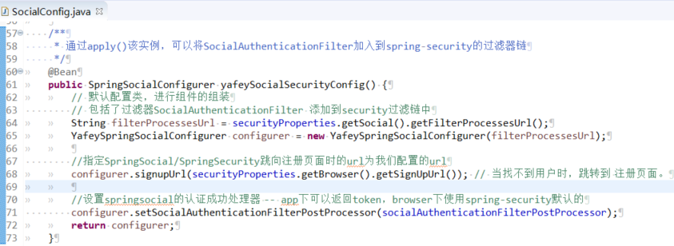
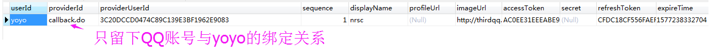
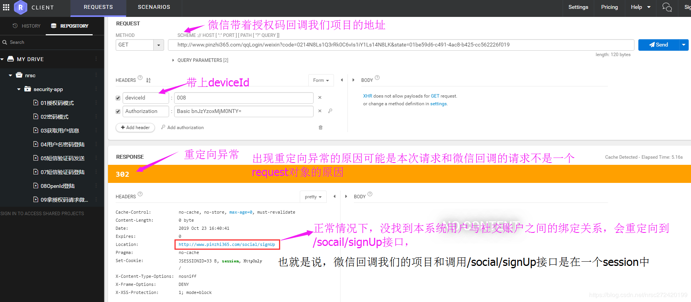
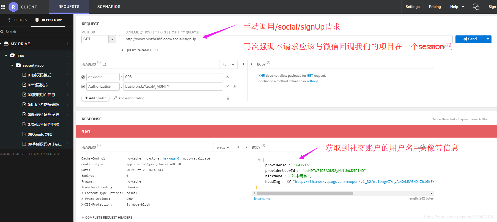
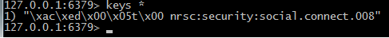
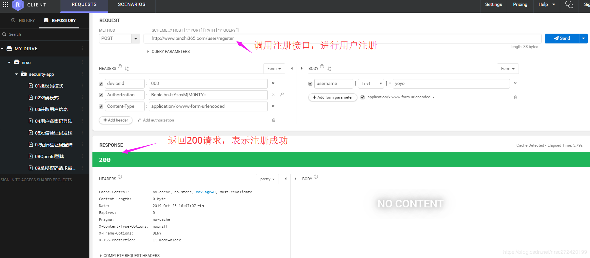
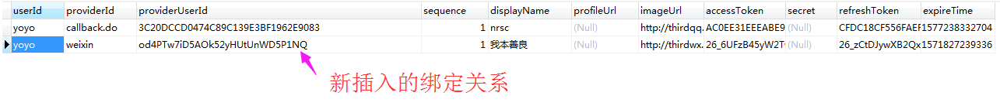
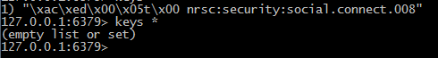

[返回](./README.md)


# 第6章 Spring Security OAuth 开发 APP 认证框架 part2

> 整理自 ： 
>
> [Spring Security源码分析十：初识Spring Security OAuth2](https://blog.csdn.net/dandandeshangni/article/details/79116294)
>
> ~~[Spring Security源码分析十：初识Spring Security OAuth2](https://blog.csdn.net/dandandeshangni/article/details/79116294)~~ [https://longfeizheng.github.io/2018/01/20/Spring-Security源码分析十-初识Spring-Security-OAuth2/](https://niocoder.com/2018/01/20/Spring-Security源码分析十-初识Spring-Security-OAuth2/)
>
> https://blog.csdn.net/nrsc272420199/category_9090165.html


## 6.8(6-7). 重构注册逻辑处理

上两篇文章讲解了开发APP认证框架时社交登陆的重构，但是这种重构其实是在一个前提下的，**即用户已经在我们的系统里存在本系统账号与其社交账号的绑定关系**。

但当这种关系不存在时，会发生什么呢？

回想一下之前写的一篇文章《[springsocial/oauth2—第三方登陆之QQ登陆6【注册逻辑之/signup错误解决+springsocial源码解读②】](https://blog.csdn.net/nrsc272420199/article/details/100623105)》可以知道，在browser项目里的具体逻辑如下：

>如果没找到社交账户与当前系统用户的绑定关系会有两种处理方式
>`处理方式（1）`
>
>- 先将从社交账户获得的用户信息封装的Connection对象存到session
>
>- 然后将用户引导到一个注册或绑定用户的url（一般会对应注册、绑定页面），在注册或绑定页面可以 （通过 `/social/user` 服务 ，使用 Spring 提供的 ProviderSignUtils ）从session里取出社交账户的头像，名称等信息展示给前端，并提醒用户注册或绑定账户
>
>- 用户输入要注册或绑定的账户点击注册或绑定时，将输入的账户与session中的Connection对象进行绑定插入到本系统账号与社交账号绑定关系表—userconnection表
>
>  
>
>`处理方式（2）`
>
>- 可以配置一个注册类，直接给其默认注册一个本系统账户，并将两者的绑定关系插入userconnection表。


在APP项目里处理方式（1）是有问题的，原因是处理方式（1）是基于session的，但是 **`APP 处于 无 session 的环境`**。

解决思路如下：

> 解决思路和 验证码校验 的情况类似，session 中存不了，那你做第三方登陆的时候多传给我一个 deviceID，如果发现你需要注册， 就拿 deviceID 把你的第三方的信息先存到一个外部存储上去，比如 Redis。存到 Redis 了之后，去注册，注册好了之后，拿到 UserId，然后根据 deviceID 将第三方用户信息取出来，进行绑定。


>(1) 如果没找到社交账户与当前系统用户的绑定关系
>(2) 先将从社交账户获得的用户信息封装的Connection对象存到session
>(3) 将用户引导到一个注册或绑定用户的url — 后端服务，在该服务里先从session里取出Connection对象然后将其转存到redis或其他数据库，然后将社交登陆失败的原因返回给APP
>(4) APP拿到（3）返回的信息，引导用户到注册或绑定页面
>(5) 用户输入要注册或绑定的账户点击注册或绑定时，将输入的账户与redis中存储的相对应的Connection对象进行绑定并插入到本系统账号与社交账号绑定关系表—userconnection表


### 具体实现

- AppSingUpUtils 工具类 — 将社交账户信息转存到redis和从redis取出社交账户信息的工具类，代码如下：

  ```java
  package com.imooc.security.app.utils;
  
  @Component
  public class AppSingUpUtils {
  
      @Autowired
      private RedisTemplate<Object, Object> redisTemplate;
  
      @Autowired
      private UsersConnectionRepository usersConnectionRepository;
  
      @Autowired
      private ConnectionFactoryLocator connectionFactoryLocator;
  
      /***
       * 将社交账户信息存到redis
       * @param request
       * @param connectionData
       */
      public void saveConnectionData(WebRequest request, ConnectionData connectionData) {
          redisTemplate.opsForValue().set(getKey(request), connectionData, 10, TimeUnit.MINUTES);
      }
  
      /***
       * 从redis取出社交账户信息，并将其与本系统账户建立关联，并将关联关系存到数据库---userconnection表
       * @param request
       * @param userId
       */
      public void doPostSignUp(WebRequest request, String userId) {
          String key = getKey(request);
          if(!redisTemplate.hasKey(key)){
              throw new AppSecretException("无法找到缓存的用户社交账号信息");
          }
          ConnectionData connectionData = (ConnectionData) redisTemplate.opsForValue().get(key);
          Connection<?> connection = connectionFactoryLocator.getConnectionFactory(connectionData.getProviderId())
                  .createConnection(connectionData);
          usersConnectionRepository.createConnectionRepository(userId).addConnection(connection);
  
          redisTemplate.delete(key);
      }
  
      /***
       * 根据请求头中的deviceId拼接一个存到redis中的key
       * @param request
       * @return
       */
      private String getKey(WebRequest request) {
          String deviceId = request.getHeader("deviceId");
          if (StringUtils.isBlank(deviceId)) {
              throw new AppSecretException("设备id参数不能为空");
          }
          return "imooc:security:social.connect." + deviceId;
      }
  }
  ```


- 光有工具类是不够的，我们需要让系统知道，当需要用户去注册的时候，不要跳到我们之前配置的 signUp 页面上去，而是跳到一个特定的服务上去，然后这个服务调用的 上面的 工具类 来缓存 用户信息，并且将用户信息以 JSON 的格式返回给 APP。


- 之前没找到社交账户与当前系统用户绑定关系时跳向注册逻辑的url配置如下：

  

  在browser项目下这个配置没有问题的，在不修改上面逻辑的情况下，可以在APP模块里实现BeanPostProcessor接口来修改该bean的signupUrl：

  ```java
  package com.imooc.security.app;
  
  @Component
  public class SpringSocialConfigurerPostProcessor implements BeanPostProcessor {
  
      /***
       * spring启动时所有的bean初始化之前都会调用该方法 --- 可以在bean初始化之前对bean做一些操作
       * @param bean
       * @param beanName
       * @return
       * @throws BeansException
       */
      @Override
      public Object postProcessBeforeInitialization(Object bean, String beanName) throws BeansException {
          return bean;
      }
  
      /***
       * spring启动时所有的bean初始化之后都会调用该方法 --- 可以对初始化好的bean做一些修改
       * @param bean
       * @param beanName
       * @return
       * @throws BeansException
       */
      @Override
      public Object postProcessAfterInitialization(Object bean, String beanName) throws BeansException {
          if(StringUtils.equals(beanName, "yafeySpringSocialConfigurer")){
          	YafeySpringSocialConfigurer config = (YafeySpringSocialConfigurer)bean;
              config.signupUrl("/social/signUp");
              return config;
          }
          return bean;
      }
  }
  ```

- 对应解决思路中的第三步

  ```java
  package com.imooc.security.app.controller;
  
  /**
   * Description：将社交账户从session转存到redis，并返回给APP一个
   * 社交登陆失败的原因+社交账户信息（便于APP前端显示当前社交账户的用户名、头像等信息）
   */
  @RestController
  public class AppSecurityController {
  
      @Autowired
      private ProviderSignInUtils providerSignInUtils;
  
      //将社交账户信息转存到redis和从redis取出社交账户信息的工具类
      @Autowired
      private AppSignUpUtils appSignUpUtils;
  
      @GetMapping("/social/signUp")
      @ResponseStatus(HttpStatus.UNAUTHORIZED)
      public SocialUserInfo getSocialUserInfo(HttpServletRequest request) {
          SocialUserInfo userInfo = new SocialUserInfo();
          //从session中取出已经认证的社交账户信息（Connection对象）
          //-->本接口的执行和微信、QQ的等服务提供商拿着授权码回调我们的项目在一个session里，因此这里可以从session里取出社交账户信息
          Connection<?> connection = providerSignInUtils.getConnectionFromSession(new ServletWebRequest(request));
          userInfo.setProviderId(connection.getKey().getProviderId());
          userInfo.setProviderUserId(connection.getKey().getProviderUserId());
          userInfo.setNickName(connection.getDisplayName());
          userInfo.setHeadImg(connection.getImageUrl());
  
          //从session里将社交账户信息取出并转存到redis
          appSignUpUtils.saveConnectionData(new ServletWebRequest(request), connection.createData());
          return userInfo;
      }
  }
  ```

- 授权 `/social/signUp` 不需要 校验。

  

### 测试

> 测试内容：社交登陆 —> 指引用户进行绑定或注册 —》注册 整个流程

（1）修改userconnection表，去掉我微信账户与本系统账户的关联关系



（2）像上篇文章一样，先在browser项目里获取到微信带着授权码回调我们项目的请求
（3）切回到app项目，先重写一下注册逻辑 —》 该接口免授权

```java
package com.nrsc.security.controller;

@RestController
@RequestMapping("/user")
public class UserController {

    @Autowired
    private ProviderSignInUtils providerSignInUtils;

    @Autowired
    private AppSignUpUtils appSignUpUtils;
    
    @PostMapping("/register") 
    public void register(NrscUser user, HttpServletRequest request) {
        //注册用户相关逻辑-----》即向用户表里插入一条用户数据-----》这里不写了

        //不管是注册用户还是绑定用户，都会拿到一个用户唯一标识，如用户名。
        String userId = user.getUsername();
        //将用户userId和第三方用户信息建立关系并将其插入到userconnection表
        //providerSignInUtils.doPostSignUp(userId, new ServletWebRequest(request));
        
        //使用我们自己的utils将用户userId和第三方用户信息建立关系、将该关系插入到userconnection表
        //和删掉redis中保存的deviceId信息
        appSignUpUtils.doPostSignUp(new ServletWebRequest(request), userId);
    }
}
```

（4）启动APP项目，拿着（2）中获得的请求访问app项目 —》 由于找不到本系统账户与我微信账户的绑定关系，会重定向到我们指定的signupUrl,但是`可能是`我们的请求与微信回调我们的请求不是一个request对象的原因，会出现一个回调异常，如下图：



(5)我们手动调一下/social/signUp请求，获取到社交账户信息----》这个信息会返回给APP，APP根据这个请求将用户引到到注册或绑定页面。



此时看一下redis，可以看到redis里已经保存了我们的社交账户信息：



`注意：`(4)和(5)两步的图里之所以一直强调微信或QQ服务器回调我们的请求和重定向到/social/signUp接口在一个session里 — 》是因为想说明开发APP项目时也并非就必须完全无session。
(6)然后进行用户注册或绑定—》下图调用了上面说的注册接口：



在注册成功后，可以看到在数据库的userconnection表里新插入了一条yoyo与我微信的绑定关系：



同时可以看到redis库里的社交账户信息已经没了：




> **上诉测试表明1中所说得处理方式（1）所面临的问题，在我们开发的APP认证框架里已经得到了解决。**