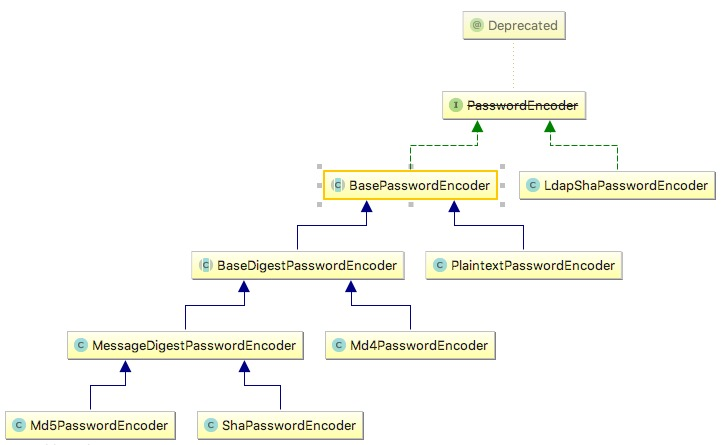
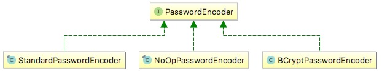
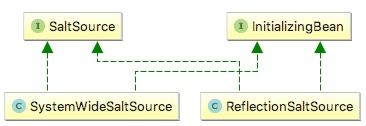
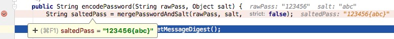

# Spring Security系列三 用户密码加密实现

> 转自： https://www.ktanx.com/blog/p/4917

## 前言

[Spring Security系列二 用户登录认证数据库实现](http://www.dexcoder.com/blog/p/4916)中，我们已经把对用户的认证改成了数据库实现，功能上虽然完成了，但是用户的密码却都是以明文保存的，这在实际项目中安全系数上会有所欠缺。在本章中我们将实现如何对用户的密码进行加密。

## Spring Security中的密码加密

在`Spring Security`中，对密码的加密都是由`PasswordEncoder`来完成的。

那什么时候会调用这个`PasswordEncoder`呢？这就要回到前面实现数据库登录认证时的`DaoAuthenticationProvider`了。在`DaoAuthenticationProvider`中，除了`UserDetailsService`之外还有其它的几个属性，其中一个就是`PasswordEncoder`，`UserDetailsService`前面我们已经实现了，现在要实现`PasswordEncoder`，密码加密功能主要就是靠它来完成。

## Spring Security中的PasswordEncoder

其实在`Spring Security`中，已经对`PasswordEncoder`有了很多实现，包括`md5`加密、`SHA-256`加密等等，一般情况下我们只要直接拿来用就可以了。

查看类`org.springframework.security.authentication.dao.DaoAuthenticationProvider`的`setPasswordEncoder`方法：

```java
package org.springframework.security.authentication.dao;
/**
 * An {@link AuthenticationProvider} implementation that retrieves user details from a {@link UserDetailsService}.
 */
public class DaoAuthenticationProvider extends AbstractUserDetailsAuthenticationProvider {
    	/**
	 * Sets the PasswordEncoder instance to be used to encode and validate passwords. If
	 * not set, the password will be compared as plain text.
	 * <p>
	 * For systems which are already using salted password which are encoded with a
	 * previous release, the encoder should be of type
	 * {@code org.springframework.security.authentication.encoding.PasswordEncoder}.
	 * Otherwise, the recommended approach is to use
	 * {@code org.springframework.security.crypto.password.PasswordEncoder}.
	 *
	 * @param passwordEncoder must be an instance of one of the {@code PasswordEncoder}
	 * types.
	 */
	public void setPasswordEncoder(Object passwordEncoder) {
		Assert.notNull(passwordEncoder, "passwordEncoder cannot be null");
		if (passwordEncoder instanceof PasswordEncoder) {
			setPasswordEncoder((PasswordEncoder) passwordEncoder);
			return;
		}
        /**
        * 推荐 使用org.springframework.security.crypto.password的实现类去完成密码的编码和匹配工作
        */
		if (passwordEncoder instanceof org.springframework.security.crypto.password.PasswordEncoder) {
			final org.springframework.security.crypto.password.PasswordEncoder delegate = (org.springframework.security.crypto.password.PasswordEncoder) passwordEncoder;
			setPasswordEncoder(new PasswordEncoder() {
				public String encodePassword(String rawPass, Object salt) {
					checkSalt(salt);
					return delegate.encode(rawPass);
				}
				public boolean isPasswordValid(String encPass, String rawPass, Object salt) {
					checkSalt(salt);
					return delegate.matches(rawPass, encPass);
				}
				private void checkSalt(Object salt) {
					Assert.isNull(salt,
							"Salt value must be null when used with crypto module PasswordEncoder");
				}
			});
			return;
		}
		throw new IllegalArgumentException(
				"passwordEncoder must be a PasswordEncoder instance");
	}
	...其他代码...
}
```

会发现参数类型居然是`Object`类型，这是因为在内置的`PasswordEncoder`中，又分了两条路线，应该是随着版本的更新优化而衍生的，但为了兼容老版本所以两个都保留了下来，这里就都分别介绍一下。

### 老的PasswordEncoder

具体是指接口：`org.springframework.security.authentication.encoding.PasswordEncoder`。

之所以说它老是因为在该接口上已经标了`@Deprecated`注解不推荐使用了，但相应的实现类却没有标注，所以目前使用上依然是相当广泛的，很多人可能并不知道已经`@Deprecated`了。

它的类图结构如下：



可以看到有很多常用的`PasswordEncoder`已经有实现了，这里拿最常用的`Md5PasswordEncoder`来做示例。

想要使用密码加密就必须指定使用哪个`PasswordEncoder`，但是在`AuthenticationManagerBuilder`中并没有可以快速指定`PasswordEncoder`的地方，所以这里必须自己声明`AuthenticationProvider`，然后设置`UserDetailsService`和`PasswordEncoder`，具体代码如下：

```java
@Bean
public UserDetailsService userDetailsService() {
    return new CustomUserDetailsService();
}
@Bean
public PasswordEncoder passwordEncoder(){
    return new Md5PasswordEncoder();
}
@Bean
public AuthenticationProvider authenticationProvider(){
    DaoAuthenticationProvider authenticationProvider = new DaoAuthenticationProvider();
    authenticationProvider.setUserDetailsService(userDetailsService());
    authenticationProvider.setPasswordEncoder(passwordEncoder());
    return authenticationProvider;
}
protected void configure(AuthenticationManagerBuilder auth) throws Exception {
    //auth.userDetailsService(userDetailsService());
    auth.authenticationProvider(authenticationProvider());
}
```

需要注意在`configure`中设置了`AuthenticationProvider`就要把原先的`auth.userDetailsService(userDetailsService())`去掉，不然就会有两个`userDetailsService`的调用和认证，结果必然是一次正确一次不正确，返回你预期之外的结果。

### 新的PasswordEncoder

具体是指接口：`org.springframework.security.crypto.password.PasswordEncoder`，这是spring当前推荐使用的接口。

它的类图如下：



下面的图片 转自 [https://fruitdish.github.io/Fruitd-BlogResources](https://fruitdish.github.io/Fruitd-BlogResources/blog/2018-01/Spring%20Security%E8%87%AA%E5%AE%9A%E4%B9%89%E7%94%A8%E6%88%B7%E8%AE%A4%E8%AF%81%E9%80%BB%E8%BE%91/passwordencoder%E7%BB%A7%E6%89%BF%E5%85%B3%E7%B3%BB.png)


实现类只有三个，简单明了，但加密安全性却提高了。

`NoOpPasswordEncoder`不多说了，啥也不做按原文本处理，相当于不加密。

`StandardPasswordEncoder` 1024次迭代的`SHA-256`散列哈希加密实现，并使用一个随机8字节的salt。

`BCryptPasswordEncoder` 使用BCrypt的强散列哈希加密实现，并可以由客户端指定加密的强度`strength`，强度越高安全性自然就越高，默认为10.

在`Spring`的注释中，明确写明了如果是开发一个新的项目，`BCryptPasswordEncoder`是较好的选择。

```java
 * If you are developing a new system,
 * {@link org.springframework.security.crypto.bcrypt.BCryptPasswordEncoder} is a better
 * choice both in terms of security and interoperability with other languages.  
```

代码示例：

```java
@Bean
public org.springframework.security.crypto.password.PasswordEncoder passwordEncoder() {
    return new BCryptPasswordEncoder();
}
@Bean
public AuthenticationProvider authenticationProvider() {
    DaoAuthenticationProvider authenticationProvider = new DaoAuthenticationProvider();
    authenticationProvider.setUserDetailsService(userDetailsService());
    authenticationProvider.setPasswordEncoder(passwordEncoder());
    return authenticationProvider;
}
protected void configure(AuthenticationManagerBuilder auth) throws Exception {
    //auth.userDetailsService(userDetailsService());
    auth.authenticationProvider(authenticationProvider());
}
```

## 给密码加点盐 salt

不得不说`salt`这名字取的很贴切。

在很多时候我们可能需要给密码加点指定的前缀或后缀，以防止像`123456`这类简单的密码被反向破解，这时候就会用到`SaltSource`了。

其实`SaltSource`随着`PasswordEncoder`的更换目前已是不推荐使用了，但是有必要了解一下它，以及它背后的目的是什么，以实现更好的密码安全性。

`SaltSource`类图如下：



`SaltSource`的目的就是混淆一下密码然后再进行加密，防止加密后的字符串被反向破解。像`ReflectionSaltSource`可以指定对象的某个属性值添加到密码中以增加安全性。

这里为简单起见，我们自己实现一个`SaltSource`，在密码中加固定的字母`abc`：

```java
/**
 * Created by liyd on 16/11/26.
 */
public class CustomSaltSource implements SaltSource {
    @Override
    public Object getSalt(UserDetails userDetails) {
        return "abc";
    }
}
```

然后指定使用`CustomSaltSource`：

```java
@Bean
public SaltSource saltSource() {
    return new CustomSaltSource();
}
@Bean
public AuthenticationProvider authenticationProvider(){
    DaoAuthenticationProvider authenticationProvider = new DaoAuthenticationProvider();
    authenticationProvider.setUserDetailsService(userDetailsService());
    authenticationProvider.setPasswordEncoder(passwordEncoder());
    authenticationProvider.setSaltSource(saltSource());
    return authenticationProvider;
}
```

启动项目，打上断点调试，发现在我们的密码`123456`后面加上了`abc`：



自然加密后的字符串也相应变了，加强了密码的安全性。

需要注意`SaltSource`只针对老的`PasswordEncoder`而言，新的`PasswordEncoder`已经不需要使用`SaltSource`来加强密码的安全性了，因为它的强度可以由用户指定，强度不同加密后的字符串自然也不同，安全性已经足够了，就算你想加也会抛出下面的异常：

```
java.lang.IllegalArgumentException: Salt value must be null when used with crypto module PasswordEncoder
```

## 密码的保存

以上说了密码的加密校验，有个前提当然是你在保存数据的时候密码加密方式得和这个保持一致，这个也不用自己实现，既然已经有了直接把`PasswordEncoder`拿来用就行：

```java
@Bean
public AuthenticationProvider authenticationProvider() {
    //这里只做如何使用passwordEncoder与校验保持一致示例 密码输出
    String password = passwordEncoder().encode("123456");
    System.out.println(password);
    ...
}
```

### 附件列表

- [security-demo.zip](https://www.ktanx.com/u/a/blog/attach/download?id=1020)