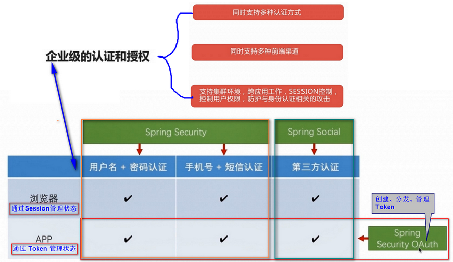

# 目录


- 第2章 开始开发

  - 安装开发工具
  - 介绍项目代码结构并搭建，基本的依赖和参数设置
  - 开发 Hello Spring Security 。

- 第3章 使用 Spring MVC 开发 RESTful API
  - 认证授权模块 主要是为 一些服务接口（API） 提供 安全保护， 不被随意访问。
  - 开发 RESTful 风格的 基本的增删改查 接口
  - Spring MVC 高级特性
    - 拦截服务接口来提供一些通用的功能（例如记日志）。
    - 文件的上传下载。
    - HTTP 请求的异步处理（通过多线程来提高服务的性能）。
  - RESTful 服务开发常用工具
    - Swagger : 自动生成接口服务文档。
    - WireMock : 快速伪造 RESTful 服务（使得前端可以和后台并行开发）。

- 第4章 使用 Spring Security 开发基于表单的登录

  - 介绍 Spring Security 的基本原理和核心概念。

  - 基于 Spring Security 的默认实现 开发 「 用户名 + 密码 」的认证 。
    （体验 开箱即用 的快速开发）
  - 扩展 Spring Security 的默认实现 来满足 个性化的需求。
    - 深入了解 Spring Security 的源码实现。
    - 实现自定义的登录方式 （开发 「 手机号 + 短信 」的认证 ） 。

- 第5章 使用 Spring Social 开发第三方登录
  - 介绍 OAuth 协议 和 Spring Social 的基本原理和核心概念。
  - 深入了解 Spring Social 的底层源码实现，以及扩展这些实现来适应不同的服务提供商。
    - 实现 QQ 认证 和 微信认证。
  - 介绍 Spring Security 中与 session 管理相关的特性。
    - 如超时处理，并发控制，集群环境等。

- 第6章 Spring Security OAuth 开发 APP 认证框架
  - Spring Security OAuth 简介。
  - 基于 Spring Security OAuth 搭建自己的认证服务器和资源服务器。
    - 重构原有认证功能，使其支持基于 Token 的认证方式 （实现 APP 登录的支持）。
  - 基于 OAuth 协议实现 SSO (单点登录)。
    - 如何控制 Token 的 生成 和 存储策略 以及 Token 的自动刷新。

- 第7章 使用 Spring Security 授权控制

  - Spring Security 中 与授权 相关的原理和概念。

  - 实现 3 种不同复杂度的授权机制。

    依据 授权逻辑 的复杂程度 将常见的 授权场景分类。

  - 重构代码。


# 1-1 导学

## 有一定经验的程序员如何提升自己


* 每天都很忙，但感觉水平没有提升
* 不知道学什么，遇到复杂业务场景时，又感觉技术储备不够
* 工作中写过很多代码，但是面试时几句话就说完了

## 讲一门聚焦的课


* 把一个知识点所有常见场景和特性都覆盖到
* 不止讲自己写的代码，还要讲框架的源码
* 不止要实现功能，还要封装起来能重用，能给别人用

## 企业级的认证和授权




* 支持多种认证方式

  * 用户名/密码
  * QQ登陆
  * 微信登陆
  * ...

* 支持多种前端渠道
  * 浏览器
  * APP

* 支持集群环境

  * 跨应用工作
  * SESSION控制
  * 控制用户权限
  * 防护与身份认证相关的攻击


## 课程目标


* 深入理解 Spring Security 及相关框架的远离、功能和代码
* 可以基于 Spring Security 及相关框架独立开发认证授权相关功能
* 掌握抽象和封装的常见技巧可以编写可重用的模块供他人使用


# 2 准备工作

## 2-1 开发环境搭建

JDK：1.8

STS （Spring Tools Suite）: https://spring.io/tools/sts

MySQL （MySQL Community Server）:  https://dev.mysql.com/downloads/mysql/  , 建议： windows 上使用 安装包（因为有 VS 的依赖）。

-  「MySQL Workbench」是 MySQL 官方客户端。


## 2-2 架构介绍


- 在 parent 项目中 ，配置 `<dependencyManagement>`  引入 pom 文件， 管理 maven 依赖（版本）。

- 设置 Project 级别的默认编译为 jdk-1.8  ， 也可以 设置成 maven 级别。（maven 默认编译级别为 jdk-1.5， 如果 project 在 Eclipse 中报错， 可通过 `Maven-->Update` 进行刷新。）

```xml
<build>
	<plugins>
		<plugin>
			<groupId>org.apache.maven.plugins</groupId>
			<artifactId>maven-compiler-plugin</artifactId>
            <!-- version 不用指定 -->
			<configuration>
				<source>1.8</source>
				<target>1.8</target>
				<encoding>UTF-8</encoding>
			</configuration>
		</plugin>
	</plugins>
</build>
```

### 依赖 jar 说明

> 所有 jar 配置在 core 项目中， 其他项目只要 引入 core 项目 即可。
>
> > browser 项目需要额外引入 `spring-session` (支持 集群 session 管理) 。

```bat

# 主要引入 Spring-Security 和 Spring-Security-oauth2 。
spring-cloud-starter-oauth2

# 存储， Token 及 用户社交账号的绑定等。 
spring-boot-starter-data-redis
spring-boot-starter-jdbc
mysql-connector-java

# Spring-social 相关， 第三方 登录（如 QQ/微信）
spring-social-config
spring-social-core
spring-social-security
spring-social-web

# 工具包 ， 字符、集合、反射 操作。
commons-lang
commons-collections
commons-beanutils
```

## 2-3 开发 Hello Spring Security

### 问题记录

```properties
# Exception1 (Exp1)
Cannot determine embedded database driver class for database type NONE

# Reason1 (RS1) : 原因是没有配置数据库

# Exp2
Establishing SSL connection without server's identity verification is not recommended. According to MySQL 5.5.45+, 5.6.26+ and 5.7.6+ requirements SSL connection must be established by default if explicit option isn't set. For compliance with existing applications not using SSL the verifyServerCertificate property is set to 'false'. You need either to explicitly disable SSL by setting useSSL=false, or set useSSL=true and provide truststore for server certificate verification.

# RS2: jdbc url 后面增加参数 useSSL=false 即可
# RS1 和 RS2 配置如下
spring.datasource.driver-class-name=com.mysql.jdbc.Driver
spring.datasource.url=jdbc:mysql://127.0.0.1:3306/imooc-demo?useUnicode=true&characterEncoding=UTF-8&useSSL=false
spring.datasource.username=root
spring.datasource.password=123456

# Exp3
No Spring Session store is configured: set the 'spring.session.store-type' property

# RS3: session 集群配置先 关闭， 另外还可以是 jdbc 和 redis。
spring.session.store-type=none

# Exp4 (参考：https://github.com/imooc-java/security ，实际没有遇到)
org.springframework.data.redis.RedisConnectionFailureException: Cannot get Jedis connection; nested exception is redis.clients.jedis.exceptions.JedisConnectionException: Could not get a resource from the pool

# RS4: 需要安装并配置 redis 服务器参数
spring.redis.host=127.0.0.1
spring.redis.port=6379

# Exp5:需要进行身份验证
# RS5 关闭 默认的 HTTP Basic 的认证。
security.basic.enabled=false
```


# 第3章 使用 Spring MVC 开发 RESTful API

## 3.1. RESTful 简介 及编写 RESTful API

### 3.1.1. RESTful 第一印象

1. 用 URL 描述资源。
2. 使用 HTTP 方法描述行为。使用 HTTP 状态码来表示不同的结果。
3. 使用 JSON 交互数据。
4. RESTful 只是一种风格，并不是强制的标准。

| 操作类型 |           传统请求           | 请求类型 |  RESTful请求   | 请求类型 |
| :------: | :--------------------------: | :------: | :------------: | :------: |
|   查询   |     /user/query?name=tom     |   GET    | /user?name=tom |   GET    |
|   详情   |      /user/getInfo?id=1      |   GET    |    /user/1     |   GET    |
|   创建   |    /user/create?name=tom     |   POST   |     /user      |   POST   |
|   修改   | /user/update?id=1&name=jerry |   POST   |    /user/1     |   PUT    |
|   删除   |      /user/delete?id=1       |   GET    |    /user/1     |  DELETE  |

#### REST 成熟度模型


* Level 0 : The Swamp of POX
  * 使用 Http 作为传输方式
* Level 1 : Resources
  * 引入资源概念
  * 每个资源有对应的 URL
* Level 2 : HTTP Verbs
  * 使用 HTTP 方法进行不同的操作
  * 使用 HTTP 状态码来表示不同的结果
* Level 3 : Hypermedia Controls
  * 使用超媒体
  * 在资源的表达中包含了链接信息

### 3.1.2. 编写 RESTful API

> - 针对 RESTful API 的测试用例
>   - `TDD` 测试驱动开发（Test-Driven Development）， 敏捷开发中的一项核心实践和技术，也是一种设计方法论。
> - 注解 声明 RESTful API  （**`@GetMapping / @PostMapping / @PutMapping / @DeleteMapping`**）
> - RESTful API 中传递参数  （ **`@RequestParam / @PathVariable / @RequestBody`** ）
>

dto 包 用于放 输入/输出 的 对象。

测试用例 详见 ： [UserControllerTest.java](C134_imooc-security-demo-browser/src/test/java/com/yafey/web/controller/UserControllerTest.java)

```java
@RunWith(SpringRunner.class)
@SpringBootTest
public class UserControllerTest {

	@Autowired
	private WebApplicationContext wac;

	private MockMvc mockMvc;

	@Before
	// Before 注解会在 所有 Test cases 之前 执行， 一般用于 环境初始化。
	public void setup() {
		// 伪造 MVC 环境，不用真正的启动 Tomcat。
		mockMvc = MockMvcBuilders.webAppContextSetup(wac).build();
	}

	@Test
	public void whenQueryUserListSuccess() throws Exception {
		// 用伪造的 MVC 环境，模拟发送一个 request ， 作为 perform 方法的参数， 执行后，校验结果是否符合预期。
		mockMvc.perform(MockMvcRequestBuilders.get("/user")
				.contentType(MediaType.APPLICATION_JSON_UTF8))
			.andExpect(MockMvcResultMatchers.status().isOk()) // 判断返回的 status =200 ， 成功。
			.andExpect(MockMvcResultMatchers.jsonPath("$.length()").value(3));  //  jsonPath 语法 见 https://github.com/json-path/JsonPath
	}
}
```


#### 3-2.1. 添加常用的方法 ，让 IDE 自动导入（static import）。

`Java -> Editor -> Content Assist -> Favorites` : `New Type` 。


#### 3-2.2. （Yafey+）java8 链式操作集合。

```java
@GetMapping("/users")
public List<User> queryList() {

	// Java 8 : 链式 add
	// https://www.geeksforgeeks.org/stream-builder-java-examples/
	//@formatter:off
	Stream.Builder<User> builder = Stream.builder();
	List<User> userList = builder
			.add(new User()).add(new User()).add(new User())
			.build()
			.collect(Collectors.toList());
	// @formatter:on
	return userList;
}
```

#### 3-2.3. 常用注解

> 实际用例 详见 ： [UserController.java](C134_imooc-security-demo-browser/src/main/java/com/yafey/web/controller/UserController.java)

* `@RestController`  ： 标明此 Controller 提供 RESTAPI
* `@RequestMapping 及 其变体(如：@GetMapping / @PostMapping / @PutMapping / @DeleteMapping)`  ： 映射 http 请求 url 到 java 方法 （ `@RequestMapping` 可以标注在 方法 和 类 上）。
* `@RequestParam` ： 映射 **请求参数** 到 java 方法的参数
* `@PageableDefault` ： 指定分页参数默认值
* `@PathVariable` 映射 **url 片段** 到 java 方法的参数  (视频 3-3 中提及。)
  * 在 url 声明中 使用 正则表达式
* `@RequestBody` 映射 **请求体** 到 java 方法的参数 (视频 3-4 中提及。)


##### 部分示例及说明

1. `@RequestParam` **默认参数名 与 方法形参名 一致， 也可以自己指定**。

    ```java
    @GetMapping("/user")
    public User queryList(@RequestParam(name="username",required=false,defaultValue="defatul as tom") String nickname) {
    	……方法体……
    }
    
    ```

2. Spring 会自动将 参数绑定到 某个对象上 （UserQueryCondition）。不需要在方法参数上写 `@RequestParam` 注解 (与上面的写法 对比， 更方便，省力。)

    ```java
    @GetMapping("/userCondition")
    public UserQueryCondition queryList(UserQueryCondition condition,
        @PageableDefault(page = 2, size = 17, sort = "username,asc") Pageable pageable) {
       		 ……方法体……
    }
    ```

    

3. 对象的格式化输出：`ReflectionToStringBuilder.toString(<bean 实例变量>, ToStringStyle.MULTI_LINE_STYLE)` 。

4. Spring Data 里面的 Pagable 对象 

    ```java
    // 请求参数中 传下面的参数 会自动绑定到 Pagable 对象中
    {
        "size":"15", // 每页 15 条数据
        "page":"3", // 第 3 页的数据
        "sort":"age,desc"  // 查询结果 按照 age desc 降序 排序
    }
    
    // 后台 对象对应 属性
    log.info("Pageable:pageSize:{},pageNumber:{},sort:{}" , pageable.getPageSize() ,pageable.getPageNumber(),pageable.getSort());
    // Pageable:pageSize:15,pageNumber:3,sort:age: DESC
    
    // 配置 Pageable 默认值, request 中可以不用 上面的 3 个参数。
    public UserQueryCondition queryList(UserQueryCondition condition, @PageableDefault(page=2,size=17,sort="username,asc") Pageable pageable) {
     ……方法体……
    }
    // Pageable:pageSize:17,pageNumber:2,sort:username,asc: ASC
    
    ```

5.   `@PathVariable` 也有和 `@RequestParam` 类似的属性，**默认参数名 与 方法形参名 一致， 也可以自己指定**。

    >  URL 中正则表达式的用法 `:<正则表达式>`  。

    ```java
    // URL 中使用 正则表达式，限制 用户 id 只能是 数字，
    @GetMapping("/user/{id:\\d+}")
    public User getUserDetail(@PathVariable(value = "id", required = true) Integer idxxx) {
    	return new User().setId(idxxx);
    }				
    ```

6. `@RequestBody` , Spring 会通过调用 `HttpMessageConverter` 进行映射 (请求时，需要指明 请求体 的格式， 一般用 JSON 格式) 。

    ```java
    @PostMapping("/user")
    public User createUser(@RequestBody User user) {
    	user.setId(1);
    	log.info(ReflectionToStringBuilder.toString(user, ToStringStyle.MULTI_LINE_STYLE));
    	return user;
    }
    
    // 请求时 ， 指定 请求体 的 格式 ， 如下指定为 JSON 格式。
    @Test
    public void whenCreateSuccess() throws Exception {
    	Date date = new Date();
    	String content = "{\"username\":\"user1\",\"password\":\"1\",\"birthday\":" + date.getTime() + "}";
    	log.info("content:{}", content);
    	// @formatter:off
    	String result = mockMvc.perform(
    				post("/user")
    				.content(content)
    				.contentType(MediaType.APPLICATION_JSON_UTF8)
    			)
    			.andExpect(status().isOk())
    			.andExpect(jsonPath("$.id").value("1"))
    			.andReturn().getResponse().getContentAsString()
    			;
    	// @formatter:on
    	log.info("result:{}", result);
    }
    ```

    


#### 3-2.4. jsonPath 语法 

详见：  https://github.com/json-path/JsonPath


#### 3-3. JsonView 控制 json 输出内容

示例: 见 提交 [97bc730](../../commit/97bc73027a5bd0cfa21d3a5684983a57e6ec6490)

JsonView 使用步骤
> 使用场景： 在 queryList 时 返回部分字段（示例中只返回 username）； 在 getInfo （单个用户）时 返回所有的字段（示例中比 queryList 多返回了 password 字段）。

* 使用接口来声明多个视图
* 在值对象的 get 方法上指定视图
* 在 Controller 方法上指定视图

```java
// TC: whenQueryUserListSuccess() 运行效果， 看不到 password 字段。
result:[{"id":null,"username":null},{"id":null,"username":null},{"id":null,"username":null}]

// TC: whenGetUserDetailSuccess() 运行效果，可以看到 password 字段。
result:{"username":"tom","password":null}
```


#### 3-4. 日期类型参数的处理 ：使用 时间戳 [ `new Date().getTime();` ]

示例: 见 提交 [0d005a3](/commit/0d005a33f749be141e16d75014ae942ecd989930)

不管是 Java 还是 JavaScript ， 都有能力将 时间戳 转化成相应的时间。

```java
// 请求中 传递 date.getTime();
@Test
public void whenCreateSuccess() throws Exception {
    Date date = new Date();
    String content = "{\"username\":\"user1\",\"password\":\"1\",\"birthday\":" + date.getTime() + "}";
    log.info("content:{}", content);
    …… 方法体中 其他代码 ……
}

// 请求体 输出
content:{"username":"user1","password":"1","birthday":1552412275666}

// 后台接收到的 对象， 已自动将 时间戳 转换成 日期格式。
com.yafey.web.controller.UserController  : com.yafey.dto.User@5c9e8a67[
  id=1
  username=user1
  password=1
  birthday=Wed Mar 13 01:37:55 CST 2019
]

//响应体， 自动将 日期格式 转换成 时间戳。
c.y.web.controller.UserControllerTest    : result:{"id":1,"username":"user1","password":"1","birthday":1552412275666}
```


##### Q: SpringBoot 1.5.6， 默认将 Date 类型 JSON 转换时 默认转成 时间戳 格式？

A：待探索。。。
> com.fasterxml.jackson.databind.SerializationFeature.WRITE_DATES_AS_TIMESTAMPS(true)
> 
>[SpringMVC HttpMessageConverter 匹配规则](https://www.cnblogs.com/page12/p/8168107.html)
>
> [[Spring Boot 2]@ResponseBody返回时间类型不再自动序列化为timestamp](https://segmentfault.com/a/1190000015487589)

```
通过调试，发现原因在于spring boot 2.0.2中的org.springframework.boot.autoconfigure.jackson.JacksonAutoConfiguration类中多了如下代码：

static {
    Map<Object, Boolean> featureDefaults = new HashMap<>();
    featureDefaults.put(SerializationFeature.WRITE_DATES_AS_TIMESTAMPS, false);
    FEATURE_DEFAULTS = Collections.unmodifiableMap(featureDefaults);
}
即，在不加配置的情况下，spring boot 2.0.2版本中，返回值中的java.util.Date类型不再默认序列化为timestamp

如果需要仍然按照之前的方式序列化，需要在application.yml中增加如下配置：

spring:
  jackson:
    serialization: 
      WRITE_DATES_AS_TIMESTAMPS: true

```


#### 3-4 + 3-5. `@Valid` 注解 及 常用的 验证注解

示例: 见 提交 [56d8161](//commit/56d8161f6e8a2d5d20fb5eff72df56ec1acc14d9)

来自 `Hibernate Validator` --> http://hibernate.org/validator/

1. 在 bean 的需要校验的字段上 添加要校验的方式 ， 如 `@NotBlank`  `@Past` 等。
2. 在 controller 的方法参数上添加 @Valid 注解。

访问时，如果 password 为 null ， 就会返回 400 ， 请求格式不正确， <span style="color:red;">不会执行方法体中的代码</span>。

建议结合 后面的 `BindingResult` 的方式。

```java
@Data
@Accessors(chain = true)
public class User {
	@NotBlank
	private String password;
	@Past
	private Date birthday;
}

@PostMapping("/user")
public User createUser(@Valid @RequestBody User user) {
	user.setId(1);
	log.info(ReflectionToStringBuilder.toString(user, ToStringStyle.MULTI_LINE_STYLE));
	return user;
}
```


##### 常见 校验注解


#### 3-4 + 3-5. 自定义消息 和 BindingResult

> BindingResult 验证请求参数的合法性并处理校验结果 。

自定义参数只要 设置 校验注解的 `message` 属性 即可。

```java
@NotBlank(message="密码不能为空")
private String password;
@Past(message="生日必须是过去的时间")
private Date birthday;
```


`@Valid` 注解 不会执行方法体中的代码， <span style="color:green;">**有时候即使 请求参数不对，但是需要在方法体中做一些操作**</span>，如：记日志啥的， 就需要结合 **BindingResult**  。

1. 在 Controller 上 添加 `BindingResult` 参数，然后获得错误信息。
2. `UserControllerTest.whenUpdateFailed()` 测试用例中， password=null , birthday=明年的今天。
3. 结果中状态码是 200 ， 日志中也输出了 错误信息。

```java
@PutMapping("/user/{id:\\d+}")
public User updateUser(@Valid @RequestBody User user, BindingResult errors) {
	if(errors.hasErrors()) {
		String errorList = errors.getAllErrors().stream().map(error -> {
			FieldError fieldError =  (FieldError) error;
			String msg = String.format("[%s] %s", fieldError.getField(),fieldError.getDefaultMessage());
			return msg;
		}).collect(Collectors.joining("; "));
		log.error("bindingErrors:{}",errorList);
	}
	user.setId(1);
    log.info(ReflectionToStringBuilder.toString(user, ToStringStyle.MULTI_LINE_STYLE));
    return user;
}

@Test
// Spring 会将错误 绑定到 BindingResult 对象上， 不像 @Valid 注解那样 方法体都不执行。
// 代码中可以拿到 如下的 错误信息。
// 默认的错误信息 ：  bindingErrors:[birthday] must be in the past; [password] may not be empty
// 自定义的错误信息： bindingErrors:[birthday] 生日必须是过去的时间; [password] 密码不能为空
public void whenUpdateFailed() throws Exception {
	// 明年的今天
	Date date = new Date(LocalDateTime.now().plusYears(1).atZone(ZoneId.systemDefault()).toInstant().toEpochMilli());
	
	String content = "{\"id\":\"1\",\"username\":\"user1\",\"password\":null,\"birthday\":" + date.getTime() + "}";
	log.info("whenUpdateSuccess content:{}", content);
	// @formatter:off
	String result = mockMvc.perform(
				put("/user/1")
				.content(content)
				.contentType(MediaType.APPLICATION_JSON_UTF8)
			)
			.andExpect(status().isOk())
			.andExpect(jsonPath("$.id").value("1"))
			.andReturn().getResponse().getContentAsString()
			;
	// @formatter:on
	log.info("whenUpdateSuccess result:{}", result);
}
```


#### 3-5. 自定义校验注解


1. 声明自定义注解 

   ```java
   public @interface MyConstraint {
   	// 如果要想用作 像 Hibernate Validator 中那样的注解（如 @NotBlank / @Past）, 必须至少包含 3 个属性。
   	…… 一些属性 ……
   }
   ```

2. 自定义校验器 实现 `ConstraintValidator` 接口。

   ```java
   public class MyConstraintValidator implements ConstraintValidator<MyConstraint, Object> {
   
   	// 不用在 自定义的校验器上用 @Component 或 @Service 标注，
   	// Spring 会自动将 自定义的 校验器 作为 bean 来管理， 自动注入 Spring 容器中的 其他 bean。
   	@Autowired
   	private HelloService helloService;
   	
   	@Override
   	public void initialize(MyConstraint constraintAnnotation) {
   		// 校验器初始化时要做的动作。
   		System.out.println("MyConstraintValidator init...");
   	}
   
   	/**
   	 * Object value ： 要校验的数据。
   	 * context ： 校验的上下文，包含了 自定义注解 @MyConstraint 里面的 一些值。
   	 */
   	@Override
   	public boolean isValid(Object value, ConstraintValidatorContext context) {
           System.out.println(String.format("传递给自定义校验器 MyConstraintValidator 的值 isValid value=[%s]", value));
           helloService.greeting("校验器的校验逻辑中可以调用 Spring 容器中的任何东西，比如这里是调用 Service 的方法。");
           // 返回 true 表示校验通过， false 表示校验失败。
   		return false;
   	}
   }
   ```

3. 为演示 校验器里自动注入 Spring 容器中的 bean 创建的 Service 。 

    ```java
    // 注册为 Spring 容器的一个 Service。
    @Service
    public class HelloServiceImpl implements HelloService {
        @Override
        public String greeting(String name) {
        	System.out.println("HelloServiceImpl greeting...");
        	return "Hello " + name;
        }
    }
    ```

4. 在 bean 中要校验的字段上使用 自定义注解

    ```java
    @Data
    @Accessors(chain = true)
    public class User {
        @MyConstraint(message="自定义校验器测试，因为在校验器的 isValid 方法直接返回 false，肯定会-->看到本消息就是校验失败了。。。")
        private String username;
        …… 其他字段 ……
    }
    ```

5. TestCase , 沿用之前的 `whenUpdateFailed（）`方法 ，输出的日志如下。

    ```log
    c.y.web.controller.UserControllerTest: whenUpdateSuccess content:{"id":"1","username":"user1","password":null,"birthday":1584123733003}
    MyConstraintValidator init...
    传递给自定义校验器 MyConstraintValidator 的值 isValid value=[user1]
    HelloServiceImpl greeting...
    2019-03-14 02:22:13.758 ERROR 23364 --- [           main] com.yafey.web.controller.UserController  : bindingErrors:[username] 自定义校验器测试，因为在校验器的 isValid 方法直接返回 false，肯定会-->看到本消息就是校验失败了。。。; [password] 密码不能为空; [birthday] 生日必须是过去的时间
    ```


### 3-6 RESTful API 异常处理

#### Spring Boot 中默认的错误处理机制

Spring Boot 错误处理类 ： **`BasicErrorController`** 类中 根据 请求头中是否包含 `text/html` 来决定是返回 HTML 页面 还是 JSON 字符串。

```java
package org.springframework.boot.autoconfigure.web;

@Controller
@RequestMapping("${server.error.path:${error.path:/error}}")
public class BasicErrorController extends AbstractErrorController {

    // 如果请求头的 accept 属性中包含 “text/html”， 返回 html 页面。
	@RequestMapping(produces = "text/html")
	public ModelAndView errorHtml(HttpServletRequest request,HttpServletResponse response) {
		…… 方法体 ……
        ModelAndView modelAndView = resolveErrorView(request, response, status, model);
		return (modelAndView == null ? new ModelAndView("error", model) : modelAndView);
	}
	
    // 其他情况都返回 json 格式（ @ResponseBody 注解 ）。
	@RequestMapping
	@ResponseBody
	public ResponseEntity<Map<String, Object>> error(HttpServletRequest request) {
		Map<String, Object> body = getErrorAttributes(request,isIncludeStackTrace(request, MediaType.ALL));
		HttpStatus status = getStatus(request);
		return new ResponseEntity<Map<String, Object>>(body, status);
	}
```


常见的错误 ： 404 , 400 ( 如 `whenCreateFailed` TC , validator failed) ， 500 ( Sever `RuntimeException` ) 。

以 400 错误为例， 输出内容如下：

```json
/*  请求信息：
method ： POST
content-type=application/json;charset=UTF-8
http://localhost:8080/user
*/
{
    "timestamp": 1552570354116,
    "status": 400,
    "error": "Bad Request",
    "exception": "org.springframework.http.converter.HttpMessageNotReadableException",
    "message": "Required request body is missing: public com.yafey.dto.User com.yafey.web.controller.UserController.createUser(com.yafey.dto.User)",
    "path": "/user"
}	
```


Q: `${server.error.path:${error.path:/error}}`  怎么理解？默认值是 `/error` ?
A: SPel ? 待研究。


#### 自定义异常处理
- 针对 浏览器 请求

  创建以 错误码 命名的 html 文件。 如 统一的 404 页面 ： `src/main/resources/error/404.html` 。

- **针对 客户端 的请求 （JSON）**

  ```java
  @RestControllerAdvice  // 标识 这是一个 自定义处理 Controller 异常的类。
  public class ControllerExceptionHandler {
  
      @ExceptionHandler(UserException4Demo.class)	// 标识 需要处理的 异常类型
      @ResponseStatus(HttpStatus.INTERNAL_SERVER_ERROR)
      public Map<String, Object> handleUserNotExistException(UserException4Demo e) {
          Map<String, Object> result = new HashMap<>();
          result.put("id", e.getId());
          result.put("message", e.getMessage());
          return result;
      }
  }
  /* 输出示例：
  {"id":1,"message":"User not exist."}
  */
  
  ```

  


