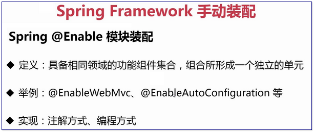

# 2. 走向自动装配

## 2-1. 本章内容

> <span style="color:green">Spring Boot 自动装配是以 **Spring Framework 手动装配** 为基础实现的。</span>

- Spring Framework 手动装配
- Spring Boot 自动装配


## 2.2. Spring Framework 手动装配

**Spring Framework 手动装配** 基本都是以 **`注解`** 驱动的。手动装配 主要分为以下几个方面：

1. Spring `模式注解` 装配
   - Spring Framework 常见的 模式注解
   - 自定义模式注解
2. Spring `@Enable 模块` 装配
3. Spring `条件装配`


### 2.2.1. Spring `模式注解` 装配

>[**模式注解（Stereotype Annotations)** @github/Spring](https://github.com/spring-projects/spring-framework/wiki/Spring-Annotation-Programming-Model#stereotype-annotations)
>
>>A **stereotype annotation** is an annotation that is used to declare the role that a component plays within the application. For example, the `@Repository` annotation in the Spring Framework is a marker for any class that fulfills the role or *stereotype* of a repository (also known as Data Access Object or DAO).
>>
>>`@Component` is a generic stereotype for any Spring-managed component. Any component annotated with `@Component` is a candidate for component scanning. Similarly, any component annotated with an annotation that is itself meta-annotated with `@Component` is also a candidate for component scanning. For example, `@Service` is meta-annotated with `@Component`.

1. **`模式注解`** 是 <span style="color:green">**一种用于 声明 在应用中 扮演 「组件」角色 的注解**</span>。如 Spring Framework 中的 `@Repository` 可以标注在 任何类 上 ，用于扮演仓储角色的模式注解。
   - 应用： 可以是 Spring 应用 ， 也可以是 SpringBoot 应用 （毕竟 SpringBoot 应用是构建在 Spring 之上的）。
   - 角色： 组件，被注解标识的类，常见有注解有 ：`@Component`、`@Service`、`@Configuration` 等。
2. `@Component` 作为一种由 Spring 容器托管的 <span style="color:green">**通用模式组件**</span>，任何被 `@Component` 标注的组件均为组件扫描的候选对象。类似地，<span style="color:green">凡是被 `@Component` 元标注（**meta-annotated**）的注解，也即被 `@Component` 注解标注过的注解，如 `@Service` </span>，且这两个注解的签名也一致时，当任何组件标注它时，也被视作组件扫描的候选对象 。(详见后续的  **`@Component` 「派生性」**) 。


#### ..1.1. 模式注解举例 （Spring Framework）

<span style="color:green">**下面的其余四个注解，都标注了@Component**</span>

| Spring Framework 注解 | 场景说明           | 起始版本 |
| :-------------------- | :----------------- | :------- |
| `@Repository`         | 数据仓储模式注解   | 2.0      |
| `@Component`          | 通用组件模式注解   | 2.5      |
| `@Service`            | 服务模式注解       | 2.5      |
| `@Controller`         | Web 控制器模式注解 | 2.5      |
| `@Configuration`      | 配置类模式注解     | 3.0      |

#### 装配方式

`<context:component-scan>` 方式

```xml
<?xml version="1.0" encoding="UTF-8"?>
<beans xmlns="http://www.springframework.org/schema/beans"
		xmlns:xsi="http://www.w3.org/2001/XMLSchema-instance"
		xmlns:context="http://www.springframework.org/schema/context"
		xsi:schemaLocation="http://www.springframework.org/schema/beans
		http://www.springframework.org/schema/beans/spring-beans.xsd
		http://www.springframework.org/schema/context
		http://www.springframework.org/schema/context/springcontext.xsd">
	
	<!-- 激活注解驱动特性 -->
	<context:annotation-config />
	
	<!-- 找寻被 @Component 或者其派生 Annotation 标记的类（Class），将它们注册为 Spring Bean -->
	<context:component-scan base-package="com.imooc.dive.in.spring.boot" />
	
</beans>
```

`@ComponentScan` 方式

```java
@ComponentScan(basePackages = "com.imooc.dive.in.spring.boot")
public class SpringConfiguration {
	...
} 
```


#### ..1.2. (2-3) Spring Framework手动装配 自定义 模式注解

> <span style="color:green">
> **注解的 *“派生性” 和 “层次性”*。**</span>以 `@Repository` 为例。
>
> 「派生性」和 「层次性」加引号的原因是：<span style="color:red">在 Java 语言规范中， 注解是不能派生的。</span>这里是为了说明 注解 之间的逻辑关系。

```java
结构关系
@Component
	@Repository
		@FirstLevelRepository  -- 说明：在该注解上标注了 @Repository 注解， 说明 注解的 “派生性”
			@SecondLevelRepository  -- 说明 注解的 “层次性”
```

说明：

- `@FirstLevelRepository` 注解 “继承” 了 `@Repository`，同时`@Repository` 注解又“继承”了 `@Component`，三个注解在注解关系上 层层 “继承”，同时 **`注解的签名字段`** 即注解属性方法 也一致，只有一个 value 字段，用于指定 bean 的 name 。
- 同理，`@SecondLevelRepository` 注解被`@FirstLevelRepository` 注解标注也会有同样的效果，**体现了 *“层次性”***。
-  *“派生性”* 侧重于说明 从 Spring 已有的注解 扩展 新的注解，*“层次性”* 侧重于说明 这些 注解之间 所谓的 *层层 ”继承“* 的关系。


具体代码见 commit:  [7cd307e](/../../commit/7cd307e)

> 代码说明解释：
>
> 1. demo 启动类： com.yafey.diveinspringboot.demo4repository.RepositoryBootstrap
>
>    - 用于验证 <span style="color:green">**被自定义注解标注的类** 是否会被纳入到 Spring 容器中。</span>
>    - 此处没有使用默认的 `@SpringBootApplication` 注解，使用 `SpringApplicationBuilder` 初始化上下文， 并进行定制。
>
>    - 这里使用 `@ComponentScan` ， 也可以使用 `@EnableAutoConfiguration`(需要结合 spring.factories ，后续说明 )。
>
> 2. 自定义注解的声明：
>
>    - `@FirstLevelRepository`（元标注了 `@Repository`）。
>    -  `@SecondLevelRepository`（元标注了 `@FirstLevelRepository`）。
>
> 3. 自定义注解的应用：`MyFirstLevelRepository` 类。
>
>    - 3 种用法都可以将该对象（MyFirstLevelRepository）注册到 Spring 容器中。  
>
>      使用自定义注解 `@SecondLevelRepository` 的类 也会被 注册 到 Spring 容器中去 。
>
>   ```java
> //@FirstLevelRepository(value = "myFirstLevelRepository")//value指定bean的名称
> @Component(value = "myFirstLevelRepository")//同样的效果，注解的派生性
> //@SecondLevelRepository(value = "myFirstLevelRepository") // 同样的效果，注解的层次性
> public class MyFirstLevelRepository {
> }
>   ```
>
>   

实际案例：`@SpringBootApplication` 注解 （等效于加了 `@Configuration`注解）

```java
@Configuration
	@SpringBootConfiguration
		@SpringBootApplication
```


### 2.2.2. (2-4) Spring `@Enable` 模块装配

- **Spring Framework 3.1** 开始支持 「`@Enable 模块驱动`」。
- <span style="color:green">**所谓 「模块」是指 具备 相同领域的 功能组件 集合， 组合 所形成一个 独立的 单元 （,进行的封装）。**</span>
  - 好处是 可以简化配置，不用一个一个单独配置。
- 比如 `Web MVC 模块`、`AspectJ 代理模块`、`Caching（缓存）模块`、`JMX（Java 管 理扩展）模块`、`Async（异步处理）模块` 等。
  - **`@EnableWebMvc` ： 来自 Spring Framework，自动组装 WebMVC 相关的组件。**
  - **`@EnableAutoConfiguration` : 来自 SpringBoot ， 激活 SpringBoot 的 自动装配。**
- 实现方式： 注解方式、编程方式。



#### ..2.1. `@Enable` 注解模块举例

| 框架实现         | @Enable 注解模块               | 激活模块            |
| :--------------- | :-------------------------- | :----------------- |
| Spring Framework | @EnableWebMvc                  | Web MVC 模块       |
|                  | @EnableTransactionManagement   | 事务管理模块        |
|                  | @EnableCaching                 | Caching 模块        |
|                  | @EnableMBeanExport             | JMX 模块            |
|                  | @EnableAsync                   | 异步处理模块        |
|                  | @EnableWebFlux                 | Web Flux 模块       |
|                  | @EnableAspectJAutoProxy        | AspectJ 代理模块    |
|                  |         |     |
| Spring Boot      | @EnableAutoConfiguration       | 自动装配模块        |
|                  | @EnableManagementContext       | Actuator 管理模块   |
|                  | @EnableConfigurationProperties | 配置属性绑定模块    |
|                  | @EnableOAuth2Sso               | OAuth2 单点登录模块 |
|                  |         |     |
| Spring Cloud     | @EnableEurekaServer            | Eureka服务器模块    |
|                  | @EnableConfigServer            | 配置服务器模块      |
|                  | @EnableFeignClients            | Feign客户端模块     |
|                  | @EnableZuulProxy               | 服务网关 Zuul 模块  |
|                  | @EnableCircuitBreaker          | 服务熔断模块        |

#### ..2.2. 实现方式

##### ...2.1. 注解驱动方式

>  以 `@EnableWebMvc` 为例
>
>  通过引入 `@Import` 一个被 `@Configuration` 模式注解的 类 来实现 此模块的 功能，加载相应的 bean。

```java
@Retention(RetentionPolicy.RUNTIME)
@Target(ElementType.TYPE)
@Documented
@Import(DelegatingWebMvcConfiguration.class)
public @interface EnableWebMvc {
}
```

```java
@Configuration
public class DelegatingWebMvcConfiguration extends WebMvcConfigurationSupport {
	...
}
```


##### ...2.2. 接口编程方式 

>  以 `@EnableCaching`为例
>
> <span style="color:red">**引入 `@Import` 的类必须实现 `ImportSelector` 接口。**</span>
>
> - <span style="color:green">**此接口能够返回 多个配置 bean**</span>，根据 注解配置的 签名信息 决定引入 bean，<span style="color:green">从而实现 模块装配的 多样化 </span>。
> - 相比 注解驱动方式， 接口编程方式 更具弹性（扩展性更好）。

```java
@Target(ElementType.TYPE)
@Retention(RetentionPolicy.RUNTIME)
@Documented
@Import(CachingConfigurationSelector.class)
public @interface EnableCaching {
	...
}
```

```java
public class CachingConfigurationSelector extends AdviceModeImportSelector<EnableCaching> {
/**
* {@inheritDoc}
* @return {@link ProxyCachingConfiguration} or {@code AspectJCacheConfiguration} for
* {@code PROXY} and {@code ASPECTJ} values of {@link nableCaching#mode()}, respectively
*/
public String[] selectImports(AdviceMode adviceMode) {
            switch (adviceMode) {
                case PROXY:
                return new String[] {                AutoProxyRegistrar.class.getName(),ProxyCachingConfiguration.class.getName() };
                case ASPECTJ:
            return new String[] {
        AnnotationConfigUtils.CACHE_ASPECT_CONFIGURATION_CLASS_NAME };
                default:
                return null;
            }
}
```

`ImportSelector 接口`

```java
package org.springframework.context.annotation;
import org.springframework.core.type.AnnotationMetadata;
/* 
 * ... 一些注释 ...
 * @author Chris Beams
 * @since 3.1
 * @see DeferredImportSelector
 * @see Import
 * @see ImportBeanDefinitionRegistrar
 * @see Configuration
 */
public interface ImportSelector {
    /**
     * Select and return the names of which class(es) should be imported based on
     * the {@link AnnotationMetadata} of the importing @{@link Configuration} class.
     */
    String[] selectImports(AnnotationMetadata importingClassMetadata);

}
```

#### ..2.3. 自定义 `@Enable` 模块

两种实现方式对比，接口驱动实现 由于中间经过 ImportSelector 转换，此种方式 相比 注解驱动实现 更有弹性，能够实现 bean 加载方式 的多样化，自定义实现 多种返回值，类似于 条件装配。

具体代码见 commit:  [f9c6f04](/../../commit/f9c6f04)

> 代码说明：
>
> 1. demo 启动类：`com.yafey.support.spring.enable.EnableHelloWorldBootstrap`
>
> 2. 提交的代码为 基于接口 驱动的 实现。
>
>    - 如要修改成 基于注解 驱动的 实现， 调整 `@EnableHelloWorld` 注解上的 `@Import` 元注解 如下所示。
>       ```java
>       @Import(HelloWorldConfiguration.class)//注解驱动实现方式
>       //@Import(HelloWorldImportSelector.class)//接口编程实现方式
>       public @interface EnableHelloWorld {
>       }
>       ```


##### ...3.1. 基于注解驱动实现 - `@EnableHelloWorld`

- `HelloWorldConfiguration` -> `HelloWorld`
- 自定义 `@EnableHelloWorld` 注解

```java
package com.yafey.support.spring.enable;
import org.springframework.context.annotation.Import;
import java.lang.annotation.*;
import com.yafey.support.spring.enable.interfaces.HelloWorldImportSelector;

@Retention(RetentionPolicy.RUNTIME)
@Target(ElementType.TYPE)
@Documented
@Import(HelloWorldConfiguration.class)//注解驱动实现方式
//@Import(HelloWorldImportSelector.class)//接口编程实现方式
public @interface EnableHelloWorld {
}
```

- 基于 `@Configuration` 注解 引入配置类

```java
package com.yafey.support.spring.enable.annotation;
import org.springframework.context.annotation.Bean;
import org.springframework.context.annotation.Configuration;

@Configuration
public class HelloWorldConfiguration {
	@Bean
    public String helloWorld() { // 方法名即 Bean 名称
        return "Hello,World 2019";
    }
}
```

- 验证 `@EnableHelloWorld` 启动类

```java
package com.yafey.support.spring.enable;
import org.springframework.boot.WebApplicationType;
import org.springframework.boot.builder.SpringApplicationBuilder;
import org.springframework.context.ConfigurableApplicationContext;

@EnableHelloWorld
public class EnableHelloWorldBootstrap {
	public static void main(String[] args) {
        ConfigurableApplicationContext context = new SpringApplicationBuilder(EnableHelloWorldBootstrap.class)
                .web(WebApplicationType.NONE)
                .run(args);

        // helloWorld Bean 是否存在
        String helloWorld = context.getBean("helloWorld", String.class);
        System.out.println("helloWorld Bean : " + helloWorld);
        
        // 关闭上下文
        context.close();
    }
}
```


##### ...3.2. 基于接口驱动实现 - @EnableServer

- `HelloWorldImportSelector` --返回--> `HelloWorldConfiguration` --返回--> `HelloWorld`
- 基于实现 ImportSelector 接口 引入的配置类

```java
package com.yafey.support.spring.enable.interfaces;
import org.springframework.context.annotation.ImportSelector;
import org.springframework.core.type.AnnotationMetadata;
import com.yafey.support.spring.enable.annotation.HelloWorldConfiguration;

public class HelloWorldImportSelector implements ImportSelector {
	@Override
	public String[] selectImports(AnnotationMetadata importingClassMetadata) {
        return new String[]{HelloWorldConfiguration.class.getName()};
	}

}
```
- 自定义 `@EnableHelloWorld` 注解

```java
package com.yafey.support.spring.enable;
import org.springframework.context.annotation.Import;
import java.lang.annotation.*;
import com.yafey.support.spring.enable.interfaces.HelloWorldImportSelector;

@Retention(RetentionPolicy.RUNTIME)
@Target(ElementType.TYPE)
@Documented
//@Import(HelloWorldConfiguration.class)//注解驱动实现方式
@Import(HelloWorldImportSelector.class)//接口编程实现方式
public @interface EnableHelloWorld {
}
```

### 2.2.3. (2-5)Spring 条件装配

从 Spring Framework 3.1 开始，允许在 Bean 装配时增加 <span style="color:green">**`前置条件判断`**</span> （类似于 if...else 判断语句）。


#### ..3.1. 条件注解举例

> `@Profile` 参数配置方式有局限，`@Conditional` 自定义编程 具有更大的灵活性。

| Spring 注解  | 场景说明                                            | 起始版本 |
| :----------- | :-------------------------------------------------- | :------- |
| @Profile     | <span style="color:green">**配置**</span>化条件装配 | 3.1      |
| @Conditional | <span style="color:green">**编程**</span>条件装配   | 4.0      |

#### ..3.2. 实现方式

##### ...2.1. 配置方式 - `@Profile`

>  <span style="color:red">**在 Spring 4.0 之后**， `@Profile` 注解 实际上是通过 `@Conditional` 编程方式 实现的 。 </span>( 通过 `ProfileCondition` 类来实现的。 )


`@Profile` 注解 的源码，Since 3.1 。

```java
package org.springframework.context.annotation;
/*
 * <p>When defining Spring beans via XML, the {@code "profile"} attribute of the
 * {@code <beans>} element may be used. See the documentation in the
 * {@code spring-beans} XSD (version 3.1 or greater) for details.

 * @since 3.1
 */
@Target({ElementType.TYPE, ElementType.METHOD})
@Retention(RetentionPolicy.RUNTIME)
@Documented
@Conditional(ProfileCondition.class)
public @interface Profile {
    /**
     * The set of profiles for which the annotated component should be registered.
     */
    String[] value();
}
```

Spring 4.0 之后， `@Profile` 真正的实现类 `ProfileCondition` 的源码。
```java
package org.springframework.context.annotation;
/**
 * {@link Condition} that matches based on the value of a {@link Profile @Profile}
 * annotation.
 * @since 4.0
 */
class ProfileCondition implements Condition {
	@Override
	public boolean matches(ConditionContext context, AnnotatedTypeMetadata metadata) {
		MultiValueMap<String, Object> attrs = metadata.getAllAnnotationAttributes(Profile.class.getName());
		if (attrs != null) {
			for (Object value : attrs.get("value")) {
				if (context.getEnvironment().acceptsProfiles(Profiles.of((String[]) value))) {
					return true;
				}
			}
			return false;
		}
		return true;
	}
}
```


##### ...2.2. 编程方式 - `@Conditional`

**`@Conditional` 注解的定义及其使用**，<span style="color:red">**必须配合 `Condition 接口` 使用。**</span> 就是判断配置是否符合条件

- <span style="color:green"> `@Conditional`就是 判断 配置是否符合条件 。</span>

- Spring `@OnClassCondition` 注解 为例：
  - 判断 `@Conditional` 注解的签名类 `OnClassCondition.class` 是否在当前classpath下存在。
  - `OnClassCondition`这个类必须 **实现 Condition 接口**，在此类中根据 `@ConditionalOnClass` 注解的 **签名信息** 作匹配判断，是否装配此 bean。

  ```java
  package org.springframework.boot.autoconfigure.condition;
  /**
   * {@link Conditional} that only matches when the specified classes are on the classpath.
   *
   * @author Phillip Webb
   */
  @Target({ ElementType.TYPE, ElementType.METHOD })
  @Retention(RetentionPolicy.RUNTIME)
  @Documented
  @Conditional(OnClassCondition.class)
  public @interface ConditionalOnClass {
      /**
       * The classes that must be present. Since this annotation is parsed by loading class
       * bytecode, it is safe to specify classes here that may ultimately not be on the
       * classpath, only if this annotation is directly on the affected component and
       * <b>not</b> if this annotation is used as a composed, meta-annotation. In order to
       * use this annotation as a meta-annotation, only use the {@link #name} attribute.
       * @return the classes that must be present
       */
      Class<?>[] value() default {};
      /**
       * The classes names that must be present.
       * @return the class names that must be present.
       */
      String[] name() default {};
  }
  ```

  

`@Conditional` 注解的定义

```java
package org.springframework.context.annotation;
import java.lang.annotation.*;
/*  ... 其他注释...
 * @author Phillip Webb
 * @author Sam Brannen
 * @since 4.0  从 Spring4.0 开始
 * @see Condition
 */
@Target({ElementType.TYPE, ElementType.METHOD})
@Retention(RetentionPolicy.RUNTIME)
@Documented
public @interface Conditional {
	/**
	 * All {@link Condition Conditions} that must {@linkplain Condition#matches match}
	 * in order for the component to be registered.
	 */
	Class<? extends Condition>[] value();
}
```

`Condition 接口`

```java
package org.springframework.context.annotation;
public interface Condition {
   /**
    * Determine if the condition matches.
    * @param context the condition context
    * @param metadata metadata of the {@link org.springframework.core.type.AnnotationMetadata class}
    * or {@link org.springframework.core.type.MethodMetadata method} being checked.
    * @return {@code true} if the condition matches and the component can be registered
    * or {@code false} to veto registration.
    */
   boolean matches(ConditionContext context, AnnotatedTypeMetadata metadata);
}
```


#### ..3.2. 自定义条件装配

##### ...2.1. (2-6)基于 `配置方式` 实现 自定义 条件装配 - `@Profile`
计算服务，多整数求和 sum (如果 Java7, 使用 for 循环方式 ; 如果是 Java8, 使用 Lambda)。 

`@Profile(“Java7”)` : for 循环
`@Profile(“Java8”)` : Lambda

`@Profile` 代码见 commit:  [e605f8d](/../../commit/e605f8d)

> 代码说明：
>
> 1. demo 启动类：`com.yafey.support.spring.condition.BootstrapUsingProfile`
>
> 2. 提交的代码 指定了以 Java8 的方式实现。
>
>    - <span style="color:red">必须在 SpringApplicationBuilder 返回的 ConfigurableApplicationContext 上指定 profiles ( *`.profiles(String...)`* )， 不然会报错  `NoUniqueBeanDefinitionException ： No qualifying bean of type '......CalculateService' available` 。</span>


##### ...2.2. (2-7)基于`编程方式` 实现 自定义 条件装配 - `@Conditional`

参考 SpringBoot 的 `@ConditionalOnProperty` 注解 (功能：判断 Spring 上下文中的 配置 是否 存在 或 匹配)  ，
<span style="color:green">**实现 自定义的 `@ConditionalOnSystemProperty` 注解 （判断 系统变量 是否有匹配的 配置 ， 可通过 `-Dxxx` 等方式启用）**。</span>


SpringBoot 的 `@ConditionalOnProperty` 注解
```java
package org.springframework.boot.autoconfigure.condition;

@Retention(RetentionPolicy.RUNTIME)
@Target({ ElementType.TYPE, ElementType.METHOD })
@Documented
@Conditional(OnPropertyCondition.class)
public @interface ConditionalOnProperty {
	String[] value() default {};
	String prefix() default "";
	String[] name() default {};
	String havingValue() default "";
	boolean matchIfMissing() default false;
}
```


自定义的 `@ConditionalOnSystemProperty` 注解  代码见 commit:  [c635fdc](/../../commit/c635fdc)
> 代码说明：
>
> 1. demo 启动类：`com.yafey.support.spring.condition.Bootstrap4ConditionalOnSystemProperty`
>
>    - 注意： 在这个 类上 是没有加 任何注解的 ， 如 `@SpringBootApplication`。
>
> 2. 在 传递给 SpringApplicationBuilder 的类中 定义的 bean (即 用 `@Bean` 标注的方法) 会自动装载到 Spring 容器中。
>
> 3. 提交的代码 是会报错的，需要修改 `Bootstrap4ConditionalOnSystemProperty` 类中的 `@ConditionalOnSystemProperty` 注解上 value 属性改成 “CN” 即可 正常运行，如下所示。
>
>    ```java
>    @Bean
>    @ConditionalOnSystemProperty(name = "user.country", value = "CN")
>    public String helloWorld() {
>    	return "hello world.";
>    }
>    ```


## 2.3. Spring Boot 自动装配

在 Spring Boot 场景下，<span style="color:green">**基于 约定 大于 配置 的原则**</span>，实现 Spring 组件自动装配的目的。

其中使用的**底层装配技术**：

- Spring 模式注解装配
- Spring @Enable 模块装配
- Spring 条件装配装配
- Spring 工厂加载机制

  - 实现类： `SpringFactoriesLoader`
  - 配置资源： `META-INF/spring.factories`

**实现方法**

1. 激活自动装配 - `@EnableAutoConfiguration`
2. 实现自动装配 - `XXXAutoConfiguration`
3. 配置自动装配实现 - `META-INF/spring.factories`


### 2.3.1. 自动装配举例说明

参考 `META-INF/spring.factories`

SpringBoot 启动时，`SpringFactoriesLoader` 的 `loadFactories` 方法会找到所有的 **`META-INF/spring.factories`**，并加载里面的配置 （以 `key-value` 的形式 配置了 需要装配 的类）。


以 `@EnableAutoConfiguration` 注解 为例

- 节选 `org.springframework.boot.autoconfigure/spring-boot-autoconfiguration-<version>.jar/META-INF/spring.factories`

- 对比 前面的 手动装配 ， 如 2.2.1. 中的`@ComponentScan`方式，不再需要手动指定要 scan 的 package。

  通过 自动装配机制，将所有 自定义配置 进行了加载。*如这里的 `@EnableAutoConfiguration` 的很多配置，其中就包括了 WebMvc 的一些配置。*

- SpringBoot 大多数 采用的是 模块化的 starter ，如 在 `starter-test` 中，就有很多这方面的配置。

    `spring-boot-starter-test-2.1.3.RELEASE.jar/META-INF/spring.factories`

    ```properties
    # Auto Configure
    org.springframework.boot.autoconfigure.EnableAutoConfiguration=\
    org.springframework.boot.autoconfigure.admin.SpringApplicationAdminJmxAutoConfiguration,\
    org.springframework.boot.autoconfigure.aop.AopAutoConfiguration,\
    ...
    org.springframework.boot.autoconfigure.web.servlet.WebMvcAutoConfiguration,\
    ...
    ```


### 2.3.2. 自定义自动装配

> 实现三部曲： 1. 激活自动装配；2. 实现自动装配；3. 配置自动装配实现

 **自定义 自动装配 `HelloWorldAutoConfiguration`** 代码见 commit:  [c635fdc](/../../commit/c635fdc)

> 代码说明：
>
> 1. **激活自动装配** ：在 启动类 上 加上 `@EnableAutoConfiguration`
>
>    - demo 启动类：   `com.yafey.support.spring.autoconfig.Bootstrap4EnableAutoConfiguration`
>    - 需要注意的是，`@SpringBootApplication ` 包含了`@EnableAutoConfiguration`
>
> 2. **实现自动装配 ** : 编写 `HelloWorldAutoConfiguration` 类。
>
> 这里整合了 多种自动装配的底层实现方式: （实际使用时，只需要选择其中之一即可。这里的示例如果只选用 Spring 模式注解 ， 会报错，因为 bean 不在这里声明。 ）
>
>    - Spring 条件装配： `@ConditionalOnSystemProperty`  ， user.country == "CN"
>    - Spring 模式注解 装配： `@Configuration` 。 
>
>      - 因为不能重复定义 bean, bean 和 `@Configuration` 其实体现在   `HelloWorldConfiguration` 类上 。
>    - Spring `@Enable 模块` 装配： (当前提交的代码 将使用 `@Enable 模块`装配的 接口编程实现方式 。) 
>
>      - 加载顺序：`@EnableHelloWorld 注解  加载 -->HelloWorldImportSelector 返回 --> HelloWorldConfiguration 生成 bean --> helloWorld` 
>
> ```java
> package com.yafey.support.spring.autoconfig;
> /**
> * 实现自动装配， 这里整合了 多种自动装配的底层实现方式: 
> （实际使用时，只需要选择其中之一即可。
> 这里的示例如果只选用 Spring 模式注解 ， 会报错，因为 bean 不在这里声明。 ）
> */
> //@Configuration // Spring 模式注解
> @EnableHelloWorld // Spring @Enable 模块装配
> @ConditionalOnSystemProperty(name = "user.country", value = "CN") // 条件装装配
> public class HelloWorldAutoConfiguration {
> }
> ```
>
> 3. **配置自动装配实现** - `/src/main/resources/META-INF/spring.factories`
>
> ```properties
> # 自动装配
> org.springframework.boot.autoconfigure.EnableAutoConfiguration=\
> com.yafey.support.spring.autoconfig.HelloWorldAutoConfiguration	
> ```


----

参考 ：以 sf 博客为基准，结合 csdn 修改。
[2.走向自动装配 @sf](https://segmentfault.com/a/1190000016714713)

 [Spring Boot 2.0之走向自动装配 @csdn](https://blog.csdn.net/yu_kang/article/details/88364354) 

```

```