# Spring Boot 2.0深度实践之核心技术篇

## 0. 补充内容

### 微服务： 一般指的是 「微服务架构」[^quick-understand-microservice] [^microservice-tech-stack]

> 2014 年可以认为是微服务 1.0 的元年，当年有几个标志性事件，<br/>
> 一是 <span style="color:green">**Martin Fowler 在其博客上发表了”Microservices”一文**</span>，正式提出微服务架构风格；<br/>
> 二是 Netflix 微服务架构经过多年大规模生产验证，最终抽象落地形成一整套开源的微服务基础组件，统称 NetflixOSS，Netflix 的成功经验开始被业界认可并推崇；<br/>
> 三是 Pivotal 将 NetflixOSS 开源微服务组件集成到其 Spring 体系，推出 Spring Cloud 微服务开发技术栈。<br/>


[^quick-understand-microservice]: http://dockone.io/article/3687 一篇文章快速理解微服务架构 @ MARCH 06, 2018 <br/>

[^microservice-tech-stack]: https://infoq.cn/article/micro-service-technology-stack  微服务架构技术栈选型手册@2018.02.12


### 微服务 与 Spring Boot

两者的趋势是同步的， Spring Boot 的搜索量更大， 毕竟 开发人员更关心 「如何落地 微服务架构」。

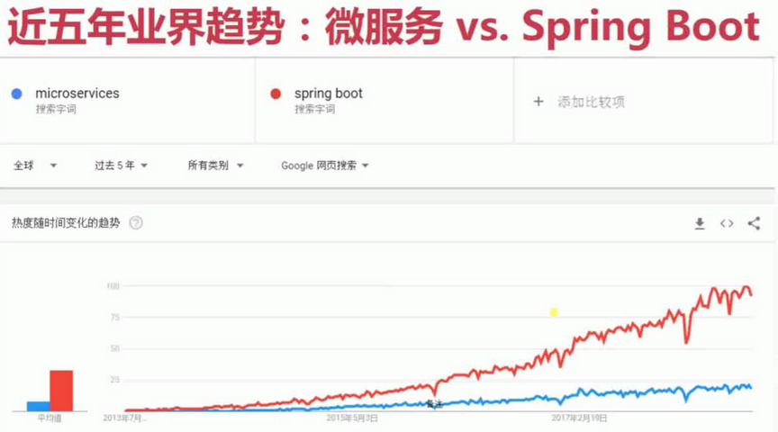

为什么 Spring Boot 会成为 微服务架构 的首选？

1. 绝对的市场占有率 

   > Spring Boot 基于 Spring Framework ， Rebel 实验室 在 2017 年 不完全统计的 数据如下，而且 Spring 架构体系完全兼容 Java EE ， 所以真实的市场占有率应该是 Spring + Java EE。 
   >
   > 有一种观点：<span style="color:green">「 **Spring 已经成为 Java 的事实标准。**」</span> ，长期处于绝对的领先地位。

2. 优秀的家族基因

   > Spring Boot 在 Spring 体系中， 起到了承上启下的角色，为 底层的 Spring Framework 快速搭建应用 ； 为 高层的 Spring Cloud 提供了 基础设施。 Spring 官方给它起了 「BUILD ANYTHING」这样的 slogan 来体现它的家族地位。

3. 与时俱进的技术信仰

   > Spring Boot 1.x 时代 ，构建在 Java EE 的技术体系，常见的 Spring MVC ，属于 Servlet 的技术栈。 数据层可选用 JDBC、JPA 等规范。
   >
   > Spring Boot 2.x 时代， 将 Java EE 从以前的 必选项 调整为 「可选项」， 可能的原因是 SUN 公司的倒塌，Oracle 对 Java EE 的热情骤减，可能终将抛弃 。 Spring 家族的发展蒸蒸日上，并且以广阔的胸襟拥抱业界的变化，最为显著的是编程模型的变化，其中以 「Reactive 为代表的编程范式」—— 使用 **非阻塞 加 异步 的方式**，帮助应用充分地利用系统资源，提高应用伸缩性。同时，底层的数据存储方面，已经提升到了 常见的核心的基础设施 ，包括 MongoDB 、Redis 等。
   >
   > <span style="color:green"> **使用 Reactive 方式 来实现 非阻塞 异步的 编程 将成为接下来的主流的编程方式。**</span> Spring 5 / Spring Boot 2.x 提早布局， 等待趋势变为现实。


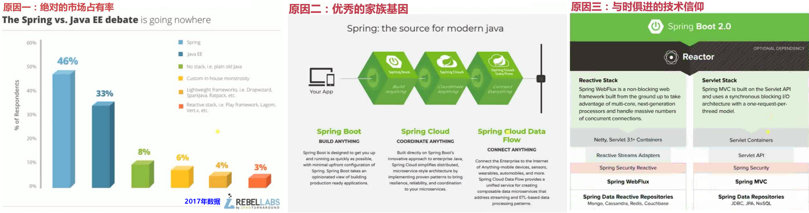


## 第1章 系列总览

总览 Spring Boot 2.0 深度实践系列课程的整体议程，包括 Spring Boot 三大核心特性（组件自动装配、嵌入式Web容器、生产准备特性）、Web 应用（传统 Servlet、Spring Web MVC、Spring WebFlux）、数据相关（JDBC、JPA、事务）、功能扩展（SpringApplication、Spring Boot 配置、Spring Boot Starter）以及...


## 1.1. 总览

- 全面覆盖： 本课程做不到面面俱到，而是在某个领域全面覆盖到，了解来龙去脉，相关原理，以及 源码分析。

- 重点突出： Spring Boot 的核心特性，主要关注 **Spring Boot 和 Spring Framework 及 Java EE 规范之间的联系**。 （Spring Boot 整合的一- 些不常用操作，并不是一定要用 Spring 的 实现。）


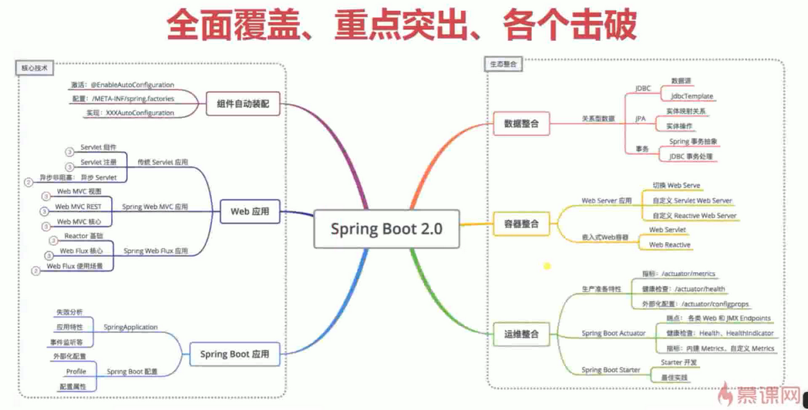


带着问题学习

- Spring Boot 如何基于 Spring Framework 逐步走向 自动装配的？
  - Spring Framework 1.x ~ 5.x 都有不同程度的 自动化装配的 贡献， 如 ： 模式注解等。
- SpringApplication 是如何掌控 Spring 应用生命周期的？
  - 传统的 Servlet 应用 是由 Servlet 容器 来驱动的， Servlet 容器启动后 再启动 SpringApplication 的上下文 （SpringApplicationContext）。
  - SpringBoot 1.x 开始， Spring boot 来启动 SpringApplication 的上下文。


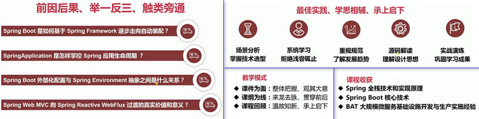

## 1.2. Spring Boot 2 易学难精

- <span style="color:green">**Spring Boot 2 易学** </span>
- - **组件自动装配**：规约大于配置，专注核心业务
  - **外部化配置**：一次构建、按需调配，到处运行
  - **嵌入式容器**：内置容器、无需部署、独立运行
  - **Spring Boot Starter**：简化依赖、按需装配、自我包含
  - **Production-Ready**：一站式运维、生态无缝整合


- <span style="color:red;">**Spring Boot 2 难精** </span>

  - **组件自动装配**：模式注解、@Enable模块、条件装配、加载机制

    - *Spring Boot 在 Spring Framework 的基础上， 扩展了一些 Spring Boot Annotation。*
  - **外部化配置**：Environment抽象、生命周期、破坏性变更 

    - *Spring Boot1.0 和 Spring Boot2.0之间有一点不太兼容的，在迁移和学习时，应予以高度关注。*
  - **嵌入式容器**：Servlet Web容器、Reactive Web容器

    - Reactive Web容器 --> Netty
  - **Spring Boot Starter**：依赖管理、装配条件、装配顺序
  - **Production-Ready**：健康检查、数据指标、@Endpoint管控


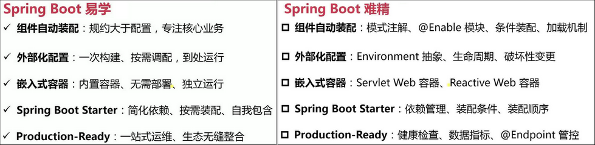


### 了解 Spring Boot 与 Java EE 规范 的联系与区别

> 精通 Spring Boot 的 学习建议， 多了解 Spring 源码 与 JSR ( Java EE 规范 ) 的关系。


- **Web** ： Servlet （JSR-315 、JSR-340）

  - JSR-315: Servlet 3.0 规范，包括 异步化。
  - JSR-340: Servlet 3.1 规范，包括 非阻塞。 WebFlux 兼容 Servlet 3.1 容器，官网简言之，但是我们不能放过任何的讯息。

- **SQL** ： JDBC （JSR-221） ： JDBC 4.0 规范。

- **数据校验**： Bean Validation ( JSR-303 、 JSR-349) 。Spring Boot 2 其实实现的是 JSR-349 , 但是官方文档中写的还是 JSR-303 。

  -  JSR-303 ：Bean Validation1.0。
  -  JSR-349：Bean Validation1.1 。

- **缓存**：Java Caching API ( JSR-107 ).

- **WebSockets** ： Java API for WebSocket ( JSR-356 )

  Spring 并不提供任何的实现，它的实现是落在 Tomcat 这样的 Servlet 容器上，因此 Tomcat 容器是实现了 WebSockets 的规范，这是 Spring 和Java EE 的困境。

- **Web Services** : JAX-WS （JSR-224）, 微服务中用的比较少。

- **Java 管理** ： JMX  （ JSR 3）。

  Java 管理 的扩展 JMX，Spring Boot 的核心概念 Production-Ready（为生产级别而准备的一些特性），包括 `@Endpoint` 端点，端点提供了两种方式，一种是 Web 方式来进行访问，另一种就是 JMX，Spring Boot 和 JMX 整合的是比较好的 。

- **消息** ： JMS ( JSR-914)  ，主要是指 JMS的规范（ JMS1.1 ），其中有代表性的实现就是 `Active MQ` 。


​	其实，这里举的例子只是很小的一部分，Spring Framework 和 Spring Boot 在实现 Java EE 规范方面是花了非常多的心思的，Java EE 规范是一个大而全的技术体系栈。Spring Boot 在此基础上提升了它的开发效率，并且简化了部分复杂的 API，因此我们需要搞清楚 Spring Boot 和 Java EE 规范之间的联系。

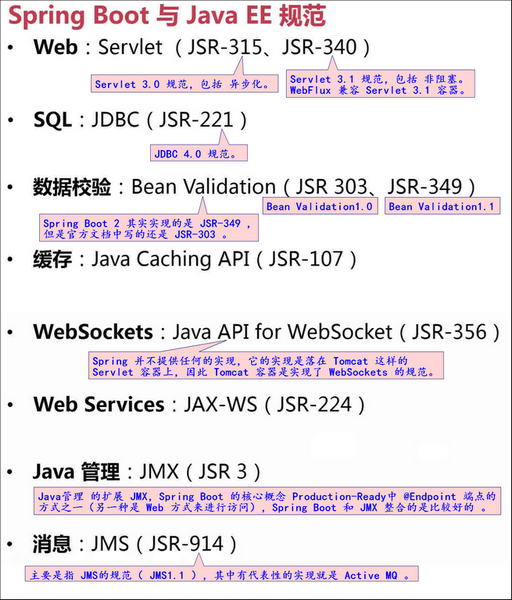


## 1.3. Spring Boot深度实践-总览

> 核心特性、Web应用（引入了Reactive Web的开发，就是我们常说的Web Flux，这是对Spring MVC或Servlet应用是一种补充，因为Spring MVC是构建在Servlet基础上的实现）、数据相关（JDBC、JPA相关的操作）、功能扩展（Web化配置、自动装配、嵌入式容器都需要对Spring Boot API非常熟悉，尤其像Spring Boot嵌入式容器这块，2.0和1.0的实现方式也发生了变化）、运维管理（为生产而准备的特性，以运维为主，日志监控、性能监控以及核心的业务指标监控，Spring Boot提供了一套完整的解决方案）。


- **核心特性** ：
  - Spring Boot 1.x (1.0~1.5) 与 Spring Boot 2 跨度比较大， 转换时的 注意事项。
- **Web 应用** ： 
  - Spring Boot 2 基于 Spring framework 5.0 ( 引入 Reactive Web 开发， 即 WebFlux ) 。
- **数据相关** ： JDBC、JPA 。
- **功能扩展**： 自动装配、配置化、嵌入式容器 等 ， Spring Boot API 的熟悉， Spring Boot 1.x 与 2.x 中 对 嵌入式容器的实现有所差异。
- **运维管理**：Ready for Production。
  - 日志监控、性能监控、核心的业务指标监控 等。
  - 国外著名的 Spring Admin 等基于这块来做的。


## 1.4. (1-4 ~ 1-5)核心特性介绍(Spring Boot三大特性)

1. **组件自动装配**：

   「组件自动装配」可以分成 「组件」、「自动」、「装配」三部分。 

   - 「组件」 就是 Web MVC、Web Flux、JDBC、Transactions事务 等。

   - 在 Spring Framework 时代， 上面提及的这些「组件」已经有了成型的方案。

     Spring Boot 在此基础上，将原先的 手动配置的方式 变成了 「自动」的方式。

   - 减少了代码的编写，并且按照一定条件的方式触发( 「装配」 )，更好地理解一些特性，**使得我们可以更专注于业务开发，减少框架配置调试的时间**。

2. **嵌入式 Web 容器**：Spring Boot 中可以自由切换下面的两种不同的容器。

   - 传统 Servlet 容器： Tomcat、Jetty 以及 Undertow( JBoss ) 等。
   - Reactive Web容器 ( Web Flux )  : 基于 Netty 开发的 HTTP Server 服务器（当然， Web Flux 也可以基于 Servlet3.1 API 来实现）。

3. **生产准备特性**（`Production-Ready`）：提供一些非功能特性，主要是 监控 和 管理 等 特性。

   > 功能性特性 如 Web Flux、Web MVC 以及 JDBC 等都是为开发做准备的 。
   >
   > URL中的前缀 `/actuator` 是在 Spring Boot 2.x 中新增的（也可以修改）， Spring Boot 1.x 中不需要这个前缀。

   - **指标(Metrics)** ： `/actuator/metrics` （CPU、内存、磁盘的利用率） 。

   - **健康检查(Health Check)** : `/actuator/health（应用是否健康、数据库、磁盘、文件系统是否健康）`

   - **外部化配置(Externalized Configuration)** ：`/actuator/configprops`（不用写代码可以调整应用的行为，比如 port 端口）。

     「外部化配置」在 Spirng Boot 工程里用的非常广泛，然而它的本质是来自于 Spring Framework，只不过在 Spring Framework 中不叫 「外部化配置」，Spirng Boot 把这个概念 加以提升了。

     > 「外部化配置」也可以通过 endpoint 进行暴露，也就是说它可以通过调整配置的方式修改应用的行为。

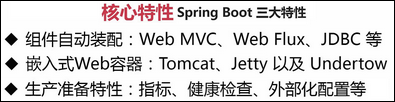


### 1.4.1. (1-5)组件自动装配介绍

>激活： `@EnableAutoConfiguration`
>配置： `/META-INF/spring.factories`
>实现： `XXXAutoConfiguration`

真正的实现比较复杂，但是可以简要概括为以下几步：

1. **激活**：使用 `@EnableAutoConfigureation` 注解。

   言外之意，<span style="color:red">Spring Boot 默认是 没有 激活 自动装配功能的</span> 。 

2. **配置**：`/META-INF/spring.factories`。

   这是一个规约文件，既可以是它内部的实现，也可以是用户自定义的实现。

   `/META-INF` 是元信息的目录，`.factories` 是工厂机制，类似 `key-value` 的形式。

3. **实现**：`XXXAutoConfiguration`。

   `XXX`代表一种特性，比如 `WebMVCAutoConfiguration`、`JDBCAutoConfiguration`。


#### 示例项目—组件自动装配

> 说明 Spring Boot 中如何处理这些激活方式 , 以及 配置文件间的 交互、过程。

1. 新建 Spring Boot 项目。

   ~~通过 http://start.spring.io 生成，然后 Import Maven 项目。~~ 使用 IDE 创建 Spring Boot 项目。

2. 官网的示例中 使用 `@EnableAutoConfiguration` 注解，项目中使用的 `＠SpringBootApplication` 注解上标注了  `@EnableAutoConfiguration` 注解 。

3. 在 IDEA 中按 `Ctrl+Shift+N`，输入`spring.factories`，选择`spring-boot-autoconfigure-2.1.2.RELEASE.jar` 。

4. 在这里，我们清楚地看到 `org.springframework.boot.autoconfigure.EnableAutoConfiguration` （全类名 或 接口名）做为 key ，它的 value 是各种各样的实现类。Spring 在启动时会启动很多的 自动装配的 bean （实现类）。

5.  常用的 `WebMvcConfiguration` 依赖 Servlet、DispatcherServlet 等，<span style="color:red">而这些东西我们工程里没有，所以它是不会被装配起来的，它的功能将加以阻止。</span>

   **其实自动化装配很复杂**，如 `WebMvcConfiguration` **有很多 前提条件 和 相应的顺序**。


```java
package com.yafey;

import org.springframework.boot.SpringApplication;
import org.springframework.boot.autoconfigure.SpringBootApplication;

@SpringBootApplication
public class DiveInSpirngBoot2Application {

	public static void main(String[] args) {
		SpringApplication.run(DiveInSpirngBoot2Application.class, args);
	}

}
```

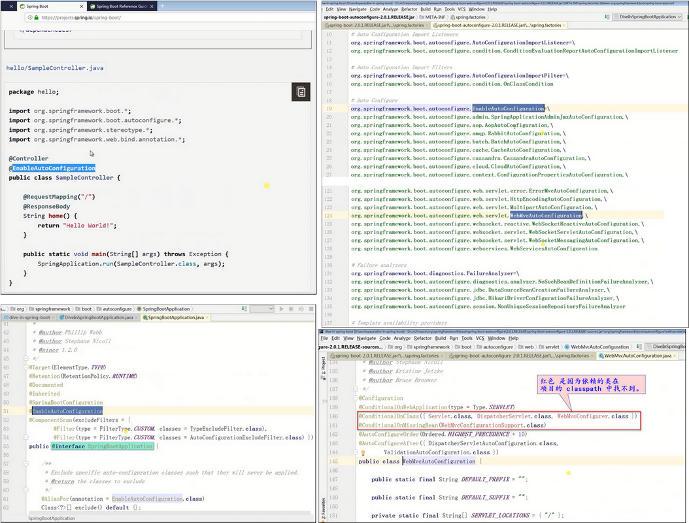


## 1.5. (1-6)Web 应用介绍

### 1.5.1. 传统 Servlet 应用

1. **`Servlet 组件`**：Servlet、Filter、Listener。

   常见的 Listener 有 ：ServletContextListener、RequestListener。

2. **`Servlet 注册`**：Servlet 注解、Spring Bean、RegistrationBean

   - `Servlet 注解` 其实是 **Servlet 3.0 本身提供的特性**。
   - `Spring Bean` 的注册方式，**在 Spring Boot 里面，我们允许把 Servlet 部署成一个Spring 的 Bean 加以 加载 和 映射**。
   - `RegistrationBean` 这种方式，**是 Spring Boot 提供新的 API**，有几种不同的变种。

3. **异步非阻塞**：异步 Servlet、非阻塞 Servlet 。

   主要是依靠 Servlet3.0 以上 的 API 来进行实现的。

   - 异步 Servlet 主要是 Servlet3.0 提供的一种实现。
   - 非阻塞 Servlet 是 Servlet3.1 的实现。
   - 因此，在 Web Flux 里面，它有一个地方提到了：**Web Flux 可以运行在 Servlet3.1 以上的 API，也说是说 Serlvet3.1 里面其实有包含异步和非阻塞两个特性**。


#### 1.5.1.0. (1-7)传统Web应用示例 TL;DR

1. **添加传统 Web 依赖** （Spring Boot Starter 方式引入）

   ```xml
   <dependency>
     <groupId>org.springframework.boot</groupId>
     <artifactId>spring-boot-starter-web</artifactId>
   </dependency>
   ```

2. **Servlet 组件**

   - **Servlet**
     1. 实现
        - `@WebServlet`
        - `extends HttpServlet`
        - 重写方法（`@Override`）
     2. URL 映射
        - `@WebServlet(urlPatterns="/my/servlet")`
     3. 注册
        - `@ServletComponentScan(basePackages="com.imooc.diveinspringboot.web.servlet")`
   - **Filter**
   - **Listener**

3. **Servlet 注册**

   1. 方式一：**Servlet 注解**
      - `@ServletComponentScan +`
        1. `@WebServlet`
        2. `@WebFilter`
        3. `@WebListener`

   2. 方式二：**Spring Bean**
      - `@Bean +`
        1. Servlet
        2. Filter
        3. Listener
   3. 方式三：**RegistrationBean**
      - `ServletRegistrationBean`
      - `FilterRegistrationBean`
      - `ServletListenerRegistrationBean`

4. **异步非阻塞**

   - **异步 Servlet**
     - `javax.servlet.ServletRequest#startAsync()`
     - `javax.servlet.AsyncContext`
   - **非阻塞 Servlet**
     1. `javax.servlet.ServletInputStream#setReadListener`
        - `javax.servlet.ReadListener`
     2. `javax.servlet.ServletOutputStream#setWriteListener`
        - `javax.servlet.WriteListener`


#### 1.5.1.1. 传统Web应用示例—详细

##### 添加传统 Web 依赖

**Spring Boot 的 自动装配** 其实是采用 「 `spring-boot-starter` 方式」。

- `spring-boot-starter` 分成 很多功能模块，如 `spring-boot-starter-test`、`spring-boot-starter-web` 模块。
- 这些模块的 `groupId` 都是 `org.springframework.boot`，而 `artifactId` 都是以 `spring-boot-starter-xxx` 开头的。


添加 传统 Web 依赖后：( 添加该依赖后， 我们可以看到一些 间接依赖，这里的有 tomcat、JSON、Servlet API 等 间接依赖。 )

```
<dependency>
    <groupId>org.springframework.boot</groupId>
    <artifactId>spring-boot-starter-web</artifactId>
</dependency>
```

启动 Spring Boot 应用，我们可以看到启动的容器是 Tomcat，端口是 8080，和上面的包依赖 tomcat 遥相呼应，当输入`localhost:8080`后，<span style="color:red">**会出现一个白页 ( Whitelabel Error Page )  ,因为当前 没有增加 映射的 任何处理**</span>，也就是说 当前页面没有映射到任何一个处理的实现类，这个白页是错误信息的警告，因此会报 404 的错误。


##### Servlet 注解方式 实现 传统 Servlet3.0 。

> `@ServletComponentScan` + `@WebServlet`( Servlet3.0 )
>
> **传统的 SpringMVC 应用也是可以放到 Spring Boot 里面的。**

示例: 见 提交 [4b2f9ec](/../../commit/4b2f9ec)

1. 模仿 `org.springframework.boot.autoconfigure.web.servlet.WebMvcAutoConfiguration` 类 创建 `web.servlet.MyServlet` class。

   - **Spring Boot2 的 web 有两种实现方式 ： Servlet 和 Reactive** ， 所以 WebMvcAutoConfiguration 类的全路径 也 从 `web.WebMvcAutoConfiguration` 调整为 `web.servlet.WebMvcAutoConfiguration`。

2. 添加 `@WebServlet`，`extends HttpServlet` (Servlet3.0 规范里决定) ，覆盖 `doGet(HttpServletRequest req, HttpServletResponse resp)` 方法。

3. 添加 URL 映射 ： `@WebServlet(urlPatterns="/my/servlet")`

4. 注册 : `@ServletComponentScan(basePackages="com.imooc.diveinspringboot.web.servlet")`。

   有点类似于 `@ComponentScan`。

5. 启动应用后，在浏览器输入 http://localhost:8080/my/servlet 后，能正常获得 “Hello,World” 信息。

6. 这里演示的 Servlet 的注册方式 是 Spring 自定义的 注册方式 (`@ServletComponentScan` +  `@WebServlet`( Servlet3.0) ) ，它结合了 Servlet 规范来操作的。

   - 和 `@WebServlet` 相应的 ， 还有 `@WebFilter` 和 `@WebListener` 。
7. 另外还有 Spring Beant 和 RegistrationBean 两种方式，Spring Bean 和 RegistrationBean 方式有点类似。后续加以说明。


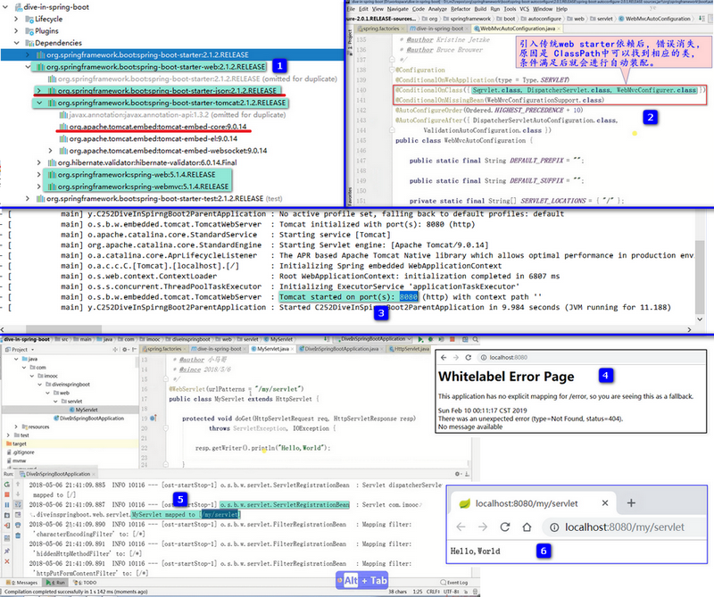


#### 1.5.1.2. (1-8)异步非阻塞 Servlet

异步非阻塞分两个方面，异步Servlet ( 3.0中提出 )，非阻塞Servlet (3.1中提出)。

1. **异步Servlet**
   - `javax.servlet.ServletRequest#startAsync()`
   - `javax.servlet.AsyncContext`
2. **非阻塞Servlet**
   - `javax.servlet.ServletInputStream#setReadListener`
     - `javax.servlet.ReadListener`
   - `javax.servlet.ServletOutputStream#setWriteListener`
     - `javax.servlet.WriteListener`


> <span style="color:red;">注意点：异步操作 比 同步操作 要复杂很多。</span>  示例: 见 提交 [92c4068](/../../commit/92c4068)
>
> 1. <span style="color:green">**需要配置 `@WebServlet` 的 属性 `asyncSupported = true`**</span> , **不然会报错**。完整的注解为：  `@WebServlet(urlPatterns="/my/servlet",asyncSupported=true)` 
> 2. 在业务代码完成后，<span style="color:green">**需要显式地 触发完成 `asyncContext.complete();`**  </span> ， 不然，浏览器会一直等待服务器端响应，直到达到 超时时间。

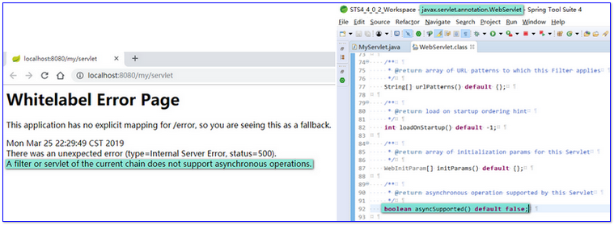


### 1.5.2. (1-9)Spring Web MVC 应用 介绍

> 需要了解 Spring Framework 中 Web MVC ， 这部分在 SpringBoot 中 没有太多变化。

- **`Web MVC 视图`** ： 主要 跟 2 个接口有关。

  > - `ViewResolver`
  > - `View`

  1. **常见模板引擎**
     - `Thymeleaf` ： SpringBoot 官方推荐。
     - `Freemarker` ： ftl 格式。
     - `JSP`
  2. **内容协商** ： 模板引擎的匹配策略。
     - `ContentNegotiationConfigurer`
     - `ContentNegotiationStrategy`
     - `ContentNegotiatingViewResolver` ：该策略 会包含所有的模板引擎的  ViewResolver， 逐一进行处理。
  3. **异常处理** ： <span style="color:orange">SpringBoot 中的 **「异常处理」**和 传统的 Spring MVC 的异常处理有所不同。</span>
     - `@ExceptionHandler` 注解
     - `HandlerExceptionResolver` 接口
       - `ExceptionHandlerExceptionResolver` 默认实现。
     - `BasicErrorController` (Spring Boot)

- **Web MVC REST**

  1. **资源服务**
     - `@RequestMapping`
       - `@GetMapping` 等变种
     - `@ResponseBody`
     - `@RequestBody`
  2. **资源跨域**
     - **`@CrossOrigin`** 注解
     - `WebMvcConfigurer#addCorsMappings` 接口
     - 传统解决方案 ：新型浏览器里面不推荐这两种方式 。
       - ~~IFrame~~
       - ~~JSONP~~
  3. **服务发现**
     - HATEOS

- **Web MVC 核心**

  1. 核心架构
  2. 处理流程
  3. 核心组件
     - `DispatcherServlet`
     - `HandlerMapping`
     - `HandlerAdapter`
     - `ViewResolver`
       ...


#### 1.5.2.1. Web MVC 视图：模板引擎、内容协商、异常处理等。

Web MVC视图：**主要是 2 个接口： `ViewResolver`、`View`** 。

> 传统 Spring MVC 时代， 实现方式基于我们的配置。 SpringBoot 中，自动装配 机制可以少写一些代码，但因此也产生了 黑盒，所以需要了解一些关键的实现。


ViewResolver ： 视图处理器。 返回 View 对象。

```java
package org.springframework.web.servlet;

//视图上的处理器
public interface ViewResolver {

    // 处理器的 处理方法。
    // 根据 viewName 和 Locale 来查询或者处理 视图, 得到 View 对象。
	View resolveViewName(String viewName, Locale locale) throws Exception;
}

```

View ： 视图。视图只关心一件事情，那就是它的渲染（render）。

```java
package org.springframework.web.servlet;
// 视图 
public interface View {
    // 视图的 渲染 方法。渲染 需要的上下文数据 就保存在 model 对象中，结合 request ， 返回相应的 response 。
	void render(@Nullable Map<String, ?> model, HttpServletRequest request, HttpServletResponse response) throws Exception;
}
```


每一种模板引擎就是对 `ViewResolver`、`View` 的实现，同时会结合相应的策略来操作。 常见的 Thymeleaf、Freemark、JSP 都有它们各自的实现。

##### 模板引擎 与 内容协商

Thymeleaf、Freemark、JSP 每一种模板引擎都会对应一个 ViewResolver 实现，同时会结合相应的策略来操作。response 就会输出内容，具体由 render 所在接口 View 的实现 来操作。

当应用里有多种模板引擎，这个时候就是「**内容协商**」的优势了，结合 **相应的策略** 来选择最佳匹配的模板引擎来渲染。以 `ContentNegotiatingViewResolver` 策略为例， 这个内容协商策略 会包含所有的 ViewResolver ，然后逐一进行处理。


##### 异常处理

> <span style="color:orange">SpringBoot 中的 **「异常处理」**和 传统的 Spring MVC 的异常处理有所不同。</span>

- 异常处理在 SpringMVC 是通过 `@ExceptionHandler` 注解来处理。

- 另外，SpringMVC、Spring Boot 会自动帮我们创建 `HandlerExceptionResolver`，比如`ExceptionHandler` 的处理方式是由 `HandlerExceptionResolver` 的子类`ExceptionHandlerExceptionResolver` 产生的。

- 在 Spring Boot 里面，我们前面看到的  `Whitelabel Error Page`（400页面），这个白页是由 `BasicErrorController` 生成的。`BasicErrorController`中的 `/error`  和白页中的 `/error` 相对应。
  - `@RequestMapping("${server.error.path:${error.path:/error}}")`
  - `BasicErrorController` 有两种方式的显示，一种是html方式，一种是json方式，两种不同的方式分别表达不同的方式和方法。
    - 根据 request 的 header 里面的 `accept` 字段来 区分 （`	@RequestMapping(produces = "text/html")` ）。


#### 1.5.2.2. Web MVC REST：资源服务、资源跨域、服务发现等

>  RESTful 一般以 JSON 或 XML 作为响应体。

##### 资源服务 

> RESTful 的操作语义，GET/POST/PUT/DELETE 。

相关的 常用注解如下：

- `@RequestMapping`

  - Spring 4.3 之后 新增了该注解的一些「同义词」：

    `@GetMapping` 、 `@PostMapping`、`@PutMapping`、`@DeleteMapping` ，

    分别对应 查询、添加、更新、删除。

  - `@RequestMapping` 和 `@AliasFor` 是一种 「委派」 的方式。

- `@ResponseBody`

- `@RequestBody`

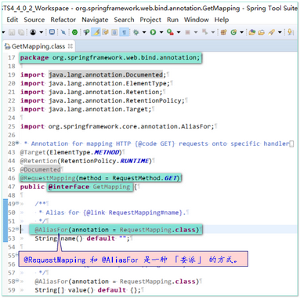

##### 资源跨域

>  **`@CrossOrigin` 注解驱动** （since Spring4.2），**`WebMvcConfigurer` 接口编程** （since Spring3.1）。 都来自 Spring Framework 。

- 传统资源跨域有两种解决办法，一种是 iframe，另一种是 JSONP，这两种方案各有优劣，但在新型浏览器里面不推荐这两种方式了。

- 而是用 `@CrossOrigin` 注解 来进行操作，它会告诉浏览器，我有哪些东西是可以跨域的，有一些默认配置。Spring5.0 开始，不建议使用默认配置，需要自定义配置 `CorsConfiguration`。
- 另外一种就是 `WebMvcConfigurer#addCorsMappings(CorsRegistry registry)` 方案，`@CrossOrigin` 和 `WebMvcConfigurer` 其实都是 SpringMVC 里面的，只是由于 Spring Boot 的流行，才把这些东西重新拾起来。


##### 服务发现

>  将应用提供的服务给暴露出去。这里主要是 HATEOS 的应用。

其实在 SpringMVC 里面也有服务发现，只不过它在控制台（ 关键字：`Mapped`），控制台没办法暴露给服务，无法让程序识别，也就是说，如果当前应用的某个服务被访问时，同时告诉对方还提供了哪些服务。


#### 1.5.2.3. Web MVC核心：核心架构、处理流程、核心组件

核心架构 和 处理流程 后续说明。

##### 核心组件

核心组件的入口是 `DispatcherServlet`，它其实也是一个 Servlet，和普通的 Servlet 没有什么区别，**唯一的区别是它会把请求转发到不同的 Controller 里去，映射到 Controller 里的路径。**

映射路径 和 `HandlerMapping` 进行交互，Handler 可以理解为就是 Controller 的处理方法，处理方法 和 Handler 做映射，所以有 `HandlerMapping`，`HandlerMapping` 是内部的一个转换，帮助我们把方法转换成它内部的一个实现，处理完之后会返回`ModelAndView`，`ModelAndView`中的 `Model` 会继续给 `ViewResolver` 来进行处理，最后生成视图 `View`。

当然，如果是 RESTful 应用，处理流程发生了一些变化。


### 1.5.3. (1-10)Spring Web Flux 应用

**Spring Web Flux 是 Spring5 开始支持的一种新的 Web 特性**，是对 Servlet 进行的一个补充，也就是说，从我们的 Web 应用中，从传统的 **同步阻塞** 的编程 变成 **异步非阻塞** 的编程，这对我们的编程模型也是一大挑战和升级。

#### 1.5.3.1. Reactor基础：Java Lambda、Mono、Flux

**Java Lambda 是 Reactive（响应式编程）的一个基础，`Reactor` 是 `Reactive Stream` 的一种实现方式**。

**`Java Reactive Stream`** 其实有好几种实现方式，包括：（它们的基础都是 Java Lambda。）

- Java9 里 Flow API。
- RxJava — Reactive Extensions for Java。
- 同时它有两个核心接口—Mono 和 Flux 。


#### 1.5.3.2. Web Flux 核心：Web MVC注解、函数式声明、异步非阻塞

- **Web Flux 可以和 Spring MVC 注解 兼容的**，其实在官方文档上也有说明，如@Controller、@RequestMapping、@ResponseBody、@RequestBody 。
- 函数式声明主要是 `RouterFunction`，Router 是路由器的意思，Function 是函数，可以通过路由的方式来表达函数，它可以通过我们编程的方式 更丰富的 去做方法内联。就是关于我们用函数的方式来进行声明我们的一些 Endpoint 的暴露，包括路径通过表达表来暴露。
  - **函数式编程的好处**：有更好的弹性，可以通过很多条件来做，尽管这个东西可以在 Condition 条件上面做一个判断，但程序方面的灵活性就远远大过其它的方式，函数式编程比较直观一些，同时它可以绑定相应的实现方法，我们可以在一个声明表达式里面部署多个 Endpoint 以及 它们映射方法 的处理机制，不需要到处进行相应的绑定。
- **非阻塞和异步 结合起来相对来讲 有性能上的提升的，因为可以提高吞吐量**。异步非阻塞包括两个方面：`Servlet3.1` 和 `Netty Reactor`。


#### 1.5.3.3. 使用场景：Web Flux 优势和限制

它的使用场景分成几个方面，和 SpringMVC 没有太大区别，一个是 **页面渲染**，一个是 **REST应用**，这两个应用是比较核心的。

性能测试：<https://blog.ippon.tech/spring-5-webflux-performance-tests/>，这是一个性能方面的测试，<span style="color:red">结论是: 在 Web Flux 里面 **性能没有提升太多，在某些方面 Web Flux 性能反而会有所下降**。</span>

<span style="color:orange">那为什么要用Reactive呢？提升系统的吞吐量，吞吐量不代表快。</span>


## 1.6. 容器整合（Web Server应用）

### 1.6.1. 切换 Web Server 容器

 　如果你不喜欢用 Tomcat，或者你不得不用 Jetty，这时你就需要做切换，同时你也许不太想用Servlet 容器，想尝试新的 Netty Web Server，也是可以的。

#### a.Servlet 容器 切换：Tomat -> jetty

示例: 见 提交 [cd93b52](/../../commit/cd93b52)

```xml
<dependency>
    <groupId>org.springframework.boot</groupId>
    <artifactId>spring-boot-starter-web</artifactId>
</dependency>
```

改成如下：（排除 web starter 中默认的 tomcat ， 并添加 jetty starter）。

> Q: 为什么要明确的把 tomcat 排除？
> A: <span style="color:red">**tomcat 优先级高于 Jetty，如果仅仅把 Jetty 加上，不把 tomcat 排除，同样还是 Tomcat。**</span>

```xml
<dependency>
    <groupId>org.springframework.boot</groupId>
    <artifactId>spring-boot-starter-web</artifactId>
    <exclusions>
        <!-- Exclude the Tomcat dependency -->
        <exclusion>
            <groupId>org.springframework.boot</groupId>
            <artifactId>spring-boot-starter-tomcat</artifactId>
        </exclusion>
    </exclusions>
</dependency>

<dependency>
    <groupId>org.springframework.boot</groupId>
    <artifactId>spring-boot-starter-jetty</artifactId>
</dependency>
```

#### b.Servlet 容器 替换为 WebFlux 容器

> - **传统的 Servlet 模块 和 WebFlux 模块 不兼容**。
>   - Servlet -> WebFlux 切换时， 需要去除 Servlet 相关使用。
>
> - 如两者都存在时，将不会使用 WebFlux 。
>   - WebFlux 的优先级 低于 传统 Servlet ，**比如 Jetty 和 WebFlux 的依赖同时存在，会以 Jetty 方式启动。**

将如下配置加到 pom.xml 中，注意把 web 配置注释掉，加上webflux starter 依赖。

示例: 见 提交 [9e0c28f](/../../commit/9e0c28f)

```xml
<!--
<dependency>
    <groupId>org.springframework.boot</groupId>
    <artifactId>spring-boot-starter-web</artifactId>
    <exclusions>
        <exclusion>
            <groupId>org.springframework.boot</groupId>
            <artifactId>spring-boot-starter-tomcat</artifactId>
        </exclusion>
    </exclusions>
</dependency>

<dependency>
    <groupId>org.springframework.boot</groupId>
    <artifactId>spring-boot-starter-jetty</artifactId>
</dependency>
-->
<dependency>
    <groupId>org.springframework.boot</groupId>
    <artifactId>spring-boot-starter-webflux</artifactId>
</dependency>
```


### 1.6.2. 自定义 Servlet Web Server

通常不需要自定义，通过 外部化配置，可以调整 Web 容器的一些配置，但是 外部化配置 并不是 每个点都可以覆盖到，因此有时候需要定制化服务器的行为。

`WebServerFactoryCustomizer` ：Spring Boot2.0 新加的接口，这个接口是我们如何自定义的关键，这是一个总接口，可以看到有很多的实现。

其中 `ServletWebServerFactoryCustomizer` 是 Servlet 的通用实现，它还有一些自定义的接口实现，如 `TomcatServletWebServerFactoryCustomizer`，它的实现是比较复杂的，我们可以通过一些简单的方式来进行操作，如通过配置项来进行操作。

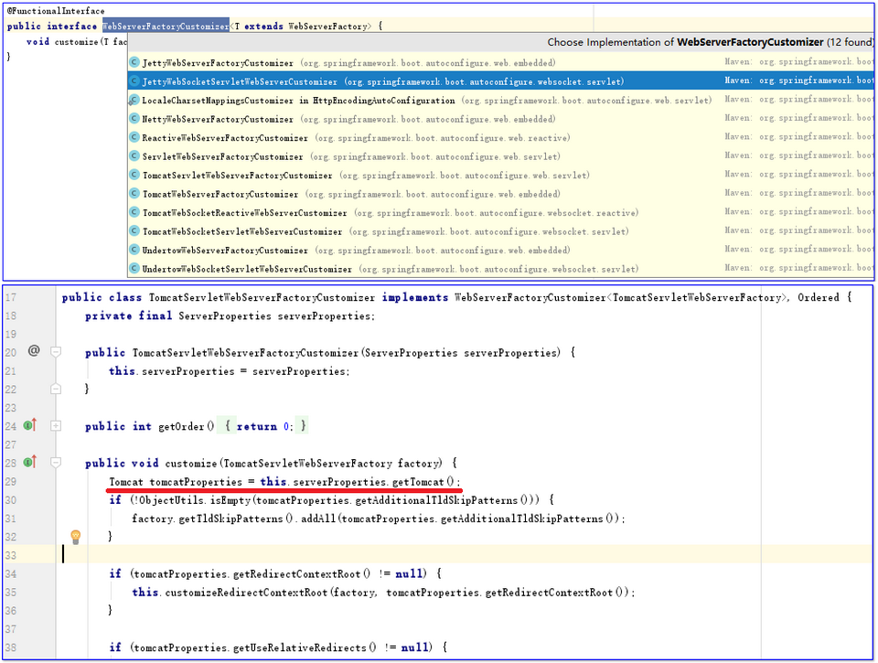


### 1.6.3. 自定义Reactive Web Server

`ReactiveWebServerFactoryCustomizer` 是 接口 `WebServerFactoryCustomizer` ` 的 Reactive 方式的实现类 ，它的实现很简单，就是端口、地址、SSL等的实现。

我们在这里可以扩展它的实现，如可以覆盖它的默认行为，提供一些具有高级特性的行为。一般来说，Spring Boot里的默认实现只是提供一些通用实现，或者说是最简单的实现、最常用的实现，这种实现方式也许满足你大部分需求，也可以进行自定义的调整。

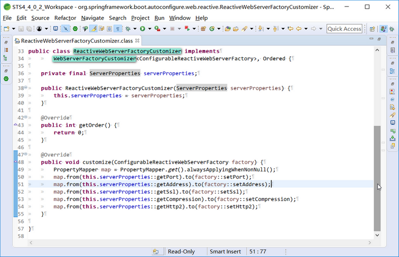