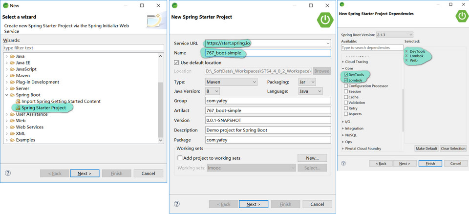
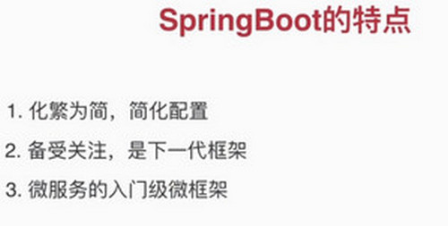
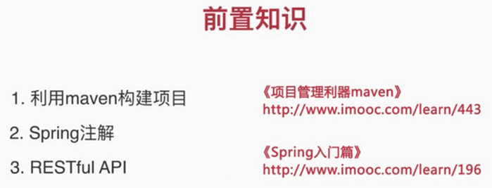
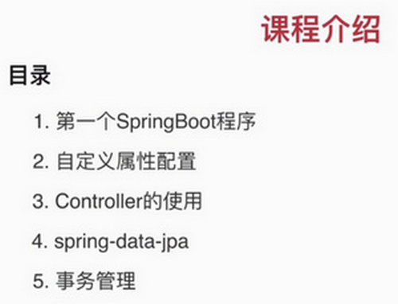

# 2小时学会SpringBoot

> from https://www.imooc.com/article/260567

由于课程内容引起女学员不适，这门课已经被慕课网下架了... ~~(原始链接：https://www.imooc.com/learn/767.html)~~

课程源码 <https://gitee.com/liaoshixiong/girl>


# Section 2: 快速构建第一个SpringBoot应用

1. 新建 spring boot 项目的方法见 



2. 配置 maven 阿里云 镜像 `~/.m2/settings.xml`

   `<mirrows>`节点添加如下代码：

```xml
<mirror>
    <id>alimaven</id>
    <name>aliyun maven</name>
    <url>http://maven.aliyun.com/nexus/content/groups/public/</url>
    <mirrorOf>central</mirrorOf>       
</mirror>

```

3. 添加第一个 controller 类 `HelloController`

   访问链接： http://localhost:8080/hello .
   `@RestController` 和 `@GetMapping` 的初步使用。

4. 多种启动方式
   1. IDE 自带的 启动 Spring Boot 项目
   2. 使用 mvn 方式启动 ，`mvn spring-boot:run`
   3. `mvn install` 后， 在 target 目录下， 使用 `java -jar app.jar` 方式启动


# Section 1： Spring Boot 介绍










# 目录

- 第1章 SpringBoot介绍
	- 1-1 SpringBoot介绍和课程安排  (05:50) 

- 第2章 第一个SpringBoot应用 : 快速构建第一个SpringBoot应用
	- 2-1 第一个SpringBoot应用 (13:52) 

- 第3章 项目属性配置 : 项目属性配置的各种方法
	- 3-1 项目属性配置 (20:09) 

- 第4章 Controller的使用 : 介绍SpringBoot项目中Controller的使用
	- 4-1 Controller的使用 (18:29) 

- 第5章 数据库操作 : SpringBoot中使用spring-data-jpa
	- 5-1 数据库操作（上） (12:33) 
	- 5-2 数据库操作（下） (21:16) 

- 第6章 事务管理 : 演示了SpringBoot中使用事务的简单例子
	- 6-1 事务管理 (08:19) 

- 第7章 课程回顾 : 回顾课程内容
	- 7-1 课程回顾 (03:39) 