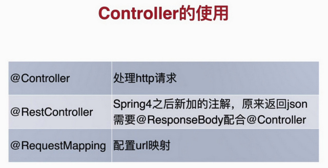
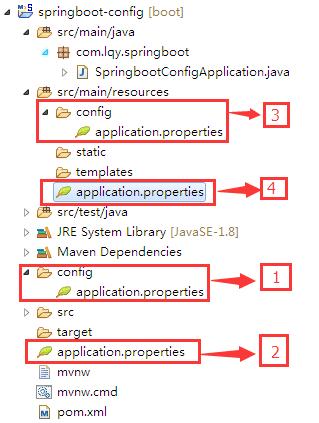
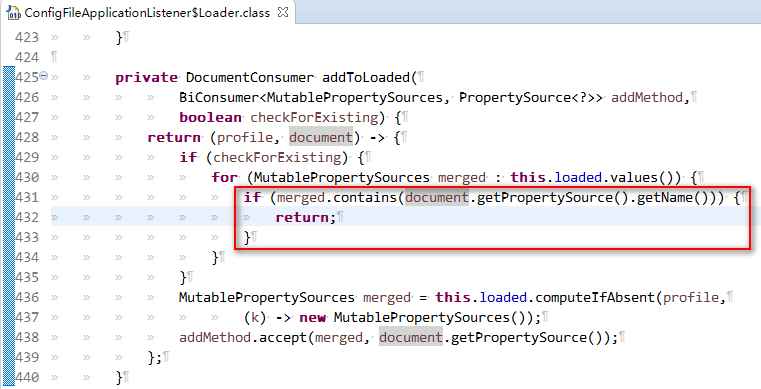
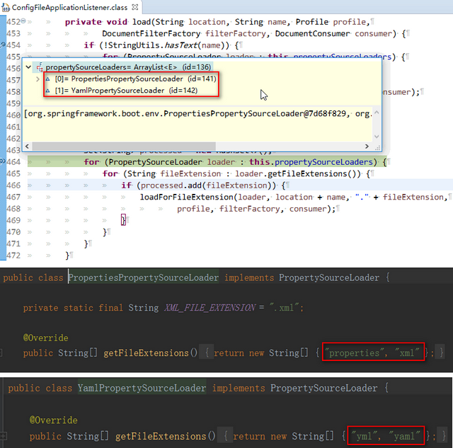

# 2小时学会SpringBoot

> from https://www.imooc.com/article/260567

由于课程内容引起女学员不适，这门课已经被慕课网下架了... 
~~(原始链接：https://www.imooc.com/learn/767.html)~~

课程源码 <https://gitee.com/liaoshixiong/girl>


# Section 4: Controller 的使用 及 处理请求中的参数

## Controller 的使用
- `@Controller`：处理 http 请求  ，GirlControllerView,
使用 Spring Boot 自带的 thymeleaf 模板,  http://localhost/index
- `@RestController`：Spring4 之后新的注解，原来返回 json 需要 `@ResponseBody` 配合 `@Controller`
- `@RequestMapping`：配置 url 映射。




## 处理请求中的参数 ，GirlController.
- `@PathVariable`：获取 url 中的数据  ， http://localhost/hi/say3/123
- `@RequestParam`：获取请求参数的值  ， http://localhost/hi/say4?id=888 , id 缺省为 0 , http://localhost/hi/say4 。
- `@GetMapping`：组合注解 ， path/value 可以是多个值，http://localhost/hi/say 或
http://localhost/hi/price 指向同一个方法。


## YAML 语法简介

文章格式：

1. **使用空格 Space 缩进表示分层**，不同层次之间的缩进可以使用不同的空格数目，但是同层元素一定左对齐，即前面空格数目相同（不能使用 Tab，各个系统 Tab对应的 Space 数目可能不同，导致层次混乱）
2. ‘#’表示注释，只能单行注释，从#开始处到行尾
3. 破折号后面跟一个空格（a dash and space）表示列表
4. 用冒号和空格表示键值对 key: value
5. 简单数据（scalars，标量数据）可以不使用引号括起来，包括字符串数据。用单引号或者双引号括起来的被当作字符串数据，在单引号或双引号中使用C风格的转义字符。

数据结构分为：

1. 键，值对（a:1）

2. 列表（- one）


```yml
com:
  yafey:
    name: "飞哥"
    age: 18
    
# 行内写法， 类似 JSON
girl: {cupSize: B,age: 18}

# 引用其他配置属性
content: "cupSize: ${girl.cupSize}, age: ${girl.age}"

```

参考：
SpringBoot（4）--配置文件（YML语法）
https://blog.csdn.net/wu2374633583/article/details/79862052

YAML 语言教程  by 阮一峰
http://www.ruanyifeng.com/blog/2016/07/yaml.html


# Section 3:项目属性配置（部分）

## 自定义端口 及 context-path

访问链接： http://localhost/girl/hello .

```yml
server:
  port: 80
  servlet:
    context-path: /girl
```

1. 使用 Spring Boot 推荐的 yml 格式。
  - 注意 yml 格式；叶子节点（具体的属性值） `: `(冒号) 后面要带一个空格。

2. `context-path` 的不同配置：
    - 在 Spring Boot 1.x 中的属性为  `server.context-path`
    - 在 Spring Boot 2.x 中的属性为  `server.servlet.context-path`

## Q: 相同路径下的 properties 和 yml 配置按什么顺序加载？

A:  分成 **项目内部配置文件** 和 **外部配置文件**。 【详情见 blog ： keyword: Spring Boot 、 加载 、启动】

- **项目内部配置文件**

  > TL;DR:
  >
  > 查找的具体路径：`location + name + "-" + profile + "." + ext`
  >
  > 三种优先级：
  >
  > 1. active (`spring.profiles.active`属性) 与 默认优先级
  > 2. 文件路径优先级
  > 3. 文件后缀优先级

  spring boot 启动会扫描以下位置的配置文件：

  属性：`DEFAULT_SEARCH_LOCATIONS = "classpath:/,classpath:/config/,file:./,file:./config/`

  ```bat
  优先级从高到低
  file:./config/
  file:./
  classpath:/config/
  classpath:/			# src/main/resources/ 目录
  ```

  即下图所示： 
  

  

  <span style="color:red">**所有位置的文件都会被加载**</span>，不同优先级的配置，

  - 如果不冲突（属性名不同），**会共同存在（合并属性）**。
  - 如果冲突，**会采用 高优先级配置， 而忽略低优先级配置** （见截图）。

  

  `propertySourceLoaders` 可以看出有 **两个 Loader** ：

  每个Loader会加载两种后缀名的文件，加起来就是4种，又因为是数组类型，所以也会有先后顺序，所以加载配置文件的先后顺序就是：

  - properties
  - xml
  - yml
  - yaml

  

# Section 2: 快速构建第一个SpringBoot应用

1. 新建 spring boot 项目的方法见 


2. 配置 maven 阿里云 镜像 `~/.m2/settings.xml`

   `<mirrows>`节点添加如下代码：

```xml
<mirror>
    <id>alimaven</id>
    <name>aliyun maven</name>
    <url>http://maven.aliyun.com/nexus/content/groups/public/</url>
    <mirrorOf>central</mirrorOf>       
</mirror>

```

3. 添加第一个 controller 类 `HelloController`

   访问链接： http://localhost:8080/hello .
   `@RestController` 和 `@GetMapping` 的初步使用。

4. 多种启动方式
   1. IDE 自带的 启动 Spring Boot 项目
   2. 使用 mvn 方式启动 ，`mvn spring-boot:run`
   3. `mvn install` 后， 在 target 目录下， 使用 `java -jar app.jar` 方式启动


# Section 1： Spring Boot 介绍


# 目录

- 第1章 SpringBoot介绍
	- 1-1 SpringBoot介绍和课程安排  (05:50) 

- 第2章 第一个SpringBoot应用 : 快速构建第一个SpringBoot应用
	- 2-1 第一个SpringBoot应用 (13:52) 

- 第3章 项目属性配置 : 项目属性配置的各种方法
	- 3-1 项目属性配置 (20:09) 

- 第4章 Controller的使用 : 介绍SpringBoot项目中Controller的使用
	- 4-1 Controller的使用 (18:29) 

- 第5章 数据库操作 : SpringBoot中使用spring-data-jpa
	- 5-1 数据库操作（上） (12:33) 
	- 5-2 数据库操作（下） (21:16) 

- 第6章 事务管理 : 演示了SpringBoot中使用事务的简单例子
	- 6-1 事务管理 (08:19) 

- 第7章 课程回顾 : 回顾课程内容
	- 7-1 课程回顾 (03:39) 