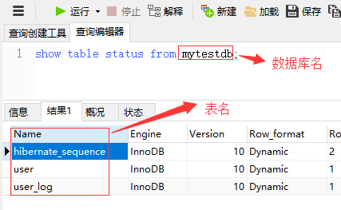
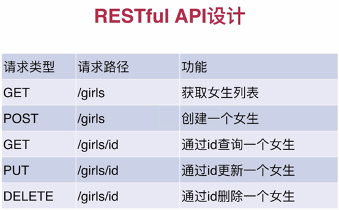

# 2小时学会SpringBoot

> from https://www.imooc.com/article/260567

由于课程内容引起女学员不适，这门课已经被慕课网下架了... 
~~(原始链接：https://www.imooc.com/learn/767.html)~~

课程源码 <https://gitee.com/liaoshixiong/girl>


# Section 6: JPA 事务的简单例子

只有查询的时候可以不加事务，其它任何操作都要加事务。

注意检查 MySQL 的引擎 ： InnoDB是事务型数据库的首选引擎。

## API

| URL| HTTP Method | body| 描述|
|-----|-----|-----|-----|
| http://localhost:8080/girls/two | POST | [{<br/>"cupSize":"A",<br/>"age":"18"<br/>},{<br/>"cupSize":"B",<br/>"age":"41"<br/>}] | 同时插入2条记录， age>40 的记录不能插入。 |

## Q: Spring Boot @Transactional注解事务不回滚不起作用无效

A: 视频中，使用的是 将数据库字段该成 1 位， 然后插入 2 位的字符， 抛出的是 DataAccessException , 自己抛出的是 Exception , 需要在注解上手动指定 rollbackFor 值 （    `@Transactional(rollbackFor = Exception.class)` ）。

参考： 
- [Spring boot 中事务注解@Transactional 回滚失效问题](https://www.imooc.com/wenda/detail/390931) : 慕课网， 同一视频，视频中代码，与自己的不同。

- [Spring 踩坑之@Transactional 神奇失效](https://segmentfault.com/a/1190000014617571)

- [spring boot @Transactional注解事务不回滚不起作用无效- yueguanyun](https://blog.csdn.net/zdyueguanyun/article/details/80236401)

- [转载--SpringBoot笔记】当@Transactional不起作用如何排查问题](https://blog.csdn.net/VicdorLin/article/details/82799408)


# Section 5-2: JPA 自定义简单查询

自定义简单查询(只需定义 DAO 接口方法)，不需要写实现。 
注意 方法名要有讲究  findByAge , `findBy<属性名>`。

##Q: JPA 预定义了哪些方法？我们可以扩展哪些查询？有什么规则？
A: 参见 [【spring boot 系列】spring data jpa 全面解析（实践 + 源码分析）](https://segmentfault.com/a/1190000015047290)

### 基本查询

基本查询分为两种，一种是 spring data 默认已经实现（只要继承`JpaRepository`），一种是根据查询的方法来自动解析成 SQL。

#### 预先生成

```
public interface UserRepository extends JpaRepository<User, Long> {
}

@Test
public void testBaseQuery() throws Exception {
    User user=new User();
    userRepository.findAll();
    userRepository.findOne(1l);
    userRepository.save(user);
    userRepository.delete(user);
    userRepository.count();
    userRepository.exists(1l);
    // ...
}
```

#### 自定义简单查询

自定义的简单查询就是根据方法名来自动生成SQL，主要的语法是`findXXBy,readAXXBy,queryXXBy,countXXBy, getXXBy`后面跟属性名称，举几个例子：

```
User findByUserName(String userName);

User findByUserNameOrEmail(String username, String email);

Long deleteById(Long id);

Long countByUserName(String userName);

List<User> findByEmailLike(String email);

User findByUserNameIgnoreCase(String userName);

List<User> findByUserNameOrderByEmailDesc(String email);
```

具体的关键字，使用方法和生产成 SQL 如下表所示

| Keyword           | Sample                                    | JPQL snippet                                                 |
| ----------------- | ----------------------------------------- | ------------------------------------------------------------ |
| And               | findByLastnameAndFirstname                | … where x.lastname = ?1 and x.firstname = ?2                 |
| Or                | findByLastnameOrFirstname                 | … where x.lastname = ?1 or x.firstname = ?2                  |
| Is,Equals         | findByFirstnameIs,findByFirstnameEquals   | … where x.firstname = ?1                                     |
| Between           | findByStartDateBetween                    | … where x.startDate between ?1 and ?2                        |
| LessThan          | findByAgeLessThan                         | … where x.age < ?1                                           |
| LessThanEqual     | findByAgeLessThanEqual                    | … where x.age ⇐ ?1                                           |
| GreaterThan       | findByAgeGreaterThan                      | … where x.age > ?1                                           |
| GreaterThanEqual  | findByAgeGreaterThanEqual                 | … where x.age >= ?1                                          |
| After             | findByStartDateAfter                      | … where x.startDate > ?1                                     |
| Before            | findByStartDateBefore                     | … where x.startDate < ?1                                     |
| IsNull            | findByAgeIsNull                           | … where x.age is null                                        |
| IsNotNull,NotNull | findByAge(Is)NotNull                      | … where x.age not null                                       |
| Like              | findByFirstnameLike                       | … where x.firstname like ?1                                  |
| NotLike           | findByFirstnameNotLike                    | … where x.firstname not like ?1                              |
| StartingWith      | findByFirstnameStartingWith               | … where x.firstname like ?1 (parameter bound with appended %) |
| EndingWith        | findByFirstnameEndingWith                 | … where x.firstname like ?1 (parameter bound with prepended %) |
| Containing        | findByFirstnameContaining                 | … where x.firstname like ?1 (parameter bound wrapped in %)   |
| OrderBy           | findByAgeOrderByLastnameDesc              | … where x.age = ?1 order by x.lastname desc                  |
| Not               | findByLastnameNot                         | … where x.lastname <> ?1                                     |
| In                | findByAgeIn(Collection<age> ages)</age>   | … where x.age in ?1                                          |
| NotIn             | findByAgeNotIn(Collection<age> age)</age> | … where x.age not in ?1                                      |
| TRUE              | findByActiveTrue()                        | … where x.active = true                                      |
| FALSE             | findByActiveFalse()                       | … where x.active = false                                     |
| IgnoreCase        | findByFirstnameIgnoreCase                 | … where UPPER(x.firstame) = UPPER(?1)                        |

### 复杂查询

在实际的开发中我们需要用到分页、删选、连表等查询的时候就需要特殊的方法或者自定义 SQL 。

#### 分页查询

分页查询在实际使用中非常普遍了，spring data jpa已经帮我们实现了分页的功能，在查询的方法中，需要传入参数`Pageable`
，当查询中有多个参数的时候`Pageable`建议做为最后一个参数传入。`Pageable`是 spring 封装的分页实现类，使用的时候需要传入页数、每页条数和排序规则

```
Page<User> findALL(Pageable pageable);

Page<User> findByUserName(String userName,Pageable pageable);
@Test
public void testPageQuery() throws Exception {
    int page=1,size=10;
    Sort sort = new Sort(Direction.DESC, "id");
    Pageable pageable = new PageRequest(page, size, sort);
    userRepository.findALL(pageable);
    userRepository.findByUserName("testName", pageable);
}
```

有时候我们只需要查询前N个元素，或者支取前一个实体。

```
User findFirstByOrderByLastnameAsc();

User findTopByOrderByAgeDesc();

Page<User> queryFirst10ByLastname(String lastname, Pageable pageable);

List<User> findFirst10ByLastname(String lastname, Sort sort);

List<User> findTop10ByLastname(String lastname, Pageable pageable);
```

#### 自定义SQL查询

其实 Spring data 大部分的 SQL 都可以根据方法名定义的方式来实现，但是由于某些原因我们想使用自定义的 SQL 来查询，spring data 也是完美支持的；在 SQL 的查询方法上面使用 @Query 注解，如涉及到删除和修改在需要加上 @Modifying 。也可以根据需要添加 @Transactional 对事物的支持，查询超时的设置等

```
@Modifying
@Query("update User u set u.userName = ?1 where c.id = ?2")
int modifyByIdAndUserId(String  userName, Long id);

@Transactional
@Modifying
@Query("delete from User where id = ?1")
void deleteByUserId(Long id);

@Transactional(timeout = 10)
@Query("select u from User u where u.emailAddress = ?1")
User findByEmailAddress(String emailAddress);
```

#### 多表查询

多表查询在 spring data jpa 中有两种实现方式，第一种是利用 hibernate 的级联查询来实现，第二种是创建一个结果集的接口来接收连表查询后的结果，这里介绍第二种方式。

首先需要定义一个结果集的接口类。

```
public interface HotelSummary {

    City getCity();

    String getName();

    Double getAverageRating();

    default Integer getAverageRatingRounded() {
        return getAverageRating() == null ? null : (int) Math.round(getAverageRating());
    }

}
```

查询的方法返回类型设置为新创建的接口

```
@Query("select h.city as city, h.name as name, avg(r.rating) as averageRating from Hotel h left outer join h.reviews r where h.city = ?1 group by h")
Page<HotelSummary> findByCity(City city, Pageable pageable);

@Query("select h.name as name, avg(r.rating) as averageRating from Hotel h left outer join h.reviews r group by h")
Page<HotelSummary> findByCity(Pageable pageable);
Page<HotelSummary> hotels = this.hotelRepository.findByCity(new PageRequest(0, 10, Direction.ASC, "name"));
for(HotelSummary summay:hotels){
    System.out.println("Name" +summay.getName());
}
```

在运行中 Spring 会给接口（`HotelSummary`）自动生产一个代理类来接收返回的结果，代码会使用 getXX 的形式来获取 。

#  Section 5: SpringBoot 中使用 Spring-Data-JPA

##  不用写 DAO 实现 CRUD。

### Spring-Data-JPA
JPA(Java Persistence API) 定义了一系列对象持久化的标准，目前实现这一规范的产品有 Hibernate 、TopLink 等。
Spring-Data-JPA 就是 Spring 对 Hibernate 实现的 整合。

- **不需要设置 `spring.datasource.driver-class-name` , 设置了会有如下提醒：**

    ```log
    Loading class `com.mysql.jdbc.Driver'. This is deprecated. The new
    driver class is `com.mysql.cj.jdbc.Driver'. The driver is automatically
    registered via the SPI and manual loading of the driver class is
    generally unnecessary.
    ```

- 数据库信息配置 （此处按 properties 风格， yml 见项目源码）：
    ```properties
    # 不要忘记 create database dbgirl;
    spring.datasource.url=jdbc:mysql://127.0.0.1:3306/
    spring.datasource.username=root
    spring.datasource.password=123456
    spring.datasource.driver-class-name=com.mysql.jdbc.Driver
    ```

- JPA 设置
  - `show-sql = true` ：打印出 SQL 语句，

  - `ddl-auto = update` ：如果 table 已经存在，不会删除 ( `hsqldb, h2, and derby` 数据库的默认值为 `create-drop` , 其他的默认值为 `none` )。 [^Spring 官网 Doc@2019.Mar.06--V2.1.3.RELEASE]

  - `database = mysql` 和 `database-platform = org.hibernate.dialect.MySQL5InnoDBDialect` ： 设置 MySQL 存储引擎为 InnoDB ， 不设置默认为 MyISAM 引擎 （不支持事务）。

    ```properties
    # 打印出 SQL 语句
    spring.jpa.show-sql = true
    spring.jpa.hibernate.ddl-auto = update
    spring.jpa.database = mysql
    # 不加下面这句则默认为 MyISAM 引擎
    spring.jpa.database-platform = org.hibernate.dialect.MySQL5InnoDBDialect
    ```


>[spring-boot工程中，jpa下hibernate的ddl-auto的各种属性](https://blog.csdn.net/zhangtongpeng/article/details/79609942
"CSDN")
>`spring.jpa.hibernate.ddl-auto`

| 属性值                 | 作用|
| ---------------------- |------------------------------------------------------------ |
| `ddl-auto:create`      | 每次运行该程序，没有表格会新建表格，表内有数据会清空         |
| `ddl-auto:create-drop` | 每次程序结束的时候会清空表|
| `ddl-auto:update`      | 每次运行程序，没有表格会新建表格，表内有数据不会清空，只会更新 |
| `ddl-auto:validate`    | 运行程序会校验数据与数据库的字段类型是否相同，不同会报错     |
| `none`                 | 除了 `hsqldb, h2, derby` 数据库之外的 默认值，什么都不做。   |

[^Spring 官网 Doc@2019.Mar.06--V2.1.3.RELEASE]:https://docs.spring.io/spring-boot/docs/current/reference/html/howto-database-initialization.html#howto-initialize-a-database-using-hibernate

### 确认数据库引擎

MySQL 查看表的引擎必须为 InnoDB。
```sql
show table status from mytestdb;

# 修改表的引擎：
alter table table_name engine=innodb;
```

MyISAM拥有较高的插入、查询速度，但**不支持事务**。
InnoDB是事务型数据库的首选引擎，支持事务安全表（ACID），支持行锁定和外键。




> 参考： [mysql-dialect-refactoring](http://in.relation.to/2017/02/20/mysql-dialect-refactoring/) ： http://in.relation.to/2017/02/20/mysql-dialect-refactoring/
>
> It （Hibernate） clearly says :
>
> > Traditionally, MySQL used the non-transactional MyISAM storage engine, and this is the default storage engine for all Dialects that are older than MySQL55Dialect. From MySQL55Dialect onwards, the InnoDB storage engine is used by default.


### API

记得在 request 的 header 中添加 `content-type=application/json;charset=UTF-8` , 不然会报 content 不合法。



| URL| HTTP Method | body| 描述|
|-----|-----|-----|-----|
| http://localhost:8080/girls | GET | N/A| 查询所有女生列表 |
| http://localhost:8080/girls | POST| { <br/>"cupSize":"F", <br/>"age":"18"<br/>} | 添加一个女生 (id 数据库自动生成), @RequestBody 获取 body 中的 json |
| http://localhost:8080/girls/123 |GET| N/A| 查询一个女生 (id=123)|
| http://localhost:8080/girls/1?cupSize=G&age=20 | PUT | N/A| 更新（按理参数应该放在 body 中， 只是demo为了演示与 POST 方式时的不同的注解使用） |
| http://localhost:8080/girls/123 | DELETE | N/A| 删除|


###Q: 配置文件中的属性名对应的类？
A: 参考 [Springboot应用中配置属性类和配置属性项的对应关系总结](https://blog.csdn.net/andy_zhang2007/article/details/86309966)

`Spring boot`应用工作时使用到的配置属性来源自某个配置属性`bean`，而这些配置属性`bean`基于相应的配置属性类和一组配置属性项创建。下表总结了`Spring boot`应用中框架内置的用于创建配置属性`bean`的配置属性类和配置属性项的对应关系 :

> 注意 1 : 这里的配置属性项指的的是外部配置文件中的配置项。这些外部配置文件通常是指`application.properties`/`application.xml`/`application.yml`。

> 注意 2 : 这里的配置属性类名字一般都采用`XXXProperties`这种格式的名字，并且使用注解`@ConfigurationProperties`指明该配置属性类要使用哪些配置项。

> 注意 3 : 本文基于一个`Springboot` `Servlet Web`应用总结，同时使用到了`JPA`，具体配置如下 :
>
> - `Springboot 2.1.1`
> - `Spring Data JPA 2.1.3 RELEASE`
> - `Spring Web 5.1.3 RELEASE`
> - `Spring Web MVC 5.1.3 RELEASE`

| 配置属性类                                    | 配置属性项前缀             | 功能简介                                 |
| --------------------------------------------- | -------------------------- | ---------------------------------------- |
| `o.sf.t.ac.web.ServerProperties`              | `server`                   | `Web`服务器参数配置，比如服务端口地址等  |
| `o.sf.t.ac.http.HttpProperties`               | `spring.http`              | `TBD`                                    |
| `o.sf.t.ac.web.servlet.WebMvcProperties`      | `spring.mvc`               | `Spring MVC参数配置`                     |
| `o.sf.t.ac.web.servlet.MultipartProperties`   | `spring.servlet.multipart` | 文件上传参数配置                         |
| `o.sf.t.ac.web.ResourceProperties`            | `spring.resources`         | `TBD`                                    |
| `o.sf.t.ac.jdbc.DataSourceProperties`         | `spring.datasource`        | 数据源参数配置                           |
| `o.sf.t.ac.orm.jpa.JpaProperties`             | `spring.jpa`               | `JPA`参数配置                            |
| `o.sf.t.ac.orm.jpa.HibernateProperties`       | `spring.jpa.hibernate`     | `Hibernate ORM`参数配置，和`JPA`配合使用 |
| `o.sf.t.ac.transaction.TransactionProperties` | `spring.transaction`       | 事务参数配置                             |
| `o.sf.t.ac.task.TaskExecutionProperties`      | `spring.task.execution`    | `TBD`                                    |
| `o.sf.t.ac.data.web.SpringDataWebProperties`  | `spring.data.web`          | `TBD`                                    |
| `o.sf.t.ac.jackson.JacksonProperties`         | `spring.jackson`           | `TBD`                                    |
| `o.sf.t.ac.transaction.jta.JtaProperties`     | `spring.jta`               | `TBD`                                    |
| `o.sf.t.ac.info.ProjectInfoProperties`        | `spring.info`              | `TBD`                                    |
| `o.sf.t.ac.jdbc.JdbcProperties`               | `spring.jdbc`              | `TBD`                                    |
| `o.sf.t.ac.task.TaskSchedulingProperties`     | `spring.task.scheduling`   | `TBD`                                    |

> 上表中 `o.sf.b.ac`是``org.springframework.boot.autoconfigure`的缩写。

# Section 3:项目属性配置（部分）

## 切换 profiles

可以在配置文件里切换，也可以在启动的时候
`java -jar app.jar --spring.profiles.active=dev`。

因为是在 项目根目录下 添加的 yml 配置文件的属性名是一样的，
**`src/main/resources` 目录下的配置将被忽略**：
1. 所有的 url 都需要添加 8080 端口。
2. 下面 2 个接口可以看到 `file.` 字符：
	- http://localhost:8080/hello
	- http://localhost:8080/hi/say 或 http://localhost:8080/hi/price


# Section 4: Controller 的使用 及 处理请求中的参数

## Controller 的使用
- `@Controller`：处理 http 请求  ，GirlControllerView,
使用 Spring Boot 自带的 thymeleaf 模板,  http://localhost/index
- `@RestController`：Spring4 之后新的注解，原来返回 json 需要 `@ResponseBody` 配合 `@Controller`
- `@RequestMapping`：配置 url 映射。


## 处理请求中的参数 ，GirlController.
- `@PathVariable`：获取 url 中的数据  ， http://localhost/hi/say3/123
- `@RequestParam`：获取请求参数的值  ， http://localhost/hi/say4?id=888 , id 缺省为 0 , http://localhost/hi/say4 。
- `@GetMapping`：组合注解 ， path/value 可以是多个值，http://localhost/hi/say 或
http://localhost/hi/price 指向同一个方法。


## YAML 语法简介

文章格式：

1. **使用空格 Space 缩进表示分层**，不同层次之间的缩进可以使用不同的空格数目，但是同层元素一定左对齐，即前面空格数目相同（不能使用 Tab，各个系统 Tab对应的 Space 数目可能不同，导致层次混乱）
2. ‘#’表示注释，只能单行注释，从#开始处到行尾
3. 破折号后面跟一个空格（a dash and space）表示列表
4. 用冒号和空格表示键值对 key: value
5. 简单数据（scalars，标量数据）可以不使用引号括起来，包括字符串数据。用单引号或者双引号括起来的被当作字符串数据，在单引号或双引号中使用C风格的转义字符。

数据结构分为：

1. 键，值对（a:1）

2. 列表（- one）


```yml
com:
  yafey:
    name: "飞哥"
    age: 18
    
# 行内写法， 类似 JSON
girl: {cupSize: B,age: 18}

# 引用其他配置属性
content: "cupSize: ${girl.cupSize}, age: ${girl.age}"

```

参考：
SpringBoot（4）--配置文件（YML语法）
https://blog.csdn.net/wu2374633583/article/details/79862052

YAML 语言教程  by 阮一峰
http://www.ruanyifeng.com/blog/2016/07/yaml.html


# Section 3:项目属性配置（部分）

## 自定义端口 及 context-path

访问链接： http://localhost/girl/hello .

```yml
server:
  port: 80
  servlet:
    context-path: /girl
```

1. 使用 Spring Boot 推荐的 yml 格式。
  - 注意 yml 格式；叶子节点（具体的属性值） `: `(冒号) 后面要带一个空格。

2. `context-path` 的不同配置：
    - 在 Spring Boot 1.x 中的属性为  `server.context-path`
    - 在 Spring Boot 2.x 中的属性为  `server.servlet.context-path`

## Q: 相同路径下的 properties 和 yml 配置按什么顺序加载？

A:  分成 **项目内部配置文件** 和 **外部配置文件**。 【详情见 blog ： keyword: Spring Boot 、 加载 、启动】

- **项目内部配置文件**

  > TL;DR:
  >
  > 查找的具体路径：`location + name + "-" + profile + "." + ext`
  >
  > 三种优先级：
  >
  > 1. active (`spring.profiles.active`属性) 与 默认优先级
  > 2. 文件路径优先级
  > 3. 文件后缀优先级

  spring boot 启动会扫描以下位置的配置文件：

  属性：`DEFAULT_SEARCH_LOCATIONS = "classpath:/,classpath:/config/,file:./,file:./config/`

  ```bat
  优先级从高到低
  file:./config/
  file:./
  classpath:/config/
  classpath:/			# src/main/resources/ 目录
  ```

  即下图所示： 
  

  

  <span style="color:red">**所有位置的文件都会被加载**</span>，不同优先级的配置，

  - 如果不冲突（属性名不同），**会共同存在（合并属性）**。
  - 如果冲突，**会采用 高优先级配置， 而忽略低优先级配置** （见截图）。

  

  `propertySourceLoaders` 可以看出有 **两个 Loader** ：

  每个Loader会加载两种后缀名的文件，加起来就是4种，又因为是数组类型，所以也会有先后顺序，所以加载配置文件的先后顺序就是：

  - properties
  - xml
  - yml
  - yaml

  

# Section 2: 快速构建第一个SpringBoot应用

1. 新建 spring boot 项目的方法见 


2. 配置 maven 阿里云 镜像 `~/.m2/settings.xml`

   `<mirrows>`节点添加如下代码：

```xml
<mirror>
    <id>alimaven</id>
    <name>aliyun maven</name>
    <url>http://maven.aliyun.com/nexus/content/groups/public/</url>
    <mirrorOf>central</mirrorOf>       
</mirror>

```

3. 添加第一个 controller 类 `HelloController`

   访问链接： http://localhost:8080/hello .
   `@RestController` 和 `@GetMapping` 的初步使用。

4. 多种启动方式
   1. IDE 自带的 启动 Spring Boot 项目
   2. 使用 mvn 方式启动 ，`mvn spring-boot:run`
   3. `mvn install` 后， 在 target 目录下， 使用 `java -jar app.jar` 方式启动


# Section 1： Spring Boot 介绍


# 目录

- 第1章 SpringBoot介绍
	- 1-1 SpringBoot介绍和课程安排  (05:50) 

- 第2章 第一个SpringBoot应用 : 快速构建第一个SpringBoot应用
	- 2-1 第一个SpringBoot应用 (13:52) 

- 第3章 项目属性配置 : 项目属性配置的各种方法
	- 3-1 项目属性配置 (20:09) 

- 第4章 Controller的使用 : 介绍SpringBoot项目中Controller的使用
	- 4-1 Controller的使用 (18:29) 

- 第5章 数据库操作 : SpringBoot中使用spring-data-jpa
	- 5-1 数据库操作（上） (12:33) 
	- 5-2 数据库操作（下） (21:16) 

- 第6章 事务管理 : 演示了SpringBoot中使用事务的简单例子
	- 6-1 事务管理 (08:19) 

- 第7章 课程回顾 : 回顾课程内容
	- 7-1 课程回顾 (03:39) 